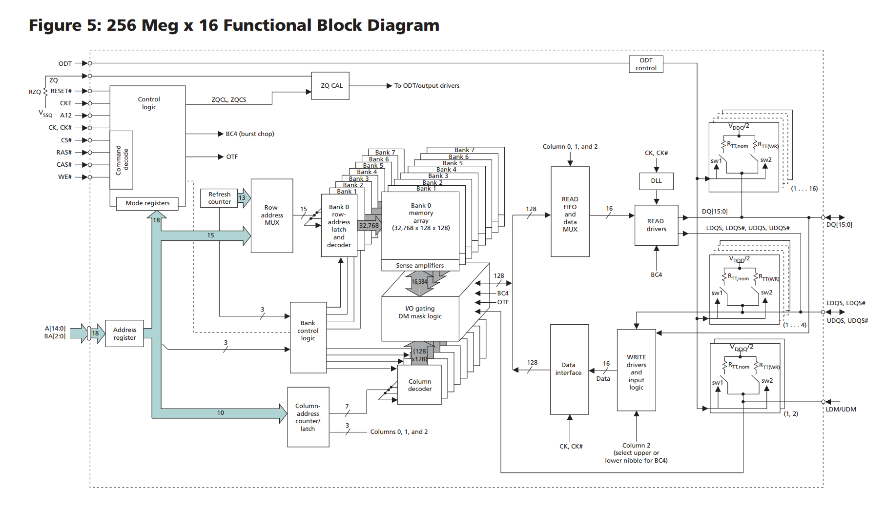

# DDR学习笔记 — 第二部分：具体DDR芯片分析

> **本文档**：各代 DDR 芯片的规格解读与数据手册分析，随实际使用过的芯片持续增加。
>
> **配套文档**：
> - [第一部分：DDR相关理论知识](01_ddr_theory.md) — 基础概念、芯片组织结构、各代演进
> - [第三部分：控制器分析与实战调试](03_controller_and_debug.md) — SoC内存控制器配置与调试

## 11. 具体芯片分析

> **本章目的**：将前面章节的理论知识应用到具体芯片规格书上，验证前面章节的参数是否正确。

### 11.1 SM41J256M16M（国微电子 4Gb DDR3）规格解读

| 参数 | 值 |
|------|-----|
| 容量 | 4Gb (4 Gbit) |
| 组织 | 256M × 16 |
| Bank 数 | 8 |
| 位宽 | x16 |
| Row 地址 | 16 位 |
| Column 地址 | 10 位 |
| Bank 地址 | 3 位 |
| 电压 | 1.5V / 1.35V |
| 封装 | FBGA |

### 11.2 Micron MT41K 系列规格解读

#### 11.2.1 型号与速度等级

| 型号 | 组织 | Row | Column | 容量 |
|------|------|-----|--------|------|
| MT41K1G4 | 128M × 4 × 8 Bank | 15 | 10 | 4Gb |
| MT41K512M8 | 64M × 8 × 8 Bank | 15 | 10 | 4Gb |
| MT41K256M16 | 32M × 16 × 8 Bank | 15 | 10 | 4Gb |

**速度等级**：

| 后缀 | 数据速率 | tRCD-tRP-CL |
|------|---------|-------------|
| -093 | DDR3-2133 | 15-15-15 |
| -107 | DDR3-1866 | 13.5-13.5-13.5 |
| -125 | DDR3-1600 | 13.75-13.75-13.75 |

#### 11.2.2 功能框图解析

以 **256 Meg x 16** 封装（MT41K256M16，4Gb）为例，其内部功能框图如下：



按信号流向将芯片划分为五大模块：命令控制、地址寻址、存储核心、数据读取路径、数据写入路径。

---

**模块一：输入接口与命令控制（左上）**

芯片的"大脑"，负责接收并翻译外部指令。

| 引脚/模块 | 说明 |
|-----------|------|
| **CS#, RAS#, CAS#, WE#** | 经典 SDRAM 命令组合，高低电平组合决定操作类型（ACT、READ、WRITE、PRE 等） |
| **CKE / CKE#** | 时钟使能，用于电源管理（掉电模式、自刷新模式） |
| **CK / CK#** | 差分时钟，数据在 CK 上升沿和 CK# 下降沿同时传输（双倍数据速率） |
| **RESET#** | 硬件复位，将芯片初始化到已知状态 |
| **ODT** | 输入控制信号，拉高时开启内部终端电阻，匹配传输线阻抗 |
| **VSSQ** | 信号地，隔离数字地与模拟地 |
| **Command decode** | 将 CS#/RAS#/CAS#/WE# 组合翻译为内部动作（ACT、PRE、REF、MRS 等） |
| **Control logic** | 总指挥官，接收解码命令后生成内部时序信号，协调各模块工作 |
| **Mode registers** | 存储配置信息（突发长度、CL 延迟、突发类型），通过 MRS 命令写入 |
| **ZQ CAL** | 阻抗校准模块，通过外部精密电阻 RZQ（通常 240Ω）校准输出驱动器和 ODT 阻抗，补偿工艺/电压/温度（PVT）漂移 |

---

**模块二：地址总线与寻址机制（左下）**

告诉芯片"去哪里"读写数据。外部地址线通过时分复用依次传输行地址和列地址。

| 模块/信号 | 说明 |
|-----------|------|
| **A[14:0]** | 主地址总线，15 位宽，复用传输行地址和列地址 |
| **BA[2:0]** | Bank 地址总线，3 位宽，从 8 个 Bank 中选择 1 个 |
| **Address register** | 地址信号的"接待处"，锁存外部 A[14:0] 和 BA[2:0] 后分发给内部模块 |
| **Row-address MUX** | 行地址复用器，从地址寄存器筛选行地址（15 位），送往行解码器 |
| **Column-address counter/latch** | 列地址锁存与计数器，锁存列地址（10 位），突发模式下自动递增列地址 |
| **Bank control logic** | Bank 控制逻辑，根据 BA 信号选中对应 Bank 的行/列解码器 |

**列地址 10 位的拆分**：A[14:0] 中被分配给列地址的部分（通常 10 位）进一步拆分为 7 + 3 两组：
- **7 位（A0-A6）** → 送往 Column address decoder，定位 128 列中的起始列
- **3 位（A7-A9）** → 送往 READ FIFO and data MUX，控制 BL8 突发传输的数据输出顺序

---

**模块三：存储核心（中间）**

芯片的数据仓库，8 个 Bank 堆叠排列。

```
Bank 组织（8 Bank × 32,768 行 × 128 列 × 128 位）：

  ┌──────────────────────────────────────────────────────┐
  │  Row address latch and decoder    │  15 位行地址     │
  │  （32,768 行中的唯一一行）          │                  │
  ├──────────────────────────────────────────────────────┤
  │                      Bank 7                          │
  │                      Bank 6                          │
  │                      ...                             │
  │  Bank 0 memory array  (32,768 × 128 × 128)           │
  │                      Bank 1                          │
  │                      Bank 0                          │
  ├──────────────────────────────────────────────────────┤
  │  Sense amplifiers        │  16,384 个，放大电容电荷  │
  │  I/O gating              │  根据列地址选通 128 位     │
  │  DM mask logic           │  写掩码逻辑               │
  │  Column decoder          │  10 位列地址 → 128 列选择 │
  └──────────────────────────────────────────────────────┘
```

| 模块/参数 | 说明 |
|-----------|------|
| **Bank 0-7** | 8 个独立存储体，可交错工作（一个 Bank 预充电时另一个 Bank 读写） |
| **32,768** | 行深度，2^15 = 32,768 行，由 15 位行地址寻址 |
| **第一个 128** | 列深度，每行 128 个列地址，由 7 位列地址（2^7 = 128）寻址 |
| **第二个 128** | 内部位宽 = 外部位宽 16 × 预取深度 8，即 8n Prefetch 架构 |
| **Row address latch and decoder** | 接收 15 位行地址，激活 Bank 中唯一一行，将该行全部数据推入 Sense Amplifiers |
| **Sense amplifiers** | 感应放大器，放大存储单元（电容）微弱电荷，同时充当行缓冲（Row Buffer） |
| **I/O gating** | I/O 门控，根据列地址从 16,384 位 Sense Amplifier 输出中选通 128 位数据 |
| **Column decoder** | 列地址解码器，接收 Column counter 信号，控制 I/O gating 的选通门 |

**容量验证**：单个 Bank = 32,768 × 128 × 128 = 536,870,912 bits = 512 Mbit；8 Bank = 4,096 Mbit = 4 Gbit，与型号 4Gb 一致。

---

**模块四：数据读取路径（右上）**

数据从存储核心到外部 DQ 引脚的通路。

| 模块 | 说明 |
|------|------|
| **READ FIFO and data MUX** | 128 位内部数据先存入 FIFO 平滑时钟域差异，MUX 将 128 位按突发顺序分 8 次切为 16 位输出 |
| **DLL** | 延迟锁定环，复制并延迟输入时钟 CK，生成与数据相位对齐的内部时钟，驱动 DQS 输出，实现源同步 |
| **READ drivers** | 读出驱动器，将 MUX 输出的 16 位信号放大，根据 ZQ 校准结果调整输出阻抗 |
| **DQ[15:0]** | 双向数据引脚，16 位宽 |
| **DQS / DQS#** | 数据选通信号，与数据边沿对齐的伴随时钟，DLL 驱动输出 |
| **LDQS / UDQS** | 低字节/高字节 DQS，x16 芯片分为两组 DQS（各对应 8 位 DQ） |

---

**模块五：数据写入路径与输出驱动（右下）**

外部数据进入芯片的通路。

| 模块 | 说明 |
|------|------|
| **Data interface** | 双向接口，读取时允许 READ drivers → DQ，写入时允许 DQ → WRITE drivers |
| **WRITE drivers and input logic** | 写入接收电路，利用 DQS 采样 DQ 数据，整形后送往 I/O gating |
| **Column 2** | 列地址最高位，用于 BC4（Burst Chop）模式下选择高/低半部 nibble |
| **ODT 电阻网络** | 片上端接，RTT,nom（读取时终端电阻）和 RTT,WR（写入时终端电阻），通过开关 sw1/sw2 动态切换，消除信号反射 |
| **LDQM / UDQM** | 低字节/高字节写掩码，写入时屏蔽对应 8 位 DQ |
| **VDDQ/2 参考电压** | ODT 电阻网络的上拉/下拉参考点，确保阻抗匹配 |

---

**关键控制信号补充**：

| 信号 | 说明 |
|------|------|
| **ZQCL / ZQCS** | ZQ 校准命令，ZQCL（长校准，上电时）和 ZQCS（短校准，运行中定期执行） |
| **BC4** | Burst Chop，将 BL8 截断为 BL4，用于减少传输延迟 |
| **OTF** | On-The-Fly，动态切换 BL8/BC4 模式 |

### 11.3 从数据手册提取关键参数的方法

阅读 DDR 芯片数据手册时，关注以下核心参数：

1. **容量与组织**：总容量、位宽、Bank 数、Row/Column 地址位数
2. **电气特性**：VDD、VDDQ、VREF 电压范围
3. **速度等级**：支持的数据速率、对应的 tRCD/tRP/CL 值
4. **时序参数**：完整交流特性表（tRC、tRAS、tRFC、tREFI 等）
5. **命令集**：支持的命令、模式寄存器配置
6. **引脚定义**：封装引脚分配
7. **初始化序列**：上电初始化步骤
8. **Self Refresh**：温度范围、刷新率

---
