# Chapter 35 Multi Mode DDR Controller (MMDC)

# 35.1 Overview

MMDC is a multi-mode DDR controller that supports DDR3/DDR3L x16 and LPDDR2x16 memory types. MMDC is configurable, high performance, and optimized. The following figure shows the MMDC block diagram.

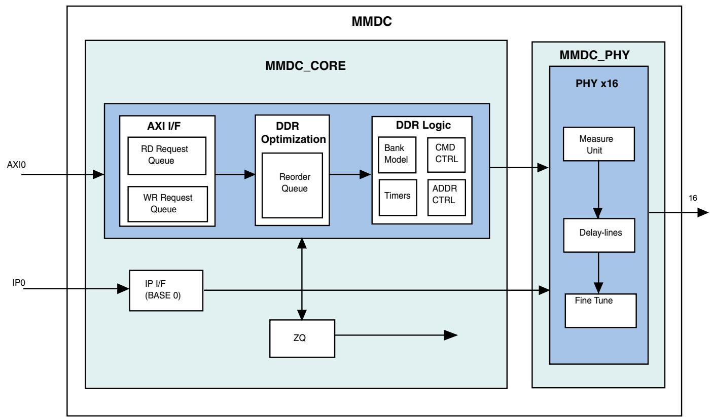  
Figure 35-1. MMDC block diagram

MMDC consists of a core (MMDC_CORE) and PHY (MMDC_PHY).

i.MX 6ULL Applications Processor Reference Manual, Rev. 1, 11/2017

# Overview

• The core is responsible for communication with the system through an AXI interface, DDR command generation, DDR command optimizations, and a read/write data path.   
• The PHY is responsible for the timing adjustment; it uses special calibration mechanisms to ensure data capture margin at a clock rate of up to 400 MHz.

The internal memory map (configuration registers) of the MMDC can be configured through an IP channel (IP0).

# 35.1.1 MMDC feature summary

The table found here summarizes the MMDC features.

Table 35-1. MMDC feature summary   

<table><tr><td>Feature</td><td>Details</td></tr><tr><td>DDR standards</td><td>• DDR3L, DDR3 x16
• LPDDR2 x16
• Does not support LPDDR1MDDR or DDR2</td></tr><tr><td>DDR interface</td><td>• x16 data bus width
• Density per DDR device of 256 Mbits-8 Gbits with the following column and row combinations:
• Column size of 8-12 bits
• Row size of 11-16 bits
• Two chip selects (one chip select for DDR3/DDR3L, LPDDR2)
• Up to 4 Gbytes of address space with configurable partitioning between CS0 and CS1 (for LPDDR2 2ch x32 up to 2 Gbytes per channel)
• Supports burst length of 8 (aligned) for DDR3
• Supports burst length of 4 for LPDDR2</td></tr><tr><td>DDR performance</td><td>• MMDC running at up to 400 MHz (800MT/s), see CCM block for actual clock frequencies supported.
• Supports Real-Time priority by means of QoS sideband priority signals from the chip to enable various priority levels in the re-ordering mechanism: real-time, latency sensitive, normal priority.
• Page hit/page miss optimizations
• Consecutive read/write access optimizations
• Supports deep read and write request queues to enable bank prediction.
• Drives back the critical word in a read transaction as soon as it is received by the DDR device (does not wait until the whole data phase has been completed).
• Keeps tracking of open memory pages
• Supports bank interleaving
• Special optimization in case of non-aligned wrap accesses in DDR3 mode (burst length 8)
NOTE: Due to reordering and optimization mechanisms (per different AXI Identifier (ID)), the transactions towards the DDR device may be driven in a different ID order than was received by the AXI master. In a similar fashion, the write response, read response or read data may be driven to the AXI master in a different ID order.</td></tr><tr><td>AXI interface</td><td>• AXI bus compliant
• Supports bus transfers of 8, 16, 64 bits (single accesses and bursts) running at 400 MHz.</td></tr><tr><td></td><td>Supports AXI bursts length of up to 16Supports burst types of WRAP, INCR and FIXEDSupports 16 bits AXI IDWrite data interleave depth is 1 (no support for Write Data Interleave)Supports write data before addressSupports buffered/non-buffered accesses (AWCACHED[0] = 0b means a non-bufferable access and AWCACHED[0] = 1b means a bufferable access). The rest of the Cache options are not supportedTo keep data access coherency between write and read access of the same master, the response signal is sent as follows:Bufferable write access—BRESP will be sent when last data of the access has entered the MMDC.Non-bufferable write access—BRESP will be sent when the data was physically written into the external memory device.Supports four exclusive monitors per configurable ID for only a single access with a size of up to 64 bitsSupports AXI responses as follows:Okay in case the access has been successful or exclusive access failureSlave error in case of security violationExclusive okay in case the read or the write portion of an exclusive access has been successful</td></tr><tr><td>DDR calibration and delay-lines.</td><td>Supports various calibration processes which can be performed either automatically (hardware) or manually (software) towards either CS0 or CS1. (At the end of the process the delay-lines will work with one set of results.) The following calibration processes are supported:ZQ calibration for external DDR device (in DDR3 through ZQ calibration command and in LPDDR2 through MRW command)Can be handled automatically for ZQ Short (periodically) and ZQ Long (at exit from self-refresh)Can be handled manually at ZQ INITZQ calibration for DDR I/O pads for calibrating the DDR driving strengthThe sequence can be handled automatically by hardwareThe sequence can be handled step by step manually by softwareRead data calibration. Adjustment of read DQS with read data byte.Read DQS gating calibration for DDR3 only. Adjustment of DQS gate with read preamble window.Write data calibration. Adjustment of write DQS with write data byte.Write leveling calibration. Adjustment of write DQS with CK (DDR differential clock).Read fine tuning. Adjustment of up to 7 delay-line units for each read data bit.Write fine tuning. Adjustment of up to 3 delay-line units for each read data bit.Periodic delay-line measurement for keeping its accuracy during refresh interval.Additional fine tuning delay lines to adjust DDR clock delay, DDR clock duty cycle, DQS duty cycle.</td></tr><tr><td>Power saving</td><td>Support of dynamic voltage, frequency change and self-refresh mode entry through hardware and software negotiation with the system (request/acknowledge handshake)Upon hardware or software self-refresh request assertion, further AXI requests are blocked (even before the assertion of the acknowledge).During self-refresh mode the system may deassert the operating clock of the MMDC for power saving.During self-refresh mode the clock (CK) that is driven to the DDR device will be gated for power saving.Supports automatic self-refresh and power down entry and exitIn automatic self-refresh, the internal operating clock will be gated for power saving.</td></tr><tr><td></td><td>Supports fast and slow precharge power down in DDR3Automatic active and precharge power down timer per chip select (one chip select can enter power down while the other is still working)While CS (chip-select) is inactive (high) the command and address buses are not toggling for power saving.</td></tr><tr><td>DDR general</td><td>Configurable timing parametersConfigurable refresh schemePage boundary crossing supportAutomatically generates precharge command and activates the next rowSupports various ODT control schemesAssertion or deassertion of ODT control per read or write accesses and for active or passive CS (chip-select)Supports MRW and MRR commands for LPDDR2Software control in LPDDR2 mode for switching to derated timing parameters and/or update the refresh rate according to temperature sensorDebug and profiling capabilities</td></tr></table>

# 35.2 External Signals

The table found here describes the external signals of MMDC.

Table 35-2. MMDC External Signals   

<table><tr><td>Signal</td><td>Description</td><td>Pad</td><td>Mode</td><td>Direction</td></tr><tr><td>DRAM_ADDR[15:0]</td><td>Address Bus Signals</td><td>DRAM_A[15:0]</td><td>No Muxing</td><td>O</td></tr><tr><td>DRAM_CAS</td><td>Column Address Strobe Signal</td><td>DRAM_CAS</td><td>No Muxing</td><td>O</td></tr><tr><td>DRAM_CS[1:0]</td><td>Chip Selects</td><td>DRAM_CS[1:0]</td><td>No Muxing</td><td>O</td></tr><tr><td>DRAM_DATA[31:0]</td><td>Data Bus Signals</td><td>DRAM_D[31:0]</td><td>No Muxing</td><td>I/O</td></tr><tr><td>DRAM_DQM[1:0]</td><td>Data Mask Signals</td><td>DRAM_DQM[1:0]</td><td>No Muxing</td><td>O</td></tr><tr><td>DRAM_ODT[1:0]</td><td>On-Die Termination Signals</td><td>DRAM_SDODT[1:0]</td><td>No Muxing</td><td>O</td></tr><tr><td>DRAM_RAS</td><td>Row Address Strobe Signal</td><td>DRAM_RAS</td><td>No Muxing</td><td>O</td></tr><tr><td>DRAM_RESET</td><td>Reset Signal</td><td>DRAM_RESET</td><td>No Muxing</td><td>O</td></tr><tr><td>DRAM_SDBA[2:0]</td><td>Bank Select Signals</td><td>DRAM_SDBA[2:0]</td><td>No Muxing</td><td>O</td></tr><tr><td>DRAM_SDCKE[1:0]</td><td>Clock Enable Signals</td><td>DRAM_SDCKE[1:0]</td><td>No Muxing</td><td>O</td></tr><tr><td>DRAM_SDCLK0_N</td><td>Negative Clock Signals</td><td>DRAM_SDCLK_1:0]</td><td>No Muxing</td><td>O</td></tr><tr><td>DRAM_SDCLK0_P</td><td>Positive Clock Signals</td><td>DRAM_SDCLK_1:0]</td><td>No Muxing</td><td>O</td></tr><tr><td>DRAM_SDQS[1:0]_N</td><td>Negative DQS Signals</td><td>DRAM_SDQS[1:0]_N</td><td>No Muxing</td><td>I/O</td></tr><tr><td>DRAM_SDQS[1:0]_P</td><td>Positive DQS Signals</td><td>DRAM_SDQS[1:0]_P</td><td>No Muxing</td><td>I/O</td></tr><tr><td>DRAM_SDWE</td><td>WE signal</td><td>DRAM_SDWE</td><td>No Muxing</td><td>O</td></tr><tr><td>DRAM_ZQPAD</td><td>ZQ signal</td><td>DRAM_ZQPAD</td><td>No Muxing</td><td>O</td></tr></table>

# 35.3 Clocks

The table found here describes the clock sources for MMDC.

See Clock Controller Module (CCM) for clock setting, configuration and gating information.

# NOTE

The terms clocks and cycles are used interchangeably and refer to the clock period of the main ddr clock (mmdc_axi_clk_root), commonly referred to as the DDR frequency.

Table 35-3. MMDC Clocks   

<table><tr><td>Clock name</td><td>Clock Root</td><td>Description</td></tr><tr><td>aclk_fast_core_p0</td><td>mmdc_axi_clk_root</td><td>Fast clock (channel 1)</td></tr><tr><td>ipg_clk_p0</td><td>ipg_clk_root</td><td>Peripheral clock (channel 1)</td></tr><tr><td>aclk_fast_phy_p0</td><td>mmdc_axi_clk_root</td><td>Fast clock (channel 1 - PHY)</td></tr></table>

# 35.4 Functional Description

This section provides a complete functional description of the block.

# 35.4.1 Write/Read data flow

# 35.4.1.1 Write data flow

1. Write requests are received into an 8 entry request FIFO. Access is received only when there are at least two available entries. Each entry holds all of the AXI attributes.

• If the burst length is greater than 8, the access splits into two accesses: one with burst length 8 and the other with the remainder.   
• The access can be performed as soon as the entire data phase of the associated write request is completed (all data beats were received).

2. A simple round-robin arbitration between the pending read and write accesses is performed, and the pointer to this stage's winner access is sent to the re-ordering buffer.

# Functional Description

3. The reordering mechanism is activated to find the winner access, which is the access that best utilizes the DDR bus, based on its dynamic score. For further information see Dynamic scoring mode (Arbitration Winning Conditions).   
4. The winner write access at the previous stage is received and is held for dispatch to the DDR logic.   
5. When the DDR command control unit is ready to accept the write request, it issues (if needed) a precharge/active command to the DDR device according to the status of the bank model and the parameters of the timers.   
6. The DDR logic drives the associated data to the DDR device through the DDR PHY.

# 35.4.1.2 Read data flow

1. Read requests are received into a 16 entry request FIFO in MMDC if there are at least two available entries. Each entry holds all of the AXI attributes.

# NOTE

If the burst length is greater than 8, the access splits into 2 accesses (one with burst length 8 and the other with the remainder).

2. A simple round-robin arbitration between the pending read and write accesses is performed and the pointer to this phase's winner access is sent to the re-ordering buffer.   
3. The reordering mechanism is activated to find the winner access, which is the access that best utilizes the DDR bus, based on its dynamic score. For further information see Dynamic scoring mode (Arbitration Winning Conditions).   
4. The winner read access at the previous stage is sampled and is held for dispatch to the DDR logic. This read access will be dispatched when there is at least one free slot in the read data buffer to store the data.   
5. When the DDR command control unit is ready to accept the read request, it issues (if needed) a precharge/active command to the DDR device according to the status of the bank model and the parameters of the timers.   
6. The MMDC PHY samples the read data, and the DDR logic transfers the data to the associated slot in the read data buffer.   
7. MMDC transfers the data back to the master.

# 35.4.2 MMDC initialization

Because the MMDC is disabled when the chip exits reset, no clock is driven to the DDR device and the whole interface towards the DDR device is inactive. The following steps are required to activate the MMDC properly.

# NOTE

To guarantee that the DRAM_RESET and DRAM_SDCKE signals are kept low during the power-up and reset sequences of the chip (as defined by JEDEC), you must connect those signals to pull-down resistors.

1. Set MDSCR[CON_REQ], which sets the configuration request; note that because the MMDC is disabled, there is no need to poll the configuration acknowledge bit at MDSCR[CON_ACK].   
2. Configure the desired timing parameters at the MDCFG0, MDCFG1, MDOTC, and MDCFG2 registers.   
3. Configure the DDR type and other miscellaneous parameters at the MDMISC register.   
4. Configure the required delay while leaving reset, at the MDOR register.   
5. Configure the DDR physical parameters (density and burst length) at the MDCTL register.   
6. Perform a ZQ calibration of the MMDC module to correctly initialize drive strengths.   
7. Enable MMDC with the desired chip select at MDCTL[SDE_0] (for chip select 0) and MDCTL[SDE_1] (for chip select 1). At this point, MMDC starts the reset and initialization sequence related to DRAM_RESET/DRAM_SDCKE as defined by JEDEC.   
8. Complete the initialization sequence as defined by JEDEC by issuing MRS/MRW commands for (ZQ, ODT, PRE, and so on). To issue those commands, configure the appropriate command and address at the MDSCR register.   
9. Program the DDR mode registers by configuring the appropriate command and address at the MDSCR register.   
10. Configure the power down and self-refresh entry and exit parameters at the MDPDC and MAPSR registers.   
11. Configure the ZQ scheme at the MPZQHWCTRL and MPZQLP2CTL registers.   
12. Configure and activate the periodic refresh scheme at the MDREF register.   
13. Deassert the configuration request by clearing MDSCR[CON_REQ].

# NOTE

Steps 1 through 6 are non-blocking and can be done in any order.

Upon completion of these steps, MMDC is ready for work and to process AXI accesses.

# NOTE

To achieve better timing and better precision, it is recommended that users configure the MMDC PHY delay parameters by operating either the automatic or manual

i.MX 6ULL Applications Processor Reference Manual, Rev. 1, 11/2017

# Functional Description

calibration process. Before starting any calibration process, you must disable the periodic refresh scheme (MDREF[REF_SEL] $= 1 1$ ) and then issue a manual refresh command by configuring MDSCR[CMD] to 2h. For further information, see Calibration Process.

# 35.4.3 Configuring the MMDC registers

To safely modify MMDC's internal configuration registers, MMDC must be placed into configuration mode.

Use the following steps to enter configuration mode.

1. Issue a configuration request by setting MDSCR[CON_REQ].   
2. Poll on configuration acknowledge until it is set at MDSCR[CON_ACK].

At this point, MMDC enters configuration mode and accessing the MMDC registers is permitted.

# NOTE

During configuration mode, MMDC prevents further AXI accesses from being acknowledged.

Upon deassertion of MDSCR[CON_REQ], MMDC leaves configuration mode and AXI accesses are processed.

# 35.4.4 MMDC Address Space

# 35.4.4.1 Address decoding

MMDC supports up to two consecutive chip selects, each with the same density.

It is optional to configure the partition between the chip selects through MDASP[CS0_END].

The incoming AXI address bus is 32 bits. MMDC decodes each access as follows:

1. chip select   
2. bank number   
3. row number   
4. column number

The following registers in the MMDC define the DDR address space:

• MDMISC[DDR_4_BANK]—Defines either 4 or 8 banks in the DDR device   
• MDCTL[DSIZ]—Defines the DDR data bus width of x16   
• MDMISC[BI]—Defines whether bank interleaving is on or off   
• MDCTL[COL]—Defines the column size of the DDR device   
• MDCTL[ROW]—Defines the row size of the DDR device

The following tables show address decoding examples for x16 bit DDR devices when bank interleaving is both on and off. It is assumed that the configuration is as follows: 8 banks (3 bits), 15 bit assignment for the row, and 10 bit assignment for the column. The total density is 256 MWords (512 Mbytes for x16 ).

# NOTE

Chip selection is done by comparing the 7 most significant address bits (ARADDR[31:25]/AWADDR[31:25]) with MDASP[CS0_END].

Table 35-4. Address decoding—bank interleaving off   

<table><tr><td>AXI ADDRESS</td><td>x16 DDR</td><td>x32 DDR</td></tr><tr><td>A29</td><td>—</td><td>BANK[2]</td></tr><tr><td>A28</td><td>BANK[2]</td><td>BANK[1]</td></tr><tr><td>A27</td><td>BANK[1]</td><td>BANK[0]</td></tr><tr><td>A26</td><td>BANK[0]</td><td>ROW[14]</td></tr><tr><td>A25</td><td>ROW[14]</td><td>ROW[13]</td></tr><tr><td>A24</td><td>ROW[13]</td><td>ROW[12]</td></tr><tr><td>A23</td><td>ROW[12]</td><td>ROW[11]</td></tr><tr><td>A22</td><td>ROW[11]</td><td>ROW[10]</td></tr><tr><td>A21</td><td>ROW[10]</td><td>ROW[9]</td></tr><tr><td>A20</td><td>ROW[9]</td><td>ROW[8]</td></tr><tr><td>A19</td><td>ROW[8]</td><td>ROW[7]</td></tr><tr><td>A18</td><td>ROW[7]</td><td>ROW[6]</td></tr><tr><td>A17</td><td>ROW[6]</td><td>ROW[5]</td></tr><tr><td>A16</td><td>ROW[5]</td><td>ROW[4]</td></tr><tr><td>A15</td><td>ROW[4]</td><td>ROW[3]</td></tr><tr><td>A14</td><td>ROW[3]</td><td>ROW[2]</td></tr><tr><td>A13</td><td>ROW[2]</td><td>ROW[1]</td></tr><tr><td>A12</td><td>ROW[1]</td><td>ROW[0]</td></tr><tr><td>A11</td><td>ROW[0]</td><td>COL[9]</td></tr><tr><td>A10</td><td>COL[9]</td><td>COL[8]</td></tr><tr><td>A9</td><td>COL[8]</td><td>COL[7]</td></tr><tr><td>A8</td><td>COL[7]</td><td>COL[6]</td></tr><tr><td>A7</td><td>COL[6]</td><td>COL[5]</td></tr><tr><td>A6</td><td>COL[5]</td><td>COL[4]</td></tr><tr><td>A5</td><td>COL[4]</td><td>COL[3]</td></tr><tr><td>A4</td><td>COL[3]</td><td>COL[2]</td></tr><tr><td>A3</td><td>COL[2]</td><td>COL[1]</td></tr><tr><td>A2</td><td>COL[1]</td><td>COL[0]</td></tr><tr><td>A1</td><td>COL[0]</td><td>—</td></tr><tr><td>A0</td><td>—</td><td>—</td></tr></table>

Table 35-5. Address decoding—bank interleaving on   

<table><tr><td>AXI ADDRESS</td><td>x16 DDR</td><td>x32 DDR</td></tr><tr><td>A29</td><td>—</td><td>ROW[14]</td></tr><tr><td>A28</td><td>ROW[14]</td><td>ROW[13]</td></tr><tr><td>A27</td><td>ROW[13]</td><td>ROW[12]</td></tr><tr><td>A26</td><td>ROW[12]</td><td>ROW[11]</td></tr><tr><td>A25</td><td>ROW[11]</td><td>ROW[10]</td></tr><tr><td>A24</td><td>ROW[10]</td><td>ROW[9]</td></tr><tr><td>A23</td><td>ROW[9]</td><td>ROW[8]</td></tr><tr><td>A22</td><td>ROW[8]</td><td>ROW[7]</td></tr><tr><td>A21</td><td>ROW[7]</td><td>ROW[6]</td></tr><tr><td>A20</td><td>ROW[6]</td><td>ROW[5]</td></tr><tr><td>A19</td><td>ROW[5]</td><td>ROW[4]</td></tr><tr><td>A18</td><td>ROW[4]</td><td>ROW[3]</td></tr><tr><td>A17</td><td>ROW[3]</td><td>ROW[2]</td></tr><tr><td>A16</td><td>ROW[2]</td><td>ROW[1]</td></tr><tr><td>A15</td><td>ROW[1]</td><td>ROW[0]</td></tr><tr><td>A14</td><td>ROW[0]</td><td>BANK[2]</td></tr><tr><td>A13</td><td>BANK[2]</td><td>BANK[1]</td></tr><tr><td>A12</td><td>BANK[1]</td><td>BANK[0]</td></tr><tr><td>A11</td><td>BANK[0]</td><td>COL[9]</td></tr><tr><td>A10</td><td>COL[9]</td><td>COL[8]</td></tr><tr><td>A9</td><td>COL[8]</td><td>COL[7]</td></tr><tr><td>A8</td><td>COL[7]</td><td>COL[6]</td></tr><tr><td>A7</td><td>COL[6]</td><td>COL[5]</td></tr><tr><td>A6</td><td>COL[5]</td><td>COL[4]</td></tr><tr><td>A5</td><td>COL[4]</td><td>COL[3]</td></tr><tr><td>A4</td><td>COL[3]</td><td>COL[2]</td></tr><tr><td>A3</td><td>COL[2]</td><td>COL[1]</td></tr><tr><td>A2</td><td>COL[1]</td><td>COL[0]</td></tr><tr><td>A1</td><td>COL[0]</td><td>—</td></tr><tr><td>A0</td><td>—</td><td>—</td></tr></table>

# NOTE

In cases where this is an access to a non-initialized or disconnected chip select, behavior may be unexpected.

# 35.4.4.2 Chip select settings

MMDC drives the incoming access to either CS0 or CS1 by comparing the 7 most significant address bits (ARADDR[31:25]/AWADDR[31:25]) with MDASP[CS0_END].

Generally, the total density per chip-select must be a power of two and the total density must be the same for each chip-select.

Creating 4 Gbyte address space with 2 Gbyte CS density and Creating 2 Gbyte address spaces with 1 Gbyte CS density show how to create a continous address space and configure the MMDC accordingly.

# 35.4.4.2.1 Creating 4 Gbyte address space with 2 Gbyte CS density

If the DDR memory space allocation is 4 Gbytes, only one configuration of chip select partition is allowed. The register MDASP[CS0_END] should be set to 2 Gbytes partition (16Gb).

The figure below shows the associated memory space.

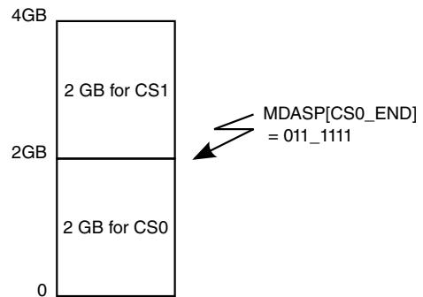  
Figure 35-2. Chip select partion—2 Gbytes per chip select

# 35.4.4.2.2 Creating 2 Gbyte address spaces with 1 Gbyte CS density

If the DDR memory space allocation is 2 Gbytes, there are three options for configuring the chip select partition:MDASP[CS0_END] to 001_1111 (1 Gbyte), MDASP[CS0_END] to 011_1111 (2 Gbytes), and MDASP[CS0_END] to 101_1111 (3 Gbytes).

# Functional Description

If DDR memory space allocation is 2 Gbytes, there are three options for configuring the chip select partition:

• MDASP[CS0_END] to 001_1111 (1 Gbyte)   
• MDASP[CS0_END] to 011_1111 (2 Gbytes)   
• MDASP[CS0_END] to 101_1111 (3 Gbytes)

The figure below shows the associated memory space:

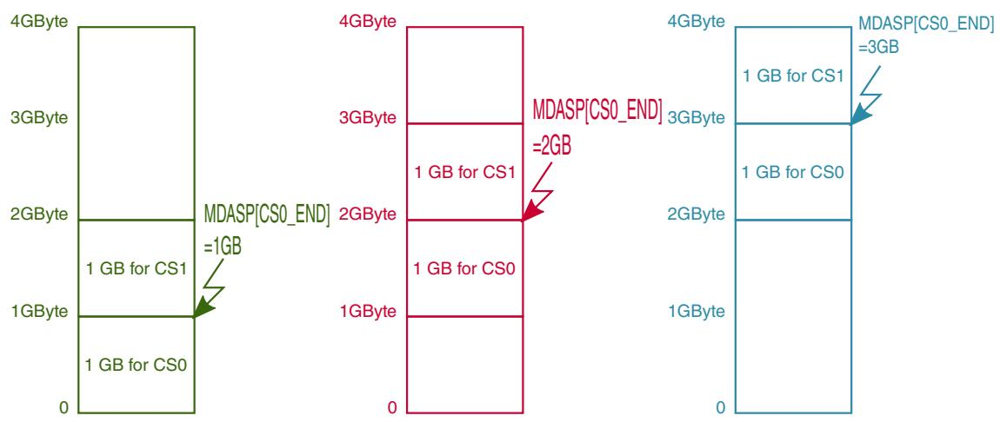  
Figure 35-3. Chip select partion—1 Gbyte per chip select

# 35.4.4.3 Translation of AXI accesses to DDR accessess

# 35.4.4.3.1 Example 1

Assume the AXI read access has the following attributes:

• Wrap (arburst $[ 1 { : } 0 ] = 1 0 \mathrm { b }$ )   
• AXI size of 128 bits (arsize $[ 2 ; 0 ] = 1 0 0 0 )$   
• AXI length of 8 (arlen[3:0] = 0111b)   
• AXI address with suffix B0h (non-aligned to AXI wrap boundary which is $1 6 \mathbf { B } \mathbf { x } 8 = 1 2 8 \mathbf { B } = 0 \mathbf { x } 8 0 )$

Toward DDR3(MDMISC[DDR_TYPE] = 00b) with the following attributes:

• x32 (MDCTL[DSIZ] = 01b)   
• burst length of 8 (MDCTL[BL] = 1b)

In this case, the AXI wrap boundary is every 16Bx8=128B (0x80) and the DDR wrap boundary is every $4 \mathbf { B } \mathbf { x } 8 { = } 3 2 \mathbf { B } ( 0 \mathbf { x } 2 0 )$ .

The master expects to fetch the data that is associated with the following addresses: 0xB0, 0xC0, 0xD0, 0xE0, 0xF0, 0x80, 0x90, 0xA0.

The first aligned AXI address that is associated with suffix 0xB0 is with suffix $0 \mathrm { { x } 8 0 }$ , and the last wrap AXI address is with suffux 0xFF. Because the AXI master expects to get the first data from AXI address with suffix 0xB0, the MMDC issues the following accesses toward the DDR:

• Read access toward logic address with suffix 0xA0 (DDR boundary is $0 \times 2 0$ and 0xA0 is the closest to 0xB0)

# NOTE

Logic address is the address of the column normalized to 1 byte.

• Read access toward logic address with suffix 0xC0   
• Read access toward logic address with suffix 0xE0   
• Read access toward logic address with suffix 0x80

The MMDC breaks the AXI access into four DDR accesses and returns the read data associated with address 0xB0 to the master first. The read data fetched from address 0xA0 is stored in the internal buffers and is driven back to the master at the end.

# 35.4.4.3.2 Example 2

Assume the AXI write access has the following attributes:

• Increment (awburst[1:0]=2'b01)   
• AXI size of 64bits (awsize[2:0]=3'b011)   
• AXI length of 8 (awlen[3:0]=4'b0111)   
• AXI address with suffix 0xB0 (aligned as the size of the increment is 8B)

Toward DDR3(MDMISC[DDR_TYPE]=2'b00) with the following attributes:

• x64 (MDCTL[DSIZ]=2'b10)  
• burst length of 8 (MDCTL[BL]=1'b1)

In this case, the AXI alignment is every 8B and the DDR boundary is every $8 \mathrm { B x } 8 { = } 6 4 \mathrm { B } ( 0 \mathrm { x } 4 0 )$ .

The master expects to write the data to the following addresses: 0xB0, 0xB8, 0xC0, 0xC8, 0xD0, 0xD8, 0xE0, 0xE8.

The MMDC will issue the following accesses toward the DDR:

# Functional Description

• Write access toward logic address with suffix 0x80 (DDR boundary is 0x40 and $0 \mathrm { { x } 8 0 }$ is the closest to 0xB0) while address $0 \times 8 0$ to 0xAF are masked by DM (data masking signal).

# NOTE

Logic address is the address of the column normalized to 1 byte.

• Write access toward logic address with suffix 0xC0 while addresses 0xF0 through 0xFF are masked by DM (data masking signal)

The MMDC will break the AXI access into two DDR accesses.

# 35.4.4.3.3 Example 3

Assume the AXI write access has the following attributes:

• Wrap (awburst[1:0]=2'b10)  
• AXI size of 128bits (awsize[2:0] $=$ 3'b100)   
• AXI length of 4 (awlen[3:0]=4'b0011)   
• AXI address with suffix 0x80 (aligned)

Toward DDR3(MDMISC[DDR_TYPE]=2'b00) with the following attributes:

• x64 (MDCTL[DSIZ]=2'b10)  
• burst length of 8 (MDCTL[BL]=1'b1)

In this case, the AXI wrap boundary is every 16Bx4=64B (0x40) and the DDR wrap boundary is every $8 \mathrm { x } 8 { = } 6 4 \mathrm { B } ( 0 \mathrm { x } 4 0 )$ .

The master expects to write the data to the following addresses: 0x80, 0x90, 0xA0, 0xB0.

Because the AXI wrap boundary and DDR wrap boundary are similar and the starting AXI address is aligned, the MMDC will issue only one access toward the DDR as follows:

• Write access towards logic address with suffix 0x80

# NOTE

Logic address is the address of the column normalized to 1 byte.

# 35.4.4.3.4 Example 4

Assume the AXI write access has the following attributes:

• Increment (awburst[1:0]=2'b01)

• AXI size of 64bits (awsize[2:0]=3'b011)   
• AXI length of 2 (awlen[3:0]=4'b0001)   
• AXI address with suffix 0x5 (non aligned)

Toward DDR3(MDMISC[DDR_TYPE]=2'b00) with the following attributes:

• x32 (MDCTL[DSIZ]=2'b10)  
• burst length of 8 (MDCTL[BL]=1'b1)

In this case the AXI alignment is every 8B (0x8) and the DDR boundary is every $4 \mathbf { B } \mathbf { x } 8 { = } 3 2 \mathbf { B } ( 0 \mathbf { x } 2 0 )$ .

The master expects to write the data to the following addresses: 0x5 (with WSTRB=0xE0), 0x8 (till 0xF).

The MMDC will issue one access toward the DDR as follows:

Write access toward logic address with suffix 0x0 (DDR boundary is $0 \times 2 0$ and $0 \mathrm { x 0 }$ is the closest to 0x0) while address 0x0 till 0x4 are masked by DM (data masking signal) and address 0x10 till 0x1F are also masked by DM.

# 35.4.4.3.5 Example 5

Assume AXI write access has the following attributes:

• Increment (awburst[1:0]=2'b01)   
• AXI size of 64bits (awsize[2:0]=3'b011)   
• AXI length of 7 (awlen[3:0]=4'b0001)   
• AXI address with suffix 0x10 (aligned)

Toward DDR3 (MDMISC[DDR_TYPE]=2'b00) with the following attributes:

• x64 (MDCTL[DSIZ]=2'b10)  
• burst length of 8 (MDCTL[BL]=1'b1)

In this case the AXI alignment is every 8B (0x8) and the DDR boundary is every $8 \mathrm { B x } 8 { = } 6 4 \mathrm { B } ( 0 \mathrm { x } 4 0 )$ .

The master expects to write the data to the following addresses: 0x10, 0x18, 0x20, 0x28, 0x30, 0x38, 0x40, 0x48.

Because the AXI access is not aligned to DDR boundary, which is every 0x40, the MMDC will issue two accesses toward the DDR as follows:

• Write access toward logic address with suffix 0x0 while address 0x0 till 0xF are masked by DM (data masking signal).

# NOTE

Logic address is the address of the column normalized to 1 byte.

• Write access towards logic address with suffix 0x40 while addresses 0x50 till 0x7F are masked by DM (data masking signal).

# 35.4.4.4 Address mirroring

When enabling this feature, address bits DRAM_A3, DRAM_A4, DRAM_A5, DRAM_A6, DRAM_A7, DRAM_A8, DRAM_SDBA0, and DRAM_SDBA1 behave differently according to the associated chip select.

This feature facilitates PCB board routing for devices on chip select 1, which are typically populated on the opposite side of the PCB from the devices on chip select 0.

# NOTE

This feature will not be supported for DDR3 since only a single chip select is supported for DDR3

The following table specifies the address mirroring options:

Table 35-6. Address mirroring options   

<table><tr><td>MMDC pin</td><td>Chip select 0 pin</td><td>Chip select 1 pin</td></tr><tr><td>DRAM_A3</td><td>DRAM_A3</td><td>DRAM_A4</td></tr><tr><td>DRAM_A4</td><td>DRAM_A4</td><td>DRAM_A3</td></tr><tr><td>DRAM_A5</td><td>DRAM_A5</td><td>DRAM_A6</td></tr><tr><td>DRAM_A6</td><td>DRAM_A6</td><td>DRAM_A5</td></tr><tr><td>DRAM_A7</td><td>DRAM_A7</td><td>DRAM_A8</td></tr><tr><td>DRAM_A8</td><td>DRAM_A8</td><td>DRAM_A7</td></tr><tr><td>DRAM_SDBA0</td><td>DRAM_SDBA0</td><td>DRAM_SDBA1</td></tr><tr><td>DRAM_SDBA1</td><td>DRAM_SDBA1</td><td>DRAM_SDBA0</td></tr></table>

# 35.4.5 LPDDR2 and DDR3 pin mux mapping

The following table shows the pin mux mapping between LPDDR2 and DDR3. The i.MX DDR I/O pads corresponds with the DDR3 standard.

• In DDR3, all DRAM_DATA, DRAM_SDQS, and DRAM_DQM data lines work with channel 0.   
• In LPDDR2, DRAM_DDQS[3:0], DRAM_DATA[31:0] and DRAM_DQM[3:0] work with channel 0. DRAM_SDQS[7:4], DRAM_DATA[63:32], and DRAM_DQM[7:4] work with channel 1.

Table 35-7. LPDDR2 and DRAM pin mux mapping   

<table><tr><td>DRAM I/O pad</td><td>LPDDR2 I/O pad</td></tr><tr><td>DRAM_ADDR00</td><td>LPDDR2_CA0</td></tr><tr><td>DRAM_ADDR01</td><td>LPDDR2_CA1</td></tr><tr><td>DRAM_ADDR02</td><td>LPDDR2_CA2</td></tr><tr><td>DRAM_ADDR03</td><td>LPDDR2_CA3</td></tr><tr><td>DRAM_ADDR04</td><td>LPDDR2_CA4</td></tr><tr><td>DRAM_ADDR05</td><td>LPDDR2_CA5</td></tr><tr><td>DRAM_ADDR06</td><td>LPDDR2_CA6</td></tr><tr><td>DRAM_ADDR07</td><td>LPDDR2_CA7</td></tr><tr><td>DRAM_ADDR08</td><td>LPDDR2_CA8</td></tr><tr><td>DRAM_ADDR09</td><td>LPDDR2_CA9</td></tr><tr><td>DRAM_ADDR10</td><td>—</td></tr><tr><td>DRAM_ADDR11</td><td>—</td></tr><tr><td>DRAM_ADDR12</td><td>—</td></tr><tr><td>DRAM_ADDR13</td><td>—</td></tr><tr><td>DRAM_ADDR14</td><td>—</td></tr><tr><td>DRAM_ADDR15</td><td>—</td></tr><tr><td>DRAM_CAS_B</td><td>—</td></tr><tr><td>DRAM_RAS_B</td><td>—</td></tr><tr><td>DRAM_WE_B</td><td>—</td></tr><tr><td>DRAM_SDCKE0</td><td>LPDDR2_CKE0</td></tr><tr><td>DRAM_SDCKE1</td><td>LPDDR2_CKE1</td></tr><tr><td>DRAM_CS_B0</td><td>LPDDR2_CS_B0</td></tr><tr><td>DRAM_CS_B1</td><td>LPDDR2_CS_B1</td></tr><tr><td>DRAM_ODT0</td><td>LPDDR2_ODT0</td></tr><tr><td>DRAM_ODT1</td><td>LPDDR2_ODT1</td></tr><tr><td>DRAM_SDCLK0_P</td><td>LPDDR2_CK0</td></tr><tr><td>DRAM_SDCLK1</td><td>LPDDR2_CK1</td></tr><tr><td>DRAM_BA0</td><td>—</td></tr><tr><td>DRAM_BA1</td><td>—</td></tr><tr><td>DRAM_BA2</td><td>—</td></tr></table>

# 35.4.6 Power Saving and Clock Frequency Change modes

# 35.4.6.1 Power saving general

MMDC supports multiple DDR power saving modes.

# NOTE

At default, the power saving modes are disabled. These modes may dramatically decrease the power consumption of DDR memories.

1. Self-refresh entry to the entire DDR device (for both chip select 0 and 1) can be activated through two mechanisms:

• LPMD (Low Power Mode)

• Hardware handshaking (LPMD/LPACK) with the clock module in the system   
• Software handshaking by setting the field MAPSR[LPMD] and polling MAPSR[LPACK]   
• Automatic entry by configuring the amount of idle cycle for triggering selfrefresh entry through MAPSR[PST] and by clearing MAPSR[PSD]

• DVFS (Dynamic Voltage and Frequency Change)

• Hardware handshaking (DVFS/DVACK) with the clock module in the system   
• Software handshaking by setting the field MAPSR[DVFS] and polling MAPSR[DVACK]

# NOTE

If hardware or software requests for self-refresh entry were detected by the MMDC (even before the assertion of the LPACK), no write or read accesses will be acknowledged until the deassertion of those requests.

2. Automatic active/precharge power down entry to a specific chip select can be activated by configuring the ESDPDC register:

• PWDT_0/PWDT_1 - define the number of idle cycles before entering power down, can be different value per chip select.   
• SLOW_PD - In case of DDR3 memory is configured to use slow precharge power down then this bit should be set as well.   
• BOTH_CS_PS - The MMDC can either set each chip select independently to power down, according to its idle state, or set both chip selects to power down only if both in idle state for the configured period.   
• Few parameters must be configured in addition:

• Timing parameters at MDCFG0[tXP and tXPDLL].   
• ODT timing at MDOTC[tAOFPD, tAONPD, tANPD and tAXPD]

# NOTE

It is possible to enter certain chip selects to low power consumption while the second chip select is activated.

3. Automatic precharge of all DDR banks to a specific chip select. Can be activated by configuring ESDPDC fields: PRCT_0 and PRCT_1. Each field determines a value loaded to a different chip select.

# 35.4.6.2 Self refresh and Frequency change entry/exit

As described in Power saving general, the MMDC supports two mechanisms that will cause the DDR device to enter self-refresh mode:

• LPMD (Low Power Mode) - For power saving purposes   
• DVFS (Dynamic Voltage and Frequency Change) - For clock frequency changes

While the DDR device is in self-refresh mode, there is no need to provide periodic refresh commands.

The MMDC treats hardware/software handshaking of LPMD/DVFS in the same manner:

• Upon the assertion of LPMD/DVFS request, the following is done:

• The MMDC blocks any further AXI accesses even before the acknowledge is asserted   
• Completes all opened AXI accesses   
• Closes (precharge) all banks in the appropriate timing   
• Drives self-refresh command by deasserting clock enable signal (DRAM_SDCKE is driven to $" 0 "$ ) together with a refresh command. This occurs after satisfying tRP/tRPA from the precharge all command.   
• Deasserts the clock (CK) that is driven to the DDR device   
• Asserts LPMD/DVFS acknowledge (LPACK/DVACK)   
• Allows deassertion of the operating clock of the MMDC (AXI clock)

• Upon the deassertion of LPMD/DVFS request, the following is done:

• Operating clock of the MMDC must be turned on before LPMD/DVFS is deasserted   
• Starts driving the clock (CK) to the DDR device   
• After satisfying tCKSRX from clock renewal the clock enable signal (DRAM_SDCKE) is asserted   
• LPMD/DVFS acknowledge (LPACK/DVACK) is deasserted

# Functional Description

• After satisfying tXS from the assertion of DRAM_SDCKE, a refresh command is driven to the DDR device.   
• If ZQ calibration is enabled then tRFC is satisfied from the refresh command and a long ZQ command is driven.   
• tZQoper idle cycles are counted after the ZQ command.   
• After satisfying tDLLK from the assertion DRAM_SDCKE, the MMDC returns to normal operation.

The figure below shows the timing diagram of the hardware/software handshaking of LPMD/DVFS:

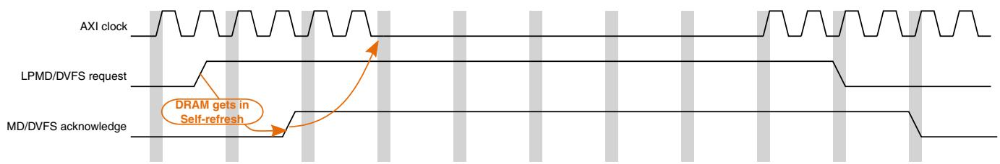  
Figure 35-4. LPMD/DVFS Hardware/Software Handshaking

Note for self-refresh:

• As soon as LPMD or DVFS requests are detected by either hardware or software handshaking, the MMDC will deassert the AXI ARREADY/AWREADY signals immediately to block further requests from the system.   
• In case of automatic self-refresh, the internal operating clock will be negated to save power.

# 35.4.7 Reset

# 35.4.7.1 Hard reset

When hard reset is asserted (aresetn is driven to $" 0 "$ ) while warm reset is deasserted (warm_reset is driven to $" 0 "$ ), the entire MMDC will be initialized, including configuration/status registers and state machines.

In order to access the DDR device, the MMDC will then have to be reconfigured.

# 35.4.7.2 Warm reset

The MMDC supports warm reset signal. The warm reset signal must envelop the hard reset signal and then the MMDC will reset all the internal registers. The only registers that are not reset are those that are essential for returning it to normal operation without repeating the initialization sequence and without losing data stored in the memory (configuration/status registers won't be initialized).

For the successful operation of warm reset, the following steps must be performed:

• The MMDC must enter self-refresh mode. This can be achieved by either LPMD or DFVS requests   
• Wait for LPMD or DVFS acknowledge   
• Assert warm reset signal (i.e. drive warm_reset to "1")   
• Assert hard reset signal (i.e. drive aresetn to "0")   
• Deassert hard reset signal   
• Deassert warm reset   
• Get out of the LPMD/DVFS mode

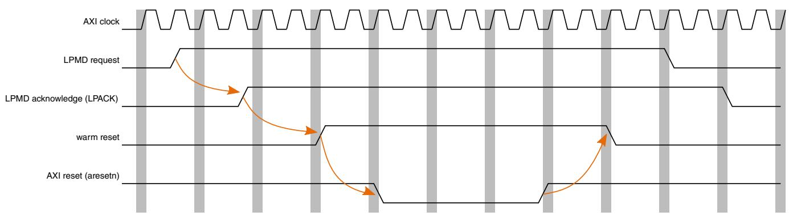  
Figure 35-5. Warm Reset Diagram

# 35.4.7.3 Software reset

The MMDC supports software reset. When software reset is configured then the MMDC will reset all the internal registers except those that are essential for returning to normal operation without repeating the initialization sequence or without losing data stored in the memory (configuration/status registers won't be initialized).

The following steps should be performed for successful operation of software reset:

• The MMDC should enter self-refresh mode. This can be achieved by either LPMD or DFVS request.   
• Wait for LPMD or DVFS acknowledge

# Functional Description

• Assert software reset, by setting MDMISC[RST]   
• Get out of the LPMD/DVFS mode

Normal operation can be resumed.

# 35.4.8 Refresh Scheme

The MMDC supports various automatic refresh options which can be configured via the MDREF register.

The periodic auto refresh can be triggered by the following clocks:

• 32 kHz clock   
• 64 kHz clock   
• MMDC operating clock

The refresh scheme of the MMDC is flexible and allows the system to configure the desired AXI accesses delay/latency in each refresh cycle.

The table below shows an example of four configurations of the refresh cycles that will be handled by the MMDC. Each configuration meets a refresh rate of 3.9μs (tREFI, refresh command every $3 . 9 \mu \mathrm { s } \dot { }$ ).

Table 35-8. MMDC Refresh Scheme   

<table><tr><td>Option number</td><td>Description</td><td>REFR</td><td>REF_SEL</td><td>REF_CNT</td><td>DDR hang time</td></tr><tr><td>1</td><td>Issue 8 refresh commands every 31,250 ns</td><td>0x7 (8 refreshes)</td><td>0x0 (64 kHz)</td><td>not needed</td><td>tRFC x 8</td></tr><tr><td>2</td><td>Issue 4 refresh commands every 15,625ns</td><td>0x3 (4 refreshes)</td><td>0x1(32 kHz)</td><td>not needed</td><td>tRFC x 4</td></tr><tr><td>3</td><td>Issue 2 refresh commands every 7800ns</td><td>0x1(2 refreshes)</td><td>0x2 (REF_CNT)</td><td>7800/2.5 = 3120 (0xC30)</td><td>tRFC x 2</td></tr><tr><td>4</td><td>Issue 1 refresh command every 3900 ns</td><td>0x0 (1 refresh)</td><td>0x2 (REF_CNT)</td><td>3900/2.5 = 1560(0x618)</td><td>tRFC</td></tr></table>

# 35.4.9 Burst Length options towards DDR

The MMDC supports burst lengths which can be configured through MD+CTL[BL] as follows:

• In DDR3 mode, only burst length 8 can be used.   
• In LPDDR2 mode, only burst length 4 can be used.

In DDR3 mode read/write accesses to the DDR are always 8 words (x16) and aligned in according to JEDEC standards.

In case of AXI INCREMENT, accesses that are not aligned the irrelevant data is masked in write accesses and ignored in read accesses. In case of AXI WRAP accesses, even if the access is not aligned, then the MMDC provides an internal optimization mechanism for better efficiency of the DDR data bus.

# 35.4.10 Exclusive accesses handling

The MMDC contains four exclusive monitors, each for dedicated ID as configured in MAEXIDR0 and MAEXIDR1.

• If legal read exclusive is received by the MMDC, the associated monitor is turned on.   
• While the monitor is turned on upon legal write exclusive, the monitor will be turned off and the write will be completed successfully with EXOKAY.

• The following rules must be met for successful exclusive access:

• Aligned access (the AXI address is aligned to the AXI size)   
• AXI single access (AXI burst length isn't greater than 1)   
• AXI size of up to 64 bits   
• AXI non-cachable access (i.e. ARCACHE[1]/AWCACHE[1] is equal "0" or ARCACHE[1]/AWCACHE[1] is equal "1" while ARCACHE[3:2]/ AWCACHE[3:2] are equal "00")   
• AXI ID that matches one of the four exclusive IDs

Exclusive read behavior (first bullet also correct for non-exclusive accesses):

• In case of security violation, the read is blocked and is not sent to DDR. There are two options for response:   
• If ARCR_SEC_ERR_EN (MAARCR[30] ) is high, SLV error is issued towards the Master, otherwise OKAY response is sent to the Master.

• If AXI exclusive rules violation occurs (as described above), the read access is not blocked and is sent to DDR. The data will be fetched and be driven to the master, but the type of response may be unpredicted.   
• If none of the above occurs, the read is sent to the DDR. The exclusive monitor will be turned on and the response is EXOKAY   
• If additional legal AXI read exclusive is received with the same ID before the AXI exclusive write, the monitor will be updated with the latest attributes.

Exclusive write behavior (first bullet also correct for non-exclusive accesses):

# Performance

• In case of security violation, the write is blocked and is not sent to DDR, but the monitor will be kept on. There are two options for response:

• If ARCR_SEC_ERR_EN (MAARCR[30]) is high then SLV error is issued towards the Master, otherwise OKAY response is sent to the Master.

• In case of AXI exclusive rules violation (as described above), the write is blocked and is not sent to DDR. In that case the type of response may be unpredicted.

• In case the exclusive write access has different AXI attributes, but the same ID as the read exclusive access, the write is blocked and is not sent to DDR and the monitor will be turned off. There are two options for response:

• If ARCR_EXC_ERR_EN (MAARCR[28]) is high then SLV error is issued towards the Master, otherwise OKAY response is sent to the Master.

• In case of regular (non exclusive) write access is received to the same address or overlapping addresses then the write will be sent to the DDR and the monitor will be turned off.

• In case of legal write exclusive access is received with the same attributes as the read exclusive access while the monitor is on ( no write accesses occured to the same address between the read exclusive and write exclusive), then the write is sent to DDR and the response is EXOKAY. But, if the legal write exclusive is received while the monitor is off, the write is blocked and there are two options for response.

• If ARCR_EXC_ERR_EN (MAARCR[28]) is high then SLV error is issued towards the Master, otherwise OKAY response is sent to the Master.

# 35.4.11 AXI Error Handling

The MMDC supports the AXI responses listed here.

• In case of AXI exclusive violation there are two options for response:

• If MAARCR[28] is high then SLV Error is issued towards the Master, Otherwise OKAY response is sent to the Master

# NOTE

In case of read error MMDC drives zeros on the read data bus

# 35.5 Performance

# 35.5.1 Arbitration and reordering mechanism

# 35.5.1.1 Arbitration General

The following specifies arbitration and reordering flow in MMDC towards the DDR.

• AXI read and write accesses are sampled in the associated queue.   
• Read/write arbitration is handled to select the winning access.   
• Winning access is sampled in the reordering queue   
• Reordering mechanism is handled between valid requests that reside in the reordering queue to select the access that will be dispatched to the DDR.

• The reordering is held in order to optimize the accesses and to maximize the utilization of the DDR bus   
• As soon as the reordered access is completed (indicated by end of response or data phase) then it is erased from the associated queue and the MMDC is ready to receive the next available access from the master

In general, the reordering/arbitration mechanism is based on dynamic priority mechanism, which compares dynamic priorities between valid entries in the reordering queue and issues the entry with highest dynamic priority towards the DDR Logic.

The selection of the winning access is based on two modes, which can be activated together, as following:

• Real time channel mode:   
• Accesses with $\mathrm { Q o S = ^ { \prime } f ^ { \prime } }$ (i.e. awqos[3:0]/arqos[3:0] = "f") will bypass all other requests towards the DDR   
• Dynamic scoring mode:   
• The arbitration mechanism is based on dynamic priority. Relevant for the accesses with QoS smaller than 'f' or when real time channel mode is disabled.

# NOTE

Due to re-ordering and optimization mechanism (per different AXI ID), the transactions towards the DDR may be driven in a different ID order they were received by the AXI master. In similar way, the write response, read response or read data may be driven to the AXI master in a different ID order.

# 35.5.1.2 Real time channel mode

When real time mode is enabled (i.e MAARCR[ARCR_RCH_EN] = "1") , all requests with $\mathrm { Q o S = ^ { \prime } f ^ { \prime } }$ (i.e. awqos[3:0]/aqqos[3:0] = "f") will bypass all other pending accesses towards the DDR. This mode is enabled by default.

# Performance

# 35.5.1.3 Dynamic scoring mode (Arbitration Winning Conditions)

The arbitration between pending accesses in the MMDC is handled according to a dynamic priority of each access.

The dynamic priority (may be also called score) is calculated according to a sum of some factors (final_score[3:0]), where part of them may be updated dynamically. The following will specify each scoring factor:

• MAARCR[ARCR_PAG_HIT] (Page hit score) - A static score which is taken into account in case the pending access has a page hit   
• MAARCR[ARCR_ACC_HIT] (Access hit score) - A static score, which is taken into account in case the current access type (read/write) is the same as the access that has been dispatched to the DDR previously   
• MAARCR[ARCR_DYN_JMP] (Dynamic jump score) - A dynamic score which is given to any pending access in case it was not chosen in the arbitration. The dynamic jump counter is limited by maximum value which is set in MAARCR[ARCR_DYN_MAX] .   
• QoS score which is indicated through a sideband 4bits AXI signals (awqos[3:0]/ aqqos[3:0]) and is driven by the AXI master per access

# NOTE

In order to prevent an overflow in the total sum of scores, a clipping is held and selects the maximum score value of 'f' once a total scores sum is greater than 'f'.

The figure below shows the dynamic score calculations

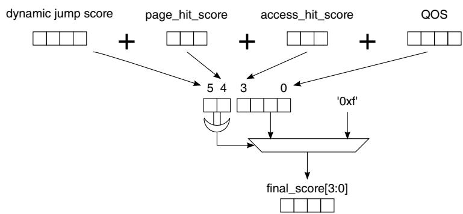  
Figure 35-6. Dynamic score/priority calculation

# 35.5.1.4 Guarding (aging) mechanism

The guarding mechanism (may be also called aging) is used to prevent a starvation of accesses.

As soon as the dynamic jump score reaches its maximum value

(MAARCR[ARCR_DYN_MAX] ) then each time a pending request was not chosen in the arbitration, the "guarding" counter is incremented by 1. When the "guarding" counter reaches its predefined value, set in MAARCR[ARCR_GUARD], the associated request gets the highest priority and will be chosen in the next arbitration cycle towards the DDR unless a real time channel (i.e access with $\mathrm { Q o S } = " \mathrm { f " } ,$ ) is arrived.

Note: In case real time channel has arrived then the dynamic score of the non real time channels won't increment in order to prevent a case where the "guarding" counter of more than one access has reached its limit.

# 35.5.2 Prediction mechanism

When prediction mechanism is enabled (i.e by configuring MDMISC[MIF3_MODE]) then the MMDC predicts the chip-select, bank address and row address that is going to be issued towards the DDR before the access is physically dispatched towards DDR device.

That mechanism enables to prepare the DDR device with future accesses and improves the overall DDR performance.

This prediction mechanism operates in parallel to the reordering mechanism and may yield a prediction based on 3 levels of pending accesses:

1. Access in first stage of pipeline.   
2. Valid access on AXI bus either read channel or write channel.   
3. Valid access on special bus from arbitration - this access is chosen by the arbitration as the next miss access in its buffers

# 35.5.3 Special Optimization for accesses towards DDR3

In case an AXI read/write wrap non-aligned access is acknowledged in DDR3 mode with the same wrap boundary as the DDR wrap boundary then the MMDC will make an optimization and issue only one access towards the DDR, although all the accesses towards the DDR3 must be aligned.

For example: AXI write access with size of 128bits (awsize[2:0] $\left| = 3 \right.$ 'b100), length of 4 (awlen[3:0]=4'b0011) towards DDR3 x64 (burst length 8). In that case the AXI wrap boundary is $1 6 \mathrm { { B x } } 4 = 6 4 \mathrm { { B } }$ (0x40) and the DDR3 wrap boundary is $8 \mathrm { B x } 8 { = } 6 4 \mathrm { B }$ (0x40). If, for example, the AXI access is towards AXI address with suffix of 0x10 (non-aligned to 64B boundary) then the MMDC will get from the AXI master the data that is associated with addresses 0x10, 0x20, 0x30, 0x0. The MMDC will rearrange internally the data so it

# MMDC Debug

will match DDR3 alignment as following: 0x0, 0x10, 0x20, 0x30 and drive it in one access towards the DDR to address 0x0. The alternative was to issue two accesses towards the DDR with address 0x0 with different data masking

# NOTE

In read wrap access the same optimization is handled, while as soon as the critical AXI word is fetched from the DDR then it is driven immediately to the AXI master without buffering. Based on the example above, the master expects to fetch first the data that is associated with address 0x10. Therefore the MMDC will issue read access from address 0x0 of the DDR and as soon as the data that is associated with address 0x10 is received then it will be driven back immediately to the master even before fetching the data of the furhter addresses.

# 35.6 MMDC Debug

# 35.6.1 Hardware debug monitor

The MMDC has a hardware debugging mechanism that monitors each access that is driven to the MMDC. Every time this mechanism is enabled (setting of MADPCR0[DBG_EN] to "1") then each access that will be dispatched to the DDR will be also observed in the I/O pads (i.e. over ipp_do_ddr_debug[50:0]). The content of this bus is described in the table below.

Table 35-9. Hardware monitor debugging   

<table><tr><td>Signal Name</td><td>Number of Bits</td><td>Description</td></tr><tr><td>acc_addr</td><td>[31:0]</td><td>AXI ADDRESS of the selected access</td></tr><tr><td>acc_type</td><td>1</td><td>access type of the selected access. &quot;0 indicates write. &quot;1&quot; indicates read.</td></tr><tr><td>acc_id</td><td>[15:0]</td><td>AXI transaction ID of the selected access</td></tr><tr><td>valid_strobe</td><td>1</td><td>indication for a valid request. This signal will be asserted for 1 clock cycle</td></tr></table>

The fields above are organized as following:

MMDC_DEBUG[50:0] = {1'b0,valid_strobe,acc_id,access_type,addr}

These signals are sent to IOMUX, in IOMUX user can configure it to be output from the chip for debug usage.

# 35.6.2 Step By Step (SBS) software monitor

The MMDC has a Step By Step (SBS) software debugging mechanism that monitors each access that is driven to the MMDC. Every time this mechanism is trigerred then one AXI access will be dispatched to the DDR and in parallel its attributes will be observed in a status register.

Once the "step by step" is enabled (i.e. MADPCR0[SBS_EN] is "1") then all accesses to the DDR device will be halted. This SBS feature is used during DDR SDCLK frequency scaling to prevent any accesses to the DDR device during the transition. Setting MADPCR0[SBS] to "1" will dispatch the access that is pending in the head of the MMDC queue (read or write). Upon every setting of MADPCR0[SBS]:

• The AXI attributes of the access will be sampled in the associated MASBS0 and MASBS1 fields   
• MADPCR0[SBS] will be cleared automatically.

Setting again MADPCR0[SBS] to "1" will dispatch the next pending access in the MMDC queue.

# NOTE

Setting the ARCR_ARB_REO_DIS bit in the MMDC0_MAARCR Register disables the SBS function

# 35.7 MMDC Profiling

The profiling mechanism provides the ability to calculate the DDR utilization together with read and write accesses statistics towards DDR per given period of time.

MMDC supports the following profiling counters:

• MADPSR0 (Total cycles count) - Indicates the total amount of cycles of the profiling period (up to $2 ^ { \wedge } 3 2$ cycles)   
• MADPSR1 (Busy cycles count) - Indicates the total busy cycles during the profiling period. Busy cycles are any MMDC clock cycles where the internal state machine is not idle. If any read or write requests are pending in the FIFOs, the MMDC is not idle.   
• MADPSR2 (Total read accesses count) - Indicates the total read accesses towards MMDC during the profiling period   
• MADPSR3 (Total write accesses count) - Indicates the total write accesses towards MMDC during the profiling period

# LPDDR2 Refresh Rate Update and Timing Derating

• MADPSR4 (Total read bytes count) - Indicates total bytes that were read from MMDC during the profiling period   
• MADPSR5 (Total write bytes count) - Indicates total bytes that were written to MMDC during the profiling period

All profiling items described above are disabled by default. The following describes how to control the profiling mechanism:

• MADPCR0[DBG_EN] enables profiling.   
• MADPCR0[PRF_FRZ] stops/freezes the profiling for example in case user wishes to perform DDR profiling per specific task. In order to resume profiling then MADPCR0[PRF_FRZ] should be cleared.   
• MADPCR0[DBG_RST] clears all profiling counters   
• MADPCR0[CYC_OVF] indicates whether an overflow occured in the total cycles counter (i.e. total amount of cycles are greater than $2 ^ { \land } 3 2 $ ) . This field can only cleared by writing '0'.

Read/Write statistics can be collected per specific AXI ID (16bits). The following fields in MADPCR1 register determines which AXI-ID or AXI-ID's to monitor:

• PRF_AXI_ID defines which AXI IDs are taken for profiling. Default values is 16'h0.   
• PRF_AXI_ID_MASK defines which bits from PRF_AXI_ID will be compared with AXI ID of read/write access. "1" means to monitor the associated bit and "0" means don't care. Default value is 16'h0000, meaning all IDs are not monitored

So the AXI-IDs to be monitored are calculated according to the following equation:

(AXI-ID & PRF_AXI_ID_MASK) Xnor (PRF_AXI_ID & PRF_AXI_ID_MASK)

For example if AXI ID's between A100 till A1FF are wished to be monitored then the following should be configured:

• PRF_AXI_ $\mathrm { I D } = \mathrm { A } 1 0 0$   
• PRF_AXI_ID_MASK = FF00

# 35.8 LPDDR2 Refresh Rate Update and Timing Derating

LPDDR2 devices may have a temperature sensor that is used to determine an appropriate refresh rate and whether AC timing derating is required. The status of the temperature sensor can be read through MRR command from LPDDR2 MR4 register.

The MMDC supports refresh update and timing derating mechanism on the fly. The following steps specify how to use that mechanism:

• Perform periodic polling on MR4 LPDDR2 register using MRR command

• Read MDMRR register and analyze the MR4 indication   
• In case refresh rate update and/or AC timing derating is required then it is needed to update MDREF and/or MDMR4[tRCD_DE, tRC_DE, tRAS_DE, tRP_DE, tRRD_DE] parameters

# NOTE

MDMR4[tRCD_DE, tRC_DE, tRAS_DE, tRP_DE, tRRD_DE] are referred to the associated values configured at MDCFG3LP[tRC_LP, tRP_LP, tRCD_LP], MDCFG1[tRAS], MDCFG2[tRRD]

• Assert MDMR4[UPDATE_DE_REQ]   
• When the MMDC switch to the new values then an acknowledge will be indicated at MDMR4[UPDATE_DE_ACK]

The enabled power saving features may be interfering with the MR4 reads. When these features are enabled the MMDC will automatically enter self-refresh and hence prevent the MR4 reads. Hence the Power Saving and refresh functionality should be disabled when SW performs the MR4 reads.

To disable the “Power Down” mode, set bit 0 of MAPSR (0x021B0404) to 1’b. To disable the “Self-Refresh Power Down Timer” mode, set bits [15:8] of MDPDC (0x021B0004) to 0x00.

Overall Sequence to Perform MR4 reads

1. Set MAPSR to 0x00010107   
2. Set MDPDC to 0x00020076   
3. MRR command to read MR4   
4. Write MDPDC to 0x00025576 to re-enable this feature   
5. Write MAPSR to 0x00010106 to re-enable this feature

# 35.9 DLL Switching

# 35.9.1 DLL Off mode

DLL Off mode is supported only in DDR3 and allows operation of the DDR in low frequency (i.e. below 125 MHz as defined in JEDEC standard).

For further details refer to DLL-off Mode chapter in the standard.

The following steps should be executed in order to switch from DLL on to DLL off mode:

# DLL Switching

• Assert CON_REQ signal and wait to CON_ACK assertion.   
• Disable power down timers that can conflict with this sequence, such as: MAPSR[PSD], MDPDC[PWDT_1], MDPDC[PWDT_0], MDPDC[PRCT_0], MDPDC[PRCT_1].   
• Execute precharge all banks command (via MDSCR).   
• Execute MRW command to MR1 and disable RTT Nom (A9,A6,A2 =0) and DLL ON $( \mathrm { A } 0 = 1 )$ ).   
• Execute MRW command to MR2 in order to update CWL to 6.   
• Execute MRW command to MR0 in order to update CL to 6.   
• De-assert CON_REQ signal.   
• Enter self refresh mode. For further information refer to Self refresh and Frequency change entry/exit.   
• At self refresh entry acknowledge , change to the desired frequency.   
• Exit self refresh mode.   
• Assert CON_REQ and wait to CON_ACK assertion.   
• Enable Pull Down resistors on DQS (through the I/O-MUX ).   
• Configure the MMDC register as following:   
• Update tCWL ${ = } 6$ and tCL ${ = } 6$ to meet the values configured in the DDR device. (MDCGFG0, MDCFG1)   
• Disable ODT resistor (i.e. set MPODTCTRL to "0").   
• Disable DQS gating (i.e. set MPDGCTRL0[DG_DIS] to "1").   
• Enable required power down timers that were disabled, such as: MAPSR[PSD], MDPDC[PWDT_1], MDPDC[PWDT_0], MDPDC[PRCT_0], MDPDC[PRCT_1].   
• De-assert CON_REQ and wait for de-assertion of CON_ACK.

The following steps should be executed in order to switch from DLL off to DLL on:

• Execute precharge all banks command (via MDSCR).   
• Enter self refresh mode. For further information refer to Self refresh and Frequency change entry/exit.   
• At self refresh entry acknowledge, change to the desired frequency.   
• Exit self refresh mode   
• Assert CON_REQ and wait to CON_ACK assertion.   
• Disable power down timers that can conflict with this sequence, such as: MAPSR[PSD], MDPDC[PWDT_1], MDPDC[PWDT_0], MDPDC[PRCT_0], MDPDC[PRCT_1].   
• Execute MRW command to MR1 and enable RTT Nom (A9,A6,A2 ) and DLL ON $( \mathrm { A } 0 = 0$ ).   
• Execute MRW command to MR0 to reset the DLL (A8) and update CL value   
• Execute MRW command to MR2 in order to update CWL value.   
• Execute ZQ commnad.   
• Reconfigure MMDC BLOCK

• Update tCWL and tCL to meet the values configured to the memory. (MDCGFG0, MDCFG1)   
• Enable ODT resistor (i.e. MPODTCTRL register)   
• Enable DQS gating (i.e. set MPDGCTRL0[DG_DIS] to "0").   
• Disable Pull Down resistors on DQS (through the I/O-MUX ).   
• Enable required power down timers that were disabled, such as: MAPSR[PSD], MDPDC[PWDT_1], MDPDC[PWDT_0], MDPDC[PRCT_0], MDPDC[PRCT_1].   
• De-assert CON_REQ and wait for de-assertion of CON_ACK.

# 35.10 ODT Configuration

The MMDC supports one DRAM_ODT signal (DRAM_ODT for each DRAM_CS) in DDR3 mode to allow the DDR device to turn on/off its termination resistors. The MMDC suggests various configurations for the assertion of the ODT signal as well as several timing related configurations.

MDOTC register controls the timing for the DRAM_ODT signals assertion.

# NOTE

tODTLon determines the delay between DRAM_ODT signal and the associated RTT, where according to JEDEC standard it equals WL(write latency) - 2. Therefore, the value configured to MDOTC[tODTLon] field should correspond with the value configured to MDCGFG1[tCWL].

In precharge power down mode, when all banks are closed, the assertion of ODT corresponds with tAOFPD and tAONPD which are configured in MDOTC register.

The figure below shows timing diagram of DRAM_ODT and RTT signals while MPODTCTRL[0] is set to "1" (i.e. assertion of DRAM_ODT to the non active DRAM_CS in write access command) and MDOTC[tODTLon] is set to 4.

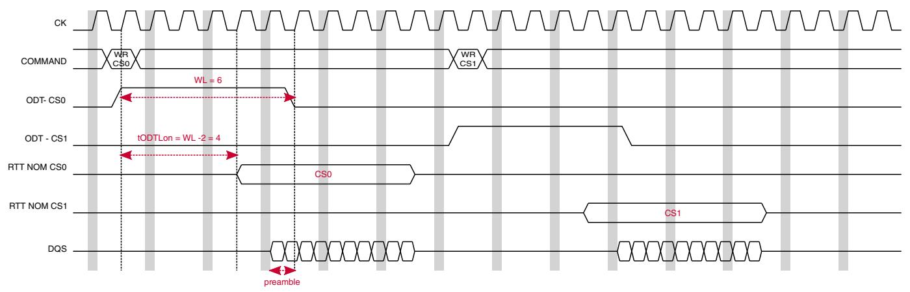  
Calibration Process   
Figure 35-7. ODT - Timing Diagram DDR3 WL $\mathtt { \pmb { \mathscr { = } } 6 }$ , BL=8

# 35.11 Calibration Process

The MMDC offers various calibration processes that are used to obtain better timing accuracy, board skew compensation and I/O pad driving strength adjustment. Each calibration process can be performed either automatically (hardware) or manually (software), though the manual method is typically reserved for debugging purposes. The following calibration processes are supported:

# NOTE

Power saving features should be disabled before the calibration process begin. (Such as: MDPDC[PWDTn], MDPDC[PRCTn], MAPSR[PSD])

• ZQ calibration for external DDR device (in DDR3 through ZQ calibration command and in LPDDR2/LPDDR3 through MRW command)

• Can be handled automatically for ZQ Short (periodically) and ZQ Long (at exit from self-refresh)   
• Can be handled manually at ZQ INIT

• ZQ calibration for i.MX DDR I/O pads for calibrating the DDR driving strength

• The sequence can be handled automatically by hardware   
• The sequence can be handled step by step manually by software

• Read DQS gating calibration for DDR3 only. Adjustment of DQS gate with read preamble window. For further information refer to Read DQS Gating Calibration   
• Read DQS gating calibration not supported for LPDDR2/LPDDR3   
• Read data calibration. Adjustment of read DQS with read data byte. For further information refer to Read Calibration   
• Write data calibration. Adjustment of write DQS with write data byte. For further information refer to Write Calibration

• Write leveling calibration. Adjustment of write DQS with CK (DDR differential clock). For further information refer to Write leveling Calibration   
• Read fine tuning. Adjustment of up to 7 delay-line units for each read data bit.   
• Write fine tuning. Adjustment of up to 3 delay-line units for each read data bit.

# NOTE

Before starting any calibration process that involves the DDR3 device MPR mode or write leveling calibration, the following should be done:

• Disable the periodic refresh scheme (i.e. setting MDREF[REF_SEL] = "11") and then issue manual refresh command burst by configuring MDSCR[CMD]= 0x2. At the end of the calibration it is needed to enable the periodic refresh scheme.   
• Disable the automatic power saving mode (i.e set MAPSR[PSD] = "1").

# 35.11.1 Delay-line

Each of the calibration processes controls several delay-lines for aligning data and strobes.

By default the delay-line is configured to generate 1/4 clock cycle of delay.

Moreover, when the operating clock is at the maximum allowed frequency, as appeared in the features list, then the delay-line is capable to issue a configurable delay of up to 1/2 clock cycle.

# NOTE

At the beginning of the calibration process the initial value of the delay-line must be a valid value (i.e. the strobes must be somewhere among the associated data window) though it might not be the optimal value. The delay-line calibration should be done after Read DQS gating and write-leveling calibrations.

In order to generate an adequate delay during normal operation of the MMDC the delay-line is going through an automatic measurement process during the refresh period of the DDR device

# 35.11.2 ZQ calibration

The MMDC supports ZQ calibration process to calibrate the driving strength of the DDR I/O pads as well as driving ZQ commands to calibrate the external DDR device driving strength.

The first ZQ calibration (after booting the processor) is performed prior to turning on the MMDC. Subsequent ZQ calibrations may be executed in parallel to the DDR ZQ calibration. The MMDC supports 2 types of ZQ calibration commands: short and long.

The ZQ long calibration is executed during power up sequence, when exiting self-refresh mode or when exiting slow precharge power down (DLL lock can be done in parallel). The ZQ short calibration is executed periodically according to a configurable timer defined by MPZQHWCTRL[ZQ_HW_PER].

The field MPZQHWCTRL[ZQ_MODE] determines whether the MMDC will execute ZQ calibration to DDR I/O pads and/or issue ZQ short/long command to the DDR device.

The MMDC supports both automatic (hardware) and manual (software) ZQ calibration process for the DDR I/O pads.

It is possible to perform automatic (hardware) ZQ calibration only once (i.e. nonperiodical) by asserting MPZQHWCTRL[ZQ_HW_FOR].

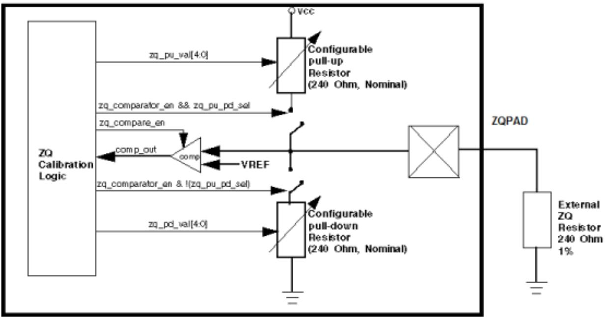  
Figure 35-8. MMDC ZQ IF with PAD

# 35.11.2.1 ZQ automatic (hardware) calibration process

The ZQ automatic calibration occurs over multiple steps isolated by pull-up resistor calibration and by pull-down resistor calibration as follows.

# 35.11.2.1.1 ZQ automatic Pull-up calibration

The MMDC automatically performs a handshaking mechanism with the ZQ calibration pad as follows:

1. The MMDC drives zq_comparator_en to "1"   
2. The MMDC waits few cycles according to MPZQHWCTRL[ZQ_EARLY_COMPARATOR_EN_TIMER]   
3. The MMDC drives zq_pu_pd_sel to "1" for indication of pull-up calibration and drives zq_pu_val[4:0] $=$ 5'b00000   
4. MMDC drives zq_pu_val[4] to "1"   
5. MMDC asserts zq_compare_en   
6. MMDC waits few cycles according to MPZQSWCTRL[ZQ_CMP_OUT_SMP] before sampling the comparator output (i.e zq_comp_out). If zq_comp_out is "1" then it means that the output voltage is greater than Vdd/2 (i.e. internal resistor is less than 240 ohm) and drives bit zq_pu_val[4] to "1" else it drives zq_pu_val[4] to "0"   
7. MMDC deasserts zq_compare_en   
8. MMDC repeats steps 4-7 for zq_pu_val bits 3 to 0   
9. MMDC drives ZQ calibration result to MPZQHWCTRL[ZQ_HW_PU_RES]   
10. MMDC advances to pull-down calibration

# 35.11.2.1.2 ZQ automatic Pull-down calibration

1. The MMDC drives zq_pu_pd_sel to $" 0 "$ for indication of pull-down calibration and drives zq_pd_val[4:0] $=$ 5'b00000   
2. MMDC drives zq_pd_val[4] to "1"   
3. MMDC asserts zq_compare_en   
4. MMDC waits few cycles according to MPZQSWCTRL[ZQ_CMP_OUT_SMP] before sampling the comparator output (i.e zq_comp_out). If zq_comp_out is "1" then it means that the output voltage is greater than Vdd/2 (i.e. internal resistor is less than 240 ohm) and drives bit zq_pd_val[4] to "0" else it drives zq_pd_val[4] to "1"   
5. MMDC deasserts zq_compare_en   
6. MMDC repeats steps 2-5 for zq_pd_val bits 3 to 0   
7. MMDC drives ZQ calibration result to MPZQHWCTRL[ZQ_HW_PD_RES]   
8. MMDC deassert zq_comparator_en to indicate the completion of the ZQ calibration

# Calibration Process

# 35.11.2.2 ZQ software calibration process

The ZQ calibration can be done also in software. However since software ZQ calibration is much slower than hardware calibration it should be used mainly for debugging.

Software should configure the ZQ calibration parameters (Pull-up or Pull-down and their value) then assert the MPZQSWCTRL[ZQ_SW_FOR] bit. Then software should wait till ZQ_SW_FOR is de-asserted and use ZQ_SW_RES status bit in order to calculate the next ZQ calibration parameters.

# 35.11.2.3 ZQ calibration commands

Before the MMDC can issue a ZQCL/ZQCS command to the memory it should precharge all memory banks and wait tRP period. A single ZQ command can be issued to all devices as long as the devices don't share the same ZQ resistor.

When the MMDC issues the ZQ command it should also drive A10 (long or short command) and CS (0, 1 or both).

The MMDC must keep the memory lines quiet (except for CK) for the ZQ calibration time as defined in the Jedec (512 cycles for ZQCL after reset, 256 for other ZQCL and 64 for ZQCS).

# 35.11.3 Read DQS Gating Calibration

The read DQS gating calibration is used to adjust the read DQS gating with the middle of the read DQS preamble. The DQS gating includes a delay of up to 7 cycles (The delay is chosen according to two fields MPDGCTRLn[DG_HC_DELn] and MPDGCTRLn[DG_DL_ABS_OFFSETn]

Each DQS has its own delay-line. The DQS gating process can be done for all DQS in parallel.

# NOTE

In LPDDR2/LPDDR3 mode hardware Read DQS gating should be disabled and Pull-up/pull-down resistors on DQS/DQSn should be enabled while ODT resistors must be disconnected.

# NOTE

In DDR3_x64 mode activation of the calibration is done by setting MPDGCTRL0[HW_DG_EN]

# 35.11.3.1 Hardware DQS Gating Calibration

• There are two modes of operations:

• Calibration with the MPR (Multi Purpose Register)   
• Calibration with MMDC pre-defined values

# 35.11.3.1.1 Hardware DQS Calibration with MPR

The following steps should be executed:

1. Precharge all active banks (Can be done through MDSCR) as requried by the standard.   
2. Enter the DDR device into MPR mode through MRS commands   
3. Configure the MMDC to work with MPR mode by asserting MPPDCMPR2[MPR_CMP]   
4. Make sure that the initial value that is configured in the read delay line absolute offset of each byte (i.e. MPRDDLCTL[RD_DL_ABS_OFFSETn]) will place the read DQS somewhere inside the read DQ window   
5. Start the calibration process by asserting MPDGCTRL0[HW_DG_EN]

# 35.11.3.1.2 Hardware DQS Calibration with pre-defined value

In case pre-defined mode is used, (i.e. MPPDCMPR2[MPR_CMP]) is cleared, then the following steps should be executed:

1. Precharge all active banks (Can be done through MDSCR) as required by the standard.   
2. Configure the pre-defined value, which reflects the value that will be written and compared through the read calibration, to MPPDCMPR1[PDV1, PDV2]   
3. Issue write access to the external DDR device by setting MPSWDAR0[SW_DUMMY_WR] = 1 (MMDC will generate internally write access without intervention of the system towards bank 0, row 0, column 0)   
4. Make sure that the initial value that is configured in the read delay line absolute offset of each byte (i.e. MPRDDLCTL[RD_DL_ABS_OFFSETn] ) will place the read DQS somewhere inside the read DQ window   
5. Start the calibration process by asserting MPDGCTRL0[HW_DG_EN]

The following steps will be executed automatically by the MMDC for both modes (MPR and Pre-defined value):

6. MMDC waits till the read DQS delay-line is updated with the absolute delay value for all bytes at MPDGCTRLn[DG_HC_DELn] and MPDGCTRLn[DG_DL_ABS_OFFSETn] and also satisfying the Tmod $+ 4$ requirement

# Calibration Process

7. MMDC drives read command to the external DDR devices and waits 16 or 32 cycles (according to MPDGCTRL0[DG_CMP_CYC] assuming that the data has arrived from the DDR device.   
8. MMDC compares the read data byte to the associated byte in the pre-defined/MPR value for all the bytes in the DDR burst (burst length 4 or 8). If the comparison fails then it indicates that the read DQS gating is asserted in illegal time point. If the comparison passes then MMDC advances to step 14   
9. MMDC resets the read FIFO (to the inverted pre-defined/MPR value) and it's pointers by setting MPDGCTRL[RST_RD_FIFO] = 1   
10. MMDC increments the read DQS gating delay of each byte by half cycle (i.e. MPDGCTRLn[DG_HC_DELn] + 1)   
11. MMDC drives read command to the external DDR devices and waits 16 or 32 cycles (according to MPDGCTRL0[DG_CMP_CYC] assuming that the data has arrived from the DDR device.   
12. MMDC compares the read data byte to the associated byte in the pre-defined/MPR value for all the bytes in the DDR burst (burst length 4 or 8).   
13. If the comparison fails then it indicates that the read DQS gating is asserted in illegal time point and it is needed to repeat steps 9-12. If the comparison passes then MMDC stores the value of the temporary low boundary and advances to next step   
14. MMDC increments the read DQS gating delay-line of each byte by half cycle (i.e. MPDGCTRLn[DG_HC_DELn] + 1) and issue measurement process of the read DQS gating delay-line to update itself with the new value   
15. MMDC drives read command to the external DDR devices and waits 16 or 32 cycles (according to MPDGCTRL0[DG_CMP_CYC] assuming that the data has arrived from the DDR device.   
16. MMDC compares the read data byte to the associated byte in the pre-defined/MPR value for all the bytes in the DDR burst (burst length 4 or 8)   
17. If the comparison passes then it indicates that the read DQS gating is asserted inside the read preamble window and it is needed to repeat steps 14-16. If the comparison fails then MMDC stores the value of the temporary upper boundary and starts searching the adequate low and high boundaries   
18. MMDC returns to the temporary low boundary minus half cycle and issue measurement process of the read DQS gating delay-line to update itself with the new value   
19. MMDC drives read command to the external DDR devices and waits 16 or 32 cycles (according to MPDGCTRL0[DG_CMP_CYC] assuming that the data has arrived from the DDR device.   
20. MMDC compares the read data byte to the associated byte in the pre-defined/MPR value for all the bytes in the DDR burst (burst length 4 or 8)

21. If the comparison fails then it indicates that the read DQS gating is asserted in illegal time point and it is needed to repeat steps 22-23. If the comparison passes then MMDC stores the value of the adequate low boundary and advances to step 24   
22. MMDC resets the read FIFO (to the inverted pre-defined/MPR value) and it's pointers by setting MPDGCTRL[RST_RD_FIFO] = 1   
23. MMDC increments the read DQS gating delay of each byte by 1 (i.e. MPDGCTRLn[DG_DL_ABS_OFFSETn] + 1) and issue measurement process of the read DQS gating delay-line to update itself with the new value and advances to step 19   
24. MMDC returns to the temporary upper boundary minus half cycle and issue measurement process of the read DQS gating delay-line to update itself with the new value   
25. MMDC drives read command to the external DDR devices and waits 16 or 32 cycles (according to MPDGCTRL0[DG_CMP_CYC] assuming that the data has arrived from the DDR device.   
26. MMDC compares the read data byte to the associated byte in the pre-defined/MPR value for all the bytes in the DDR burst (burst length 4 or 8)   
27. If the comparison passes then it indicates that the read DQS gating is asserted inside the read preamble window and it is needed to repeat steps 28-29. If the comparison fails then MMDC stores the value minus 1 of the adequate upper boundary and advances to step 30   
28. MMDC resets the read FIFO (to the inverted pre-defined/MPR value) and it's pointers by setting MPDGCTRL[RST_RD_FIFO] = 1   
29. MMDC increments the read DQS gating delay of each byte by 1 (i.e. MPDGCTRLn[DG_DL_ABS_OFFSETn] + 1) and issue measurement process of the read DQS gating delay-line to update itself with the new value and advances to step 25   
30. After the MMDC finds the window boundary (lower and upper) of each read data byte then it stores the average between lower and upper boundaries at the associated MPDGCTRLn[DG_DL_ABS_OFFSETn] and issue measurement process of the read DQS delay-line to update itself with the new value.   
31. MMDC indicates that the read DQS gating calibration had finished by setting MPDGCTRL0[HW_DG_EN] = 0   
32. Exit the DDR device from MPR mode through MRS command   
33. Read the upper boundary that was found: MPDGHWSTn[HW_DG_UPn]. This field is 11 bits, 7 LSB bits correspond to MPDGCTRLn[DG_DL_ABS_OFFSETn] upper limit value and 4 MSB bits correspond to MPDGCTRLn[DG_HC_DELn] upper limit value.   
34. Set MPDGHWSTn[HW_DG_UPn][6:0] to MPDGCTRLn[DG_DL_ABS_OFFSETn].

# Calibration Process

35. Set (MPDGHWSTn[HW_DG_UPn][10:7] - 1) to MPDGCTRLn[DG_HC_DELn]. (We set the DQS gating value to be the upper limit value minus 1 half cycle)

# 35.11.3.2 SW read DQS gating Calibration

There are two modes of operations:

• Calibration with the MPR (Multi Purpose Register)   
• Calibration with MMDC pre-defined values

# 35.11.3.2.1 SW read Calibration with MPR

Execute the following steps:

1. Precharge all active banks (Can be done through MDSCR) as required.   
2. Enter the DDR device into MPR mode through MRS commands   
3. Configure the MMDC to work with MPR mode by asserting MPPDCMPR2[MPR_CMP]   
4. Ensure that the initial value that is configured in the read delay line absolute offset of each byte (i.e. MPRDDLCTL[RD_DL_ABS_OFFSET#]) will place the read DQS somewhere inside the read DQ window

# 35.11.3.2.2 SW read Calibration with pre-defined value

In case pre-defined mode is used, (i.e. MPPDCMPR2[MPR_CMP]) is cleared, then the following steps should be executed:

1. Precharge all active banks (Can be done through MDSCR) as required by the standard.   
2. Configure the pre-defined value, which reflects the value that will be written and compared through the read calibration, to MPPDCMPR1[PDV1, PDV2]   
3. Issue write access (with any legal DDR address) to external DDR device   
4. Ensure that the initial value that is configured in the read delay line absolute offset of each byte (i.e. MPRDDLCTL[RD_DL_ABS_OFFSETn] ) will place the read DQS somewhere inside the read DQ window

The following steps should be executed automatically by the MMDC for both modes (MPR and Pre-defined value):

1. Configure the read DQS delay-line to issue zero delay by setting MPDGCTRLn[DG_DL_ABS_OFFSETn] $= 0$ and MPDGCTRLn[DG_HC_DELn] = 0   
2. Force the delay line to measure itself and to issue the requested read delay by configuring MPMUR[FRC_MSR] = 1

3. Wait 16 DDR cycles till the read DQS delay-line is updated with the absolute delay value for all bytes   
4. Issue read command (with the legal DDR address chosen in step 3) from the external DDR device   
5. Waits 16 or 32 cycles (according to MPDGCTRL0[DG_CMP_CYC]) assuming that the data has arrived from the DDR device.   
6. Compare the read data byte to the associated byte in the pre-defined/MPR value for all the bytes in the DDR burst (burst length 4 or 8). If the comparison fails then it indicates that the read DQS gating is asserted in illegal time point. If the comparison passes then advance to step 11.   
7. MMDC resets the read FIFO (to the inverted pre-defined/MPR value) and it's pointers by setting MPDGCTRL[RST_RD_FIFO] = 1   
8. Increment the read DQS gating delay of each byte by half cycle (i.e. MPDGCTRLn[DG_HC_DELn] + 1)   
9. MMDC drives read command to the external DDR devices and waits 16 or 32 cycles (according to MPDGCTRL0[DG_CMP_CYC]) assuming that the data has arrived from the DDR device.   
10. Compare the read data byte to the associated byte in the pre-defined/MPR value for all the bytes in the DDR burst (burst length 4 or 8). If the comparison fails then it indicates that the read DQS gating is asserted in illegal time point and it is needed to repeat steps 7-10. If the comparison passes then advance to step 11.   
11. Store the temporary lower boundary and start searching the temporary upper boundary   
12. MMDC resets the read FIFO (to the inverted pre-defined/MPR value) and it's pointers by setting MPDGCTRL[RST_RD_FIFO] = 1   
13. Increment the read DQS gating delay of each byte by half cycle (i.e. MPDGCTRLn[DG_HC_DELn] + 1)   
14. MMDC drives read command to the external DDR devices and waits 16 or 32 cycles (according to MPDGCTRL0[DG_CMP_CYC] assuming that the data has arrived from the DDR device.   
15. Compare the read data byte to the associated byte in the pre-defined/MPR value for all the bytes in the DDR burst (burst length 4 or 8).   
16. If the comparison passes then it indicates that the read DQS gating is asserted inside the read preamble window and it is needed to repeat steps 12-15. If the comparison fails then it is needed to store the value of the temporary upper boundary and starts searching the adequate low and high boundaries   
17. Load the temporary low boundary minus half cycle into the associated MPDGCTRLn[DG_HC_DELn]   
18. Reset the read FIFO (to the inverted pre-defined/MPR value) and its pointers by setting MPDGCTRL[RST_RD_FIFO] = 1

# Calibration Process

19. Increment the read DQS gating delay of each byte by 1 (i.e. MPDGCTRLn[DG_DL_ABS_OFFSETn] + 1) and force the delay line to measure itself and to issue the requested read DQS delay by configuring MPMUR0[FRC_MSR] = 1   
20. Issue read command to the external DDR devices and waits 16 or 32 cycles (according to MPDGCTRL0[DG_CMP_CYC]) assuming that the data has arrived from the DDR device.   
21. Compare the read data byte to the associated byte in the pre-defined/MPR value for all the bytes in the DDR burst (burst length 4 or 8)   
22. If the comparison fails then it indicates that the read DQS gating is asserted in illegal time point and it is needed to repeat steps 18-22. If the comparisons passes then advance to the next step.   
23. Store the adequate lower boundary   
24. Load the temporary upper boundary minus half cycle into the associated MPDGCTRLn[DG_HC_DELn]   
25. Reset the read FIFO (to the inverted pre-defined/MPR value) and it's pointers by setting MPDGCTRL[RST_RD_FIFO] = 1   
26. Increment the read DQS gating delay of each byte by 1 (i.e. MPDGCTRLn[DG_DL_ABS_OFFSETn] + 1) and force the delay line to measure itself and to issue the requested read DQS delay by configuring MPMUR[FRC_MSR] = 1   
27. Issue read command to the external DDR devices and waits 16 or 32 cycles (according to MPDGCTRL0[DG_CMP_CYC] assuming that the data has arrived from the DDR device.   
28. Compare the read data byte to the associated byte in the pre-defined/MPR value for all the bytes in the DDR burst (burst length 4 or 8)   
29. If the comparison passes then it is needed to repeat steps 25-28. If the comparisons fails then advance to the next step.   
30. Reset the read FIFO (to the inverted pre-defined/MPR value) and it's pointers by setting MPDGCTRL[RST_RD_FIFO] = 1   
31. Store the adequate upper boundary.   
32. Keep the MPDGCTRLn[DG_DL_ABS_OFFSETn] value of the upper limit.   
33. Set MPDGCTRLn[DG_HC_DELn] $=$ (MPDGCTRLn[DG_HC_DELn] - 1). (We set the DQS gating value to be the upper limit value minus 1 half cycle)   
34. Issue the requested read DQS delay by configuring MPMUR[FRC_MSR] = 1   
35. Exit the DDR device from MPR mode through MRS command

# 35.11.4 Read Calibration

The read calibration is used to adjust the read DQS with read data byte. It is assumed that the read DQS gating calibration process is completed prior to the read calibration.

# NOTE

In DDR3 mode, the activation of the calibration is done by setting MPRDDLHWCTL[HW_RD_DL_EN].

# NOTE

In LP2_x16 the activation of the calibration is done by setting MPRDDLHWCTL[HW_RD_DL_EN].

# 35.11.4.1 Hardware (automatic) Read Calibration

There are two modes of operations:

• Calibration with the MPR (Multi Purpose Register)/DQ calibration(LPDDR2)   
• Calibration with MMDC pre-defined values

# 35.11.4.1.1 Hardware (automatic) Calibration with MPR/DQ Calibration

Execute the following steps:

1. Precharge all active banks (can be done through MDSCR) as required.   
2. Enter the DDR device into MPR/DQ calibration mode through MRS/MRW commands.   
3. Configure the MMDC to work with MPR/DQ calibration mode by asserting MPPDCMPR2[MPR_CMP].   
4. Make sure that the initial value that is configured in the read delay line absolute offset of each byte (MPRDDLCTL[RD_DL_ABS_OFFSET#]) will place the read DQS somewhere inside the read DQ window.   
5. Start the calibration process by asserting MPRDDLHWCTL[HW_RD_DL_EN].

# 35.11.4.1.2 Hardware (automatic) Calibration with pre-defined value

In case pre-defined mode is used, i.e. MPPDCMPR2[MPR_CMP] is cleared, then the following steps should be executed:

1. Precharge all active banks (Can be done through MDSCR) as required.   
2. Configure the pre-defined value, which reflects the value that will be written and compared through the read calibration, to MPPDCMPR1[PDV1, PDV2]   
3. Issue write access to the external DDR device by setting MPSWDAR0[SW_DUMMY_WR] = 1 (MMDC will generate internally write access without intervention of the system towards bank 0, row 0, column 0)   
4. Make sure that the initial value that is configured in the read delay line absolute offset of each byte (i.e. MPRDDLCTL[RD_DL_ABS_OFFSETn] ) will place the read DQS somewhere inside the read DQ window

# Calibration Process

5. Start the calibration process by asserting MPRDDLHWCTL[HW_RD_DL_EN]

The following steps will be executed automatically by the MMDC for both modes (MPR and Pre-defined value):

1. MMDC waits till the read delay-line is updated with the absolute delay value for all bytes at MPRDDLCTL[RD_DL_ABS_OFFSETn] and also satisfying the Tmod $+ 4$ requirement   
2. MMDC drives read command to the external DDR devices and waits 16 or 32 cycles (according to MPRDDLHWCTL[HW_RD_DL_CMP_CYC]) assuming that the data has arrived from the DDR device.   
3. MMDC compares the read data byte to the associated byte in the pre-defined/MPR value for all the bytes in the DDR burst (burst length 4 or 8). If the comparison fails then it indicates that the initial read DQS isn't inside the read DQ window and the MMDC generates an error for the associated byte at MPRDDLHWCTL[HW_RD_DL_ERRn] . If the comparison passes then MMDC advances to next step.   
4. MMDC resets the rd fifo (to the inverted pre-defined/MPR value) and it's pointers by setting MPDGCTRL[RST_RD_FIFO] = 1   
5. MMDC decrements the read delay line absolute offset of each byte by 1 (i.e. MPRDDLCTL[RD_DL_ABS_OFFSETn] ) and issue measurement process of the read delay-line to update itself with the new value.   
6. MMDC drives read command to the DDR external devices and waits 16 or 32 cycles (according to MPRDDLHWCTL[HW_RD_DL_CMP_CYC]) assuming that the data has arrived from the DDR device   
7. MMDC compares the read data byte to the associated byte in the pre-defined/MPR value for all the bytes in the DDR burst (burst length 4 or 8). If the comparison fails then it stores the low read boundary of the associated byte for each byte at MPRDDLHWST0/1[HW_RD_DL_LOWn] . If the comparison passes then MMDC repeats steps 4-6. If all read data comparisons fail then the MMDC advances to the next step   
8. The MMDC start seeking the upper boundary and sets the read delay line absolute offset of each byte to the initial value $+ ~ 1$ as determined at step 4 and issue measurement process of the read delay-line to update itself with the new value   
9. MMDC resets the rd fifo (to the inverted pre-defined value) and it's pointers by setting MPDGCTRL[RST_RD_FIFO] = 1   
10. MMDC drives read command to the DDR external devices and waits 16 or 32 cycles (according to MPRDDLHWCTL[HW_RD_DL_CMP_CYC]) assuming that the data has arrived from the DDR device   
11. MMDC compares the read data byte to the associated byte in the pre-defined/MPR value for all the bytes in the DDR burst (burst length 4 or 8). If the comparison fails then it stores the upper read boundary of the associated byte for each byte at MPRDDLHWST0/1[HW_RD_DL_UPn] . If the comparison passes then MMDC

increments the read delay line absolute offset of each byte by 1 (i.e.

MPRDDLCTL[RD_DL_ABS_OFFSETn] ) and issue measurement process of the read delay-line to update itself with the new value.

12. If all read data comparisons fail then the MMDC advances to the next step. otherwise, MMDC repeats steps 9-11.   
13. After the MMDC finds the window boundary (lower and upper) of each read data byte then it stores the average between lower and upper boundaries at the associated MPRDDLCTL[RD_DL_ABS_OFFSETn] and issue measurement process of the read delay-line to update itself with the new value.   
14. MMDC indicates that the read data calibration had finished by setting MPRDDLHWCTL[HW_RD_DL_EN] = 0   
15. Exit the DDR device from MPR/DQ calibration mode through MRS/MRW commands

# 35.11.4.2 SW Read Calibration

There are two modes of operations:

• Calibration with the MPR (Multi Purpose Register)/DQ calibration (LPDDR2)   
• Calibration with MMDC pre-defined values

# 35.11.4.2.1 Calibration with MPR/DQ calibration

Execute the following steps:

1. Precharge all active banks (Can be done through MDSCR) as required.   
2. Enter the DDR device into MPR/DQ calibration mode through MRS/MRW commands   
3. Configure the MMDC to work with MPR/DQ calibration mode by asserting MPPDCMPR2[MPR_CMP]   
4. Make sure that the initial value that is configured in the read delay line absolute offset of each byte (i.e. MPRDDLCTL[RD_DL_ABS_OFFSETn] ) will place the read DQS somewhere inside the read DQ window

# 35.11.4.2.2 Calibration with pre-defined value

In case pre-defined mode is used, i.e. MPPDCMPR2[MPR_CMP] is cleared, then the following steps should be executed:

1. Precharge all active banks (Can be done through MDSCR) as requried by the standard.   
2. Configure the pre-defined value, which reflects the value that will be written and compared through the read calibration, to MPPDCMPR1[PDV1, PDV2]

# Calibration Process

3. Issue write access (with any legal DDR address) to external DDR device.   
4. Make sure that the initial value that is configured in the read delay line absolute offset of each byte (i.e. MPRDDLCTL[RD_DL_ABS_OFFSETn] ) will place the read DQS somewhere inside the read DQ window

The following steps will be executed manually by SW for both modes (MPR/DQ calibration and Pre-defined value):

1. Force the delay line to measure itself and to issue the requested read delay by configuring MPMUR[FRC_MSR] = 1   
2. Wait 16 DDR cycles till the read delay-line is updated with the absolute delay value for all bytes   
3. Issue read command (with any legal DDR address) from the external DDR device   
4. Compare the read data byte to the associated byte in the pre-defined/MPR value for all the bytes in the DDR burst (burst length 4 or 8). If the comparison fails then it indicates that the initial read DQS isn't inside the read DQ window. If the comparison passes then advance to next step.   
5. Reset the rd fifo (to the inverted pre-defined/MPR value) and it's pointers by setting MPDGCTRL[RST_RD_FIFO] = 1   
6. Decrement the read delay line absolute offset of each byte by 1 (i.e. MPRDDLCTL[RD_DL_ABS_OFFSETn] )   
7. Force the delay line to measure itself and to issue the requested read delay by configuring MPMUR[FRC_MSR] = 1   
8. Issue read command (with the legal DDR address chosen in step 7) from the external DDR device and waits 16 or 32 cycles (according to MPRDDLHWCTL[HW_RD_DL_CMP_CYC]) assuming that the data has arrived from the DDR device   
9. Compare the read data byte to the associated byte in the pre-defined/MPR value for all the bytes in the DDR burst (burst length 4 or 8). If the comparison fails then it is needed to store the low read boundary of the associated byte at of each byte . If the comparison passes then repeat steps 5-8. If all read data comparisons fail then advance to the next step.   
10. Start seeking the upper boundary and set the read delay line absolute offset of each byte to the initial value $+ ~ 1$ as determined at step 4   
11. Force the delay line to measure itself and to issue the requested read delay by configuring MPMUR[FRC_MSR] = 1   
12. Resets the rd fifo (to the inverted pre-defined/MPR value) and it's pointers by setting MPDGCTRL[RST_RD_FIFO] = 1   
13. Issue read command (with the legal DDR address chosen in step 7) from the external DDR device

14. Compare the read data byte to the associated byte in the pre-defined/MPR value for all the bytes in the DDR burst (burst length 4 or 8). If the comparison fails then it is needed to store the upper read boundary of the associated byte at of each byte. If the comparison passes then increment the read delay line absolute offset of each byte by 1 (i.e. MPRDDLCTL[RD_DL_ABS_OFFSETn] )   
15. Force the delay line to measure itself and to issue the requested read delay by configuring MPMUR[FRC_MSR] = 1   
16. If all read data comparisons fail then advance to the next step, else repeat steps 12-15.   
17. After finding the window boundary (lower and upper) of each read data byte then calculate the average between lower and upper boundaries and store the associated average at MPRDDLCTL[RD_DL_ABS_OFFSETn]   
18. Force the delay line to measure itself and to issue the requested read delay by configuring MPMUR[FRC_MSR] = 1   
19. Exit the DDR device from MPR/DQ calibration mode through MRS/MRW commands.

# 35.11.5 Write Calibration

The write calibration is used to adjust the write DQS with write data byte. It is assumed that the read calibration process is completed prior to the write calibration.

# NOTE

In DDR3_x64 and LP2_1ch_x64 modes, the activation of the

calibration is done by setting

MPWRDLHWCTL0[HW_WR_DL_EN]

# NOTE

In LP2_x16, LP2_x32 the activation of the calibration of each

channel is done by setting

MPWRDLHWCTL0[HW_WR_DL_EN].

# 35.11.5.1 HW (automatic) Write Calibration

The following steps should be executed:

1. Make sure that the initial value that is configured in the write delay line absolute offset of each byte (i.e. MPWRDLCTL[WR_DL_ABS_OFFSET#] ) will place the write DQS somewhere inside the write DQ window   
2. Configure the pre-defined value, which reflects the value that will be written and compared through the write calibration, to MPPDCMPR1[PDV1, PDV2]

# Calibration Process

3. Assert MPWRDLHWCTL0[HW_WR_DL_EN]

The following steps will be executed automatically:

4. MMDC waits till the write delay-line is updated with the absolute delay value for all bytes at MPWRDCTL[WR_DL_ABS_OFFSET#]   
5. MMDC drives write command to the external DDR devices (to bank 0 address 0) and waits 16 or 32 cycles (according to MPWRDLHWCTL[HW_WR_DL_CMP_CYC]) assuming that the data has arrived to the DDR device.   
6. MMDC drives read command to the same address from the external DDR   
7. MMDC compares the read data byte to the associated byte in the pre-defined value for all the bytes in the DDR burst (burst length 4 or 8). If the comparison fails then it indicates that the initial write DQS isn't inside the write DQ window and the MMDC generates an error for the associated byte at MPWRDLHWCTL[HW_WR_DL_ERR#] . If the comparison passes then MMDC advances to next step.   
8. MMDC resets the rd fifo (to the inverted pre-defined value) and it's pointers by setting MPDGCTRL[RST_RD_FIFO] = 1   
9. MMDC decrements the write delay line absolute offset of each byte by 1 (i.e. MPWRDLCTL[WR_DL_ABS_OFFSET#] ) and issue measurement process of the write delay-line to update itself with the new value.   
10. MMDC drives write command to the external DDR devices (to bank 0 address 0) and waits 16 or 32 cycles (according to MPWRDLHWCTL[HW_WR_DL_CMP_CYC]) assuming that the data has arrived to the DDR device   
11. MMDC drives read command to the same address from the external DDR   
12. MMDC compares the read data byte to the associated byte in the pre-defined value for all the bytes in the DDR burst (burst length 4 or 8). If the comparison fails then it stores the low write boundary of the associated byte of each byte at MPWRDLHWST0/1[HW_WR_DL_LOW#] . If the comparison passes then MMDC repeats steps 8-11. If all data comparisons fail then the MMDC advances to the next step   
13. The MMDC start seeking the upper boundary and sets the write delay line absolute offset of each byte to the initial value $+ ~ 1$ as determined at step 4 and issue measurement process of the write delay-line to update itself with the new value   
14. MMDC resets the rd fifo (to the inverted pre-defined value) and its pointers by setting MPDGCTRL[RST_RD_FIFO] = 1   
15. MMDC drives write command to the external DDR devices (to bank 0 address 0) and waits 16 or 32 cycles (according to MPWRDLHWCTL[HW_WR_DL_CMP_CYC]) assuming that the data has arrived to the DDR device.   
16. MMDC drives read command to the same address from the external DDR   
17. MMDC compares the read data byte to the associated byte in the pre-defined value for all the bytes in the DDR burst (burst length 4 or 8). If the comparison fails then it

stores the upper write boundary of the associated byte of each byte at MPWRDLHWST0/1[HW_WR_DL_UP#] . If the comparison passes then MMDC increments the write delay line absolute offset of each byte by 1 (i.e. MPWRDLCTL[WR_DL_ABS_OFFSET#] ) and issue measurement process of the write delay-line to update itself with the new value.

18. MMDC repeats steps 14-17. If all data comparisons fail then the MMDC advances to the next step   
19. .After the MMDC finds the window boundary (lower and upper) of each write data byte then it stores the average between lower and upper boundaries at the associated MPWRDLCTL[WR_DL_ABS_OFFSET#] and issue measurement process of the write delay-line to update itself with the new value.   
20. MMDC indicates that the write data calibration had finished by setting MPWRDLHWCTL[HW_WR_DL_EN] = 0

# 35.11.5.2 SW Write Calibration

The following steps should be executed:

# NOTE

It is recommended to perform the write calibration using the HW method. The SW method is provided for debug purposes only.

1. Make sure that the initial value that is configured in the write delay line absolute offset of each byte (i.e. MPWRDLCTL[WR_DL_ABS_OFFSETn] ) will place the write DQS somewhere inside the write DQ window   
2. Configure the pre-defined value, which reflects the value that will be written and compared through the write calibration, to MPPDCMPR1[PDV1, PDV2]   
3. Force the delay line to measure itself and to issue the requested write delay by configuring MPMUR0[FRC_MSR] = 1   
4. Wait 16 DDR cycles till the write delay-line is updated with the absolute delay value for all bytes   
5. Issue write command to any legal DDR address of the external DDR device   
6. Issue read command, to the address written previously, from the external DDR device   
7. Compare the read data byte to the associated byte in the pre-defined value for all bytes in the DDR burst (burst length 4 or 8). If the comparison fails then it indicates that the initial write DQS isn't inside the write DQ window. If the comparison passes then advance to next step.   
8. MMDC resets the rd fifo (to the inverted pre-defined value) and it's pointers by setting MPDGCTRL[RST_RD_FIFO] = 1

# Calibration Process

9. Decrement the write delay line absolute offset of each byte by 1 (i.e. MPWRDLCTL[WR_DL_ABS_OFFSETn] )   
10. Force the delay line to measure itself and to issue the requested write delay by configuring MPMUR0[FRC_MSR] = 1   
11. Issue write command to any legal DDR address of the external DDR device   
12. Issue read command, to the address written previously, from the external DDR device   
13. Compare the read data byte to the associated byte in the pre-defined value for all the bytes in the DDR burst (burst length 4 or 8). If the comparison fails then it is needed to store the low write boundary of the associated byte of each byte at MPWRDLHWST0/1[HW_WR_DL_LOWn] . If the comparison passes then repeat steps 8-12. If all data comparisons fail then advance to the next step.   
14. Start seeking the upper boundary and set the write delay line absolute offset of each byte to the initial value $+ ~ 1$   
15. Force the delay line to measure itself and to issue the requested write delay by configuring MPMUR0[FRC_MSR] = 1   
16. Reset the rd fifo (to the inverted pre-defined value) and it's pointers by setting MPDGCTRL[RST_RD_FIFO] = 1   
17. Issue write command to any legal DDR address of the external DDR device   
18. Issue read command, to the address written previously, from the external DDR device   
19. Compare the read data byte to the associated byte in the pre-defined value for all the bytes in the DDR burst (burst length 4 or 8). If the comparison fails then it is needed to store the upper write boundary of the associated byte of each byte at MPWRDLHWST0/1[HW_WR_DL_UPn]. If the comparison passes then increment the write delay line absolute offset of each byte by 1.   
20. Force the delay line to measure itself and to issue the requested write delay by configuring MPMUR0[FRC_MSR] = 1   
21. If all read data comparisons fail then advance to the next step else repeat steps 16-20.   
22. .After finding the window boundary (lower and upper) of each write data byte then calculate the average between lower and upper boundaries and store the associated average at MPWRDLCTL[WR_DL_ABS_OFFSETn]   
23. Force the delay line to measure itself and to issue the requested write delay by configuring MPMUR0[FRC_MSR] = 1

# 35.11.6 Write leveling Calibration

The write leveling calibration can generate a delay between the clock and the associate DQS of up to 3 cycles as following: (WL_DL_ABS_OFFSET/256*cycle) $^ +$ (WL_HC_DEL*half cycle) $^ +$ (WL_CYC_DEL*cycle). Write leveling calibration can be executed automatically(HW) or manually (SW).

The automatic calibration process can only detect the optimal DQS to clock delay to within 1 cycle. In extreme cases in which the DDR3 memory is placed far from the microcontroller (long address/command/clock trace lengths), the skew between the DQS and clock may exceed 1 cycle. If this is the case, it is the user's responsibility to both understand that their design causes the DQS to clock skew to exceed 1 cycle and to indicate this manually in the MPWLDECTRL0/1[WL_CYC_DEL#]. It is highly recommended to keep the DDR3 memory as close to the microcontroller as possible, especially in embedded system designs. When using fly-by topology, the user should calculate the PCB flight time of the clock signal to the furthest placed DDR3 memory to ensure less than 1 cycle skew between DQS and clock.

# NOTE

In LPDDR2 mode Write-leveling calibration should be disabled.

# 35.11.6.1 Hardware Write Leveling Calibration

The following steps should be executed:

1. Configure the external DDR device to enter write leveling mode through MRS command   
2. Activate the DQS output enable by setting MDSCR[WL_EN]   
3. Active automatic calibration by setting MPWLGCR[HW_WL_EN]

The following steps will be executed automatically by the MMDC:

4. MMDC enters write leveling mode, counts $2 5 + 1 5$ cycles and drives the DQS pads as output while the DQ pads will remain inputs. In parallel the MMDC configures the write leveling delay line to $" 0 "$ (i.e. MPWLDECTRL0[WL_DL_ABS_OFFSET#] $= 0$ ) and issue measurement process of the writ-leveling delay-line to update itself with the new value   
5. MMDC drives one DQS pulse to the DDR external device   
6. MMDC waits 16 cycles (to guarantee that the DQ prime data is stable) and samples the associated prime DQ bit (for example for DQS1 the MMDC samples DQ[8])   
7. MMDC increments the write leveling delay line by 1/8 cycle and perform measurement process in order to load the updated value to the associated delay-line

# Calibration Process

8. MMDC repeates steps 5-7 till the write leveling delay is 1 cycle   
9. MMDC checks the 8 bit prime DQ results for each DQS and finds the first transition from 0 to 1. If no transition is found then the MMDC indicates an error at MPWLGCR[HW_WL_ERR#]   
10. MMDC stores the value that issues the last "0" on the prime DQ before the transition and loads it to the write leveling delay-line. The MMDC initiates a fine-tune process by incrementing the delay-line values by 1 step (which is 1/256 part of a cycle) till detecting the most accurate transition from 0 to 1   
11. Upon completion of this process the MMDC de-asserts the MPWLGCR[HW_WL_EN] and update the most accurate value of the delay-line at the associated MPWLDECTRL#[WL_DL_ABS_OFFSET#]   
12. MMDC perform measurement process in order to load the most accurate value to the associated delay-line   
13. User should issue MRS command to exit write leveling mode   
14. The user should read the results of the associated delay-line at MPWLDECTRL#[WL_DL_ABS_OFFSET#] and in case the user estimates that the reasonable delay may be above 1 cycle then the user should indicate it at MPWLDECTRL#[WL_CYC_DEL#]. Moreover the user should indicate it in MDMISC[WALAT] field. For example, if the result of the write leveling calibration is 100/256 parts of a cycle, but the user estimates that the delay is above 2 cycles then MPWLDECTRL#[WL_CYC_DEL#] should be configured to 2, so the total delay will be 2 and 100/256 parts of a cycle   
15. Return the DQS output enable to functional mode by deasserting MDSCR[WL_EN]

# 35.11.6.2 SW Write Leveling Calibration

The following steps should be executed:

# NOTE

It is recommended to perform the write calibration using the HW method. The SW method is provided for debug purposes only.

1. Configure the external DDR device to enter write leveling mode through MRS command   
2. Activate the DQS output enable by setting MDSCR[WL_EN]   
3. Set the write-leveling delay-line offset to $" 0 "$ by configuring MPWLDECTRL0[WL_DL_ABS_OFFSET#] $= 0$   
4. Force the delay line to measure itself and to issue the requested write-leveling delay by configuring MPMUR[FRC_MSR] = 1

5. Activate SW write-leveling calibration and issue one DQS pulse by setting MPWLGCR[SW_WL_EN] = 1 together with MPWLGCR[SW_WL_CNT_EN] = 1   
6. Issue an IP read command from MPWLGCR. If MPWLGCR[SW_WL_EN] = 0 then the SW write-leveling result is valid at MPWLGCR[WL_SW_RES#].   
7. Increment the write leveling delay line by 1/8 cycle—that is, add 0x20 to {MPWLDECTRL0[WL_HC_DEL#],MPWLDECTRL0[WL_DL_ABS_OFFSET#]}   
8. Force the delay line to measure itself and to issue the requested write-leveling delay by configuring MPMUR[FRC_MSR] = 1   
9. Activate SW write-leveling calibration and issue one DQS pulse by setting MPWLGCR[SW_WL_EN] = 1   
10. Repeate steps 6-9 till the edge of CK was detected (i.e the write-leveling result switched from $" 0 "$ to "1")   
11. Store the value that issues the last $" 0 "$ on the prime DQ before the transition and load it to the write leveling delay-line and start fine tuning process to detect the exact switch from $" 0 "$ to "1"   
12. Force the delay line to measure itself and to issue the requested write-leveling delay by configuring MPMUR[FRC_MSR] = 1   
13. Activate SW write-leveling calibration and issue one DQS pulse by setting MPWLGCR[SW_WL_EN] = 1   
14. Issue a IP read command from MPWLGCR. If MPWLGCR[SW_WL_EN] = 0 then the SW write-leveling result is valid at MPWLGCR[WL_SW_RES#].   
15. Increment the write leveling delay line by 1 step (i.e add 0x01 to MPWLDECTRL0[WL_DL_ABS_OFFSET#])   
16. Force the delay line to measure itself and to issue the requested write-leveling delay by configuring MPMUR[FRC_MSR] = 1   
17. Issue an IP read command from MPWLGCR. If MPWLGCR[SW_WL_EN] = 0 then the SW write-leveling result is valid at MPWLGCR[WL_SW_RES#].   
18. Activate SW write-leveling calibration and issue one DQS pulse by setting MPWLGCR[SW_WL_EN] = 1   
19. Repeates step 15-18 till the exact edge of CK was detected (i.e the write-leveling result switched from $" 0 "$ to "1")   
20. Issue MRS command to exit write leveling mode   
21. Return the DQS output enable to functional mode by deasserting MDSCR[WL_EN]

# 35.11.7 Write fine tuning

Write fine tuning is an additional circuit that provides the ability to fine tune the timing of each of the DQ/DM bits (relative to DQS) by up to 100 ps. To use the write fine tuning, select the number of delay units in each DQ/DM I/O (maximum 3 delay units of around 30-35 ps each). The delay can be configured independently for each DQ/DM. This configuration is controlled by the MPWRDQBYnDL registers.

# 35.11.8 Read fine tuning

Read fine tuning is an additional circuit that provides the ability to fine tune the timing of each coming dq bits (relative to coming dqs) by up to $+ / - 1 0 0$ ps.

This is done by reducing the delay between the incoming rd_dqs by 100 ps and adding a configurable delay of up to 200 ps (6 delay units of around 30-35 ps each) for each DQ input. The delay can be configured independently for each DQ. The calibration of this mechanism can be done only by writing and reading data from the memory. Controlled by register MPRDDQBY#DL.

# 35.11.9 ZQ Fine Tuning

An offset can be added to the PU /PD values determined by the ZQ calibration process. The offset range is programmable from $^ { - 7 }$ to $+ 7$ , controlled by the MMDC_MPPDCMPR2[ZQ_PU_OFFSET] and MMDC_MPPDCMPR2[ZQ_PD_OFFSET] fields. The offset is enabled/disabled by MMDC_MPPDCMPR2[ZQ_OFFSET_EN]. See MMDC_MPPDCMPR2 register for more information.

# 35.11.10 Duty cycle adjustment

Duty cycle adjustments can be made to the SDCLKx and SDQSx signals, see the MMDCx_MPDCCR register for more information.

# 35.12 MMDC Memory Map/Register Definition

The Memory Map is shown below.

# NOTE

The terms clocks and cycles are used interchangeably and refer to the clock period of the main ddr clock (mmdc_axi_clk_root), commonly referred to as the DDR frequency.

MMDC memory map   

<table><tr><td>Absolute address (hex)</td><td>Register name</td><td>Width (in bits)</td><td>Access</td><td>Reset value</td><td>Section/page</td></tr><tr><td>21B_0000</td><td>MMDC Core Control Register (MMDC_MDCTL)</td><td>32</td><td>R/W</td><td>0311_0000h</td><td>35.12.1/2263</td></tr><tr><td>21B_0004</td><td>MMDC Core Power Down Control Register (MMDC_MDPDC)</td><td>32</td><td>R/W</td><td>0003_0012h</td><td>35.12.2/2264</td></tr><tr><td>21B_0008</td><td>MMDC Core ODT Timing Control Register (MMDC_MDOTC)</td><td>32</td><td>R/W</td><td>1227_2000h</td><td>35.12.3/2267</td></tr><tr><td>21B_000C</td><td>MMDC Core Timing Configuration Register 0 (MMDC_MDCFG0)</td><td>32</td><td>R/W</td><td>3236_22D3h</td><td>35.12.4/2269</td></tr><tr><td>21B_0010</td><td>MMDC Core Timing Configuration Register 1 (MMDC_MDCFG1)</td><td>32</td><td>R/W</td><td>B6B1_8A23h</td><td>35.12.5/2270</td></tr><tr><td>21B_0014</td><td>MMDC Core Timing Configuration Register 2 (MMDC_MDCFG2)</td><td>32</td><td>R/W</td><td>00C7_0092h</td><td>35.12.6/2273</td></tr><tr><td>21B_0018</td><td>MMDC Core Miscellaneous Register (MMDC_MDMISC)</td><td>32</td><td>R/W</td><td>0000_1600h</td><td>35.12.7/2275</td></tr><tr><td>21B_001C</td><td>MMDC Core Special Command Register (MMDC_MDSCR)</td><td>32</td><td>R/W</td><td>0000_0000h</td><td>35.12.8/2278</td></tr><tr><td>21B_0020</td><td>MMDC Core Refresh Control Register (MMDC_MDREF)</td><td>32</td><td>R/W</td><td>0000_C000h</td><td>35.12.9/2281</td></tr><tr><td>21B_002C</td><td>MMDC Core Read/Write Command Delay Register (MMDC_MDRWD)</td><td>32</td><td>R/W</td><td>0F9F_26D2h</td><td>35.12.10/2283</td></tr><tr><td>21B_0030</td><td>MMDC Core Out of Reset Delays Register (MMDC_MDOR)</td><td>32</td><td>R/W</td><td>009F_0E0Eh</td><td>35.12.11/2285</td></tr><tr><td>21B_0034</td><td>MMDC Core MRR Data Register (MMDC_MDMRR)</td><td>32</td><td>R</td><td>0000_0000h</td><td>35.12.12/2286</td></tr><tr><td>21B_0038</td><td>MMDC Core Timing Configuration Register 3 (MMDC_MDCFG3LP)</td><td>32</td><td>R/W</td><td>0000_0000h</td><td>35.12.13/2287</td></tr><tr><td>21B_003C</td><td>MMDC Core MR4 Derating Register (MMDC_MDMR4)</td><td>32</td><td>R/W</td><td>0000_0000h</td><td>35.12.14/2289</td></tr><tr><td>21B_0040</td><td>MMDC Core Address Space Partition Register (MMDC_MDASP)</td><td>32</td><td>R/W</td><td>0000_003Fh</td><td>35.12.15/2291</td></tr><tr><td>21B_0400</td><td>MMDC Core AXI Reordering Control Register (MMDC_MAARCR)</td><td>32</td><td>R/W</td><td>5142_01F0h</td><td>35.12.16/2292</td></tr><tr><td>21B_0404</td><td>MMDC Core Power Saving Control and Status Register (MMDC(MapSR)</td><td>32</td><td>R/W</td><td>0000_1007h</td><td>35.12.17/2294</td></tr><tr><td>21B_0408</td><td>MMDC Core Exclusive ID Monitor Register0 (MMDC_MAEXIDR0)</td><td>32</td><td>R/W</td><td>0020_0000h</td><td>35.12.18/2296</td></tr><tr><td>21B_040C</td><td>MMDC Core Exclusive ID Monitor Register1 (MMDC_MAEXIDR1)</td><td>32</td><td>R/W</td><td>0060_0040h</td><td>35.12.19/2297</td></tr><tr><td>21B_0410</td><td>MMDC Core Debug and Profiling Control Register 0 (MMDC_MADPCR0)</td><td>32</td><td>R/W</td><td>0000_0000h</td><td>35.12.20/2298</td></tr><tr><td>21B_0414</td><td>MMDC Core Debug and Profiling Control Register 1 (MMDC_MADPCR1)</td><td>32</td><td>R/W</td><td>0000_0000h</td><td>35.12.21/2299</td></tr><tr><td>21B_0418</td><td>MMDC Core Debug and Profiling Status Register 0 (MMDC_MADPSR0)</td><td>32</td><td>R</td><td>0000_0000h</td><td>35.12.22/2300</td></tr><tr><td>21B_041C</td><td>MMDC Core Debug and Profiling Status Register 1 (MMDC_MADPSR1)</td><td>32</td><td>R</td><td>0000_0000h</td><td>35.12.23/2300</td></tr><tr><td>21B_0420</td><td>MMDC Core Debug and Profiling Status Register 2 (MMDC_MADPSR2)</td><td>32</td><td>R</td><td>0000_0000h</td><td>35.12.24/2301</td></tr><tr><td>21B_0424</td><td>MMDC Core Debug and Profiling Status Register 3 (MMDC_MADPSR3)</td><td>32</td><td>R</td><td>0000_0000h</td><td>35.12.25/2301</td></tr><tr><td>21B_0428</td><td>MMDC Core Debug and Profiling Status Register 4 (MMDC_MADPSR4)</td><td>32</td><td>R</td><td>0000_0000h</td><td>35.12.26/2302</td></tr><tr><td>21B_042C</td><td>MMDC Core Debug and Profiling Status Register 5 (MMDC_MADPSR5)</td><td>32</td><td>R</td><td>0000_0000h</td><td>35.12.27/2302</td></tr><tr><td>21B_0430</td><td>MMDC Core Step By Step Address Register (MMDC_MASBS0)</td><td>32</td><td>R</td><td>0000_0000h</td><td>35.12.28/2303</td></tr><tr><td>21B_0434</td><td>MMDC Core Step By Step Address Attributes Register (MMDC_MASBS1)</td><td>32</td><td>R</td><td>0000_0000h</td><td>35.12.29/2303</td></tr><tr><td>21B_0440</td><td>MMDC Core General Purpose Register (MMDC_MAGENP)</td><td>32</td><td>R/W</td><td>0000_0000h</td><td>35.12.30/2304</td></tr><tr><td>21B_0800</td><td>MMDC PHY ZQ HW control register (MMDC_MPZQHWCTRL)</td><td>32</td><td>R/W</td><td>A138_0000h</td><td>35.12.31/2305</td></tr><tr><td>21B_0804</td><td>MMDC PHY ZQ SW control register (MMDC_MPZQSWCTRL)</td><td>32</td><td>R/W</td><td>0000_0000h</td><td>35.12.32/2308</td></tr><tr><td>21B_0808</td><td>MMDC PHY Write Leveling Configuration and Error Status Register (MMDC_MPWLGCR)</td><td>32</td><td>R/W</td><td>0000_0000h</td><td>35.12.33/2310</td></tr><tr><td>21B_080C</td><td>MMDC PHY Write Leveling Delay Control Register 0 (MMDC_MPWLDECTRL0)</td><td>32</td><td>R/W</td><td>0000_0000h</td><td>35.12.34/2313</td></tr><tr><td>21B_0810</td><td>MMDC PHY Write Leveling Delay Control Register 1 (MMDC_MPWLDECTRL1)</td><td>32</td><td>R/W</td><td>0000_0000h</td><td>35.12.35/2315</td></tr><tr><td>21B_0814</td><td>MMDC PHY Write Leveling delay-line Status Register (MMDC_MPWLDLST)</td><td>32</td><td>R</td><td>0000_0000h</td><td>35.12.36/2318</td></tr><tr><td>21B_0818</td><td>MMDC PHY ODT control register (MMDC_MPODTCTRL)</td><td>32</td><td>R/W</td><td>0000_0000h</td><td>35.12.37/2319</td></tr><tr><td>21B_081C</td><td>MMDC PHY Read DQ Byte0 Delay Register (MMDC_MPRDDQBY0DL)</td><td>32</td><td>R/W</td><td>0000_0000h</td><td>35.12.38/2321</td></tr><tr><td>21B_0820</td><td>MMDC PHY Read DQ Byte1 Delay Register (MMDC_MPRDDQBY1DL)</td><td>32</td><td>R/W</td><td>0000_0000h</td><td>35.12.39/2324</td></tr><tr><td>21B_082C</td><td>MMDC PHY Write DQ Byte0 Delay Register (MMDC_MPWRDQBY0DL)</td><td>32</td><td>R/W</td><td>0000_0000h</td><td>35.12.40/2327</td></tr><tr><td>21B_0830</td><td>MMDC PHY Write DQ Byte1 Delay Register (MMDC_MPWRDQBY1DL)</td><td>32</td><td>R/W</td><td>0000_0000h</td><td>35.12.41/2329</td></tr><tr><td>21B_0834</td><td>MMDC PHY Write DQ Byte2 Delay Register (MMDC_MPWRDQBY2DL)</td><td>32</td><td>R/W</td><td>0000_0000h</td><td>35.12.42/2331</td></tr><tr><td>21B_0838</td><td>MMDC PHY Write DQ Byte3 Delay Register (MMDC_MPWRDQBY3DL)</td><td>32</td><td>R/W</td><td>0000_0000h</td><td>35.12.43/2333</td></tr><tr><td>21B_083C</td><td>MMDC PHY Read DQS Gating Control Register 0 (MMDC_MPDGCTRL0)</td><td>32</td><td>R/W</td><td>0000_0000h</td><td>35.12.44/2336</td></tr><tr><td>21B_0840</td><td>MMDC PHY Read DQS Gating Control Register 1 (MMDC_MPDGCTRL1)</td><td>32</td><td>R/W</td><td>0000_0000h</td><td>35.12.45/2338</td></tr><tr><td>21B_0844</td><td>MMDC PHY Read DQS Gating delay-line Status Register (MMDC_MPDLST0)</td><td>32</td><td>R</td><td>0000_0000h</td><td>35.12.46/2340</td></tr><tr><td>21B_0848</td><td>MMDC PHY Read delay-lines Configuration Register (MMDC_MPRDDLCTL)</td><td>32</td><td>R/W</td><td>4040_4040h</td><td>35.12.47/2342</td></tr><tr><td>21B_084C</td><td>MMDC PHY Read delay-lines Status Register (MMDC_MPRDDLST)</td><td>32</td><td>R</td><td>0000_0000h</td><td>35.12.48/2344</td></tr><tr><td>21B_0850</td><td>MMDC PHY Write delay-lines Configuration Register (MMDC_MPWRDLCTL)</td><td>32</td><td>R/W</td><td>4040_4040h</td><td>35.12.49/2346</td></tr><tr><td>21B_0854</td><td>MMDC PHY Write delay-lines Status Register (MMDC_MPWRDLST)</td><td>32</td><td>R</td><td>0000_0000h</td><td>35.12.50/2348</td></tr><tr><td>21B_0858</td><td>MMDC PHY CK Control Register (MMDC_MPSDCTRL)</td><td>32</td><td>R/W</td><td>0000_0000h</td><td>35.12.51/2349</td></tr><tr><td>21B_085C</td><td>MMDC ZQ LPDDR2 HW Control Register (MMDC_MPZQLP2CTL)</td><td>32</td><td>R/W</td><td>1B5F_0109h</td><td>35.12.52/2350</td></tr><tr><td>21B_0860</td><td>MMDC PHY Read Delay HW Calibration Control Register (MMDC_MPRDDLHWCTL)</td><td>32</td><td>R/W</td><td>0000_0000h</td><td>35.12.53/2352</td></tr><tr><td>21B_0864</td><td>MMDC PHY Write Delay HW Calibration Control Register (MMDC_MPWRDLHWCTL)</td><td>32</td><td>R/W</td><td>0000_0000h</td><td>35.12.54/2355</td></tr><tr><td>21B_0868</td><td>MMDC PHY Read Delay HW Calibration Status Register 0 (MMDC_MPRDDLHWST0)</td><td>32</td><td>R</td><td>0000_0000h</td><td>35.12.55/2357</td></tr><tr><td>21B_0870</td><td>MMDC PHY Write Delay HW Calibration Status Register 0 (MMDC_MPWRDLHWST0)</td><td>32</td><td>R</td><td>0000_0000h</td><td>35.12.56/2358</td></tr><tr><td>21B_0878</td><td>MMDC PHY Write Leveling HW Error Register (MMDC_MPWLHWERR)</td><td>32</td><td>R/W</td><td>0000_0000h</td><td>35.12.57/2359</td></tr><tr><td>21B_087C</td><td>MMDC PHY Read DQS Gating HW Status Register 0 (MMDC_MPDLHWST0)</td><td>32</td><td>R</td><td>0000_0000h</td><td>35.12.58/2359</td></tr><tr><td>21B_0880</td><td>MMDC PHY Read DQS Gating HW Status Register 1 (MMDC_MPDLHWST1)</td><td>32</td><td>R</td><td>0000_0000h</td><td>35.12.59/2360</td></tr><tr><td>21B_0884</td><td>MMDC PHY Read DQS Gating HW Status Register 2 (MMDC_MPDGHWST2)</td><td>32</td><td>R</td><td>0000_0000h</td><td>35.12.60/2360</td></tr><tr><td>21B_0888</td><td>MMDC PHY Read DQS Gating HW Status Register 3 (MMDC_MPDGHWST3)</td><td>32</td><td>R</td><td>0000_0000h</td><td>35.12.61/2361</td></tr><tr><td>21B_088C</td><td>MMDC PHY Pre-defined Compare Register 1 (MMDC_MPPDCMPR1)</td><td>32</td><td>R/W</td><td>0000_0000h</td><td>35.12.62/2361</td></tr><tr><td>21B_0890</td><td>MMDC PHY Pre-defined Compare and CA delay-line Configuration Register (MMDC_MPPDCMPR2)</td><td>32</td><td>R/W</td><td>0040_0000h</td><td>35.12.63/2363</td></tr><tr><td>21B_0894</td><td>MMDC PHY SW Dummy Access Register (MMDC_MPSWDAR0)</td><td>32</td><td>R/W</td><td>0000_0000h</td><td>35.12.64/2366</td></tr><tr><td>21B_0898</td><td>MMDC PHY SW Dummy Read Data Register 0 (MMDC_MPSWDRDR0)</td><td>32</td><td>R</td><td>FFFF_FFFFh</td><td>35.12.65/2368</td></tr><tr><td>21B_089C</td><td>MMDC PHY SW Dummy Read Data Register 1 (MMDC_MPSWDRDR1)</td><td>32</td><td>R</td><td>FFFF_FFFFh</td><td>35.12.66/2368</td></tr><tr><td>21B_08A0</td><td>MMDC PHY SW Dummy Read Data Register 2 (MMDC_MPSWDRDR2)</td><td>32</td><td>R</td><td>FFFF_FFFFh</td><td>35.12.67/2369</td></tr><tr><td>21B_08A4</td><td>MMDC PHY SW Dummy Read Data Register 3 (MMDC_MPSWDRDR3)</td><td>32</td><td>R</td><td>FFFF_FFFFh</td><td>35.12.68/2369</td></tr><tr><td>21B_08A8</td><td>MMDC PHY SW Dummy Read Data Register 4 (MMDC_MPSWDRDR4)</td><td>32</td><td>R</td><td>FFFF_FFFFh</td><td>35.12.69/2369</td></tr><tr><td>21B_08AC</td><td>MMDC PHY SW Dummy Read Data Register 5 (MMDC_MPSWDRDR5)</td><td>32</td><td>R</td><td>FFFF_FFFFh</td><td>35.12.70/2370</td></tr><tr><td>21B_08B0</td><td>MMDC PHY SW Dummy Read Data Register 6 (MMDC_MPSWDRDR6)</td><td>32</td><td>R</td><td>FFFF_FFFFh</td><td>35.12.71/2370</td></tr><tr><td>21B_08B4</td><td>MMDC PHY SW Dummy Read Data Register 7 (MMDC_MPSWDRDR7)</td><td>32</td><td>R</td><td>FFFF_FFFFh</td><td>35.12.72/2371</td></tr><tr><td>21B_08B8</td><td>MMDC PHY Measure Unit Register (MMDC_MPMUR0)</td><td>32</td><td>R/W</td><td>0000_0000h</td><td>35.12.73/2371</td></tr><tr><td>21B_08BC</td><td>MMDC Write CA delay-line controller (MMDC_MPWRCADL)</td><td>32</td><td>R/W</td><td>0000_0000h</td><td>35.12.74/2372</td></tr><tr><td>21B_08C0</td><td>MMDC Duty Cycle Control Register (MMDC_MPDCCR)</td><td>32</td><td>R/W</td><td>2492_2492h</td><td>35.12.75/2374</td></tr></table>

# 35.12.1 MMDC Core Control Register (MMDC_MDCTL)

Address: 21B_0000h base + 0h offset $=$ 21B_0000h

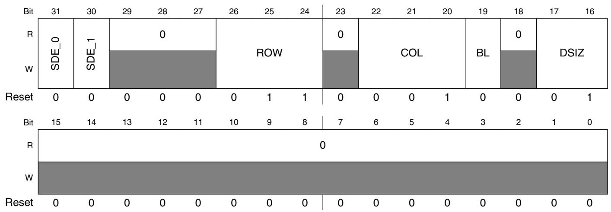

# MMDC_MDCTL field descriptions

<table><tr><td>Field</td><td>Description</td></tr><tr><td>31SDE_0</td><td>MMDC Enable CS0. This bit enables/disables accesses from the MMDC toward Chip Select 0. The reset value of this bit is "0" (i.e. No clocks and clock enable will be driven to the memory).At the enabling point the MMDC will perform an initialization process (including a delay on RESET and/or CKE) for both chip selects. The initialization length depends on the configured memory type.0 Disabled1 Enabled</td></tr><tr><td>30SDE_1</td><td>MMDC Enable CS1. This bit enables/disables accesses from the MMDC toward Chip Select 1. The reset value of this bit is "0" (i.e. No clocks and clock enable will be driven to the memory).At the enabling point the MMDC will perform an initialization process (including a delay on RESET and/or CKE) for both chip selects. The initialization length depends on the configured memory type.0 Disabled1 Enabled</td></tr><tr><td>29-27Reserved</td><td>This read-only field is reserved and always has the value 0 .</td></tr><tr><td>26-24ROW</td><td>Row Address Width. This field specifies the number of row addresses used by the memory array.It will affect the way an incoming address will be decoded.Settings 110-111 are reserved000 11 bits Row001 12 bits Row010 13 bits Row011 14 bits Row100 15 bits Row101 16 bits Row</td></tr><tr><td>23Reserved</td><td>This read-only field is reserved and always has the value 0.</td></tr><tr><td>22-20COL</td><td>Column Address Width. This field specifies the number of column addresses used by the memory array. It will determine how an incoming address will be decoded.0x0 9 bits column0x1 10 bits column0x2 11 bits column0x3 8 bits column0x4 12 bits column0x5-0xF Reserved</td></tr><tr><td>19BL</td><td>Burst Length. This field determines the burst length of the DDR device.In LPDDR2 mode the MMDC supports burst length 4.In DDR3 mode the MMDC supports burst length 8.0 Burst Length 4 is used1 Burst Length 8 is used</td></tr><tr><td>18Reserved</td><td>This read-only field is reserved and always has the value 0.</td></tr><tr><td>17-16DSIZ</td><td>DDR data bus size. This field determines the size of the data bus of the DDR memory0 16-bit data bus—1 Reserved—2-3 Reserved</td></tr><tr><td>Reserved</td><td>This read-only field is reserved and always has the value 0.</td></tr></table>

# 35.12.2 MMDC Core Power Down Control Register (MMDC_MDPDC)

Table 35-10. PRCT field encoding   

<table><tr><td>PRCT[2:0]</td><td>Precharge Timer</td></tr><tr><td>000</td><td>Disabled (Bit field reset value)</td></tr><tr><td>001</td><td>2 clocks</td></tr><tr><td>010</td><td>4 clocks</td></tr><tr><td>011</td><td>8 clocks</td></tr><tr><td>100</td><td>16 clocks</td></tr><tr><td>101</td><td>32 clocks</td></tr><tr><td>110</td><td>64 clocks</td></tr><tr><td>111</td><td>128 clocks</td></tr></table>

Table 35-11. PWDT field encoding   

<table><tr><td>PWDT[3:0]</td><td>Power Down Time-out</td></tr><tr><td>0000</td><td>Disabled (bit field reset value)</td></tr><tr><td>0001</td><td>16 cycles</td></tr><tr><td>0010</td><td>32 cycles</td></tr><tr><td>0011</td><td>64 cycles</td></tr><tr><td>0100</td><td>128 cycles</td></tr><tr><td>0101</td><td>256 cycles</td></tr><tr><td>0110</td><td>512 cycles</td></tr><tr><td>0111</td><td>1024 cycles</td></tr><tr><td>1000</td><td>2048 cycles</td></tr><tr><td>1001</td><td>4096 cycles</td></tr><tr><td>1010</td><td>8196 cycles</td></tr><tr><td>1011</td><td>16384 cycles</td></tr><tr><td>1100</td><td>32768 cycles</td></tr><tr><td>1101-1111</td><td>Reserved</td></tr></table>

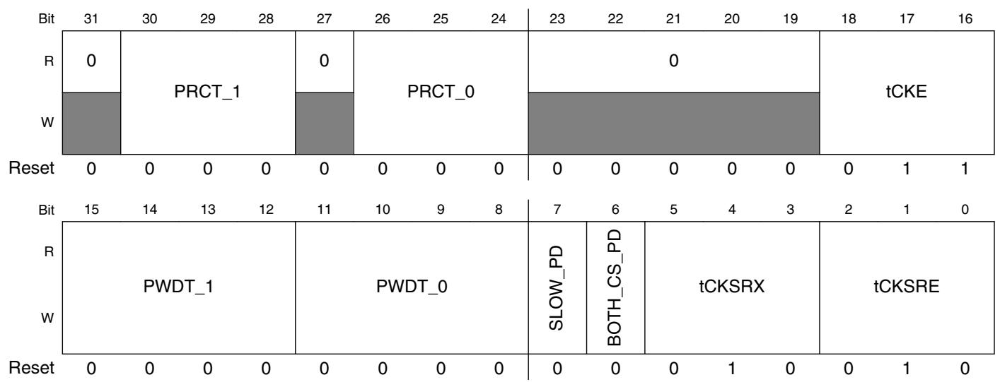  
Address: 21B_0000h base $^ +$ 4h offset $=$ 21B_0004h

MMDC_MDPDC field descriptions   

<table><tr><td>Field</td><td>Description</td></tr><tr><td>31 Reserved</td><td>This read-only field is reserved and always has the value 0.</td></tr><tr><td>30-28 PRCT_1</td><td>Precharge Timer - Chip Select 1.
This field determines the amount of idle cycle for which chip select 1 will be automatically precharged. The amount of cycles are determined according to the PRCT Field Encoding table above.</td></tr><tr><td>27 Reserved</td><td>This read-only field is reserved and always has the value 0.</td></tr><tr><td>26-24PRCT_0</td><td>Precharge Timer - Chip Select 0.This field determines the amount of idle cycle for which chip select 0 will be automatically precharged. The amount of cycles are determined according to the table below.</td></tr><tr><td>23-19Reserved</td><td>This read-only field is reserved and always has the value 0 .</td></tr><tr><td>18-16tCKE</td><td>CKE minimum pulse width. This field determines the minimum pulse width of CKE.0x0 1 cycle0x1 2 cycles0x6 7 cycles0x7 8 cycles</td></tr><tr><td>15-12PWDT_1</td><td>Power Down Timer - Chip Select 1.This field determines the amount of idle cycle for which chip select 1 will be automatically get into precharge/active power down. The amount of cycles are determined according to the PWDT Field Encoding table above .</td></tr><tr><td>11-8PWDT_0</td><td>Power Down Timer - Chip Select 0.This field determines the amount of idle cycle for which chip select 0 will be automatically get into precharge/active power down. The amount of cycles are determined according to the PWDT Field Encoding table above .</td></tr><tr><td>7SLOW_PD</td><td>Slow/fast power down.In DDR3 mode this field is referred to slow precharge power-down.LPDDR2 mode: This field is not relevant and should remain in its default reset value.NOTE: Memory should be configured the same.0 Fast mode.1 Slow mode .</td></tr><tr><td>6BOTH_CS_PD</td><td>Parallel power down entry to both chip selects.When power down timer is used for both chip-selects (i.e. PWDT_0 and PWDT1 don't equal "0") , then if this bit is enabled, the MMDC will enter power down only if the amount of idle cycles of both chip selects was obtained.0 Each chip select can enter power down independently according to its configuration.1 Chip selects can enter power down only if the amount of idle cycles of both chip selects was obtained .</td></tr><tr><td>5-3tCKSRX</td><td>Valid clock cycles before self-refresh exit. This field determines the amount of clock cycles before self-refresh exit.0x0 0 cycle0x1 1 cycles0x6 6 cycles0x7 7 cycles</td></tr><tr><td>tCKSRE</td><td>Valid clock cycles after self-refresh entry.This field determines the amount of clock cycles after self-refresh entry.0x0 0 cycle0x1 1 cycles</td></tr><tr><td></td><td>0x6 6 cycles</td></tr><tr><td></td><td>0x7 7 cycles</td></tr></table>

# 35.12.3 MMDC Core ODT Timing Control Register (MMDC_MDOTC)

For further information see ODT Configuration .

Address: 21B_0000h base $^ +$ 8h offset $=$ 21B_0008h

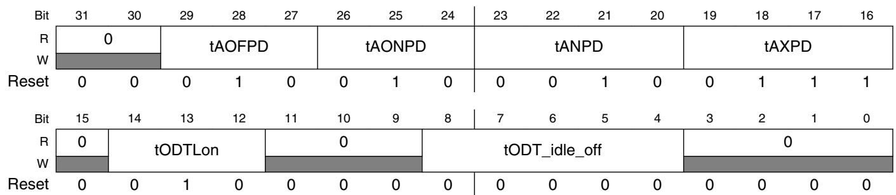

MMDC_MDOTC field descriptions   

<table><tr><td>Field</td><td>Description</td></tr><tr><td>31-30 
Reserved</td><td>This read-only field is reserved and always has the value 0.</td></tr><tr><td>29-27 
tAOFPD</td><td>Asynchronous RTT turn-off delay (power down with DLL frozen). This field determines the time between termination circuit starts to turn off the ODT resistance till termination has reached high impedance. 
LPDDR2 mode: This field is not relevant and should remain in its default reset value. 
0x0 1 cycle 
0x1 2 cycles 
0x6 7 cycles 
0x7 8 cycles</td></tr><tr><td>26-24 
tAONPD</td><td>Asynchronous RTT turn-on delay (power down with DLL frozen). This field determines the time between termination circuit gets out of high impedance and begins to turn on till ODT resistance are fully on. 
LPDDR2 mode: This field is not relevant and should remain in its default reset value. 
0x0 1 cycle 
0x1 2 cycles 
0x6 7 cycles 
0x7 8 cycles</td></tr><tr><td>23-20 
tANPD</td><td>Asynchronous ODT to power down entry delay. In DDR3 should be set to tCWL-1 
LPDDR2 mode: This field is not relevant and should remain in its default reset value.</td></tr></table>

Table continues on the next page...

i.MX 6ULL Applications Processor Reference Manual, Rev. 1, 11/2017

MMDC_MDOTC field descriptions (continued)   

<table><tr><td>Field</td><td>Description</td></tr><tr><td></td><td>0x0 1 clock</td></tr><tr><td></td><td>0x1 2 clocks</td></tr><tr><td></td><td>0x2 3 clocks</td></tr><tr><td></td><td>0xE 15 clocks</td></tr><tr><td></td><td>0xF 16 clocks</td></tr><tr><td>19-16 tAXPD</td><td>Asynchronous ODT to power down exit delay. In DDR3 should be set to tCWL-1</td></tr><tr><td></td><td>LPDDR2 mode: This field is not relevant and should remain in its default reset value.</td></tr><tr><td></td><td>0x0 1 clock</td></tr><tr><td></td><td>0x1 2 clocks</td></tr><tr><td></td><td>0x2 3 clocks</td></tr><tr><td></td><td>0xE 15 clocks</td></tr><tr><td></td><td>0xF 16 clocks</td></tr><tr><td>15 Reserved</td><td>This read-only field is reserved and always has the value 0.</td></tr><tr><td>14-12 tODTLon</td><td>ODT turn on latency. This field determines the delay between ODT signal and the associated RTT, where according to JEDEC standard it equals WL(write latency) - 2. Therefore, the value that is configured to tODTLon field should correspond the value that is configured to MDCGFG1[tCWL]</td></tr><tr><td></td><td>LPDDR2 mode: This field is not relevant and should remain in its default reset value.</td></tr><tr><td></td><td>0x0 - 0x1 Reserved</td></tr><tr><td></td><td>0x2 2 cycles</td></tr><tr><td></td><td>0x3 3 cycles</td></tr><tr><td></td><td>0x4 4 cycles</td></tr><tr><td></td><td>0x5 5 cycles</td></tr><tr><td></td><td>0x6 6 cycles</td></tr><tr><td></td><td>0x7 Reserved</td></tr><tr><td>11-9 Reserved</td><td>This read-only field is reserved and always has the value 0.</td></tr><tr><td>8-4 tODT_idle_off</td><td>ODT turn off latency. This field determines the Idle period before turning memory ODT off.</td></tr><tr><td></td><td>NOTE: LPDDR2 mode: This field is not relevant and should remain in its default reset value.</td></tr><tr><td></td><td>0x0 0 cycle (turned off at the earliest possible time)</td></tr><tr><td></td><td>0x1 1 cycle</td></tr><tr><td></td><td>0x2 2 cycles</td></tr><tr><td></td><td>0x1E 30 cycles</td></tr><tr><td></td><td>0x1F 31 cycles</td></tr><tr><td>Reserved</td><td>This read-only field is reserved and always has the value 0.</td></tr></table>

# 35.12.4 MMDC Core Timing Configuration Register 0 (MMDC_MDCFG0)

Address: 21B_0000h base $^ +$ Ch offset $=$ 21B_000Ch

<table><tr><td>Bit</td><td>31</td><td>30</td><td>29</td><td>28</td><td>27</td><td>26</td><td>25</td><td>24</td><td>23</td><td>22</td><td>21</td><td>20</td><td>19</td><td>18</td><td>17</td><td>16</td><td>15</td><td>14</td><td>13</td><td>12</td><td>11</td><td>10</td><td>9</td><td>8</td><td>7</td><td>6</td><td>5</td><td>4</td><td>3</td><td>2</td><td>1</td><td>0</td><td></td></tr><tr><td>RW</td><td colspan="8">tRFC</td><td colspan="9">tXS</td><td colspan="2">tXP</td><td colspan="4">tXPDLL</td><td colspan="6">tFAW</td><td colspan="4">tCL</td></tr><tr><td>Reset</td><td>0</td><td>0</td><td>1</td><td>1</td><td>0</td><td>0</td><td>1</td><td>0</td><td>0</td><td>0</td><td>1</td><td>1</td><td>0</td><td>1</td><td>1</td><td>0</td><td>0</td><td>0</td><td>1</td><td>0</td><td>0</td><td>0</td><td>1</td><td>0</td><td>1</td><td>1</td><td>0</td><td>1</td><td>0</td><td>0</td><td>1</td><td>1</td><td></td></tr></table>

MMDC_MDCFG0 field descriptions   

<table><tr><td>Field</td><td>Description</td></tr><tr><td>31-24tRFC</td><td>Refresh command to Active or Refresh command time.See DDR3 SDRAM Specification JESD79-3E (July 2010) and LPDDR2 SDRAM SpecificationJESD209-2B (February 2010) for a detailed description of this parameter.0x0 1 clock0x1 2 clocks0x2 3 clocks0xFE 255 clocks0xFF 256 clocks</td></tr><tr><td>23-16tXS</td><td>Exit self refresh to non READ command. In LPDDR2 it is called tXSR, self-refresh exit to next validcommand delay.See DDR3 SDRAM Specification JESD79-3E (July 2010), LPDDR2 SDRAM Specification JESD209-2B(February 2010) for a detailed description of this parameter.0x0 - 0x15 reserved0x16 23 clocks0x17 24 clocks0xFE 255 clocks0xFF 256 clocks</td></tr><tr><td>15-13tXP</td><td>Exit power down with DLL-on to any valid command. Exit power down with DLL-frozen to commands notrequiring a locked DLLIn LPDDR2/LPDDR3 mode this field is referred to Exit power-down to next valid command delay.See DDR3 SDRAM Specification JESD79-3E (July 2010), LPDDR2 SDRAM Specification JESD209-2B(February 2010) for a detailed description of this parameter.0x0 1 cycle0x1 2 cycles0x6 7 cycles0x7 8 cycles</td></tr><tr><td>12-9tXPDLL</td><td>Exit precharge power down with DLL frozen to commands requiring DLL.LPDDR2 mode: This field is not relevant and should remain in its default reset value.See DDR3 SDRAM Specification JESD79-3E (July 2010), LPDDR2 SDRAM Specification JESD209-2B(February 2010) for a detailed description of this parameter.0x0 1 clock</td></tr></table>

Table continues on the next page...

i.MX 6ULL Applications Processor Reference Manual, Rev. 1, 11/2017

MMDC_MDCFG0 field descriptions (continued)   

<table><tr><td>Field</td><td>Description</td></tr><tr><td></td><td>0x1 2 clocks</td></tr><tr><td></td><td>0x2 3 clocks</td></tr><tr><td></td><td>0xE 15 clocks</td></tr><tr><td></td><td>0xF 16 clocks</td></tr><tr><td>8-4 tFAW</td><td>Four Active Window (all banks).See DDR3 SDRAM Specification JESD79-3E (July 2010), LPDDR2 SDRAM Specification JESD209-2B (February 2010) for a detailed description of this parameter.</td></tr><tr><td></td><td>0x0 1 clock</td></tr><tr><td></td><td>0x1 2 clocks</td></tr><tr><td></td><td>0x2 3 clocks</td></tr><tr><td></td><td>0x1E 31 clocks</td></tr><tr><td></td><td>0x1F 32 clocks</td></tr><tr><td>tCL</td><td>CAS Read Latency.In DDR3 mode this field is referred to CL.In LPDDR2 mode this field is referred to RL.NOTE: In LPDDR2/LPDDR3 mode only the RL/WL pairs are allowed as specified in MR2 register.See DDR3 SDRAM Specification JESD79-3E (July 2010), LPDDR2 SDRAM Specification JESD209-2B (February 2010) for a detailed description of this parameter.</td></tr><tr><td></td><td>0x0 3 cycles</td></tr><tr><td></td><td>0x1 4 cycles</td></tr><tr><td></td><td>0x2 5 cycles</td></tr><tr><td></td><td>0x3 6 cycles</td></tr><tr><td></td><td>0x4 7 cycles</td></tr><tr><td></td><td>0x5 8 cycles</td></tr><tr><td></td><td>0x6 9 cycles</td></tr><tr><td></td><td>0x7 10 cycles</td></tr><tr><td></td><td>0x8 11 cycles</td></tr><tr><td></td><td>0x9 - 0xF Reserved</td></tr></table>

# 35.12.5 MMDC Core Timing Configuration Register 1 (MMDC_MDCFG1)

Address: 21B_0000h base $^ +$ 10h offset $=$ 21B_0010h

<table><tr><td rowspan="2">Bit
R
W</td><td>31</td><td>30</td><td>29</td><td>28</td><td>27</td><td>26</td><td>25</td><td>24</td><td>23</td><td>22</td><td>21</td><td>20</td><td>19</td><td>18</td><td>17</td><td>16</td></tr><tr><td colspan="3">tRCD</td><td colspan="3">tRP</td><td colspan="5">tRC</td><td colspan="5">tRAS</td></tr><tr><td>Reset</td><td>1</td><td>0</td><td>1</td><td>1</td><td>0</td><td>1</td><td>1</td><td>0</td><td>1</td><td>0</td><td>1</td><td>1</td><td>0</td><td>0</td><td>0</td><td>1</td></tr><tr><td rowspan="3">Bit
R
W</td><td>15</td><td>14</td><td>13</td><td>12</td><td>11</td><td>10</td><td>9</td><td>8</td><td>7</td><td>6</td><td>5</td><td>4</td><td>3</td><td>2</td><td>1</td><td>0</td></tr><tr><td>tRPA</td><td colspan="3">0</td><td rowspan="2" colspan="3">tWR</td><td rowspan="2" colspan="4">tMRD</td><td colspan="2">0</td><td rowspan="2" colspan="3">tCWL</td></tr><tr><td colspan="4"></td><td colspan="2"></td></tr><tr><td>Reset</td><td>1</td><td>0</td><td>0</td><td>0</td><td>1</td><td>0</td><td>1</td><td>0</td><td>0</td><td>0</td><td>1</td><td>0</td><td>0</td><td>0</td><td>1</td><td>1</td></tr></table>

i.MX 6ULL Applications Processor Reference Manual, Rev. 1, 11/2017

MMDC_MDCFG1 field descriptions   

<table><tr><td>Field</td><td>Description</td></tr><tr><td>31-29tRCD</td><td>Active command to internal read or write delay time (same bank).This field is valid only for DDR2/DDR3 memoriesIn LPDDR2/LPDDR3 mode, this parameter should be configured at tRCD_LP.See DDR3 SDRAM Specification JESD79-3E (July 2010), LPDDR2 SDRAM Specification JESD209-2B (February 2010) for a detailed description of this parameter.0x0 1 clock0x1 2 clocks0x2 3 clocks0x3 4 clocks0x4 5 clocks0x5 6 clocks0x6 7 clocks0x7 8 clocks</td></tr><tr><td>28-26tRP</td><td>Precharge command period (same bank).This field is valid only for DDR2/DDR3 memoriesIn LPDDR2 mode this parameter should be configured at tRPpb_LP.See DDR3 SDRAM Specification JESD79-3E (July 2010), LPDDR2 SDRAM Specification JESD209-2B (February 2010) for a detailed description of this parameter.0x0 1 clock0x1 2 clocks0x2 3 clocks0x3 4 clocks0x4 5 clocks0x5 6 clocks0x6 7 clocks0x? 8 clocks</td></tr><tr><td>25-21tRC</td><td>Active to Active or Refresh command period (same bank).This field is valid only for DDR2/DDR3 memoriesIn LPDDR2/LPDDR3 mode, this parameter should be configured at tRC_LP.See DDR3 SDRAM Specification JESD79-3E (July 2010), LPDDR2 SDRAM Specification JESD209-2B (February 2010) for a detailed description of this parameter.0x0 1 clock0x1 2 clocks0x2 3 clocks0x1E 31 clocks0x1F 32 clocks</td></tr><tr><td>20-16tRAS</td><td>Active to Precharge command period (same bank).See DDR3 SDRAM Specification JESD79-3E (July 2010), LPDDR2 SDRAM Specification JESD209-2B (February 2010) for a detailed description of this parameter.0x0 1 clock0x1 2 clocks0x2 3 clocks</td></tr></table>

Table continues on the next page...

i.MX 6ULL Applications Processor Reference Manual, Rev. 1, 11/2017

MMDC_MDCFG1 field descriptions (continued)   

<table><tr><td>Field</td><td>Description</td></tr><tr><td></td><td>0x1E 31 clocks
0x1F Reserved</td></tr><tr><td>15 tRPA</td><td>Precharge-all command period.
This field is valid only for DDR2/DDR3 memories
In LPDDR2/LPDDR3 mode, this parameter should be configured at tRPab_LP.
See DDR3 SDRAM Specification JESD79-3E (July 2010), LPDDR2 SDRAM Specification JESD209-2B (February 2010) for a detailed description of this parameter.
0 Will be equal to: tRP.
1 Will be equal to: tRP+1.</td></tr><tr><td>14-12 Reserved</td><td>This read-only field is reserved and always has the value 0.</td></tr><tr><td>11-9 tWR</td><td>WRITE recovery time (same bank).
See DDR3 SDRAM Specification JESD79-3E (July 2010), LPDDR2 SDRAM Specification JESD209-2B (February 2010) for a detailed description of this parameter.
0x0 1cycle
0x1 2cycles
0x2 3cycles
0x3 4cycles
0x4 5cycles
0x5 6cycles
0x6 7cycles
0x7 8 cycles</td></tr><tr><td>8-5 tMRD</td><td>Mode Register Set command cycle (all banks).
In DDR3 mode this field must be set to max (tMRD,tMOD).
In LPDDR2/LPDDR3 mode this field should be set to max(tMRR,tMRW).
See DDR3 SDRAM Specification JESD79-3E (July 2010), LPDDR2 SDRAM Specification JESD209-2B (February 2010) for a detailed description of this parameter.
0x0 1 clock
0x1 2 clocks
0x2 3 clocks
0xE 15 clocks
0xF 16 clocks</td></tr><tr><td>4-3 Reserved</td><td>This read-only field is reserved and always has the value 0.</td></tr><tr><td>tCWL</td><td>CAS Write Latency.
In DDR3 mode this field is referred to CWL.
In LPDDR2/LPDDR3 mode this field is referred to WL.
0x0 2 cycles (DDR2/DDR3),1 cycles (LPDDR2/LPDDR3)
0x1 3 cycles (DDR2/DDR3),2 cycles (LPDDR2/LPDDR3)
0x2 4 cycles (DDR2/DDR3),3 cycles (LPDDR2/LPDDR3)
0x3 5 cycles (DDR2/DDR3),4 cycles (LPDDR2/LPDDR3)
0x4 6 cycles (DDR2/DDR3),5 cycles (LPDDR2/LPDDR3)</td></tr><tr><td></td><td>0x5 7 cycles (DDR2/DDR3),6 cycles (LPDDR2/LPDDR3)</td></tr><tr><td></td><td>0x6 8 cycles (DDR2/DDR3),7 cycles (LPDDR2/LPDDR3)</td></tr><tr><td></td><td>0x7 Reserved</td></tr></table>

# 35.12.6 MMDC Core Timing Configuration Register 2 (MMDC_MDCFG2)

Address: 21B_0000h base $^ +$ 14h offset $=$ 21B_0014h

<table><tr><td>Bit</td><td>31</td><td>30</td><td>29</td><td>28</td><td>27</td><td>26</td><td>25</td><td>24</td><td>23</td><td>22</td><td>21</td><td>20</td><td>19</td><td>18</td><td>17</td><td>16</td><td>15</td><td>14</td><td>13</td><td>12</td><td>11</td><td>10</td><td>9</td><td>8</td><td>7</td><td>6</td><td>5</td><td>4</td><td>3</td><td>2</td><td>1</td><td>0</td></tr><tr><td>R</td><td colspan="7">0</td><td rowspan="2" colspan="9">tDLLK</td><td colspan="6">0</td><td rowspan="2" colspan="2">tRTP</td><td rowspan="2" colspan="2">tWTR</td><td rowspan="2" colspan="6">tRRD</td></tr><tr><td>W</td><td colspan="7"></td><td colspan="6"></td></tr><tr><td>Reset</td><td>0</td><td>0</td><td>0</td><td>0</td><td>0</td><td>0</td><td>0</td><td>0</td><td>1</td><td>1</td><td>0</td><td>0</td><td>0</td><td>1</td><td>1</td><td>1</td><td>0</td><td>0</td><td>0</td><td>0</td><td>0</td><td>0</td><td>0</td><td>0</td><td>1</td><td>0</td><td>0</td><td>1</td><td>0</td><td>0</td><td>1</td><td>0</td></tr></table>

MMDC_MDCFG2 field descriptions   

<table><tr><td>Field</td><td>Description</td></tr><tr><td>31-25Reserved</td><td>This read-only field is reserved and always has the value 0.</td></tr><tr><td>24-16tDLLK</td><td>DLL locking time.LPDDR2 mode: This field is not relevant and should remain in its default reset value.See DDR3 SDRAM Specification JESD79-3E (July 2010), LPDDR2 SDRAM Specification JESD209-2B (February 2010) for a detailed description of this parameter.0x0 1 cycle.0x1 2 cycles.0x2 3 cycles.0xC7 200 cycles0x1FE 511 cycles.0x1FF 512 cycles (JEDEC value for DDR3).</td></tr><tr><td>15-9Reserved</td><td>This read-only field is reserved and always has the value 0.</td></tr><tr><td>8-6tRTP</td><td>Internal READ command to Precharge command delay (same bank).See DDR3 SDRAM Specification JESD79-3E (July 2010), LPDDR2 SDRAM Specification JESD209-2B (February 2010) for a detailed description of this parameter.0x0 1cycle0x1 2cycles0x2 3cycles0x3 4cycles0x4 5cycles0x5 6cycles0x6 7cycles0x7 8 cycles</td></tr></table>

Table continues on the next page...

i.MX 6ULL Applications Processor Reference Manual, Rev. 1, 11/2017

MMDC_MDCFG2 field descriptions (continued)   

<table><tr><td>Field</td><td>Description</td></tr><tr><td>5-3tWTR</td><td>Internal WRITE to READ command delay (same bank).See DDR3 SDRAM Specification JESD79-3E (July 2010) , LPDDR2 SDRAM Specification JESD209-2B (February 2010) for a detailed description of this parameter.0x0 1cycle0x1 2cycles0x2 3cycles0x3 4cycles0x4 5cycles0x5 6cycles0x6 7cycles0x7 8 cycles</td></tr><tr><td>tRRD</td><td>Active to Active command period (all banks).See DDR3 SDRAM Specification JESD79-3E (July 2010) , LPDDR2 SDRAM Specification JESD209-2B (February 2010) for a detailed description of this parameter.0x0 1cycle0x1 2cycles0x2 3cycles0x3 4cycles0x4 5cycles0x5 6cycles0x6 7cycles0x? Reserved</td></tr></table>

# 35.12.7 MMDC Core Miscellaneous Register (MMDC_MDMISC)

Address: 21B_0000h base $^ +$ 18h offset $=$ 21B_0018h

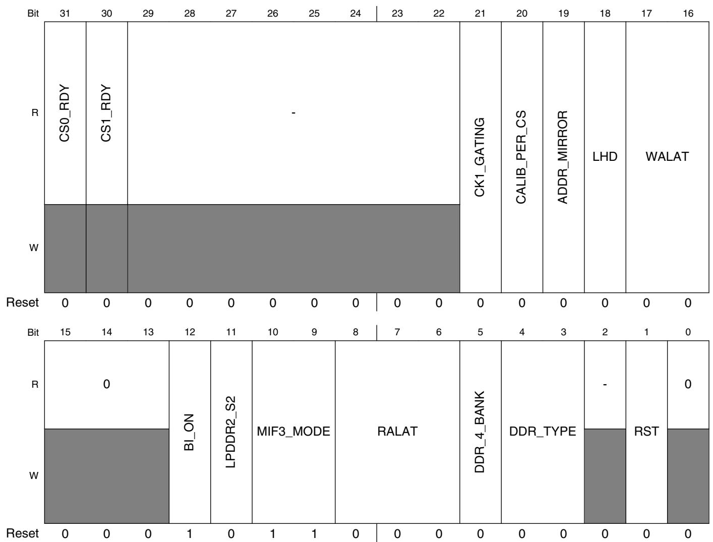

MMDC_MDMISC field descriptions   

<table><tr><td>Field</td><td>Description</td></tr><tr><td>31CS0_RDY</td><td>External status device on CS0. This is a read-only status bit, that indicates whether the external memory is in wake-up period.0 Device in wake-up period.1 Device is ready for initialization.</td></tr><tr><td>30CS1_RDY</td><td>External status device on CS1. This is a read-only status bit, that indicates whether the external memory is in wake-up period.0 Device in wake-up period.1 Device is ready for initialization.</td></tr></table>

Table continues on the next page...

i.MX 6ULL Applications Processor Reference Manual, Rev. 1, 11/2017

MMDC_MDMISC field descriptions (continued)   

<table><tr><td>Field</td><td>Description</td></tr><tr><td>29-22 -</td><td>Reserved</td></tr><tr><td>21 CK1_GATING</td><td>Gating the secondary DDR clock. When this bit is asserted then the MMDC will disable the secondary DDR clock0 MMDC drives two clocks toward the DDR memory1 MMDC drives only one clock toward the DDR memory (CK0)</td></tr><tr><td>20 CALIB_PER_CS</td><td>Number of chip-select for calibration process. This bit determines the chip-select index that the associated calibration is targeted to. Relevant for read, write, write leveling and read DQS gating calibrations0 Calibration is targeted to CS01 Calibration is targeted to CS1</td></tr><tr><td>19 ADDR_MIRROR</td><td>Address mirroring.NOTE: This feature is not supported for LPDDR2/LPDDR3 memories. But only for DDR2/DDR3 memories.For further information see Address mirroring .0 Address mirroring disabled.1 Address mirroring enabled.</td></tr><tr><td>18 LHD</td><td>Latency hiding disable.This is a debug feature. When set to "1" the MMDC will handle one read/write access at a time. Meaning that the MMDC pipe-line will be limited to 1 open access (next AXI address phase will be acknowledged if the current AXI data phase had finished)0 Latency hiding on.1 Latency hiding disable.</td></tr><tr><td>17-16 WALAT</td><td>Write Additional latency.In case the write-leveling calibration process indicates a delay of greater than one-eighth a clock cycle (between CK and any of the DQS strobe lines), then this field must be configured accordingly.This field will add delay on the strobe I/O control, which will compensate on the additional write leveling delay on DQS and prevent the DQS from being cropped.NOTE: The purpose of WALAT is to add time delay at the end of a burst write operation to ensure that the JEDEC time specification for Write Post Amble Delay (tWPST) is met (DQS strobe is held low at the end of a write burst for &gt; 30% a clock cycle before it is released). If the value of any of the WL_DL_ABS_OFFSETn register fields are greater than '1F', WALAT should be set to '1' (cycle additional delay). WALAT should be further increased for any full cycle delays added by the WL_CYC_DELn register fields.0x0 No additional latency required.0x1 1 cycle additional delay0x2 2 cycles additional delay0x3 3 cycles additional delay</td></tr><tr><td>15-13 Reserved</td><td>This read-only field is reserved and always has the value 0 .</td></tr><tr><td>12 BI_ON</td><td>Bank Interleaving On. This bit controls the organization of the bank, row and column address bits.For further information see Address decoding .</td></tr><tr><td></td><td>0 Banks are not interleaved, and address will be decoded as bank-row-column1 Banks are interleaved, and address will be decoded as row-bank-column</td></tr><tr><td>11LPDDR2_S2</td><td>LPDDR2 S2 device type indication.In case LPDDR2 device is used (DDR_TYPE = 0x1), this bit will indicate whether S2 or S4 device is used.This bit should be cleared in DDR3 mode0x0 LPDDR2-S4 device is used.0x1 LPDDR2-S2 device is used.</td></tr><tr><td>10-9MIF3_MODE</td><td>Command prediction working mode. This field determines the level of command prediction that will be used by the MMDC00 Disable prediction.01 Enable prediction based on : Valid access on first pipe line stage.10 Enable prediction based on: Valid access on first pipe line stage, Valid access on axi bus.11 Enable prediction based on: Valid access on first pipe line stage, Valid access on axi bus, Next miss access from access queue.</td></tr><tr><td>8-6RALAT</td><td>Read Additional Latency. This field determines the additional read latency which is added to CAS latency and internal delays for which the MMDC will retrieve the read data from the internal FIFO. This field is used to compensate on board/chip delays.NOTE: In LPDDR2 mode 2 extra cycles will be added internally in order to compensate tDQSCK delay.0x0 no additional latency.0x1 1 cycle additional latency.0x2 2 cycles additional latency.0x3 3 cycles additional latency.0x4 4 cycles additional latency.0x5 5 cycles additional latency.0x6 6 cycles additional latency.0x7 7 cycles additional latency.</td></tr><tr><td>5DDR_4_BANK</td><td>Number of banks per DDR device. When this bit is set to "1" then the MMDC will work with DDR device of 4 banks.0 8 banks device is being used. (Default)1 4 banks device is being used</td></tr><tr><td>4-3DDR_TYPE</td><td>DDR TYPE. This field determines the type of the external DDR device.0x0 DDR3 device is used.0x1 LPDDR2 device is used.0x2 Reserved0x3 Reserved</td></tr><tr><td>2-</td><td>Reserved</td></tr><tr><td>1RST</td><td>Software Reset. When this bit is asserted then the internal FSMs and registers of the MMDC will be initialized.NOTE: This bit once asserted gets deasserted automatically.</td></tr></table>

Table continues on the next page...

i.MX 6ULL Applications Processor Reference Manual, Rev. 1, 11/2017

MMDC_MDMISC field descriptions (continued)   

<table><tr><td>Field</td><td>Description</td></tr><tr><td></td><td>0 Do nothing.
1 Assert reset to the MMDC.</td></tr><tr><td>0 Reserved</td><td>This read-only field is reserved and always has the value 0.</td></tr></table>

# 35.12.8 MMDC Core Special Command Register (MMDC_MDSCR)

This register is used to issue special commands manually toward the external DDR device (such as load mode register, manual self refresh, manual precharge and so on). Every write to this register will be interpreted as a command, and a read from this register will show the last command that was executed.

Every write to this register will result in one special command, and the IP bus will assert ips_xfr_wait as long as the special command is being carried out.

Address: 21B_0000h base $^ +$ 1Ch offset $=$ 21B_001Ch

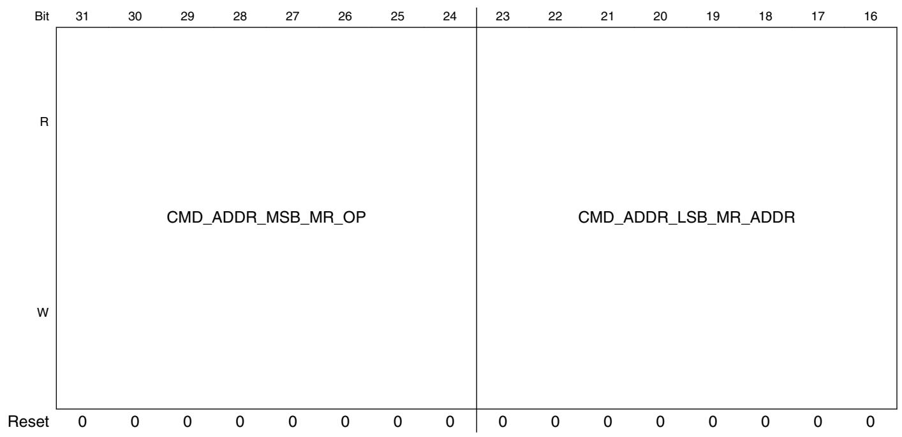

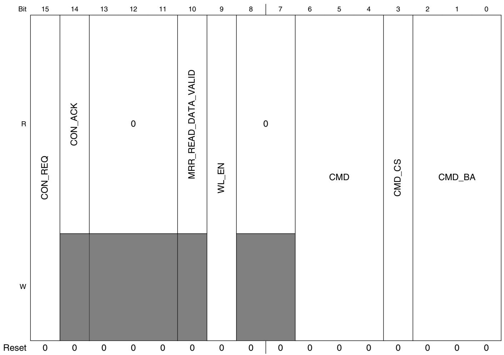

MMDC_MDSCR field descriptions   

<table><tr><td>Field</td><td>Description</td></tr><tr><td>31-24CMD_ADDR_MSB_MR_OP</td><td>Command/Address MSB. This field indicates the MSB of the command/Address.In LPDDR2/LPDDR3 this field indicates the MRW operand</td></tr><tr><td>23-16CMD_ADDRLSB_MR_ADDR</td><td>Command/Address LSB. This field indicates the LSB of the command/AddressIn LPDDR2/LPDDR3 this field indicates the MRR/MRW address</td></tr><tr><td>15CON_REQ</td><td>Configuration request.When this bit is set then the MMDC will clean the pending AXI accesses and will prevent from further AXI accesses to be acknowledged. This field guarantee safe configuration (or change configuration) of the MMDC while no access is in process and prevents an unexpected behaviour.After setting this bit, it is needed to poll on CON_ACK until it is set to &quot;1&quot;. When CON_ACK is asserted then configuration is permitted. After configuration is completed then this bit must be deasserted in order to process further AXI accesses.NOTE: This bit is asserted at the end of the reset sequence, meaning that the MMDC is waiting to configure and initialize the external memory before accepting any AXI accesses. Configuration request/acknowledge mechanism should be used for the following procedures: changing of timing parameters , during calibration process or driving commands via MDSCR[CMD]</td></tr></table>

Table continues on the next page...

i.MX 6ULL Applications Processor Reference Manual, Rev. 1, 11/2017

MMDC_MDSCR field descriptions (continued)   

<table><tr><td>Field</td><td>Description</td></tr><tr><td></td><td>0 No request to configure MMDC.1 A request to configure MMDC is valid</td></tr><tr><td>14CON_ACK</td><td>Configuration acknowledge.Whenever this bit is set, it is permitted to configure MMDC IP registers.0 Configuration of MMDC registers is forbidden.1 Configuration of MMDC registers is permitted.</td></tr><tr><td>13-11Reserved</td><td>This read-only field is reserved and always has the value 0 .</td></tr><tr><td>10MRR_READ_DATA_VALID</td><td>MRR read data valid. This field indicates that read data is valid at MDMRR registerNOTE: This field is relevant only for LPDDR2/LPDDR3 mode0 Cleared upon the assertion of MRR command1 Set after MRR data is valid and stored at MDMRR register.</td></tr><tr><td>9WL_EN</td><td>DQS pads direction. This bit controls the DQS pads direction during write-leveling calibration process.Before starting the write-leveling calibration process this bit should be set to "1". It should be set to "0" when sending write leveling exit command.For further information see Write leveling Calibration .0 Exit write leveling mode or stay in normal mode.1 Write leveling entry command was sent.</td></tr><tr><td>8-7Reserved</td><td>This read-only field is reserved and always has the value 0 .</td></tr><tr><td>6-4CMD</td><td>Command. This field contains the command to be executed.This field will be automatically cleared after the command will be send to the DDR memory.NOTE: Only the 0x5 Precharge all command should be used, memory operation is unpredictable when using the 0x1 command0x0 Normal operation0x1 Precharge all, command is sent independently of bank status (set correct CMD_CS). Will be issued even if banks are closed. Primarily used for initialization sequence purposes. Not to be used during run-time operation.0x2 Auto-Refresh Command (set correct CMD_CS).0x3 Load Mode Register Command DDR2/DDR3, set correct CMD_CS, CMD_BA, CMD_ADDR_LSB, CMD_ADDR_MSB), MRW Command (LPDDR2/LPDDR3, set correct CMD_CS, MR_OP, MR_ADDR)0x4 ZQ calibration (DDR2/DDR3, set correct CMD_CS, {CMD_ADDR_MSB,CMD_ADDR_LSB} = 0x400 or 0x0 )0x5 Precharge all, only if banks open (set correct CMD_CS).0x6 MRR command (LPDDR2/LPDDR3, set correct CMD_CS, MR_ADDR)0x7 Reserved</td></tr><tr><td>3CMD_CS</td><td>Chip Select. This field determines which chip select the command is targeted to0 to Chip-select 01 to Chip-select 1</td></tr><tr><td>CMD_BA</td><td>Bank Address. This field determines the address of the bank within the selected chip-select to where the command is targeted.</td></tr><tr><td></td><td>0x0 bank address 0</td></tr><tr><td></td><td>0x1 bank address 1</td></tr><tr><td></td><td>0x2 bank address 2</td></tr><tr><td></td><td>0x7 bank address 7</td></tr></table>

# 35.12.9 MMDC Core Refresh Control Register (MMDC_MDREF)

This register determines the refresh scheme that will be executed toward the DDR device. It specifies how often a refresh cycle occurs and how many refresh commands will be executed every refresh cycle.

For further information see Refresh Scheme .

The following tables show examples of possible refresh schemes.

Table 35-12. Refresh rate example for REF_SEL ${ \bf \mu } = { \bf 0 }$   

<table><tr><td>REFR[2:0]</td><td>Number of refresh commands every 64KHz</td><td>Average periodic refresh rate (tREFI)</td><td>System Refresh period</td></tr><tr><td>0x0</td><td>1</td><td>15.6 μs</td><td>tRFC</td></tr><tr><td>0x1</td><td>2</td><td>7.8 μs</td><td>2*tRFC</td></tr><tr><td>0x3</td><td>4</td><td>3.9μs</td><td>4*tRFC</td></tr><tr><td>0x7</td><td>8</td><td>1.95 μs</td><td>8*tRFC</td></tr></table>

Table 35-13. Refresh rate example for REF_SEL = 1   

<table><tr><td>REFR[2:0]</td><td>Number of refresh commands every 32KHz</td><td>Average periodic refresh rate (tREFI)</td><td>System Refresh period</td></tr><tr><td>0x1</td><td>2</td><td>15.6 μs</td><td>2*tRFC</td></tr><tr><td>0x3</td><td>4</td><td>7.8 μs</td><td>4*tRFC</td></tr><tr><td>0x7</td><td>8</td><td>3.9μs</td><td>8*tRFC</td></tr></table>

Table 35-14. Refresh rate example for REF_SEL $= 2 @$ 400MHz   

<table><tr><td>REFR[2:0]</td><td>Number of refresh commands every refresh cycle</td><td>REF_CNT</td><td>Average periodic refresh rate (tREFI)</td><td>System Refresh period</td></tr><tr><td>0x0</td><td>1</td><td>0x618</td><td>3.9 μs</td><td>tRFC</td></tr><tr><td>0x1</td><td>2</td><td>0xC30</td><td>3.9 μs</td><td>2*tRFC</td></tr></table>

Table continues on the next page...

i.MX 6ULL Applications Processor Reference Manual, Rev. 1, 11/2017

Table 35-14. Refresh rate example for REF_SEL $= 2 @$ 400MHz (continued)   

<table><tr><td>REFR[2:0]</td><td>Number of refresh commands every refresh cycle</td><td>REF_CNT</td><td>Average periodic refresh rate (tREFI)</td><td>System Refresh period</td></tr><tr><td>0x2</td><td>3</td><td>0x1248</td><td>3.9μs</td><td>3*tRFC</td></tr><tr><td>0x3</td><td>4</td><td>0x1860</td><td>3.9 μs</td><td>4*tRFC</td></tr></table>

Other refresh configurations are also allowed; the configuration values in the tables above are only examples for obtaining the desired average periodic refresh rate.

If the required average periodic refresh rate (tREFI) is kept, all of the rows will be refreshed in every refresh window. Because the memory device issues additional refresh commands for every refresh it receives, the tREFI remains the same across the device, regardless of its number of rows. This is particularly relevant in the tRFC parameter, which becomes bigger as the density increases.

Address: 21B_0000h base $^ +$ 20h offset $=$ 21B_0020h

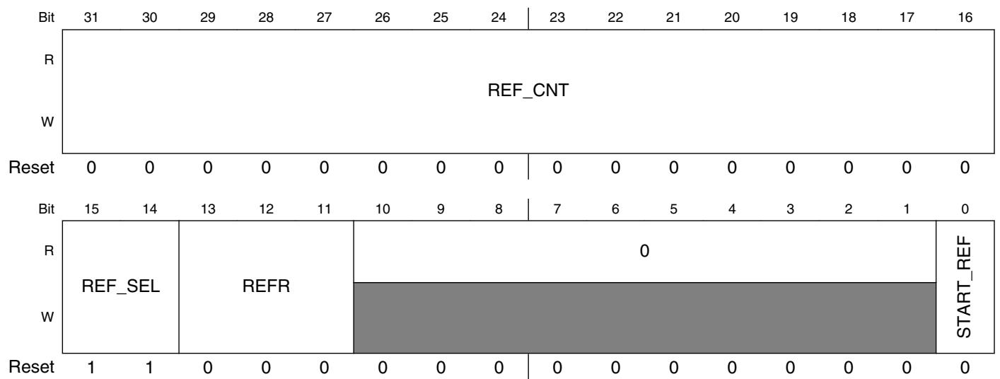

MMDC_MDREF field descriptions   
Table continues on the next page...   

<table><tr><td>Field</td><td>Description</td></tr><tr><td>31-16 REF_CNT</td><td>Refresh Counter at DDR clock periodIf REF_SEL equals &#x27;2&#x27; a refresh cycle will begin every amount of DDR cycles configured in this field.0x0 Reserved.0x1 1 cycle.0xFFFFE 65534 cycles.0xFFFFFF 65535 cycles.</td></tr><tr><td>15-14 REF_SEL</td><td>Refresh Selector.This bit selects the source of the clock that will trigger each refresh cycle:</td></tr></table>

i.MX 6ULL Applications Processor Reference Manual, Rev. 1, 11/2017

MMDC_MDREF field descriptions (continued)   

<table><tr><td>Field</td><td>Description</td></tr><tr><td></td><td>0 Periodic refresh cycles will be triggered in frequency of 64KHz.1 Periodic refresh cycles will be triggered in frequency of 32KHz.2 Periodic refresh cycles will be triggered every amount of cycles that are configured in REF_CNT field.3 No refresh cycles will be triggered.</td></tr><tr><td>13-11REFR</td><td>Refresh Rate.This field determines how many refresh commands will be issued every refresh cycle.After every refresh command the MMDC won&#x27;t drive any command to the DDR device until satisfying tRFC period0x0 1 refresh0x1 2 refreshes0x2 3 refreshes0x3 4 refreshes0x4 5 refreshes0x5 6 refreshes0x6 7 refreshes0x7 8 refreshes</td></tr><tr><td>10-1Reserved</td><td>This read-only field is reserved and always has the value 0 .</td></tr><tr><td>0START_REF</td><td>Manual start of refresh cycle. When this field is set to &#x27;1&#x27; the MMDC will start a refresh cycle immediately according to number of refresh commands that are configured in &#x27;REFR&#x27; field.This bit returns to zero automatically.0 Do nothing.1 Start a refresh cycle.</td></tr></table>

# 35.12.10 MMDC Core Read/Write Command Delay Register (MMDC_MDRWD)

This register determines the delay between back to back read and write accesses. The register reset values are set to the minimum required value.

# NOTE

As the default values are set to achieve optimal results, changing them is discouraged.

Address: 21B_0000h base $^ +$ 2Ch offset $=$ 21B_002Ch

<table><tr><td>Bit</td><td>31</td><td>30</td><td>29</td><td>28</td><td>27</td><td>26</td><td>25</td><td>24</td><td>23</td><td>22</td><td>21</td><td>20</td><td>19</td><td>18</td><td>17</td><td>16</td></tr><tr><td>R</td><td colspan="3">0</td><td rowspan="2" colspan="13">tDAI</td></tr><tr><td>W</td><td colspan="3"></td></tr><tr><td>Reset</td><td>0</td><td>0</td><td>0</td><td>0</td><td>1</td><td>1</td><td>1</td><td>1</td><td>1</td><td>0</td><td>0</td><td>1</td><td>1</td><td>1</td><td>1</td><td>1</td></tr></table>

i.MX 6ULL Applications Processor Reference Manual, Rev. 1, 11/2017

MMDC Memory Map/Register Definition   

<table><tr><td>Bit</td><td>15</td><td>14</td><td>13</td><td>12</td><td>11</td><td>10</td><td>9</td><td>8</td><td>7</td><td>6</td><td>5</td><td>4</td><td>3</td><td>2</td><td>1</td><td>0</td></tr><tr><td>R</td><td>0</td><td rowspan="2" colspan="2">RTW_SAME</td><td rowspan="2" colspan="2">WTR_DIFF</td><td rowspan="2" colspan="3">WTW_DIFF</td><td rowspan="2" colspan="2">RTW_DIFF</td><td rowspan="2" colspan="6">RTR_DIFF</td></tr><tr><td>W</td><td></td></tr><tr><td>Reset</td><td>0</td><td>0</td><td>1</td><td>0</td><td>0</td><td>1</td><td>1</td><td>0</td><td>1</td><td>1</td><td>0</td><td>1</td><td>0</td><td>0</td><td>1</td><td>0</td></tr></table>

MMDC_MDRWD field descriptions   

<table><tr><td>Field</td><td>Description</td></tr><tr><td>31-29Reserved</td><td>This read-only field is reserved and always has the value 0.</td></tr><tr><td>28-16tDAI</td><td>Device auto initialization period.(maximum)NOTE: This field is relevant only to LPDDR2 mode0x0 1 cycle0xF9F 4000 cycles (Default, JEDEC value for LPDDR2, gives 10us at 400MHz clock).0x1FFF 8192 cycles</td></tr><tr><td>15Reserved</td><td>This read-only field is reserved and always has the value 0.</td></tr><tr><td>14-12RTW_SAME</td><td>Read to write delay for the same chip-select. This field controls the delay between read to write commands toward the same chip select.The total delay is calculated according to: BL/2 + RTW_SAME + (tCL-tCWL) + RALAT0x0 0 cycle0x1 1 cycle0x2 2 cycles (Default)0x3 3 cycles0x4 4 cycles0x5 5 cycles0x6 6 cycles0x7 7 cycles</td></tr><tr><td>11-9WTR_DIFF</td><td>Write to read delay for different chip-select. This field controls the delay between write to read commands toward different chip select.The total delay is calculated according to: BL/2 + WTR_DIFF + (tCL-tCWL) + RALAT0x0 0 cycle0x1 1 cycle0x2 2 cycles0x3 3 cycles (Default)0x4 4 cycles0x5 5 cycles0x6 6 cycles0x7 7 cycles</td></tr><tr><td>8-6WTW_DIFF</td><td>Write to write delay for different chip-select. This field controls the delay between write to write commands toward different chip select.The total delay is calculated according to: BL/2 + WTW_DIFF0x0 0 cycle0x1 1 cycle0x2 2 cycles0x3 3 cycles</td></tr></table>

Table continues on the next page...

i.MX 6ULL Applications Processor Reference Manual, Rev. 1, 11/2017

MMDC_MDRWD field descriptions (continued)   

<table><tr><td>Field</td><td>Description</td></tr><tr><td></td><td>0x4 4 cycles</td></tr><tr><td></td><td>0x5 5 cycles</td></tr><tr><td></td><td>0x6 6 cycles</td></tr><tr><td></td><td>0x7 7 cycles</td></tr><tr><td>5-3 RTW_DIFF</td><td>Read to write delay for different chip-select. This field controls the delay between read to write commands toward different chip select.The total delay is calculated according to: BL/2 + RTW_DIFF + (tCL - tCWL) + RALAT</td></tr><tr><td></td><td>0x0 0 cycle</td></tr><tr><td></td><td>0x1 1 cycle</td></tr><tr><td></td><td>0x2 2 cycles (Default)</td></tr><tr><td></td><td>0x3 3 cycles</td></tr><tr><td></td><td>0x4 4 cycles</td></tr><tr><td></td><td>0x5 5 cycles</td></tr><tr><td></td><td>0x6 6 cycles</td></tr><tr><td></td><td>0x7 7 cycles</td></tr><tr><td>RTR_DIFF</td><td>Read to read delay for different chip-select. This field controls the delay between read to read commands toward different chip select.The total delay is calculated according to: BL/2 + RTR_DIFF</td></tr><tr><td></td><td>0x0 0 cycle</td></tr><tr><td></td><td>0x1 1 cycle</td></tr><tr><td></td><td>0x2 2 cycles (Default)</td></tr><tr><td></td><td>0x3 3 cycles</td></tr><tr><td></td><td>0x4 4 cycles</td></tr><tr><td></td><td>0x5 5 cycles</td></tr><tr><td></td><td>0x6 6 cycles</td></tr><tr><td></td><td>0x7 7 cycles</td></tr></table>

# 35.12.11 MMDC Core Out of Reset Delays Register (MMDC_MDOR)

This register defines delays that must be kept when MMDC exits reset.

Address: 21B_0000h base $^ +$ 30h offset $=$ 21B_0030h

<table><tr><td>Bit</td><td>31</td><td>30</td><td>29</td><td>28</td><td>27</td><td>26</td><td>25</td><td>24</td><td>23</td><td>22</td><td>21</td><td>20</td><td>19</td><td>18</td><td>17</td><td>16</td><td>15</td><td>14</td><td>13</td><td>12</td><td>11</td><td>10</td><td>9</td><td>8</td><td>7</td><td>6</td><td>5</td><td>4</td><td>3</td><td>2</td><td>1</td><td>0</td><td></td></tr><tr><td>R</td><td colspan="8">0</td><td rowspan="2" colspan="8">tXPR</td><td colspan="2">0</td><td rowspan="2" colspan="5">SDE_to_RST</td><td colspan="2">0</td><td rowspan="2" colspan="8">RST_to_CKE</td></tr><tr><td>W</td><td colspan="8"></td><td colspan="2"></td><td colspan="2"></td><td></td></tr><tr><td>Reset</td><td>0</td><td>0</td><td>0</td><td>0</td><td>0</td><td>0</td><td>0</td><td>0</td><td>1</td><td>0</td><td>0</td><td>1</td><td>1</td><td>1</td><td>1</td><td>1</td><td>0</td><td>0</td><td>0</td><td>0</td><td>1</td><td>1</td><td>1</td><td>0</td><td>0</td><td>0</td><td>0</td><td>0</td><td>1</td><td>1</td><td>1</td><td>0</td><td></td></tr></table>

i.MX 6ULL Applications Processor Reference Manual, Rev. 1, 11/2017

MMDC_MDOR field descriptions   

<table><tr><td>Field</td><td>Description</td></tr><tr><td>31-24Reserved</td><td>This read-only field is reserved and always has the value 0.</td></tr><tr><td>23-16tXPR</td><td>LPDDR2: Not relevant to this mode and should remain in default reset value.DDR3: As defined in timing parameter table.0x0 Reserved0x1 2 cycles0x2 3 cycles0xFE 255 cycles0xFF 256 cycles</td></tr><tr><td>15-14Reserved</td><td>This read-only field is reserved and always has the value 0 .</td></tr><tr><td>13-8SDE_to_RST</td><td>DDR3 mode: Time from SDE enable until DDR reset# is high.LPDDR2 mode: This field is not relevant and should remain in its default reset value.NOTE: Each cycle in this field is 15.258 us.0x0 Reserved0x1 Reserved0x2 Reserved0x3 1 cycles0x4 2 cycles0x10 14 cycles (JEDEC value for DDR3) - total of 200 us0x3E 60 cycles0x3F 61 cycles</td></tr><tr><td>7-6Reserved</td><td>This read-only field is reserved and always has the value 0 .</td></tr><tr><td>RST_to_CKE</td><td>DDR3: Time from SDE enable to CKE rise. In case that DDR reset# is low, will wait until it&#x27;s high and then wait this period until rising CKE. (JEDEC value is 500 us)LPDDR2: Idle time after first CKE assertion (JEDEC value is 200 us).NOTE: Each cycle in this field is 15.258 us.0x0 Reserved0x1 Reserved0x2 Reserved0x3 1 cycles0x10 14 cycles (JEDEC value for LPDDR2) - total of 200 us0x23 33 cycles (JEDEC value for DDR3) - total of 500 us0x3E 60 cycles0x3F 61 cycles</td></tr></table>

# 35.12.12 MMDC Core MRR Data Register (MMDC_MDMRR)

This register contains data that was collected after issuing MRR command. The data in this register is valid only when MDSCR[MRR_READ_DATA_VALID] is set to "1".

This register is relevant only in LPDDR2 mode. For further information see LPDDR2 Refresh Rate Update and Timing Derating.

Address: 21B_0000h base + 34h offset $=$ 21B_0034h

<table><tr><td>Bit</td><td>31</td><td>30</td><td>29</td><td>28</td><td>27</td><td>26</td><td>25</td><td>24</td><td>23</td><td>22</td><td>21</td><td>20</td><td>19</td><td>18</td><td>17</td><td>16</td><td>15</td><td>14</td><td>13</td><td>12</td><td>11</td><td>10</td><td>9</td><td>8</td><td>7</td><td>6</td><td>5</td><td>4</td><td>3</td><td>2</td><td>1</td><td>0</td></tr><tr><td>R</td><td rowspan="2" colspan="8">Reserved</td><td rowspan="2" colspan="8">Reserved</td><td colspan="7">MRR_READ_DATA1</td><td colspan="9">MRR_READ_DATA0</td></tr><tr><td>W</td><td colspan="7"></td><td colspan="8"></td><td></td></tr><tr><td>Reset</td><td>0</td><td>0</td><td>0</td><td>0</td><td>0</td><td>0</td><td>0</td><td>0</td><td>0</td><td>0</td><td>0</td><td>0</td><td>0</td><td>0</td><td>0</td><td>0</td><td>0</td><td>0</td><td>0</td><td>0</td><td>0</td><td>0</td><td>0</td><td>0</td><td>0</td><td>0</td><td>0</td><td>0</td><td>0</td><td>0</td><td>0</td><td></td></tr></table>

# MMDC_MDMRR field descriptions

<table><tr><td>Field</td><td>Description</td></tr><tr><td>31-24 -</td><td>This field is reserved. Reserved</td></tr><tr><td>23-16 -</td><td>This field is reserved. Reserved</td></tr><tr><td>15-8 MRR_READ_DATA1</td><td>MRR DATA that arrived on DQ[15:8]</td></tr><tr><td>MRR_READ_DATA0</td><td>MRR DATA that arrived on DQ[7:0]</td></tr></table>

# 35.12.13 MMDC Core Timing Configuration Register 3 (MMDC_MDCFG3LP)

This register is relevant only for LPDDR2 mode.

Address: 21B_0000h base $^ +$ 38h offset $=$ 21B_0038h

<table><tr><td>Bit</td><td>31</td><td>30</td><td>29</td><td>28</td><td>27</td><td>26</td><td>25</td><td>24</td><td>23</td><td>22</td><td>21</td><td>20</td><td>19</td><td>18</td><td>17</td><td>16</td><td>15</td><td>14</td><td>13</td><td>12</td><td>11</td><td>10</td><td>9</td><td>8</td><td>7</td><td>6</td><td>5</td><td>4</td><td>3</td><td>2</td><td>1</td><td>0</td><td></td></tr><tr><td>R</td><td colspan="10">0</td><td rowspan="2" colspan="7">RC_LP</td><td colspan="4">0</td><td rowspan="2" colspan="3">tRCD_LP</td><td rowspan="2" colspan="3">tRPpb_LP</td><td rowspan="2" colspan="6">tRPab_LP</td></tr><tr><td>W</td><td colspan="10"></td><td colspan="4"></td></tr><tr><td>Reset</td><td>0</td><td>0</td><td>0</td><td>0</td><td>0</td><td>0</td><td>0</td><td>0</td><td>0</td><td>0</td><td>0</td><td>0</td><td>0</td><td>0</td><td>0</td><td>0</td><td>0</td><td>0</td><td>0</td><td>0</td><td>0</td><td>0</td><td>0</td><td>0</td><td>0</td><td>0</td><td>0</td><td>0</td><td>0</td><td>0</td><td>0</td><td>0</td><td></td></tr></table>

# MMDC_MDCFG3LP field descriptions

<table><tr><td>Field</td><td>Description</td></tr><tr><td>31-22 Reserved</td><td>This read-only field is reserved and always has the value 0.</td></tr><tr><td>21-16 RC_LP</td><td>Active to Active or Refresh command period (same bank).This field is valid only for LPDDR2 memories0x0 1 clock0x1 2 clocks0x2 3 clocks</td></tr></table>

Table continues on the next page...

i.MX 6ULL Applications Processor Reference Manual, Rev. 1, 11/2017

MMDC_MDCFG3LP field descriptions (continued)   

<table><tr><td>Field</td><td>Description</td></tr><tr><td></td><td>0x3E 63 clocks
0x3F Reserved</td></tr><tr><td>15-12
Reserved</td><td>This read-only field is reserved and always has the value 0.</td></tr><tr><td>11-8
tRCD_LP</td><td>Active command to internal read or write delay time (same bank).
This field is valid only for LPDDR2 memories
0x0 1 clock
0x1 2 clocks
0x2 3 clocks
0xE 15 clocks
0xF Reserved</td></tr><tr><td>7-4
tRPpb_LP</td><td>Precharge (per bank) command period (same bank).
This field is valid only for LPDDR2 memories
0x0 1 clock
0x1 2 clocks
0x2 3 clocks
0xE 15 clocks
0xF Reserved</td></tr><tr><td>tRPab_LP</td><td>Precharge (all banks) command period.
This field is valid only for LPDDR2 memories
0x0 1 clock
0x1 2 clocks
0x2 3 clocks
0xE 15 clocks
0xF Reserved</td></tr></table>

# 35.12.14 MMDC Core MR4 Derating Register (MMDC_MDMR4)

This register is relevant only for LPDDR2 mode. It is used to dynamically change certain values depending on MR4 read result, which is based on memory temperature sensor result.

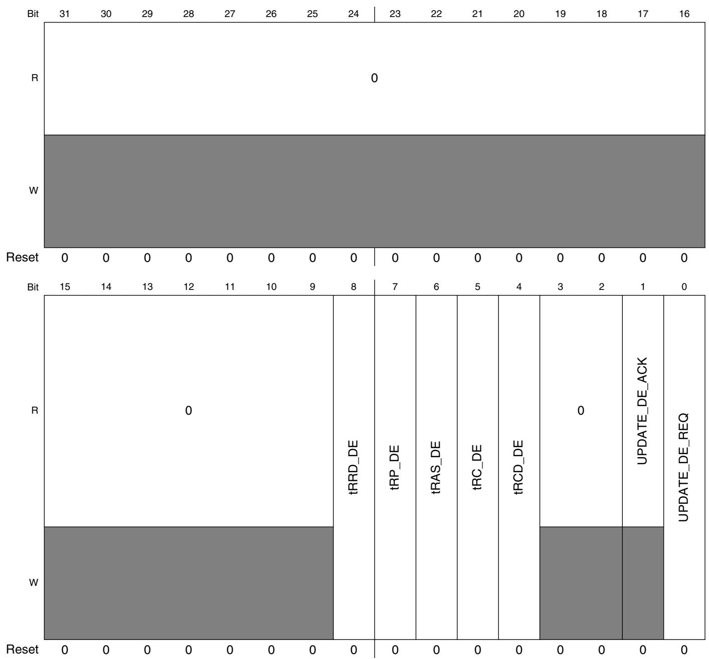  
Address: 21B_0000h base $^ +$ 3Ch offset $=$ 21B_003Ch

i.MX 6ULL Applications Processor Reference Manual, Rev. 1, 11/2017

MMDC_MDMR4 field descriptions   

<table><tr><td>Field</td><td>Description</td></tr><tr><td>31-9 Reserved</td><td>This read-only field is reserved and always has the value 0.</td></tr><tr><td>8 tRRD_DE</td><td>tRRD derating value.0 Original tRRD is used.1 tRRD is derated in 1 cycle.</td></tr><tr><td>7 tRP_DE</td><td>tRP derating value.0 Original tRP is used.1 tRP is derated in 1 cycle.</td></tr><tr><td>6 tRAS_DE</td><td>tRAS derating value.0 Original tRAS is used.1 tRAS is derated in 1 cycle.</td></tr><tr><td>5 tRC_DE</td><td>tRC derating value.0 Original tRC is used.1 tRC is derated in 1 cycle.</td></tr><tr><td>4 tRCD_DE</td><td>tRCD derating value.0 Original tRCD is used.1 tRCD is derated in 1 cycle.</td></tr><tr><td>3-2 Reserved</td><td>This read-only field is reserved and always has the value 0.</td></tr><tr><td>1 UPDATE_DE_ACK</td><td>Update Derated Values Acknowledge.This read only bit will be cleared upon UPDATE_DE_REQ assertion and will be set after the new values are taken.</td></tr><tr><td>0 UPDATE_DE_REQ</td><td>Update Derated Values Request.This read modify write field is automatically cleared after the request is issued.0 Do nothing.1 Request to update the following values: tRRD, tRCD, tRP, tRC, tRAS and refresh related fields(MDREF register): REF_CNT, REF_SEL, REFR</td></tr></table>

# 35.12.15 MMDC Core Address Space Partition Register (MMDC_MDASP)

This register defines the partitioning between chip select 0 and chip select 1. For further information see Chip select settings .

Address: 21B_0000h base $^ +$ 40h offset $=$ 21B_0040h

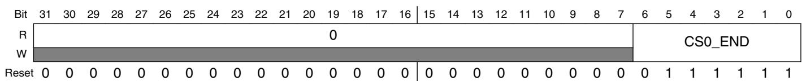

# MMDC_MDASP field descriptions

<table><tr><td>Field</td><td>Description</td></tr><tr><td>31-7 Reserved</td><td>This read-only field is reserved and always has the value 0.</td></tr><tr><td>CS0_END</td><td>Defines the absolute last address associated with CS0 with increments of 256Mb. CS0_END=AXI_ADDRESS[31:25] bits. MMDC0_MDASP[CS0_END] should be set to DDR_CS_SIZE/32M + 0x3f (channel 0 base address begins at 0x80000000)</td></tr></table>

# 35.12.16 MMDC Core AXI Reordering Control Register (MMDC_MAARCR)

This register determines the values of the weights used for the re-ordering arbitration engine. For further information see Performance.

Address: 21B_0000h base $^ +$ 400h offset $=$ 21B_0400h

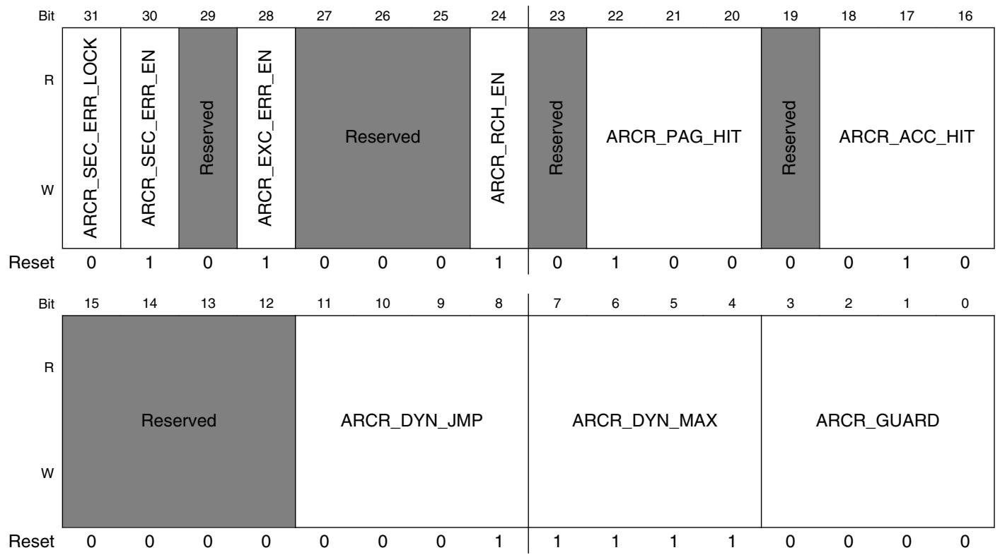

MMDC_MAARCR field descriptions   

<table><tr><td>Field</td><td>Description</td></tr><tr><td>31
ARCR_SEC_
ERR_LOCK</td><td>Once set, this bit locks ARCR_SEC_ERR_EN and prevents from its updating. This bit can be only cleared by reset
Default value is 0x0 - encoding 0 (unlocked)
0     ARCR_SEC_ERR_EN is unlocked, so can be updated any moment
1     ARCR_SEC_ERR_EN is locked, so it can&#x27;t be updated</td></tr><tr><td>30
ARCR_SEC_
ERR_EN</td><td>This bit defines whether security read/write access violation result in SLV Error response or in OKAY response
Default value is 0x1 - encoding 1(response is SLV Error, rresp/bresp=2&#x27;b10)
0     security violation results in OKAY response (rresp/bresp=2&#x27;b00)
1     security violation results in SLAVE Error response (rresp/bresp=2&#x27;b10)</td></tr></table>

Table continues on the next page...

i.MX 6ULL Applications Processor Reference Manual, Rev. 1, 11/2017

MMDC_MAARCR field descriptions (continued)   

<table><tr><td>Field</td><td>Description</td></tr><tr><td>29-</td><td>This field is reserved.Reserved</td></tr><tr><td>28ARCR_EXC_ERR_EN</td><td>This bit defines whether exclusive read/write access violation of AXI 6.2.4 rule result in SLV Error response or in OKAY responseDefault value is 0x1 - encoding 1(response is SLV Error)0violation of AXI exclusive rules (6.2.4) result in OKAY response (rresp/bresp=2&#x27;b00)1violation of AXI exclusive rules (6.2.4) result in SLAVE Error response (rresp/bresp=2&#x27;b10)</td></tr><tr><td>27-25-</td><td>This field is reserved.Reserved</td></tr><tr><td>24ARCR_RCH_EN</td><td>This bit defines whether Real time channel is activated and bypassed all other pending accesses, So accesses with QoS=&#x27;F&#x27; will be granted the highest priority in the optimization/reordering mechanism Default value is 0x1 - encoding 1 (Enabled)0normal prioritization, no bypassing1accesses with QoS=&#x27;F&#x27; bypass the arbitration</td></tr><tr><td>23-</td><td>This field is reserved.Reserved</td></tr><tr><td>22-20ARCR_PAG_HIT</td><td>ARCR Page Hit Rate. This value will be added by the optimization/reordering mechanism to any pending access that is targeted to an open DDR row.Default value of ARCR_PAG_HIT is 0x00100 - encoding 4.</td></tr><tr><td>19-</td><td>This field is reserved.Reserved</td></tr><tr><td>18-16ARCR_ACC_HIT</td><td>ARCR Access Hit Rate. This value will be added by the optimization/reordering mechanism to any pending access that has the same access type (read/write) as the previous access.Default value of is ARCR_ACC_HIT 0x0010 - encoding 2.</td></tr><tr><td>15-12-</td><td>This field is reserved.Reserved</td></tr><tr><td>11-8ARCR_DYN_JMP</td><td>ARCR Dynamic Jump. Each time an access is not chosen by the optimization/reordering mechanism then its dynamic score will be incremented by ARCR_DYN_JMP value.NOTE: Setting ARCR_DYN_JMP may cause starvation of low priority accessesNOTE: ARCR_DYN_JMP must be smaller than ARCR_DYN_MAXDefault ARCR_DYN_JMP value is 0x0001 - encoding 1</td></tr><tr><td>7-4ARCR_DYN_MAX</td><td>ARCR Dynamic Maximum. ARCR_DYN_MAX is the maximum dynamic score value that each access inside the optimization/reordering mechanism can get.0000 00001 1111 15 (default)</td></tr><tr><td>ARCR-guard</td><td>ARCR Guard. After an access reached the maximum dynamic score value, it will wait additional ARCR-guard arbitration cycles and then will gain the highest priority in the optimization/reordering mechanism.0000 15 (default)0001 16111 30</td></tr></table>

# 35.12.17 MMDC Core Power Saving Control and Status Register (MMDC_MAPSR)

The MAPSR determines the power saving features of MMDC. For further information see Power Saving and Clock Frequency Change modes .

# NOTE

See chip-specific information for implementation on your device.

Address: 21B_0000h base $^ +$ 404h offset $=$ 21B_0404h

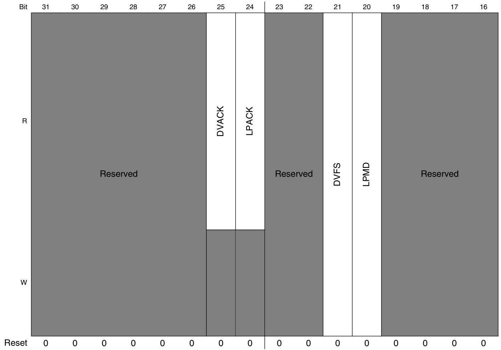

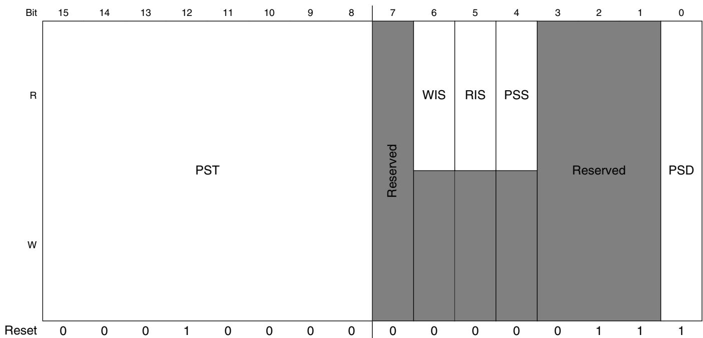

MMDC_MAPSR field descriptions   

<table><tr><td>Field</td><td>Description</td></tr><tr><td>31-26 -</td><td>This field is reserved.Reserved</td></tr><tr><td>25 DVACK</td><td>DVFS/Self-Refresh acknowledge. This read only bit indicates whether a DVFS/self-refresh acknowledge was asserted and that the MMDC is in self-refresh mode.</td></tr><tr><td>24 LPACK</td><td>General low-power acknowledge. This read only bit indicates whether a low-power acknowledge was asserted and that MMDC is in self-refresh mode</td></tr><tr><td>23-22 -</td><td>This field is reserved.Reserved</td></tr><tr><td>21 DVFS</td><td>DVFS/Self-Refresh request. Software request for DVFS/self-refresh. Assertion of this bit will initiate a self- refresh entry sequence.
0 no DVFS/Self-Refresh entry request
1 DVFS/Self-Refresh entry request</td></tr><tr><td>20 LPMD</td><td>General LPMD request. Software request for LPMD. Assertion of this bit will yield in self-refresh entry sequence
0 no lpmd request
1 lpmd request</td></tr><tr><td>19-16 -</td><td>This field is reserved.Reserved</td></tr><tr><td>15-8 PST</td><td>Automatic Power saving timer.Verify only when PSD is set to "0". When the MMDC is idle for amount of cycles specified in that field then the DDR device will be entered automatically into self-refresh mode.The real value which is used is register-value multiplied by 64.00000000 Reserved - this value is forbidden.00000001 timer is configured to 64 clock cycles.</td></tr><tr><td></td><td>00000010 timer is configured to 128 clock cycles.00010000 (Default)- 1024 clock cycles.11111111 timer clock is configured to 16320 clock cycles.</td></tr><tr><td>7-</td><td>This field is reserved.Reserved.</td></tr><tr><td>6WIS</td><td>Write Idle Status. This read only bit indicates whether write request buffer is idle (empty) or not.0 not idle1 idle</td></tr><tr><td>5RIS</td><td>Read Idle Status. This read only bit indicates whether read request buffer is idle (empty) or not.0 not idle1 idle</td></tr><tr><td>4PSS</td><td>Power Saving Status. This read only bit indicates whether the MMDC is in automatic power saving mode.0 not in power saving mode1 power saving mode</td></tr><tr><td>3-1-</td><td>This field is reserved.Reserved.</td></tr><tr><td>0PSD</td><td>Automatic Power Saving Disable. When the value of PSD is "0" (i.e. automatic power saving is enabled) then the PST is activated and MMDC will enter automatically to self-refresh while the number of idle cycle reached.NOTE: This bit must be disabled (i.e. set to "1") during calibration process0 power saving enabled1 power saving disabled (default)</td></tr></table>

# 35.12.18 MMDC Core Exclusive ID Monitor Register0 (MMDC_MAEXIDR0)

This register defines the ID to be monitored for exclusive accesses of monitor0 and monitor1. For further information see Exclusive accesses handling .

Address: 21B_0000h base $^ +$ 408h offset $=$ 21B_0408h

<table><tr><td>Bit</td><td>31</td><td>30</td><td>29</td><td>28</td><td>27</td><td>26</td><td>25</td><td>24</td><td>23</td><td>22</td><td>21</td><td>20</td><td>19</td><td>18</td><td>17</td><td>16</td><td>15</td><td>14</td><td>13</td><td>12</td><td>11</td><td>10</td><td>9</td><td>8</td><td>7</td><td>6</td><td>5</td><td>4</td><td>3</td><td>2</td><td>1</td><td>0</td><td></td></tr><tr><td>RW</td><td colspan="17">EXC_ID_MONITOR1</td><td colspan="16">EXC_ID.MONITOR0</td></tr><tr><td>Reset</td><td>0</td><td>0</td><td>0</td><td>0</td><td>0</td><td>0</td><td>0</td><td>0</td><td>0</td><td>0</td><td>1</td><td>0</td><td>0</td><td>0</td><td>0</td><td>0</td><td>0</td><td>0</td><td>0</td><td>0</td><td>0</td><td>0</td><td>0</td><td>0</td><td>0</td><td>0</td><td>0</td><td>0</td><td>0</td><td>0</td><td>0</td><td>0</td><td></td></tr></table>

MMDC_MAEXIDR0 field descriptions   

<table><tr><td>Field</td><td>Description</td></tr><tr><td>31-16
EXC_ID_
MONITOR1</td><td>This field defines ID for Exclusive monitor#1. Default value is 0x0020</td></tr><tr><td>EXC_ID_
MONITOR0</td><td>This field defines ID for Exclusive monitor#0. Default value is 0x0000</td></tr></table>

# 35.12.19 MMDC Core Exclusive ID Monitor Register1 (MMDC_MAEXIDR1)

This register defines the ID to be monitored for exclusive accesses of monitor2 and monitor3. For further information see Exclusive accesses handling .

Address: 21B_0000h base $^ +$ 40Ch offset $=$ 21B_040Ch

<table><tr><td>Bit</td><td>31</td><td>30</td><td>29</td><td>28</td><td>27</td><td>26</td><td>25</td><td>24</td><td>23</td><td>22</td><td>21</td><td>20</td><td>19</td><td>18</td><td>17</td><td>16</td><td>15</td><td>14</td><td>13</td><td>12</td><td>11</td><td>10</td><td>9</td><td>8</td><td>7</td><td>6</td><td>5</td><td>4</td><td>3</td><td>2</td><td>1</td><td>0</td><td></td></tr><tr><td>RW</td><td colspan="17">EXC_ID_MONITOR3</td><td colspan="16">EXC_ID.MONITOR2</td></tr><tr><td>Reset</td><td>0</td><td>0</td><td>0</td><td>0</td><td>0</td><td>0</td><td>0</td><td>0</td><td>0</td><td>1</td><td>1</td><td>0</td><td>0</td><td>0</td><td>0</td><td>0</td><td>0</td><td>0</td><td>0</td><td>0</td><td>0</td><td>0</td><td>0</td><td>1</td><td>0</td><td>0</td><td>0</td><td>0</td><td>0</td><td>0</td><td>0</td><td>0</td><td></td></tr></table>

MMDC_MAEXIDR1 field descriptions   

<table><tr><td>Field</td><td>Description</td></tr><tr><td>31-16 EXC_ID Monitoring3</td><td>This field defines ID for Exclusive monitor#3. Default value is 0x0060</td></tr><tr><td>EXC_ID Monitoring2</td><td>This field defines ID for Exclusive monitor#2. Default value is 0x0040</td></tr></table>

# 35.12.20 MMDC Core Debug and Profiling Control Register 0 (MMDC_MADPCR0)

Address: 21B_0000h base $^ +$ 410h offset $=$ 21B_0410h

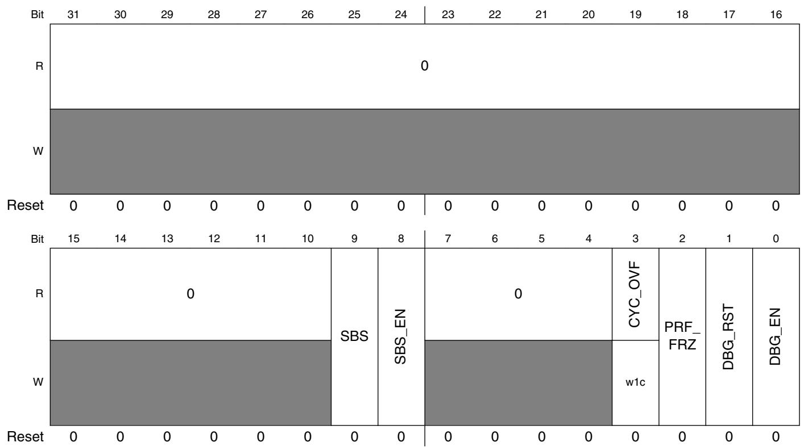

MMDC_MADPCR0 field descriptions   

<table><tr><td>Field</td><td>Description</td></tr><tr><td>31-10 Reserved</td><td>This read-only field is reserved and always has the value 0.</td></tr><tr><td>9 SBS</td><td>Step By Step trigger. If SBS_EN is set to &quot;1&quot; then dispatching AXI pending access toward the DDR will done only if this bit is set to &quot;1&quot;, otherwise no access will be dispatched toward the DDR. This bit is cleared when the pending access has been issued toward the DDR device.1 Launch AXI pending access toward the DDR0 No access will be launched toward the DDR</td></tr><tr><td>8 SBS_EN</td><td>Step By Step debug Enable. Enable step by step mode. Every time this mechanism is enabled then setting SBS to &quot;1&quot; will dispatch one pending AXI access to the DDR and in parallel its attributes will be observed in the status registers (MASBS0 and MASBS1). For further information see Step By Step (SBS) software monitor .0 disable1 enable</td></tr><tr><td>7-4 Reserved</td><td>This read-only field is reserved and always has the value 0.</td></tr></table>

Table continues on the next page...

i.MX 6ULL Applications Processor Reference Manual, Rev. 1, 11/2017

MMDC_MADPCR0 field descriptions (continued)   

<table><tr><td>Field</td><td>Description</td></tr><tr><td>3CYC_OVF</td><td>Total Profiling Cycles Count Overflow. When profiling mechanism is enabled (DBG_EN is set to &quot;1&quot;) then this bit is asserted when overflow of CYC_COUNT occurred. Cleared by writing 1 to it.0 no overflow1 overflow</td></tr><tr><td>2PRF_FRZ</td><td>Profiling freeze. When this bit is asserted then the profiling mechanism will be froze and the associated status registers ( MADPSR0-MADPSR5) will hold the current profiling values.0profiling counters are not frozen1profiling counters are frozen</td></tr><tr><td>1DBG_RST</td><td>Debug and Profiling Reset. Reset all debug and profiling counters and components.0 no reset1 reset</td></tr><tr><td>0DBG_EN</td><td>Debug and Profiling Enable. Enable debug and profiling mechanism. When this bit is asserted then the MMDC will perform a profiling based on the ID that is configured to MADPCR1. Upon assertion of PRF_FRZ the profiling will be froze and the profiling results will be sampled to the status registers (MADPSR0-MADPSR5). For further information see MMDC Profiling.0 disable (default)1 enable</td></tr></table>

# 35.12.21 MMDC Core Debug and Profiling Control Register 1 (MMDC_MADPCR1)

Address: 21B_0000h base $^ +$ 414h offset $=$ 21B_0414h

<table><tr><td>Bit</td><td>31</td><td>30</td><td>29</td><td>28</td><td>27</td><td>26</td><td>25</td><td>24</td><td>23</td><td>22</td><td>21</td><td>20</td><td>19</td><td>18</td><td>17</td><td>16</td><td>15</td><td>14</td><td>13</td><td>12</td><td>11</td><td>10</td><td>9</td><td>8</td><td>7</td><td>6</td><td>5</td><td>4</td><td>3</td><td>2</td><td>1</td><td>0</td><td></td></tr><tr><td>R W</td><td colspan="16">PRF_AXI_ID_MASK</td><td colspan="17">PRF_AXI_ID</td></tr><tr><td>Reset</td><td>0</td><td>0</td><td>0</td><td>0</td><td>0</td><td>0</td><td>0</td><td>0</td><td>0</td><td>0</td><td>0</td><td>0</td><td>0</td><td>0</td><td>0</td><td>0</td><td>0</td><td>0</td><td>0</td><td>0</td><td>0</td><td>0</td><td>0</td><td>0</td><td>0</td><td>0</td><td>0</td><td>0</td><td>0</td><td>0</td><td>0</td><td>0</td><td></td></tr></table>

MMDC_MADPCR1 field descriptions   

<table><tr><td>Field</td><td>Description</td></tr><tr><td>31-16PRF_AXI_ID_MASK</td><td>Profiling AXI ID Mask. AXI ID bits which masked by this value are chosen for profiling.1 AXI ID specific bit is chosen for profiling0 AXI ID specific bit is ignored (don&#x27;t care)</td></tr><tr><td>PRF_AXI_ID</td><td>Profiling AXI ID. AXI IDs that match a bit-wise AND logic operation between PRF_AXI_ID and PRF_AXI_ID_MASK are chosen for profiling.Default value is 0x0, to choose any ID-s for profiling</td></tr></table>

# 35.12.22 MMDC Core Debug and Profiling Status Register 0 (MMDC_MADPSR0)

Address: 21B_0000h base $^ +$ 418h offset $=$ 21B_0418h

MMDC_MADPSR0 field descriptions   

<table><tr><td>Field</td><td>Description</td></tr><tr><td>CYC_COUNT</td><td>Total Profiling cycle Count. This field reflects the total cycle count in case the profiling mechanism is enabled from assertion of DBG_EN and until PRF_FRZ is asserted</td></tr></table>

# 35.12.23 MMDC Core Debug and Profiling Status Register 1 (MMDC_MADPSR1)

The register reflects the total cycles during which the MMDC state machines were busy (both writes and reads). This information can be used for DDR Utilization calculation.

Address: 21B_0000h base $^ +$ 41Ch offset $=$ 21B_041Ch

MMDC_MADPSR1 field descriptions   

<table><tr><td>Field</td><td>Description</td></tr><tr><td>BUSY_COUNT</td><td>Profiling Busy Cycles Count. This field reflects the total number of cycles where the MMDC read and write state machines were busy during the profiling period. Can be used for DDR utilization calculations. Busy cycles are any MMDC clock cycles where the internal state machine is not idle. If any read or write requests are pending in the FIFOs, the MMDC is not idle.</td></tr></table>

# 35.12.24 MMDC Core Debug and Profiling Status Register 2 (MMDC_MADPSR2)

This register reflects the total number of read accesses (per AXI ID) toward MMDC.

Address: 21B_0000h base $^ +$ 420h offset $=$ 21B_0420h

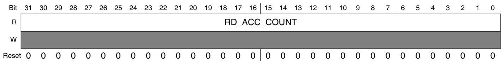

MMDC_MADPSR2 field descriptions   

<table><tr><td>Field</td><td>Description</td></tr><tr><td>RD_ACC_COUNT</td><td>Profiling Read Access Count. This register reflects the total number of read accesses (per AXI ID) toward MMDC.</td></tr></table>

# 35.12.25 MMDC Core Debug and Profiling Status Register 3 (MMDC_MADPSR3)

This register reflects the total number of write accesses (per AXI ID) toward MMDC.

Address: 21B_0000h base $^ +$ 424h offset $=$ 21B_0424h

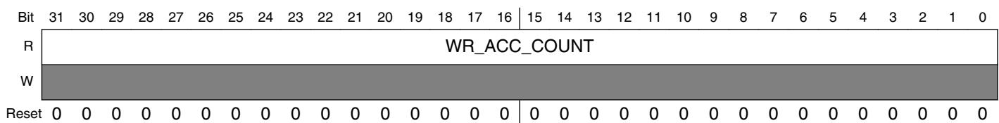

MMDC_MADPSR3 field descriptions   

<table><tr><td>Field</td><td>Description</td></tr><tr><td>WR_ACC_COUNT</td><td>Profiling Write Access Count. This register reflects the total number of write accesses (per AXI ID) toward MMDC.</td></tr></table>

# 35.12.26 MMDC Core Debug and Profiling Status Register 4 (MMDC_MADPSR4)

This register reflects the total number of bytes that were transferred during read access (per AXI ID) toward MMDC.

Address: 21B_0000h base $^ +$ 428h offset $=$ 21B_0428h

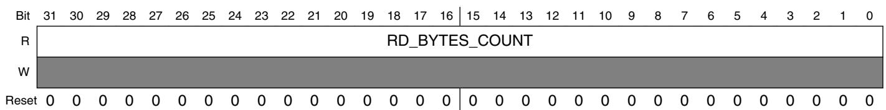

MMDC_MADPSR4 field descriptions   

<table><tr><td>Field</td><td>Description</td></tr><tr><td>RD_BYTESCOUNT</td><td>Profiling Read Bytes Count. This register reflects the total number of bytes that were transferred during read access (per AXI ID) toward MMDC.</td></tr></table>

# 35.12.27 MMDC Core Debug and Profiling Status Register 5 (MMDC_MADPSR5)

This register reflects the total number of bytes that were transferred during write access (per AXI ID) toward MMDC.

Address: 21B_0000h base $^ +$ 42Ch offset $=$ 21B_042Ch

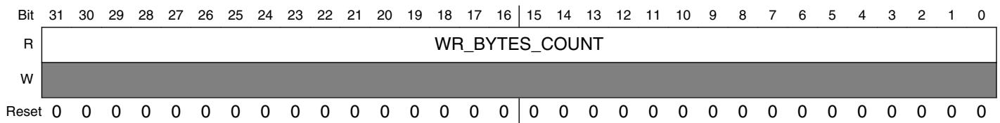

MMDC_MADPSR5 field descriptions   

<table><tr><td>Field</td><td>Description</td></tr><tr><td>WR Bytes_COUNT</td><td>Profiling Write Bytes Count. This register reflects the total number of bytes that were transferred during write access (per AXI ID) toward MMDC.</td></tr></table>

# 35.12.28 MMDC Core Step By Step Address Register (MMDC_MASBS0)

Address: 21B_0000h base $^ +$ 430h offset $=$ 21B_0430h

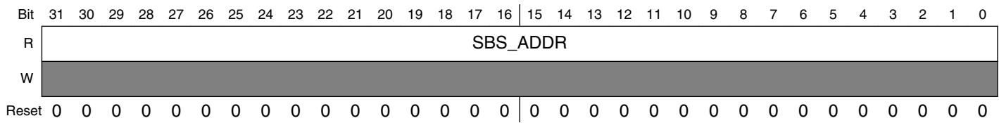

MMDC_MASBS0 field descriptions   

<table><tr><td>Field</td><td>Description</td></tr><tr><td>SBS_ADDR</td><td>Step By Step Address. These bits reflect the address of the pending request in case of step by step mode.</td></tr></table>

# 35.12.29 MMDC Core Step By Step Address Attributes Register (MMDC_MASBS1)

Address: 21B_0000h base $^ +$ 434h offset $=$ 21B_0434h

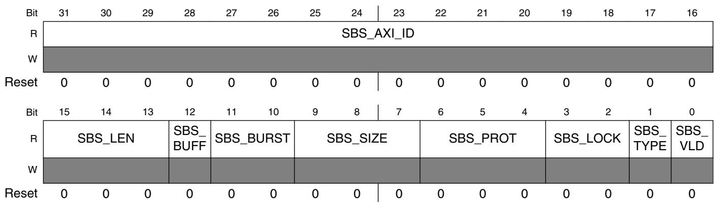

MMDC_MASBS1 field descriptions   
Table continues on the next page...   

<table><tr><td>Field</td><td>Description</td></tr><tr><td>31-16 SBS_AXI_ID</td><td>Step By Step AXI ID. These bits reflect the AXI ID of the pending request in case of step by step mode.</td></tr><tr><td>15-13 SBS_LEN</td><td>Step By Step Length. These bits reflect the AXI LENGTH of the pending request in case of step by step mode.000 burst of length 1001 burst of length 2111 burst of length 8</td></tr><tr><td>12 SBS BUFF</td><td>Step By Step Buffered. This bit reflects the AXI Cache[0] of the pending request in case of step by step mode. Relevant only for write requests</td></tr></table>

i.MX 6ULL Applications Processor Reference Manual, Rev. 1, 11/2017

MMDC_MASBS1 field descriptions (continued)   

<table><tr><td>Field</td><td>Description</td></tr><tr><td rowspan="5">11-10 SBS_BURST</td><td>Step By Step Burst. These bits reflect the AXI BURST of the pending request in case of step by step mode.</td></tr><tr><td>00 FIXED</td></tr><tr><td>01INCR burst</td></tr><tr><td>10WRAP burst</td></tr><tr><td>11reserved</td></tr><tr><td rowspan="7">9-7 SBS_SIZE</td><td>Step By Step Size. These bits reflect the AXI SIZE of the pending request in case of step by step mode.</td></tr><tr><td>0008 bits</td></tr><tr><td>00116 bits</td></tr><tr><td>01032 bits</td></tr><tr><td>01164 bits</td></tr><tr><td>100128bits</td></tr><tr><td>101-111Reserved</td></tr><tr><td>6-4 SBS PROT</td><td>Step By Step Protection. These bits reflect the AXI PROT of the pending request in case of step by step mode.</td></tr><tr><td>3-2 SBS_LOCK</td><td>Step By Step Lock. These bits reflect the AXI LOCK of the pending request in case of step by step mode.</td></tr><tr><td rowspan="3">1 SBS_TYPE</td><td>Step By Step Request Type. These bits reflect the type (read/write) of the pending request in case of step by step mode.</td></tr><tr><td>0write</td></tr><tr><td>1read</td></tr><tr><td rowspan="3">0SBS_VLD</td><td>Step By Step Valid. This bit reflects whether there is a pending request in case of step by step mode.</td></tr><tr><td>0not valid</td></tr><tr><td>1valid</td></tr></table>

# 35.12.30 MMDC Core General Purpose Register (MMDC_MAGENP)

This register is a general 32 bit read/write register.

Address: 21B_0000h base $^ +$ 440h offset $=$ 21B_0440h

<table><tr><td>Bit</td><td>31</td><td>30</td><td>29</td><td>28</td><td>27</td><td>26</td><td>25</td><td>24</td><td>23</td><td>22</td><td>21</td><td>20</td><td>19</td><td>18</td><td>17</td><td>16</td><td>15</td><td>14</td><td>13</td><td>12</td><td>11</td><td>10</td><td>9</td><td>8</td><td>7</td><td>6</td><td>5</td><td>4</td><td>3</td><td>2</td><td>1</td><td>0</td></tr><tr><td>R W</td><td colspan="32">GP31_GP0</td></tr><tr><td>Reset</td><td>0</td><td>0</td><td>0</td><td>0</td><td>0</td><td>0</td><td>0</td><td>0</td><td>0</td><td>0</td><td>0</td><td>0</td><td>0</td><td>0</td><td>0</td><td>0</td><td>0</td><td>0</td><td>0</td><td>0</td><td>0</td><td>0</td><td>0</td><td>0</td><td>0</td><td>0</td><td>0</td><td>0</td><td>0</td><td>0</td><td>0</td><td>0</td></tr></table>

MMDC_MAGENP field descriptions   

<table><tr><td>Field</td><td>Description</td></tr><tr><td>GP31_GP0</td><td>General purpose read/write bits.</td></tr></table>

i.MX 6ULL Applications Processor Reference Manual, Rev. 1, 11/2017

# 35.12.31 MMDC PHY ZQ HW control register (MMDC_MPZQHWCTRL)

Address: 21B_0000h base $^ +$ 800h offset $=$ 21B_0800h

<table><tr><td>Bit</td><td>31</td><td>30</td><td>29</td><td>28</td><td>27</td><td>26</td><td>25</td><td>24</td><td>23</td><td>22</td><td>21</td><td>20</td><td>19</td><td>18</td><td>17</td><td>16</td></tr><tr><td>R</td><td rowspan="2" colspan="5">ZQ_EARLY_COMPARATOR_EN_TIMER</td><td rowspan="2">0</td><td rowspan="2" colspan="3">TZQ_CS</td><td rowspan="2" colspan="3">TZQ_OPEN</td><td rowspan="2" colspan="3">TZQ_INIT</td><td rowspan="2">ZQ_HW_FOR</td></tr><tr><td>W</td></tr><tr><td>Reset</td><td>1</td><td>0</td><td>1</td><td>0</td><td>0</td><td>0</td><td>0</td><td>1</td><td>0</td><td>0</td><td>1</td><td>1</td><td>1</td><td>0</td><td>0</td><td>0</td></tr><tr><td>Bit</td><td>15</td><td>14</td><td>13</td><td>12</td><td>11</td><td>10</td><td>9</td><td>8</td><td>7</td><td>6</td><td>5</td><td>4</td><td>3</td><td>2</td><td>1</td><td>0</td></tr><tr><td>R</td><td colspan="5">ZQ_HW_PD_RES</td><td colspan="5">ZQ_HW_PU_RES</td><td rowspan="2" colspan="4">ZQ_HW_PER</td><td rowspan="2" colspan="2">ZQ_MODE</td></tr><tr><td>W</td><td colspan="5"></td><td colspan="5"></td></tr><tr><td>Reset</td><td>0</td><td>0</td><td>0</td><td>0</td><td>0</td><td>0</td><td>0</td><td>0</td><td>0</td><td>0</td><td>0</td><td>0</td><td>0</td><td>0</td><td>0</td><td>0</td></tr></table>

MMDC_MPZQHWCTRL field descriptions   

<table><tr><td>Field</td><td>Description</td></tr><tr><td>31-27ZQ_EARLY_COMPARATOR_EN_TIMER</td><td>ZQ early comparator enable timer. This timer defines the interval between the warming up of the comparator of the i.MX ZQ calibration pad and the beginning of the ZQ calibration process with the pad0x0 - 0x6 Reserved0x7 8 cycles0x14 21 cycles (Default)0x1E 31 cycles0x1F 32 cycles</td></tr><tr><td>26Reserved</td><td>This read-only field is reserved and always has the value 0 .</td></tr><tr><td>25-23TZQ_CS</td><td>Device ZQ short time. This field holds the number of cycles that are required by the external DDR device to perform ZQ short calibration. Upon driving the command to the DDR device then no further accesses will be issued to the DDR device till satisfying that time.NOTE: In LPDDR2 the ZQ short time is taken from MPZQLP2CTL[ZQ_LP2_HW_ZQCS]NOTE: This field should not be update during ZQ calibration.000 Reserved001 Reserved010 128 cycles (Default)011 256 cycles100 512 cycles101 1024 cycles110- 111 Reserved</td></tr><tr><td>22-20TZQ_OPEN</td><td>Device ZQ long/oper time. This field holds the number of cycles that are required by the external DDR device to perform ZQ long calibration except the first ZQ long command that is issued after reset. Upon driving the command to the DDR device then no further accesses will be issued to the DDR device till satisfying that time.NOTE: In LPDDR2 the ZQ oper time is taken from MPZQLP2CTL[ZQ_LP2_HW_ZQCL]</td></tr></table>

Table continues on the next page...

i.MX 6ULL Applications Processor Reference Manual, Rev. 1, 11/2017

MMDC_MPZQHWCTRL field descriptions (continued)   

<table><tr><td>Field</td><td>Description</td></tr><tr><td></td><td>NOTE: This field should not be update during ZQ calibration.</td></tr><tr><td></td><td>000 Reserved</td></tr><tr><td></td><td>001 Reserved</td></tr><tr><td></td><td>010 128 cycles</td></tr><tr><td></td><td>011 256 cycles - Default (JEDEC value for DDR3)</td></tr><tr><td></td><td>100 512 cycles</td></tr><tr><td></td><td>101 1024 cycles</td></tr><tr><td></td><td>110- 111 Reserved</td></tr><tr><td>19-17TZQ_INIT</td><td>Device ZQ long/ini time. This field holds the number of cycles that are required by the external DDR device to perform ZQ long calibration right after reset. Upon driving the command to the DDR device then no further accesses will be issued to the DDR device till satisfying that time.</td></tr><tr><td></td><td>NOTE: In LPDDR2 the ZQ init time is taken from MPZQLP2CTL[ZQ_LP2_HW_ZQINIT]</td></tr><tr><td></td><td>NOTE: This field should not be update during ZQ calibration.</td></tr><tr><td></td><td>000 Reserved</td></tr><tr><td></td><td>001 Reserved</td></tr><tr><td></td><td>010 128 cycles</td></tr><tr><td></td><td>011 256 cycles</td></tr><tr><td></td><td>100 512 cycles - Default (JEDEC value for DDR3)</td></tr><tr><td></td><td>101 1024 cycles</td></tr><tr><td></td><td>110- 111 Reserved</td></tr><tr><td>16ZQ_HW_FOR</td><td>Force ZQ automatic calibration process with the i.MX ZQ calibration pad. When this bit is asserted then the MMDC will issue one ZQ automatic calibration process with the i.MX ZQ calibration pad. It is the user responsibility to make sure that all the accesses to DDR will be finished before asserting this bit using CON_REQ/CON_ACK mechanism. HW will negate this bit upon completion of the ZQ calibration process. Upon negation of this bit the ZQ HW calibration pull-up and pull-down results (ZQ_HWPu_RES and ZQ_HW_PD_RES respectively) are valid</td></tr><tr><td></td><td>NOTE: In order to enable this bit ZQ_MODE must be set to either "1" or "3"</td></tr><tr><td>15-11ZQ_HW_PD_RES</td><td>ZQ HW calibration pull-down result. This field holds the pull-down resistor value calculated at the end of the ZQ automatic calibration process with the i.MX ZQ calibration pad.</td></tr><tr><td></td><td>NOTE: An offset can be applied to this result, see MMDC_MPPDCMPR2[ZQ_PD_OFFSET].</td></tr><tr><td></td><td>00000 Max. resistance.</td></tr><tr><td></td><td>11111 Min. resistance.</td></tr><tr><td>10-6ZQ_HW_DU_RES</td><td>ZQ automatic calibration pull-up result. This field holds the pull-up resistor value calculated at the end of the ZQ automatic calibration process with the i.MX ZQ calibration pad.</td></tr><tr><td></td><td>NOTE: An offset can be applied to this result, see MMDC_MPPDCMPR2[ZQ_DU_OFFSET]</td></tr><tr><td></td><td>00000 Min. resistance.</td></tr><tr><td></td><td>11111 Max. resistance.</td></tr><tr><td>5-2ZQ_HW_PER</td><td>ZQ periodic calibration time. This field determines how often the periodic ZQ calibration is performed. This field is applied for both ZQ short calibration and ZQ automatic calibration process with i.MX ZQ calibration pad. Whenever this timer is expired then according to ZQ_MODE the ZQ automatic calibration process with the i.MX ZQ calibration pad will be issued and/or short/long command will be issued to the external DDR device.</td></tr><tr><td></td><td>This field is ignored if ZQ_MODE equals "00"</td></tr><tr><td></td><td>0000 ZQ calibration is performed every 1 ms.</td></tr><tr><td></td><td>0001 ZQ calibration is performed every 2 ms.</td></tr><tr><td></td><td>0010 ZQ calibration is performed every 4 ms.</td></tr><tr><td></td><td>1010 ZQ calibration is performed every 1 sec.</td></tr><tr><td></td><td>1110 ZQ calibration is performed every 16 sec.</td></tr><tr><td></td><td>1111 ZQ calibration is performed every 32 sec.</td></tr><tr><td>ZQ_MODE</td><td>ZQ calibration mode:</td></tr><tr><td></td><td>0x0 No ZQ calibration is issued. (Default)</td></tr><tr><td></td><td>0x1 ZQ calibration is issued to i.MX ZQ calibration pad together with ZQ long command to the external DDR device only when exiting self refresh.</td></tr><tr><td></td><td>0x2 ZQ calibration command long/short is issued only to the external DDR device periodically and when exiting self refresh</td></tr><tr><td></td><td>0x3 ZQ calibration is issued to i.MX ZQ calibration pad together with ZQ calibration command long/short to the external DDR device periodically and when exiting self refresh</td></tr></table>

# 35.12.32 MMDC PHY ZQ SW control register (MMDC_MPZQSWCTRL)

Address: 21B_0000h base $^ +$ 804h offset $=$ 21B_0804h

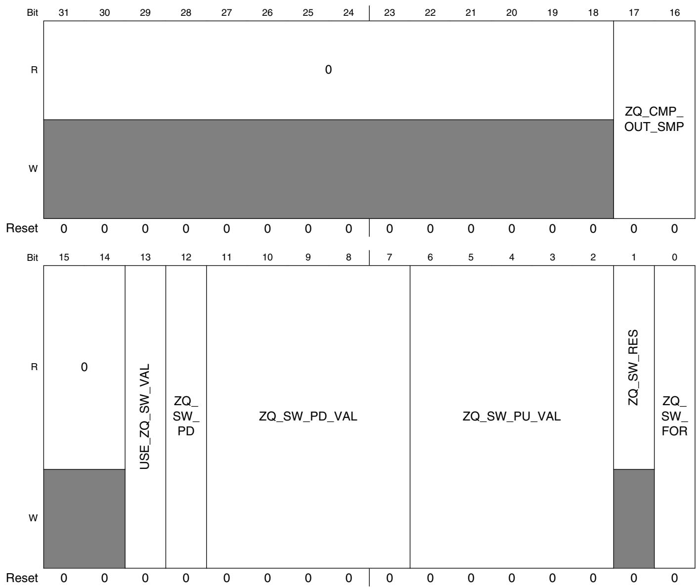

MMDC_MPZQSWCTRL field descriptions   

<table><tr><td>Field</td><td>Description</td></tr><tr><td>31-18 Reserved</td><td>This read-only field is reserved and always has the value 0.</td></tr><tr><td>17-16 ZQ_CMP_OUT_SMP</td><td>Defines the amount of cycles between driving the ZQ signals to the ZQ pad and till sampling the comparator enable output while performing ZQ calibration process with the i.MX ZQ calibration pad</td></tr><tr><td></td><td>00 7 cycles</td></tr><tr><td></td><td>01 15 cycles</td></tr></table>

Table continues on the next page...

i.MX 6ULL Applications Processor Reference Manual, Rev. 1, 11/2017

MMDC_MPZQSWCTRL field descriptions (continued)   

<table><tr><td>Field</td><td>Description</td></tr><tr><td></td><td>10 23 cycles11 31 cycles</td></tr><tr><td>15-14Reserved</td><td>This read-only field is reserved and always has the value 0.</td></tr><tr><td>13USE_ZQ_SW_VAL</td><td>Use SW ZQ configured value for I/O pads resistor controls. This bit selects whether ZQ SW value or ZQ HW value will be driven to the I/O pads resistor controls. By default this bit is cleared and MMDC drives the HW ZQ status bits on the resistor controls of the I/O pads.NOTE: This bit should not be updated during ZQ calibration.0 Fields ZQ_HW_PD_VAL &amp; ZQ_HWPU_VAL will be driven to I/O pads resistor controls.1 Fields ZQ_HW_PD_VAL &amp; ZQ_SWPU_VAL will be driven to I/O pads resistor controls.</td></tr><tr><td>12ZQ_SW_PD</td><td>ZQ software PU/PD calibration. This bit determines the calibration stage (PU or PD).0 PU resistor calibration1 PD resistor calibration</td></tr><tr><td>11-7ZQ_SW_PD_VAL</td><td>ZQ software pull-down resistance. This field determines the value of the PD resistor during SW ZQ calibration.00000 Max. resistance.11111 Min. resistance.</td></tr><tr><td>6-2ZQ_SWPU_VAL</td><td>ZQ software pull-up resistance. This field determines the value of the PU resistor during SW ZQ calibration.00000 Min. resistance.11111 Max. resistance.</td></tr><tr><td>1ZQ_SW_RES</td><td>ZQ software calibration result. This bit reflects the ZQ calibration voltage comparator value.0 Current ZQ calibration voltage is less than VDD/2.1 Current ZQ calibration voltage is more than VDD/2</td></tr><tr><td>0ZQ_SW_FOR</td><td>ZQ SW calibration enable. This bit when asserted enables ZQ SW calibration. HW negates this bit upon completion of the ZQ SW calibration. Upon negation of this bit the ZQ SW calibration result (i.e.ZQ_SW_RES) is valid</td></tr></table>

# 35.12.33 MMDC PHY Write Leveling Configuration and Error Status Register (MMDC_MPWLGCR)

Address: 21B_0000h base $^ +$ 808h offset $=$ 21B_0808h

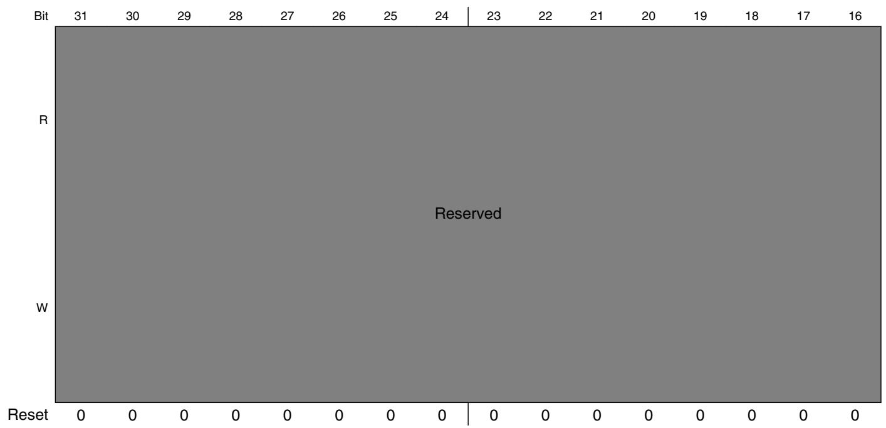

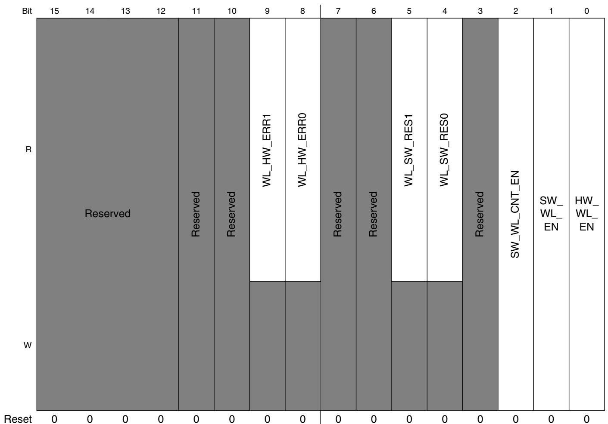

MMDC_MPWLGCR field descriptions   

<table><tr><td>Field</td><td>Description</td></tr><tr><td>31-12 -</td><td>This field is reserved. Reserved</td></tr><tr><td>11 -</td><td>This field is reserved. Reserved</td></tr><tr><td>10 -</td><td>This field is reserved. Reserved</td></tr><tr><td>9 WL_HW_ERR1</td><td>Byte1 write-leveling HW calibration error. This bit is asserted when an error was found on byte1 during write-leveling HW calibration. This bit is valid only upon completion of the write-leveling HW calibration (i.e. HW_WL_EN bit is de-asserted)0 No error was found on byte1 during write-leveling HW calibration.1 An error was found on byte1 during write-leveling HW calibration.</td></tr><tr><td>8 WL_HW_ERR0</td><td>Byte0 write-leveling HW calibration error. This bit is asserted when an error was found on byte0 during write-leveling HW calibration. This bit is valid only upon completion of the write-leveling HW calibration (i.e. HW_WL_EN bit is de-asserted)</td></tr></table>

Table continues on the next page...

i.MX 6ULL Applications Processor Reference Manual, Rev. 1, 11/2017

MMDC_MPWLGCR field descriptions (continued)   

<table><tr><td>Field</td><td>Description</td></tr><tr><td></td><td>0 No error was found on byte0 during write-leveling HW calibration.1 An error was found on byte0 during write-leveling HW calibration.</td></tr><tr><td>7-</td><td>This field is reserved.Reserved</td></tr><tr><td>6-</td><td>This field is reserved.Reserved</td></tr><tr><td>5 WL_SW_RES1</td><td>Byte1 write-leveling software result. This bit reflects the value that is driven by the DDR device on DQ8 during SW write-leveling.0 DQS1 sampled low CK during SW write-leveling.1 DQS1 sampled high CK during SW write-leveling.</td></tr><tr><td>4 WL_SW_RES0</td><td>Byte0 write-leveling software result. This bit reflects the value that is driven by the DDR device on DQ0 during SW write-leveling.0 DQS0 sampled low CK during SW write-leveling.1 DQS0 sampled high CK during SW write-leveling.</td></tr><tr><td>3-</td><td>This field is reserved.Reserved</td></tr><tr><td>2 SW_WL_CNT_EN</td><td>SW write-leveling count down enable. This bit when asserted set a certain delay of (25+15) cycles from the setting of SW_WL_EN and before driving the DQS to the DDR device. This bit should be asserted before the first SW write-leveling request and after issuing the write leveling MRS command0 MMDC doesn&#x27;t count 25+15 cycles before issuing write-leveling DQS.1 MMDC counts 25+15 cycles before issuing write-leveling DQS.</td></tr><tr><td>1 SW_WL_EN</td><td>Write-Leveling SW enable. If this bit is asserted then the MMDC will perform one write-leveling iteration with the DDR device (assuming that Write-Leveling procedure is already enabled in the DDR device through MRS command). HW negate this bit upon completion of the SW write-leveling. Negation of this bit also points that the write-leveling SW calibration result is validNOTE: If this bit and the SW_WL_CNT_EN are enabled the MMDC counts 25 + 15 cycles before issuing the SW write-leveling DQS.</td></tr><tr><td>0 HW_WL_EN</td><td>Write-Leveling HW (automatic) enable. If this bit is asserted then the MMDC will perform the whole Write-Leveling sequence with the DDR device (assuming that Write-Leveling procedure is already enabled in the DDR device through MRS command). HW negates this bit upon completion of the HW write-leveling.Negation of this bit also points that the write-leveling HW calibration results are validNOTE: Before issuing the first DQS the MMDC counts 25 + 15 cycles automatically as required by the standard.</td></tr></table>

# 35.12.34 MMDC PHY Write Leveling Delay Control Register 0 (MMDC_MPWLDECTRL0)

Address: 21B_0000h base $^ +$ 80Ch offset $=$ 21B_080Ch

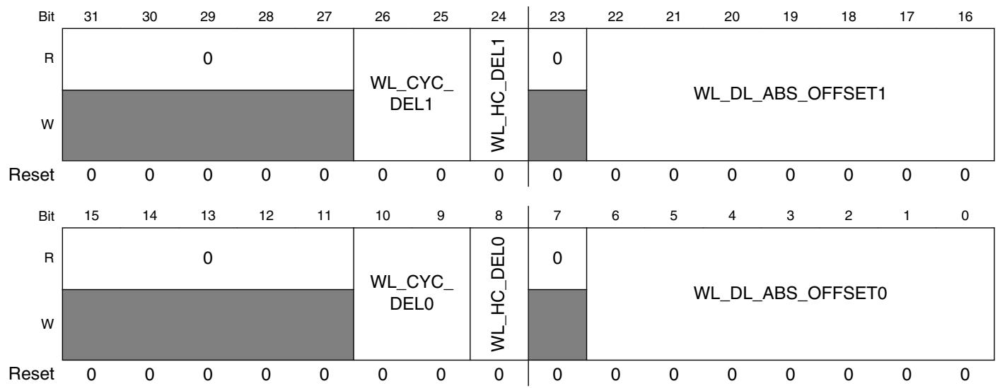

MMDC_MPWLDECTRL0 field descriptions   

<table><tr><td>Field</td><td>Description</td></tr><tr><td>31-27Reserved</td><td>This read-only field is reserved and always has the value 0.</td></tr><tr><td>26-25WL_CYC_DEL1</td><td>Write leveling cycle delay for Byte 1. This field indicates whether a delay of 1 or 2 cycles between CK and write DQS is added to the delay that is indicated in the associated WR_DL_ABS_OFFSET and WL_HC_DEL. So the total delay is the sum of (WL_DL_ABS_OFFSET/256*cycle) + (WL_HC_DEL*half cycle) + (WL_CYC_DEL*cycle).When both SW write-leveling is enabled (i.e. SW_WL_EN = 1) or HW write-leveling is enabled (i.e. HW_WL_EN = 1) then this value will be taken as is and will be added to the associated delay that is configured in WL_DL_OFFSET and WL_HC_DEL.NOTE: In HW write-leveling this field is not used for indication, as in WL_DL_OFFSET and WL_HC_DEL, but for configuration.0 No delay is added.1 1 cycle delay is added.2 2 cycles delay is added.3 Reserved.</td></tr><tr><td>24WL_HC_DEL1</td><td>Write leveling half cycle delay for Byte 1. This field indicates whether a delay of half cycle between CK and write DQS is added to the delay that is indicated in the associated WR_DL_ABS_OFFSET and WL_CYC_DEL. So the total delay is the sum of (WL_DL_ABS_OFFSET/256*cycle) + (WL_HC_DEL*half cycle) + (WL_CYC_DEL*cycle).When SW write-leveling is enabled (i.e. SW_WL_EN = 1) then this value will be taken as is and will be added to the associated delay that is configured in WL_DL_OFFSET and WL_CYC_DEL. When HW write-leveling is enabled (i.e. HW_WL_EN = 1) then this value will indicate (status) whether a delay of half cycle was added or not to the associated WL_DL_OFFSET and WL_CYC_DEL.</td></tr></table>

Table continues on the next page...

i.MX 6ULL Applications Processor Reference Manual, Rev. 1, 11/2017

MMDC_MPWLDECTRL0 field descriptions (continued)   

<table><tr><td>Field</td><td>Description</td></tr><tr><td></td><td>0 No delay is added.1 Half cycle delay is added.</td></tr><tr><td>23 Reserved</td><td>This read-only field is reserved and always has the value 0.</td></tr><tr><td>22-16 WL_DL_ABS_OFFSET1</td><td>Absolute write-leveling delay offset for Byte 1. This field indicates the absolute delay between CK and write DQS of Byte1 with fractions of a clock period and up to half cycle. This value is process and frequency independent. The value of the delay can be calculated using the following equation (WR_DL_ABS_OFFSET1 / 256) * clock periodWhen SW write-leveling is enabled (i.e. SW_WL_EN = 1) then this value will be taken as is to the associated delay-line. When HW write-leveling is enabled (i.e. HW_WL_EN = 1 ) then this value will indicate (status) the value that is taken to the associated delay-line at the end of the write-leveling calibration.NOTE: The delay-line has a resolution that may vary between device to device, therefore is some cases an increment of the delay by 1 step may be smaller than the delay-line resolution.</td></tr><tr><td>15-11 Reserved</td><td>This read-only field is reserved and always has the value 0.</td></tr><tr><td>10-9 WL_CYC_DEL0</td><td>Write leveling cycle delay for Byte 0. This field indicates whether a delay of 1 or 2 cycles between CK and write DQS is added to the delay that is indicated in the associated WR_DL_ABS_OFFSET and WL_HC_DEL. So the total delay is the sum of (WL_DL_ABS_OFFSET/256*cycle) + (WL_HC_DEL*half cycle) + (WL_CYC_DEL*cycle).When both SW write-leveling is enabled (i.e. SW_WL_EN = 1) or HW write-leveling is enabled (i.e. HW_WL_EN = 1 ) then this value will be taken as is and will be added to the associated delay that is configured in WL_DL_OFFSET and WL_HC_DEL.Note that in HW write-leveling this field is not used for indication, as in WL_DL_OFFSET and WL_HC_DEL, but for configuration.0 No delay is added.1 1 cycle delay is added.2 2 cycles delay is added.3 Reserved.</td></tr><tr><td>8 WL_HC_DEL0</td><td>Write leveling half cycle delay for Byte 0. This field indicates whether a delay of half cycle between CK and write DQS is added to the delay that is indicated in the associated WR_DL_ABS_OFFSET and WL_CYC_DEL. So the total delay is the sum of (WL_DL_ABS_OFFSET/256*cycle) + (WL_HC_DEL*half cycle) + (WL_CYC_DEL*cycle).When SW write-leveling is enabled (i.e. SW_WL_EN = 1) then this value will be taken as is and will be added to the associated delay that is configured in WL_DL_OFFSET and WL_CYC_DEL. When HW write-leveling is enabled (i.e. HW_WL_EN = 1 ) then this value will indicate (status) whether a delay of half cycle was added or not to the associated WL_DL_OFFSET and WL_CYC_DEL.0 No delay is added.1 Half cycle delay is added.</td></tr><tr><td>7 Reserved</td><td>This read-only field is reserved and always has the value 0.</td></tr><tr><td>WL_DL_ABS_OFFSET0</td><td>Absolute write-leveling delay offset for Byte 0. This field indicates the absolute delay between CK and write DQS of Byte0 with fractions of a clock period and up to half cycle. This value is process and frequency independent. The value of the delay can be calculated using the following equation (WR_DL_ABS_OFFSET1 / 256) * clock period</td></tr><tr><td rowspan="2"></td><td>When SW write-leveling is enabled (i.e. SW_WL_EN = 1) then this value will be taken as is to the associated delay-line. When HW write-leveling is enabled (i.e. HW_WL_EN = 1) then this value will indicate (status) the value that is taken to the associated delay-line at the end of the write-leveling calibration.</td></tr><tr><td>NOTE: The delay-line has a resolution that may vary between device to device, therefore is some cases an increment of the delay by 1 step may be smaller than the delay-line resolution.</td></tr></table>

# 35.12.35 MMDC PHY Write Leveling Delay Control Register 1 (MMDC_MPWLDECTRL1)

Address: 21B_0000h base $^ +$ 810h offset $=$ 21B_0810h

MMDC_MPWLDECTRL1 field descriptions   

<table><tr><td>Field</td><td>Description</td></tr><tr><td>31-27Reserved</td><td>This read-only field is reserved and always has the value 0 .</td></tr><tr><td>26-25WL_CYC_DEL3</td><td>Write leveling cycle delay for Byte 3 . This field indicates whether a delay of 1 or 2 cycles between CK and write DQS is added to the delay that is indicated in the associated WL_DL_ABS_OFFSET and WL_HC_DEL. So the total delay is the sum of (WL_DL_ABS_OFFSET/256*cycle) + (WL_HC_DEL*half cycle) + (WL_CYC_DEL*cycle).When both SW write-leveling is enabled (i.e. SW_WL_EN = 1) or HW write-leveling is enabled (i.e. HW_WL_EN = 1 ) then this value will be taken as is and will be added to the associated delay that is configured in WL_DL_OFFSET and WL_HC_DEL.NOTE: In HW write-leveling this field is not used for indication, as in WL_DL_OFFSET and WL_HC_DEL,but for configuration.0 No delay is added.1 1 cycle delay is added.</td></tr></table>

Table continues on the next page...

i.MX 6ULL Applications Processor Reference Manual, Rev. 1, 11/2017

MMDC_MPWLDECTRL1 field descriptions (continued)   

<table><tr><td>Field</td><td>Description</td></tr><tr><td></td><td>2 2 cycles delay is added.3 Reserved.</td></tr><tr><td>24WL_HC_DEL3</td><td>Write leveling half cycle delay for Byte 3. This field indicates whether a delay of half cycle between CK and write DQS is added to the delay that is indicated in the associated WL_DL_ABS_OFFSET and WL_CYC_DEL. So the total delay is the sum of (WL_DL_ABS_OFFSET/256*cycle) + (WL_HC_DEL*half cycle) + (WL_CYC_DEL*cycle).When SW write-leveling is enabled (i.e. SW_WL_EN = 1) then this value will be taken as is and will be added to the associated delay that is configured in WL_DL_OFFSET and WL_CYC_DEL. When HW write-leveling is enabled (i.e. HW_WL_EN = 1) then this value will indicate (status) whether a delay of half cycle was added or not to the associated WL_DL_OFFSET and WL_CYC_DEL.0 No delay is added.1 Half cycle delay is added.</td></tr><tr><td>23Reserved</td><td>This read-only field is reserved and always has the value 0 .</td></tr><tr><td>22-16WL_DL_ABS_OFFSET3</td><td>Absolute write-leveling delay offset for Byte 3. This field indicates the absolute delay between CK and write DQS of Byte3 with fractions of a clock period and up to half cycle. This value is process and frequency independent. The value of the delay can be calculated using the following equation (WL_DL_ABS_OFFSET3 / 256) * clock periodWhen SW write-leveling is enabled (i.e. SW_WL_EN = 1) then this value will be taken as is to the associated delay-line. When HW write-leveling is enabled (i.e. HW_WL_EN = 1) then this value will indicate (status) the value that is taken to the associated delay-line at the end of the write-leveling calibration.NOTE: The delay-line has a resolution that may vary between device to device, therefore is some cases an increment of the delay by 1 step may be smaller than the delay-line resolution.</td></tr><tr><td>15-11Reserved</td><td>This read-only field is reserved and always has the value 0 .</td></tr><tr><td>10-9WL_CYC_DEL2</td><td>Write leveling cycle delay for Byte 2. This field indicates whether a delay of 1 or 2 cycles between CK and write DQS is added to the delay that is indicated in the associated WR_DL_ABS_OFFSET and WL_HC_DEL. So the total delay is the sum of (WL_DL_ABS_OFFSET/256*cycle) + (WL_HC_DEL*half cycle) + (WL_CYC_DEL*cycle).When both SW write-leveling is enabled (i.e. SW_WL_EN = 1) or HW write-leveling is enabled (i.e. HW_WL_EN = 1) then this value will be taken as is and will be added to the associated delay that is configured in WL_DL_OFFSET and WL_HC_DEL.NOTE: In HW write-leveling this field is not used for indication, as in WL_DL_OFFSET and WL_HC_DEL,but for configuration.0 No delay is added.1 1 cycle delay is added.2 2 cycles delay is added.3 Reserved.</td></tr><tr><td>8WL_HC_DEL2</td><td>Write leveling half cycle delay for Byte 2. This field indicates whether a delay of half cycle between CK and write DQS is added to the delay that is indicated in the associated WR_DL_ABS_OFFSET and WL_CYC_DEL. So the total delay is the sum of (WL_DL_ABS_OFFSET/256*cycle) + (WL_HC_DEL*half cycle) + (WL_CYC_DEL*cycle).When SW write-leveling is enabled (i.e. SW_WL_EN = 1) then this value will be taken as is and will be added to the associated delay that is configured in WL_DL_OFFSET and WL_CYC_DEL. When HW write-levelling is enabled (i.e. HW_WL_EN = 1) then this value will indicate (status) whether a delay of half cycle was added or not to the associated WL_DL_OFFSET and WL_CYC_DEL.</td></tr></table>

Table continues on the next page...

i.MX 6ULL Applications Processor Reference Manual, Rev. 1, 11/2017

MMDC_MPWLDECTRL1 field descriptions (continued)   

<table><tr><td>Field</td><td>Description</td></tr><tr><td></td><td>0 No delay is added.
1 Half cycle delay is added.</td></tr><tr><td>7 Reserved</td><td>This read-only field is reserved and always has the value 0.</td></tr><tr><td>WL_DL_ABS_OFFSET2</td><td>Absolute write-leveling delay offset for Byte 2. This field indicates the absolute delay between CK and write DQS of Byte1 with fractions of a clock period and up to half cycle. This value is process and frequency independent. The value of the delay can be calculated using the following equation (WR_DL_ABS_OFFSET2 / 256) * clock period
When SW write-leveling is enabled (i.e. SW_WL_EN = 1) then this value will be taken as is to the associated delay-line. When HW write-leveling is enabled (i.e. HW_WL_EN = 1) then this value will indicate (status) the value that is taken to the associated delay-line at the end of the write-leveling calibration.
NOTE: The delay-line has a resolution that may vary between device to device, therefore is some cases an increment of the delay by 1 step may be smaller than the delay-line resolution.</td></tr></table>

# 35.12.36 MMDC PHY Write Leveling delay-line Status Register (MMDC_MPWLDLST)

This register holds the status of the four write leveling delay-lines.

Address: 21B_0000h base + 814h offset $=$ 21B_0814h

i.MX 6ULL Applications Processor Reference Manual, Rev. 1, 11/2017

MMDC_MPWLDLST field descriptions   

<table><tr><td>Field</td><td>Description</td></tr><tr><td>31</td><td>This field is reserved. 
Reserved</td></tr><tr><td>30-24</td><td rowspan="2">This field is reserved. 
Reserved</td></tr><tr><td>-</td></tr><tr><td>23</td><td rowspan="2">This field is reserved. 
Reserved</td></tr><tr><td>-</td></tr><tr><td>22-16</td><td rowspan="2">This field is reserved. 
Reserved</td></tr><tr><td>-</td></tr><tr><td>15</td><td rowspan="2">This field is reserved. 
Reserved</td></tr><tr><td>-</td></tr><tr><td>14-8</td><td rowspan="2">This field reflects the number of delay units that are actually used by write leveling delay-line 1.</td></tr><tr><td>WL_DL_UNIT_NUM1</td></tr><tr><td>7</td><td rowspan="2">This field is reserved. 
Reserved</td></tr><tr><td>-</td></tr><tr><td>WL_DL_UNIT_NUM0</td><td>This field reflects the number of delay units that are actually used by write leveling delay-line 0.</td></tr></table>

# 35.12.37 MMDC PHY ODT control register (MMDC_MPODTCTRL)

# NOTE

In LPDDR2 mode this register should be cleared, so no termination will be activated

Address: 21B_0000h base $^ +$ 818h offset $=$ 21B_0818h

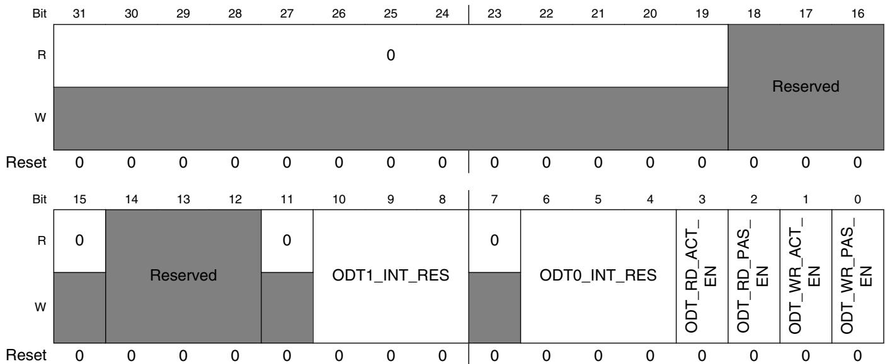

i.MX 6ULL Applications Processor Reference Manual, Rev. 1, 11/2017

MMDC_MPODTCTRL field descriptions   

<table><tr><td>Field</td><td>Description</td></tr><tr><td>31-19Reserved</td><td>This read-only field is reserved and always has the value 0.</td></tr><tr><td>18-16-Reserved</td><td>This field is reserved.Reserved</td></tr><tr><td>15Reserved</td><td>This read-only field is reserved and always has the value 0.</td></tr><tr><td>14-12-Reserved</td><td>This field is reserved.Reserved</td></tr><tr><td>11Reserved</td><td>This read-only field is reserved and always has the value 0.</td></tr><tr><td>10-8ODT1_INT_RES</td><td>On chip ODT byte1 resistor - This field determines the Rtt_Nom of the on chip ODT byte1 resistor during read accesses.0000 Rtt_Nom Disabled.001 Rtt_Nom 120 Ohm010 Rtt_Nom 60 Ohm011 Rtt_Nom 40 Ohm100 Rtt_Nom 30 Ohm101 Rtt_Nom 24 Ohm110 Rtt_Nom 20 Ohm111 Rtt_Nom 17 Ohm</td></tr><tr><td>7Reserved</td><td>This read-only field is reserved and always has the value 0.</td></tr><tr><td>6-4ODT0_INT_RES</td><td>On chip ODT byte0 resistor - This field determines the Rtt_Nom of the on chip ODT byte0 resistor during read accesses.000 Rtt_Nom Disabled.001 Rtt_Nom 120 Ohm010 Rtt_Nom 60 Ohm011 Rtt_Nom 40 Ohm100 Rtt_Nom 30 Ohm101 Rtt_Nom 24 Ohm110 Rtt_Nom 20 Ohm111 Rtt_Nom 17 Ohm</td></tr><tr><td>3ODT_RD_ACT_EN</td><td>Active read CS ODT enable. The bit determines if ODT pin of the active CS will be asserted during read accesses.0 Active CS ODT pin is disabled during read access.1 Active CS ODT pin is enabled during read access.</td></tr><tr><td>2ODT_RD_PAS_EN</td><td>Inactive read CS ODT enable. The bit determines if ODT pin of the inactive CS will be asserted during read accesses.0 Inactive CS ODT pin is disabled during read accesses to other CS.1 Inactive CS ODT pin is enabled during read accesses to other CS.</td></tr><tr><td>1ODT_WR_ACT_EN</td><td>Active write CS ODT enable. The bit determines if ODT pin of the active CS will be asserted during write accesses.</td></tr><tr><td></td><td>0 Active CS ODT pin is disabled during write access.1 Active CS ODT pin is enabled during write access.</td></tr><tr><td>0 ODT_WR_PAS_EN</td><td>Inactive write CS ODT enable. The bit determines if ODT pin of the inactive CS will be asserted during write accesses.0 Inactive CS ODT pin is disabled during write accesses to other CS.1 Inactive CS ODT pin is enabled during write accesses to other CS.</td></tr></table>

# 35.12.38 MMDC PHY Read DQ Byte0 Delay Register (MMDC_MPRDDQBY0DL)

This register is used to add fine-tuning adjustment to every bit in the read DQ byte0 relative to the read DQS. This delay is in addition to the read data calibration. If operating in 64-bit mode, there is an identical register that is mapped at the second base address.

Address: 21B_0000h base $^ +$ 81Ch offset $=$ 21B_081Ch

MMDC_MPRDDQBY0DL field descriptions   

<table><tr><td>Field</td><td>Description</td></tr><tr><td>31Reserved</td><td>This read-only field is reserved and always has the value 0.</td></tr><tr><td>30-28rd_dq7_del</td><td>Read dqs0 to dq7 delay fine-tuning. This field holds the number of delay units that are added to dq7 relative to dqs0.</td></tr><tr><td></td><td>000 No change in dq7 delay</td></tr><tr><td></td><td>001 Add dq7 delay of 1 delay unit</td></tr><tr><td></td><td>010 Add dq7 delay of 2 delay units.</td></tr><tr><td></td><td>011 Add dq7 delay of 3 delay units.</td></tr><tr><td></td><td>100 Add dq7 delay of 4 delay units.</td></tr><tr><td></td><td>101 Add dq7 delay of 5 delay units.</td></tr><tr><td></td><td>110 Add dq7 delay of 6 delay units.</td></tr><tr><td></td><td>111 Add dq7 delay of 7 delay units.</td></tr></table>

Table continues on the next page...

i.MX 6ULL Applications Processor Reference Manual, Rev. 1, 11/2017

MMDC_MPRDDQBY0DL field descriptions (continued)   

<table><tr><td>Field</td><td>Description</td></tr><tr><td>27Reserved</td><td>This read-only field is reserved and always has the value 0.</td></tr><tr><td>26-24rd_dq6_del</td><td>Read dq50 to dq6 delay fine-tuning. This field holds the number of delay units that are added to dq6 relative to dq50.000 No change in dq6 delay001 Add dq6 delay of 1 delay unit010 Add dq6 delay of 2 delay units.011 Add dq6 delay of 3 delay units.100 Add dq6 delay of 4 delay units.101 Add dq6 delay of 5 delay units.110 Add dq6 delay of 6 delay units.111 Add dq6 delay of 7 delay units.</td></tr><tr><td>23Reserved</td><td>This read-only field is reserved and always has the value 0.</td></tr><tr><td>22-20rd_dq5_del</td><td>Read dq50 to dq5 delay fine-tuning. This field holds the number of delay units that are added to dq5 relative to dq50.000 No change in dq5 delay001 Add dq5 delay of 1 delay unit010 Add dq5 delay of 2 delay units.011 Add dq5 delay of 3 delay units.100 Add dq5 delay of 4 delay units.101 Add dq5 delay of 5 delay units.110 Add dq5 delay of 6 delay units.111 Add dq5 delay of 7 delay units.</td></tr><tr><td>19Reserved</td><td>This read-only field is reserved and always has the value 0.</td></tr><tr><td>18-16rd_dq4_del</td><td>Read dq50 to dq4 delay fine-tuning. This field holds the number of delay units that are added to dq4 relative to dq50.000 No change in dq4 delay001 Add dq4 delay of 1 delay unit010 Add dq4 delay of 2 delay units.011 Add dq4 delay of 3 delay units.100 Add dq4 delay of 4 delay units.101 Add dq4 delay of 5 delay units.110 Add dq4 delay of 6 delay units.111 Add dq4 delay of 7 delay units.</td></tr><tr><td>15Reserved</td><td>This read-only field is reserved and always has the value 0.</td></tr><tr><td>14-12rd_dq3_del</td><td>Read dq50 to dq3 delay fine-tuning. This field holds the number of delay units that are added to dq3 relative to dq50.000 No change in dq3 delay001 Add dq3 delay of 1 delay unit010 Add dq3 delay of 2 delay units.011 Add dq3 delay of 3 delay units.</td></tr><tr><td></td><td>100 Add dq3 delay of 4 delay units.</td></tr><tr><td></td><td>101 Add dq3 delay of 5 delay units.</td></tr><tr><td></td><td>110 Add dq3 delay of 6 delay units.</td></tr><tr><td></td><td>111 Add dq3 delay of 7 delay units.</td></tr><tr><td>11 Reserved</td><td>This read-only field is reserved and always has the value 0.</td></tr><tr><td>10-8 rd_dq2_del</td><td>Read dq50 to dq2 delay fine-tuning. This field holds the number of delay units that are added to dq2 relative to dq50.</td></tr><tr><td></td><td>000 No change in dq2 delay</td></tr><tr><td></td><td>001 Add dq2 delay of 1 delay unit</td></tr><tr><td></td><td>010 Add dq2 delay of 2 delay units.</td></tr><tr><td></td><td>011 Add dq2 delay of 3 delay units.</td></tr><tr><td></td><td>100 Add dq2 delay of 4 delay units.</td></tr><tr><td></td><td>101 Add dq2 delay of 5 delay units.</td></tr><tr><td></td><td>110 Add dq2 delay of 6 delay units.</td></tr><tr><td></td><td>111 Add dq2 delay of 7 delay units.</td></tr><tr><td>7 Reserved</td><td>This read-only field is reserved and always has the value 0.</td></tr><tr><td>6-4 rd_dq1_del</td><td>Read dq50 to dq1 delay fine-tuning. This field holds the number of delay units that are added to dq1 relative to dq50.</td></tr><tr><td></td><td>000 No change in dq1 delay</td></tr><tr><td></td><td>001 Add dq1 delay of 1 delay unit</td></tr><tr><td></td><td>010 Add dq1 delay of 2 delay units.</td></tr><tr><td></td><td>011 Add dq1 delay of 3 delay units.</td></tr><tr><td></td><td>100 Add dq1 delay of 4 delay units.</td></tr><tr><td></td><td>101 Add dq1 delay of 5 delay units.</td></tr><tr><td></td><td>110 Add dq1 delay of 6 delay units.</td></tr><tr><td></td><td>111 Add dq1 delay of 7 delay units.</td></tr><tr><td>3 Reserved</td><td>This read-only field is reserved and always has the value 0.</td></tr><tr><td>rd_dq0_del</td><td>Read dq50 to dq0 delay fine-tuning. This field holds the number of delay units that are added to dq0 relative to dq50.</td></tr><tr><td></td><td>000 No change in dq0 delay</td></tr><tr><td></td><td>001 Add dq0 delay of 1 delay unit</td></tr><tr><td></td><td>010 Add dq0 delay of 2 delay units.</td></tr><tr><td></td><td>011 Add dq0 delay of 3 delay units.</td></tr><tr><td></td><td>100 Add dq0 delay of 4 delay units.</td></tr><tr><td></td><td>101 Add dq0 delay of 5 delay units.</td></tr><tr><td></td><td>110 Add dq0 delay of 6 delay units.</td></tr><tr><td></td><td>111 Add dq0 delay of 7 delay units.</td></tr></table>

# 35.12.39 MMDC PHY Read DQ Byte1 Delay Register (MMDC_MPRDDQBY1DL)

This register is used to add fine-tuning adjustment to every bit in the read DQ byte1 relative to the read DQS

Address: 21B_0000h base $^ +$ 820h offset $=$ 21B_0820h

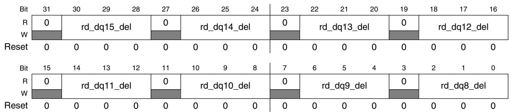

MMDC_MPRDDQBY1DL field descriptions   

<table><tr><td>Field</td><td>Description</td></tr><tr><td>31Reserved</td><td>This read-only field is reserved and always has the value 0.</td></tr><tr><td>30-28rd_dq15_del</td><td>Read dq51 to dq15 delay fine-tuning. This field holds the number of delay units that are added to dq15 relative to dq51.000 No change in dq15 delay001 Add dq15 delay of 1 delay unit010 Add dq15 delay of 2 delay units.011 Add dq15 delay of 3 delay units.100 Add dq15 delay of 4 delay units.101 Add dq15 delay of 5 delay units.110 Add dq15 delay of 6 delay units.111 Add dq15 delay of 7 delay units.</td></tr><tr><td>27Reserved</td><td>This read-only field is reserved and always has the value 0.</td></tr><tr><td>26-24rd_dq14_del</td><td>Read dq51 to dq14 delay fine-tuning. This field holds the number of delay units that are added to dq14 relative to dq51.000 No change in dq14 delay001 Add dq14 delay of 1 delay unit010 Add dq14 delay of 2 delay units.011 Add dq14 delay of 3 delay units.100 Add dq14 delay of 4 delay units.101 Add dq14 delay of 5 delay units.110 Add dq14 delay of 6 delay units.111 Add dq14 delay of 7 delay units.</td></tr><tr><td>23Reserved</td><td>This read-only field is reserved and always has the value 0.</td></tr><tr><td>22-20rd_dq13_del</td><td>Read dq51 to dq13 delay fine-tuning. This field holds the number of delay units that are added to dq13 relative to dq51.000 No change in dq13 delay001 Add dq13 delay of 1 delay unit010 Add dq13 delay of 2 delay units.011 Add dq13 delay of 3 delay units.100 Add dq13 delay of 4 delay units.101 Add dq13 delay of 5 delay units.110 Add dq13 delay of 6 delay units.111 Add dq13 delay of 7 delay units.</td></tr><tr><td>19Reserved</td><td>This read-only field is reserved and always has the value 0.</td></tr><tr><td>18-16rd_dq12_del</td><td>Read dq51 to dq12 delay fine-tuning. This field holds the number of delay units that are added to dq12 relative to dq51.000 No change in dq12 delay001 Add dq12 delay of 1 delay unit010 Add dq12 delay of 2 delay units.011 Add dq12 delay of 3 delay units.100 Add dq12 delay of 4 delay units.101 Add dq12 delay of 5 delay units.110 Add dq12 delay of 6 delay units.111 Add dq12 delay of 7 delay units.</td></tr><tr><td>15Reserved</td><td>This read-only field is reserved and always has the value 0.</td></tr><tr><td>14-12rd_dq11_del</td><td>Read dq51 to dq11 delay fine-tuning. This field holds the number of delay units that are added to dq11 relative to dq51.000 No change in dq11 delay001 Add dq11 delay of 1 delay unit010 Add dq11 delay of 2 delay units.011 Add dq11 delay of 3 delay units.100 Add dq11 delay of 4 delay units.101 Add dq11 delay of 5 delay units.110 Add dq11 delay of 6 delay units.111 Add dq11 delay of 7 delay units.</td></tr><tr><td>11Reserved</td><td>This read-only field is reserved and always has the value 0.</td></tr><tr><td>10-8rd_dq10_del</td><td>Read dq51 to dq10 delay fine-tuning. This field holds the number of delay units that are added to dq10 relative to dq51.000 No change in dq10 delay001 Add dq10 delay of 1 delay unit010 Add dq10 delay of 2 delay units.011 Add dq10 delay of 3 delay units.</td></tr><tr><td></td><td>100 Add dq10 delay of 4 delay units.</td></tr><tr><td></td><td>101 Add dq10 delay of 5 delay unit</td></tr><tr><td></td><td>110 Add dq10 delay of 6 delay units.</td></tr><tr><td></td><td>111 Add dq10 delay of 7 delay units.</td></tr><tr><td>7 Reserved</td><td>This read-only field is reserved and always has the value 0.</td></tr><tr><td>6-4 rd_dq9_del</td><td>Read dq51 to dq9 delay fine-tuning. This field holds the number of delay units that are added to dq9 relative to dq51.</td></tr><tr><td></td><td>000 No change in dq9 delay</td></tr><tr><td></td><td>001 Add dq9 delay of 1 delay unit</td></tr><tr><td></td><td>010 Add dq9 delay of 2 delay units.</td></tr><tr><td></td><td>011 Add dq9 delay of 3 delay units.</td></tr><tr><td></td><td>100 Add dq9 delay of 4 delay units.</td></tr><tr><td></td><td>101 Add dq9 delay of 5 delay units.</td></tr><tr><td></td><td>110 Add dq9 delay of 6 delay units.</td></tr><tr><td></td><td>111 Add dq9 delay of 7 delay units.</td></tr><tr><td>3 Reserved</td><td>This read-only field is reserved and always has the value 0.</td></tr><tr><td>rd_dq8_del</td><td>Read dq51 to dq8 delay fine-tuning. This field holds the number of delay units that are added to dq8 relative to dq51.</td></tr><tr><td></td><td>000 No change in dq8 delay</td></tr><tr><td></td><td>001 Add dq8 delay of 1 delay unit</td></tr><tr><td></td><td>010 Add dq8 delay of 2 delay units.</td></tr><tr><td></td><td>011 Add dq8 delay of 3 delay units.</td></tr><tr><td></td><td>100 Add dq8 delay of 4 delay units.</td></tr><tr><td></td><td>101 Add dq8 delay of 5 delay units.</td></tr><tr><td></td><td>110 Add dq8 delay of 6 delay units.</td></tr><tr><td></td><td>111 Add dq8 delay of 7 delay units.</td></tr></table>

# 35.12.40 MMDC PHY Write DQ Byte0 Delay Register (MMDC_MPWRDQBY0DL)

This register is used to add fine-tuning adjustment to every bit in the write DQ byte0 relative to the write DQS

Address: 21B_0000h base $^ +$ 82Ch offset $=$ 21B_082Ch

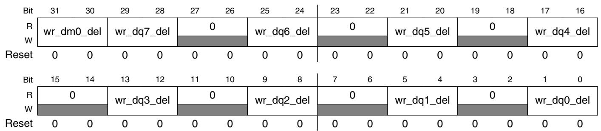

MMDC_MPWRDQBY0DL field descriptions   

<table><tr><td>Field</td><td>Description</td></tr><tr><td rowspan="5">31-30 wr_dm0_del</td><td>Write dm0 delay fine-tuning. This field holds the number of delay units that are added to dm0 relative to dqso.</td></tr><tr><td>00 No change in dm0 delay</td></tr><tr><td>01 Add dm0 delay of 1 delay unit.</td></tr><tr><td>10 Add dm0 delay of 2 delay units.</td></tr><tr><td>11 Add dm0 delay of 3 delay units.</td></tr><tr><td rowspan="5">29-28 wr_dq7_del</td><td>Write dq7 delay fine-tuning. This field holds the number of delay units that are added to dq7 relative to dqso.</td></tr><tr><td>00 No change in dq7 delay</td></tr><tr><td>01 Add dq7 delay of 1 delay unit.</td></tr><tr><td>10 Add dq7 delay of 2 delay units.</td></tr><tr><td>11 Add dq7 delay of 3 delay units.</td></tr><tr><td>27-26 Reserved</td><td>This read-only field is reserved and always has the value 0.</td></tr><tr><td rowspan="5">25-24 wr_dq6_del</td><td>Write dq6 delay fine-tuning. This field holds the number of delay units that are added to dq6 relative to dqso.</td></tr><tr><td>00 No change in dq6 delay</td></tr><tr><td>01 Add dq6 delay of 1 delay unit.</td></tr><tr><td>10 Add dq6 delay of 2 delay units.</td></tr><tr><td>11 Add dq6 delay of 3 delay units.</td></tr><tr><td>23-22 Reserved</td><td>This read-only field is reserved and always has the value 0.</td></tr><tr><td>21-20 wr_dq5_del</td><td>Write dq5 delay fine-tuning. This field holds the number of delay units that are added to dq5 relative to dqso.</td></tr></table>

Table continues on the next page...

i.MX 6ULL Applications Processor Reference Manual, Rev. 1, 11/2017

MMDC_MPWRDQBY0DL field descriptions (continued)   

<table><tr><td>Field</td><td>Description</td></tr><tr><td></td><td>00 No change in dq5 delay</td></tr><tr><td></td><td>01 Add dq5 delay of 1 delay unit.</td></tr><tr><td></td><td>10 Add dq5 delay of 2 delay units.</td></tr><tr><td></td><td>11 Add dq5 delay of 3 delay units.</td></tr><tr><td>19-18Reserved</td><td>This read-only field is reserved and always has the value 0.</td></tr><tr><td>17-16wr_dq4_del</td><td>Write dq4 delay fine-tuning. This field holds the number of delay units that are added to dq4 relative to dqso.</td></tr><tr><td></td><td>00 No change in dq4 delay</td></tr><tr><td></td><td>01 Add dq4 delay of 1 delay unit..</td></tr><tr><td></td><td>10 Add dq4 delay of 2 delay units.</td></tr><tr><td></td><td>11 Add dq4 delay of 3 delay units.</td></tr><tr><td>15-14Reserved</td><td>This read-only field is reserved and always has the value 0.</td></tr><tr><td>13-12wr_dq3_del</td><td>Write dq3 delay fine-tuning. This field holds the number of delay units that are added to dq3 relative to dqso.</td></tr><tr><td></td><td>00 No change in dq3 delay</td></tr><tr><td></td><td>01 Add dq3 delay of 1 delay unit.</td></tr><tr><td></td><td>10 Add dq3 delay of 2 delay units.</td></tr><tr><td></td><td>11 Add dq3 delay of 3 delay units.</td></tr><tr><td>11-10Reserved</td><td>This read-only field is reserved and always has the value 0.</td></tr><tr><td>9-8wr_dq2_del</td><td>Write dq2 delay fine-tuning. This field holds the number of delay units that are added to dq2 relative to dqso.</td></tr><tr><td></td><td>00 No change in dq2 delay</td></tr><tr><td></td><td>01 Add dq2 delay of 1 delay unit.</td></tr><tr><td></td><td>10 Add dq2 delay of 2 delay units.</td></tr><tr><td></td><td>11 Add dq2 delay of 3 delay units.</td></tr><tr><td>7-6Reserved</td><td>This read-only field is reserved and always has the value 0.</td></tr><tr><td>5-4wr_dq1_del</td><td>Write dq1 delay fine-tuning. This field holds the number of delay units that are added to dq1 relative to dqso.</td></tr><tr><td></td><td>00 No change in dq1 delay</td></tr><tr><td></td><td>01 Add dq1 delay of 1 delay unit.</td></tr><tr><td></td><td>10 Add dq1 delay of 2 delay units.</td></tr><tr><td></td><td>11 Add dq1 delay of 3 delay units.</td></tr><tr><td>3-2Reserved</td><td>This read-only field is reserved and always has the value 0.</td></tr><tr><td>wr_dq0_del</td><td>Write dq0 delay fine-tuning. This field holds the number of delay units that are added to dq0 relative to dqso.</td></tr><tr><td></td><td>00 No change in dq0 delay</td></tr><tr><td></td><td>01 Add dq0 delay of 1 delay unit.</td></tr><tr><td></td><td>10 Add dq0 delay of 2 delay units.</td></tr><tr><td></td><td>11 Add dq0 delay of 3 delay units.</td></tr></table>

# 35.12.41 MMDC PHY Write DQ Byte1 Delay Register (MMDC_MPWRDQBY1DL)

This register is used to add fine-tuning adjustment to every bit in the write DQ byte1 relative to the write DQS

Address: 21B_0000h base $^ +$ 830h offset $=$ 21B_0830h

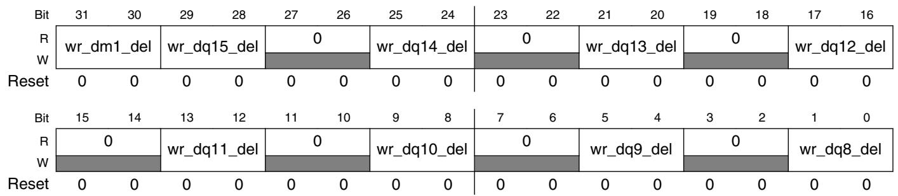

MMDC_MPWRDQBY1DL field descriptions   

<table><tr><td>Field</td><td>Description</td></tr><tr><td rowspan="5">31-30 wr_dm1_del</td><td>Write dm1 delay fine-tuning. This field holds the number of delay units that are added to dm1 relative to dqs1.</td></tr><tr><td>00 No change in dm1 delay</td></tr><tr><td>01 Add dm1 delay of 1 delay unit.</td></tr><tr><td>10 Add dm1 delay of 2 delay units.</td></tr><tr><td>11 Add dm1 delay of 3 delay units.</td></tr><tr><td rowspan="5">29-28 wr_dq15_del</td><td>Write dq15 delay fine-tuning. This field holds the number of delay units that are added to dq15 relative to dqs1.</td></tr><tr><td>00 No change in dq15 delay</td></tr><tr><td>01 Add dq15 delay of 1 delay unit.</td></tr><tr><td>10 Add dq15 delay of 2 delay units.</td></tr><tr><td>11 Add dq15 delay of 3 delay units.</td></tr><tr><td>27-26 Reserved</td><td>This read-only field is reserved and always has the value 0.</td></tr><tr><td rowspan="2">25-24 wr_dq14_del</td><td>Write dq14 delay fine-tuning. This field holds the number of delay units that are added to dq14 relative to dqs1.</td></tr><tr><td>00 No change in dq14 delay</td></tr></table>

Table continues on the next page...

i.MX 6ULL Applications Processor Reference Manual, Rev. 1, 11/2017

MMDC_MPWRDQBY1DL field descriptions (continued)   

<table><tr><td>Field</td><td>Description</td></tr><tr><td></td><td>01 Add dq14 delay of 1 delay unit.</td></tr><tr><td></td><td>10 Add dq14 delay of 2 delay units.</td></tr><tr><td></td><td>11 Add dq14 delay of 3 delay units.</td></tr><tr><td>23-22Reserved</td><td>This read-only field is reserved and always has the value 0.</td></tr><tr><td>21-20wr_dq13_del</td><td>Write dq13 delay fine-tuning. This field holds the number of delay units that are added to dq13 relative to dqs1.</td></tr><tr><td></td><td>00 No change in dq13 delay</td></tr><tr><td></td><td>01 Add dq13 delay of 1 delay unit.</td></tr><tr><td></td><td>10 Add dq13 delay of 2 delay units.</td></tr><tr><td></td><td>11 Add dq13 delay of 3 delay units.</td></tr><tr><td>19-18Reserved</td><td>This read-only field is reserved and always has the value 0.</td></tr><tr><td>17-16wr_dq12_del</td><td>Write dq12 delay fine-tuning. This field holds the number of delay units that are added to dq12 relative to dqs1.</td></tr><tr><td></td><td>00 No change in dq12 delay</td></tr><tr><td></td><td>01 Add dq12 delay of 1 delay unit.</td></tr><tr><td></td><td>10 Add dq12 delay of 2 delay units.</td></tr><tr><td></td><td>11 Add dq12 delay of 3 delay units.</td></tr><tr><td>15-14Reserved</td><td>This read-only field is reserved and always has the value 0.</td></tr><tr><td>13-12wr_dq11_del</td><td>Write dq11 delay fine-tuning. This field holds the number of delay units that are added to dq11 relative to dqs1.</td></tr><tr><td></td><td>00 No change in dq11 delay</td></tr><tr><td></td><td>01 Add dq11 delay of 1 delay unit.</td></tr><tr><td></td><td>10 Add dq11 delay of 2 delay units.</td></tr><tr><td></td><td>11 Add dq11 delay of 3 delay units.</td></tr><tr><td>11-10Reserved</td><td>This read-only field is reserved and always has the value 0.</td></tr><tr><td>9-8wr_dq10_del</td><td>Write dq10 delay fine-tuning. This field holds the number of delay units that are added to dq10 relative to dqs1.</td></tr><tr><td></td><td>00 No change in dq10 delay</td></tr><tr><td></td><td>01 Add dq10 delay of 1 delay unit.</td></tr><tr><td></td><td>10 Add dq10 delay of 2 delay units.</td></tr><tr><td></td><td>11 Add dq10 delay of 3 delay units.</td></tr><tr><td>7-6Reserved</td><td>This read-only field is reserved and always has the value 0.</td></tr><tr><td>5-4wr_dq9_del</td><td>Write dq9 delay fine-tuning. This field holds the number of delay units that are added to dq9 relative to dqs1.</td></tr><tr><td></td><td>00 No change in dq9 delay</td></tr><tr><td></td><td>01 Add dq9 delay of 1 delay unit.</td></tr><tr><td></td><td>10 Add dq9 delay of 2 delay units.</td></tr><tr><td></td><td>11 Add dq9 delay of 3 delay units.</td></tr><tr><td>3-2 Reserved</td><td>This read-only field is reserved and always has the value 0.</td></tr><tr><td>wr_dq8_del</td><td>Write dq8 delay fine-tuning. This field holds the number of delay units that are added to dq8 relative to dqs1.00 No change in dq8 delay01 Add dq8 delay of 1 delay unit.10 Add dq8 delay of 2 delay units.11 Add dq8 delay of 3 delay units.</td></tr></table>

# 35.12.42 MMDC PHY Write DQ Byte2 Delay Register (MMDC_MPWRDQBY2DL)

This register is used to add fine-tuning adjustment to every bit in the write DQ byte2 relative to the write DQS

Address: 21B_0000h base $^ +$ 834h offset $=$ 21B_0834h

MMDC_MPWRDQBY2DL field descriptions   

<table><tr><td>Field</td><td>Description</td></tr><tr><td>31-30 wr_dm2_del</td><td>Write dm2 delay fine-tuning. This field holds the number of delay units that are added to dm2 relative to dqs2.</td></tr><tr><td></td><td>00 No change in dm2 delay</td></tr><tr><td></td><td>01 Add dm2 delay of 1 delay unit.</td></tr><tr><td></td><td>10 Add dm2 delay of 2 delay units.</td></tr><tr><td></td><td>11 Add dm2 delay of 3 delay units.</td></tr><tr><td>29-28 wr_dq23_del</td><td>Write dq23 delay fine tuning. This field holds the number of delay units that are added to dq23 relative to dqs2.</td></tr><tr><td></td><td>00 No change in dq23 delay</td></tr><tr><td></td><td>01 Add dq23 delay of 1 delay unit.</td></tr></table>

Table continues on the next page...

i.MX 6ULL Applications Processor Reference Manual, Rev. 1, 11/2017

MMDC_MPWRDQBY2DL field descriptions (continued)   

<table><tr><td>Field</td><td>Description</td></tr><tr><td></td><td>10 Add dq23 delay of 2 delay units.</td></tr><tr><td></td><td>11 Add dq23 delay of 3 delay units.</td></tr><tr><td>27-26Reserved</td><td>This read-only field is reserved and always has the value 0.</td></tr><tr><td>25-24wr_dq22_del</td><td>Write dq22 delay fine tuning. This field holds the number of delay units that are added to dq22 relative to dq2.</td></tr><tr><td></td><td>00 No change in dq22 delay</td></tr><tr><td></td><td>01 Add dq22 delay of 1 delay unit.</td></tr><tr><td></td><td>10 Add dq22 delay of 2 delay units.</td></tr><tr><td></td><td>11 Add dq22 delay of 3 delay units.</td></tr><tr><td>23-22Reserved</td><td>This read-only field is reserved and always has the value 0.</td></tr><tr><td>21-20wr_dq21_del</td><td>Write dq21 delay fine tuning. This field holds the number of delay units that are added to dq21 relative to dq2.</td></tr><tr><td></td><td>00 No change in dq21 delay</td></tr><tr><td></td><td>01 Add dq21 delay of 1 delay unit.</td></tr><tr><td></td><td>10 Add dq21 delay of 2 delay units.</td></tr><tr><td></td><td>11 Add dq21 delay of 3 delay units.</td></tr><tr><td>19-18Reserved</td><td>This read-only field is reserved and always has the value 0.</td></tr><tr><td>17-16wr_dq20_del</td><td>Write dq20 delay fine tuning. This field holds the number of delay units that are added to dq20 relative to dq2.</td></tr><tr><td></td><td>00 No change in dq20 delay</td></tr><tr><td></td><td>01 Add dq20 delay of 1 delay unit.</td></tr><tr><td></td><td>10 Add dq20 delay of 2 delay units.</td></tr><tr><td></td><td>11 Add dq20 delay of 3 delay units.</td></tr><tr><td>15-14Reserved</td><td>This read-only field is reserved and always has the value 0.</td></tr><tr><td>13-12wr_dq19_del</td><td>Write dq19 delay fine tuning. This field holds the number of delay units that are added to dq19 relative to dq2.</td></tr><tr><td></td><td>00 No change in dq19 delay</td></tr><tr><td></td><td>01 Add dq19 delay of 1 delay unit.</td></tr><tr><td></td><td>10 Add dq19 delay of 2 delay units.</td></tr><tr><td></td><td>11 Add dq19 delay of 3 delay units.</td></tr><tr><td>11-10Reserved</td><td>This read-only field is reserved and always has the value 0.</td></tr><tr><td>9-8wr_dq18_del</td><td>Write dq18 delay fine tuning. This field holds the number of delay units that are added to dq18 relative to dq2.</td></tr><tr><td></td><td>00 No change in dq18 delay</td></tr><tr><td></td><td>01 Add dq18 delay of 1 delay unit.</td></tr><tr><td></td><td>10 Add dq18 delay of 2 delay units.</td></tr><tr><td></td><td>11 Add dq18 delay of 3 delay units.</td></tr><tr><td>7-6 
Reserved</td><td>This read-only field is reserved and always has the value 0.</td></tr><tr><td rowspan="5">5-4 
wr_dq17_del</td><td>Write dq17 delay fine tuning. This field holds the number of delay units that are added to dq17 relative to dqs2.</td></tr><tr><td>00 No change in dq17 delay</td></tr><tr><td>01 Add dq17 delay of 1 delay unit.</td></tr><tr><td>10 Add dq17 delay of 2 delay units.</td></tr><tr><td>11 Add dq17 delay of 3 delay units.</td></tr><tr><td>3-2 
Reserved</td><td>This read-only field is reserved and always has the value 0.</td></tr><tr><td rowspan="5">wr_dq16_del</td><td>Write dq16 delay fine tuning. This field holds the number of delay units that are added to dq16 relative to dqs2.</td></tr><tr><td>00 No change in dq16 delay</td></tr><tr><td>01 Add dq16 delay of 1 delay unit.</td></tr><tr><td>10 Add dq16 delay of 2 delay units.</td></tr><tr><td>11 Add dq16 delay of 3 delay units.</td></tr></table>

# 35.12.43 MMDC PHY Write DQ Byte3 Delay Register (MMDC_MPWRDQBY3DL)

This register is used to add fine-tuning adjustment to every bit in the write DQ byte3 relative to the write DQS

Address: 21B_0000h base $^ +$ 838h offset $=$ 21B_0838h

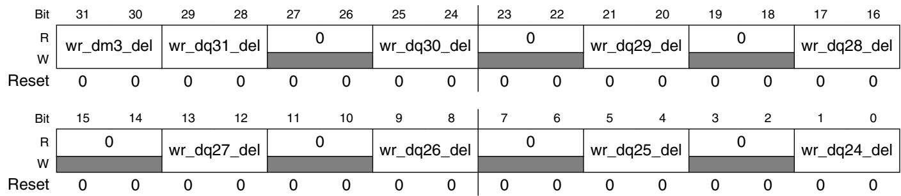

MMDC_MPWRDQBY3DL field descriptions   

<table><tr><td>Field</td><td>Description</td></tr><tr><td>31-30
wr_dm3_del</td><td>Write dm3 delay fine tuning. This field holds the number of delay units that are added to dm3 relative to dqs3.
00 No change in dm3 delay
01 Add dm3 delay of 1 delay unit.</td></tr></table>

Table continues on the next page...

i.MX 6ULL Applications Processor Reference Manual, Rev. 1, 11/2017

MMDC_MPWRDQBY3DL field descriptions (continued)   

<table><tr><td>Field</td><td>Description</td></tr><tr><td></td><td>10 Add dm3 delay of 2 delay units.</td></tr><tr><td></td><td>11 Add dm3 delay of 3 delay units.</td></tr><tr><td>29-28 wr_dq31_del</td><td>Write dq31 delay fine tuning. This field holds the number of delay units that are added to dq31 relative to dq3.</td></tr><tr><td></td><td>00 No change in dq31 delay</td></tr><tr><td></td><td>01 Add dq31 delay of 1 delay unit.</td></tr><tr><td></td><td>10 Add dq31 delay of 2 delay units.</td></tr><tr><td></td><td>11 Add dq31 delay of 3 delay units.</td></tr><tr><td>27-26 Reserved</td><td>This read-only field is reserved and always has the value 0.</td></tr><tr><td>25-24 wr_dq30_del</td><td>Write dq30 delay fine tuning. This field holds the number of delay units that are added to dq30 relative to dq3.</td></tr><tr><td></td><td>00 No change in dq30 delay</td></tr><tr><td></td><td>01 Add dq30 delay of 1 delay unit.</td></tr><tr><td></td><td>10 Add dq30 delay of 2 delay units.</td></tr><tr><td></td><td>11 Add dq30 delay of 3 delay units.</td></tr><tr><td>23-22 Reserved</td><td>This read-only field is reserved and always has the value 0.</td></tr><tr><td>21-20 wr_dq29_del</td><td>Write dq29 delay fine tuning. This field holds the number of delay units that are added to dq29 relative to dq3.</td></tr><tr><td></td><td>00 No change in dq29 delay</td></tr><tr><td></td><td>01 Add dq29 delay of 1 delay unit.</td></tr><tr><td></td><td>10 Add dq29 delay of 2 delay units.</td></tr><tr><td></td><td>11 Add dq29 delay of 3 delay units.</td></tr><tr><td>19-18 Reserved</td><td>This read-only field is reserved and always has the value 0.</td></tr><tr><td>17-16 wr_dq28_del</td><td>Write dq28 delay fine tuning. This field holds the number of delay units that are added to dq28 relative to dq3.</td></tr><tr><td></td><td>00 No change in dq28 delay</td></tr><tr><td></td><td>01 Add dq28 delay of 1 delay unit.</td></tr><tr><td></td><td>10 Add dq28 delay of 2 delay units.</td></tr><tr><td></td><td>11 Add dq28 delay of 3 delay units.</td></tr><tr><td>15-14 Reserved</td><td>This read-only field is reserved and always has the value 0.</td></tr><tr><td>13-12 wr_dq27_del</td><td>Write dq27 delay fine tuning. This field holds the number of delay units that are added to dq27 relative to dq3.</td></tr><tr><td></td><td>00 No change in dq27 delay</td></tr><tr><td></td><td>01 Add dq27 delay of 1 delay unit.</td></tr><tr><td></td><td>10 Add dq27 delay of 2 delay units.</td></tr><tr><td></td><td>11 Add dq27 delay of 3 delay units.</td></tr><tr><td>11-10 Reserved</td><td>This read-only field is reserved and always has the value 0.</td></tr><tr><td>9-8 wr_dq26_del</td><td>Write dq26 delay fine tuning. This field holds the number of delay units that are added to dq26 relative to dqs3.00 No change in dq26 delay01 Add dq26 delay of 1 delay unit.10 Add dq26 delay of 2 delay units.11 Add dq26 delay of 3 delay units.</td></tr><tr><td>7-6 Reserved</td><td>This read-only field is reserved and always has the value 0.</td></tr><tr><td>5-4 wr_dq25_del</td><td>Write dq25 delay fine tuning. This field holds the number of delay units that are added to dq25 relative to dqs3.00 No change in dq25 delay01 Add dq25 delay of 1 delay unit.10 Add dq25 delay of 2 delay units.11 Add dq25 delay of 3 delay units.</td></tr><tr><td>3-2 Reserved</td><td>This read-only field is reserved and always has the value 0.</td></tr><tr><td>wr_dq24_del</td><td>Write dq24 delay fine tuning. This field holds the number of delay units that are added to dq24 relative to dqs3.00 No change in dq24 delay01 Add dq24 delay of 1 delay unit.10 Add dq24 delay of 2 delay units.11 Add dq24 delay of 3 delay units.</td></tr></table>

# 35.12.44 MMDC PHY Read DQS Gating Control Register 0 (MMDC_MPDGCTRL0)

Address: 21B_0000h base $^ +$ 83Ch offset $=$ 21B_083Ch

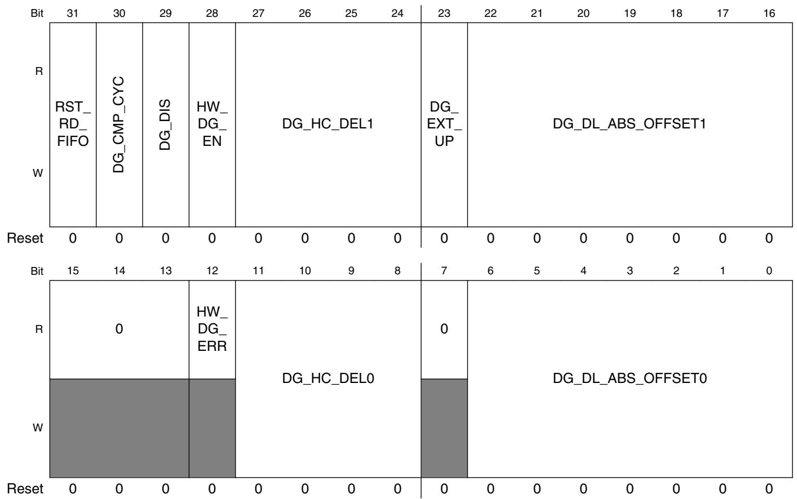

MMDC_MPDGCTRL0 field descriptions   

<table><tr><td>Field</td><td>Description</td></tr><tr><td>31RST_RD_FIFO</td><td>Reset Read Data FIFO and associated pointers. If this bit is asserted then the MMDC resets the read data FIFO and the associated pointers. This bit is self cleared after the FIFO reset is done.</td></tr><tr><td>30DG_CMP_CYC</td><td>Read DQS gating sample cycle. If this bit is asserted then the MMDC waits 32 cycles before comparing the read data, Otherwise it waits 16 DDR cycles.0 MMDC waits 16 DDR cycles1 MMDC waits 32 DDR cycles</td></tr><tr><td>29DG_DIS</td><td>Read DQS gating disable. If this bit is asserted then the MMDC disables the read DQS gating mechanism. If this bits is asserted (read DQS gating is disabled) then pull-up and pull-down resistors suppose to be used on DQS and DQS# respectively0 Read DQS gating mechanism is enabled1 Read DQS gating mechanism is disabled</td></tr><tr><td>28HW_DG_EN</td><td>Enable automatic read DQS gating calibration. If this bit is asserted then the MMDC performs automatic read DQS gating calibration. HW negates this bit upon completion of the automatic read DQS gating.</td></tr></table>

Table continues on the next page...

i.MX 6ULL Applications Processor Reference Manual, Rev. 1, 11/2017

MMDC_MPDGCTRL0 field descriptions (continued)   

<table><tr><td>Field</td><td>Description</td></tr><tr><td></td><td>NOTE: Before issuing the first read command the MMDC counts 12 cycles.
In LPDDR2 mode automatic (HW) read DQS gating should be disabled and Pull-up/pull-down resistors on DQS/DQS# should be enabled while ODT resistors must be disconnected.
0 Disable automatic read DQS gating calibration
1 Start automatic read DQS gating calibration</td></tr><tr><td>27-24
DG_HC_DEL1</td><td>Read DQS gating half cycles delay for Byte1.
This field indicates the delay in half cycles between read DQS gate and the middle of the read DQS preamble of Byte1. This delay is added to the delay that is generated by the read DQS1 gating delay-line, So the total read DQS gating delay is (DG_HC_DEL#)*0.5*cycle + (DG_DL_ABS_OFFSET#)*1/256*cycle Upon completion of the automatic read DQS gating calibration this field gets the value of the 4 MSB of ((HW_DG_LOW1 + HW_DG_UP1) /2).
0000 0 cycles delay.
0001 Half cycle delay.
0010 1 cycle delay
1101 6.5 cycles delay
1110 Reserved
1111 Reserved</td></tr><tr><td>23
DG_EXT_UP</td><td>DG extend upper boundary. By default the upper boundary of DQS gating HW calibration is set according to first failing comparison after at least one passing comparison. If this bit is asserted then the upper boundary is set according to the last passing comparison.</td></tr><tr><td>22-16
DG_DL_ABS_
OFFSET1</td><td>Absolute read DQS gating delay offset for Byte1. This field indicates the absolute delay between read DQS gate and the middle of the read DQS preamble of Byte1 with fractions of a clock period and up to half cycle. The fraction is process and frequency independent. The delay of the delay-line would be (DG_DL_ABS_OFFSET1 / 256)* MMDC AXI clock (fast clock).
This field can also bit written by HW. Upon completion of the automatic read DQS gating calibration this field gets the value of the 7 LSB of ((HW_DG_LOW1 + HW_DG_UP1) /2).
NOTE: Not all changes will have effect on the actual delay. If the requested change is smaller than the delay-line resolution, then no change will occur.</td></tr><tr><td>15-13
Reserved</td><td>This read-only field is reserved and always has the value 0.</td></tr><tr><td>12
HW_DG_ERR</td><td>HW DQS gating error. This bit valid is asserted when an error was found during the read DQS gating HW calibration process. Error can occur when no valid value was found during HW calibration.
This bit is valid only after HW_DG_EN is de-asserted.
0 No error was found during the DQS gating HW calibration process.
1 An error was found during the DQS gating HW calibration process.</td></tr><tr><td>11-8
DG_HC_DEL0</td><td>Read DQS gating half cycles delay for Byte0.
. This field indicates the delay in half cycles between read DQS gate and the middle of the read DQS preamble of Byte0/4. This delay is added to the delay that is generated by the read DQS1 gating delay-line, So the total read DQS gating delay is (DG_HC_DEL#)*0.5*cycle + (DG_DL_ABS_OFFSET#)*1/256*cycle Upon completion of the automatic read DQS gating calibration this field gets the value of the 4 MSB of ((HW_DG_LOW1 + HW_DG_UP1) /2).
0000 2 cycles delay.
0001 Half cycle delay.</td></tr></table>

Table continues on the next page...

i.MX 6ULL Applications Processor Reference Manual, Rev. 1, 11/2017

MMDC_MPDGCTRL0 field descriptions (continued)   

<table><tr><td>Field</td><td>Description</td></tr><tr><td></td><td>0010 1 cycle delay</td></tr><tr><td></td><td>1101 6.5 cycles delay</td></tr><tr><td></td><td>1110 Reserved</td></tr><tr><td></td><td>1111 Reserved</td></tr><tr><td>7 Reserved</td><td>This read-only field is reserved and always has the value 0.</td></tr><tr><td>DG_DL_ABS_OFFSET0</td><td>Absolute read DQS gating delay offset for Byte0. This field indicates the absolute delay between read DQS gate and the middle of the read DQS preamble of Byte0 with fractions of a clock period and up to half cycle. The fraction is process and frequency independent. The delay of the delay-line would be (DG_DL_ABS_OFFSET0 / 256)* MMDC AXI clock (fast clock).This field can also bit written by HW. Upon completion of the automatic read DQS gating calibration this field gets the value of the 7 LSB of ((HW_DG_LOW0 + HW_DG_UP0) /2).NOTE: Not all changes will have effect on the actual delay. If the requested change is smaller than the delay-line resolution, then no change will occur.</td></tr></table>

# 35.12.45 MMDC PHY Read DQS Gating Control Register 1 (MMDC_MPDGCTRL1)

Address: 21B_0000h base $^ +$ 840h offset $=$ 21B_0840h

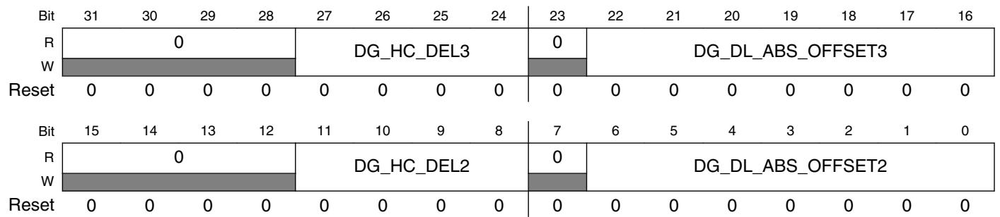

MMDC_MPDGCTRL1 field descriptions   

<table><tr><td>Field</td><td>Description</td></tr><tr><td>31-28Reserved</td><td>This read-only field is reserved and always has the value 0 .</td></tr><tr><td>27-24DG_HC_DEL3</td><td>Read DQS gating half cycles delay for Byte3. This field indicates the delay in half cycles between read DQS gate and the middle of the read DQS preamble of Byte3/7. This delay is added to the delay that is generated by the read DQS1 gating delay-line, So the total read DQS gating delay is (DG_HC_DEL#)*0.5*cycle + (DG_DL_ABS_OFFSET#)*1/256*cycleUpon completion of the automatic read DQS gating calibration this field gets the value of the 4 MSB of ((HW_DG_LOW3 + HW_DG_UP3) /2).0000 0 cycles delay.0001 Half cycle delay.</td></tr></table>

Table continues on the next page...

i.MX 6ULL Applications Processor Reference Manual, Rev. 1, 11/2017

MMDC_MPDGCTRL1 field descriptions (continued)   

<table><tr><td>Field</td><td>Description</td></tr><tr><td></td><td>0010 1 cycle delay</td></tr><tr><td></td><td>1101 6.5 cycles delay</td></tr><tr><td></td><td>1110 Reserved</td></tr><tr><td></td><td>1111 Reserved</td></tr><tr><td>23Reserved</td><td>This read-only field is reserved and always has the value 0.</td></tr><tr><td>22-16DG_DL_ABS_OFFSET3</td><td>Absolute read DQS gating delay offset for Byte3. This field indicates the absolute delay between read DQS gate and the middle of the read DQS preamble of Byte3 with fractions of a clock period and up to half cycle. The fraction is process and frequency independent. The delay of the delay-line would be (DG_DL_ABS_OFFSET3 / 256)* MMDC AXI clock (fast clock).This field can also bit written by HW. Upon completion of the automatic read DQS gating calibration this field gets the value of the 7 LSB of ((HW_DG_LOW3 + HW_DG_UP3) /2).NOTE: Not all changes will have effect on the actual delay. If the requested change is smaller than the delay-line resolution, then no change will occur.</td></tr><tr><td>15-12Reserved</td><td>This read-only field is reserved and always has the value 0.</td></tr><tr><td>11-8DG_GC_DEL2</td><td>Read DQS gating half cycles delay for Byte2. This field indicates the delay in half cycles between read DQS gate and the middle of the read DQS preamble of Byte2/5. This delay is added to the delay that is generated by the read DQS1 gating delay-line, So the total read DQS gating delay is (DG_GC_DEL#)*0.5*cycle + (DG_DL_ABS_OFFSET#)*1/256*cycleUpon completion of the automatic read DQS gating calibration this field gets the value of the 4 MSB of ((HW_DG_LOW2 + HW_DG_UP2) /2).0000 0 cycles delay.0001 Half cycle delay.0010 1 cycle delay1101 6.5 cycles delay1110 Reserved1111 Reserved</td></tr><tr><td>7Reserved</td><td>This read-only field is reserved and always has the value 0.</td></tr><tr><td>DG_DL_ABS_OFFSET2</td><td>Absolute read DQS gating delay offset for Byte2. This field indicates the absolute delay between read DQS gate and the middle of the read DQS preamble of Byte2 with fractions of a clock period and up to half cycle. The fraction is process and frequency independent. The delay of the delay-line would be (DG_DL_ABS_OFFSET2 / 256)* MMDC AXI clock (fast clock).This field can also bit written by HW. Upon completion of the automatic read DQS gating calibration this field gets the value of the 7 LSB of ((HW_DG_LOW2 + HW_DG_UP2) /2).NOTE: Not all changes will have effect on the actual delay. If the requested change is smaller than the delay-line resolution, then no change will occur.</td></tr></table>

# 35.12.46 MMDC PHY Read DQS Gating delay-line Status Register (MMDC_MPDGDLST0)

This register holds the status of the 4 dqs gating delay-lines.

Address: 21B_0000h base + 844h offset $=$ 21B_0844h

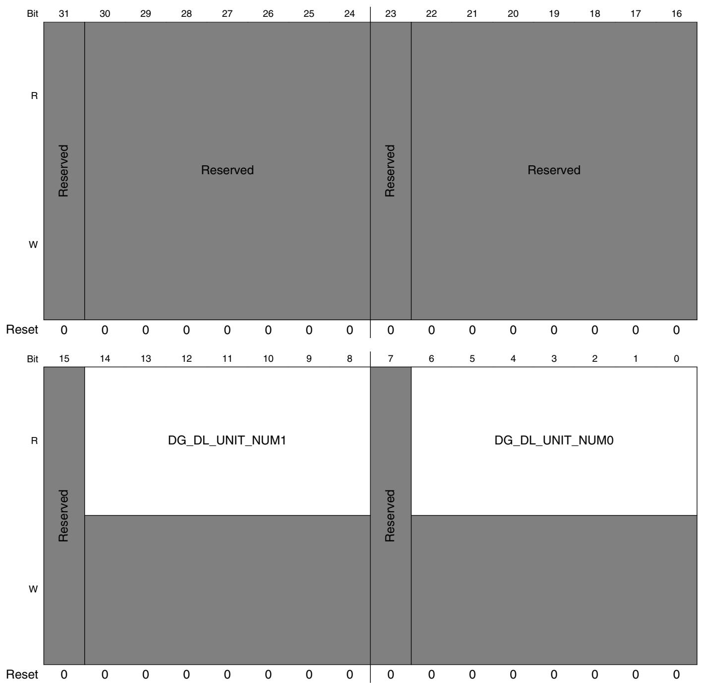

i.MX 6ULL Applications Processor Reference Manual, Rev. 1, 11/2017

MMDC_MPDGDLST0 field descriptions   

<table><tr><td>Field</td><td>Description</td></tr><tr><td>31</td><td>This field is reserved. 
Reserved</td></tr><tr><td>30-24</td><td rowspan="2">This field is reserved. 
Reserved</td></tr><tr><td>-</td></tr><tr><td>23</td><td rowspan="2">This field is reserved. 
Reserved</td></tr><tr><td>-</td></tr><tr><td>22-16</td><td rowspan="2">This field is reserved. 
Reserved</td></tr><tr><td>-</td></tr><tr><td>15</td><td rowspan="2">This field is reserved. 
Reserved</td></tr><tr><td>-</td></tr><tr><td>14-8</td><td rowspan="2">This field reflects the number of delay units that are actually used by read DQS gating delay-line 1.</td></tr><tr><td>DG_DL_UNIT_NUM1</td></tr><tr><td>7</td><td rowspan="2">This field is reserved. 
Reserved</td></tr><tr><td>-</td></tr><tr><td>DG_DL_UNIT_NUM0</td><td>This field reflects the number of delay units that are actually used by read DQS gating delay-line 0.</td></tr></table>

# 35.12.47 MMDC PHY Read delay-lines Configuration Register (MMDC_MPRDDLCTL)

This register controls read delay-lines functionality; it determines DQS delay relative to the associated DQ read access. The delay-line compensates for process variations and produces a constant delay regardless of the process, temperature and voltage.

Address: 21B_0000h base + 848h offset $=$ 21B_0848h

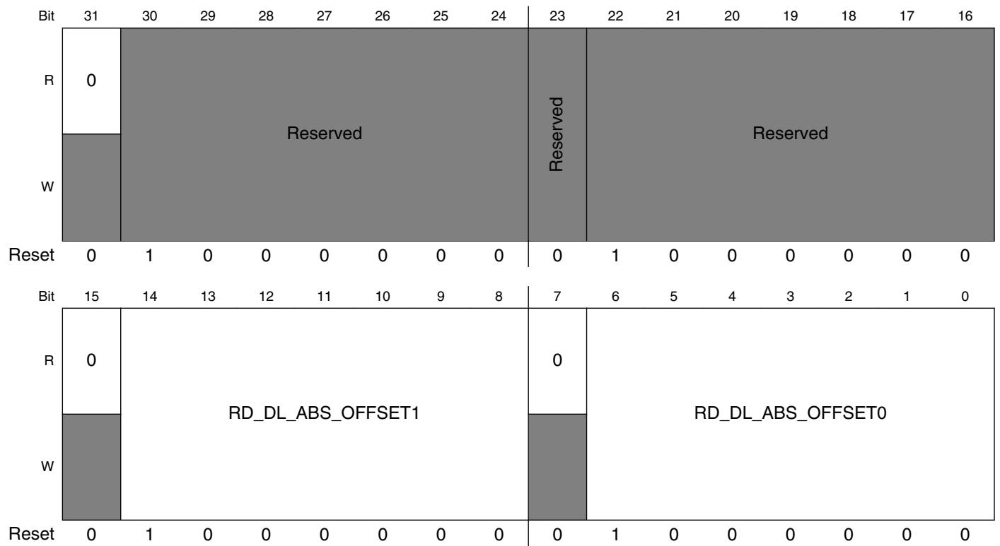

MMDC_MPRDDLCTL field descriptions   
Table continues on the next page...   

<table><tr><td>Field</td><td>Description</td></tr><tr><td>31 Reserved</td><td>This read-only field is reserved and always has the value 0.</td></tr><tr><td>30-24 -</td><td>This field is reserved.
Reserved</td></tr><tr><td>23 -</td><td>This field is reserved.
Reserved</td></tr><tr><td>22-16 -</td><td>This field is reserved.
Reserved</td></tr><tr><td>15 Reserved</td><td>This read-only field is reserved and always has the value 0.</td></tr></table>

i.MX 6ULL Applications Processor Reference Manual, Rev. 1, 11/2017

MMDC_MPRDDLCTL field descriptions (continued)   

<table><tr><td>Field</td><td>Description</td></tr><tr><td>14-8 RD_DL_ABS_OFFSET1</td><td>Absolute read delay offset for Byte1. This field indicates the absolute delay between read DQS strobe and the read data of Byte1 with fractions of a clock period and up to half cycle. The fraction is process and frequency independent. The delay of the delay-line would be (RD_DL_ABS_OFFSET1 / 256) * MMDC AXI clock (fast clock). So for the default value of 64 we get a quarter cycle delay.
This field can also bit written by HW. Upon completion of the read delay-line HW calibration this field gets the value of (HW_RD_DL_LOW1 + HW_RD_DL_UP1) /2
NOTE: Not all changes will have effect on the actual delay. If the requested change is smaller than the delay-line resolution, then no change will occur.</td></tr><tr><td>7 Reserved</td><td>This read-only field is reserved and always has the value 0.</td></tr><tr><td>RD_DL_ABS_OFFSET0</td><td>Absolute read delay offset for Byte0. This field indicates the absolute delay between read DQS strobe and the read data of Byte0 with fractions of a clock period and up to half cycle. The fraction is process and frequency independent. The delay of the delay-line would be (RD_DL_ABS_OFFSET0 / 256) * MMDC AXI clock (fast clock). So for the default value of 64 we get a quarter cycle delay.
This field can also bit written by HW. Upon completion of the read delay-line HW calibration this field gets the value of (HW_RD_DL_LOW0 + HW_RD_DL_UP0) /2
NOTE: Not all changes will have effect on the actual delay. If the requested change is smaller than the delay-line resolution, then no change will occur.</td></tr></table>

# 35.12.48 MMDC PHY Read delay-lines Status Register (MMDC_MPRDDLST)

This register holds the status of the 4 read delay-lines.

Address: 21B_0000h base $^ +$ 84Ch offset $=$ 21B_084Ch

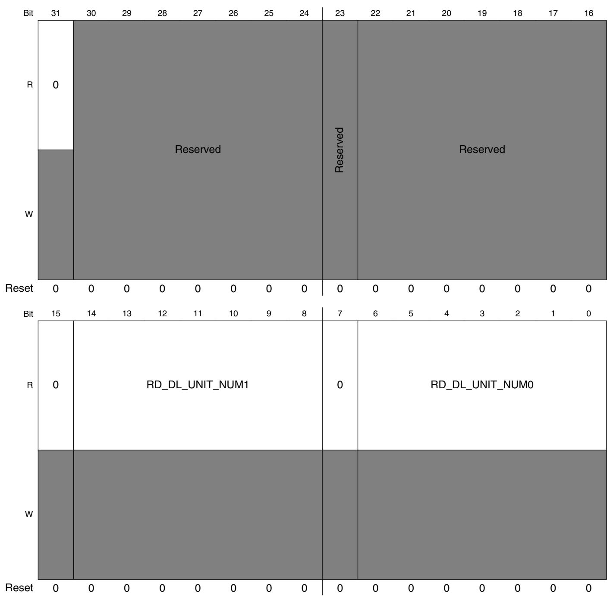

i.MX 6ULL Applications Processor Reference Manual, Rev. 1, 11/2017

MMDC_MPRDDLST field descriptions   

<table><tr><td>Field</td><td>Description</td></tr><tr><td>31Reserved</td><td>This read-only field is reserved and always has the value 0.</td></tr><tr><td>30-24-</td><td>This field is reserved.Reserved</td></tr><tr><td>23-</td><td>This field is reserved.Reserved</td></tr><tr><td>22-16-</td><td>This field is reserved.Reserved</td></tr><tr><td>15Reserved</td><td>This read-only field is reserved and always has the value 0.</td></tr><tr><td>14-8RD_DL_UNIT_NUM1</td><td>This field reflects the number of delay units that are actually used by read delay-line 1.</td></tr><tr><td>7Reserved</td><td>This read-only field is reserved and always has the value 0.</td></tr><tr><td>RD_DL_UNIT_NUM0</td><td>This field reflects the number of delay units that are actually used by read delay-line 0.</td></tr></table>

# 35.12.49 MMDC PHY Write delay-lines Configuration Register (MMDC_MPWRDLCTL)

This register controls write delay-lines functionality, it determines DQ/DM delay relative to the associated DQS in write access. The delay-line compensates for process variations, and produces a constant delay regardless of the process, temperature and voltage.

Address: 21B_0000h base $^ +$ 850h offset $=$ 21B_0850h

MMDC_MPWRDLCTL field descriptions   
Table continues on the next page...   

<table><tr><td>Field</td><td>Description</td></tr><tr><td>31 Reserved</td><td>This read-only field is reserved and always has the value 0.</td></tr><tr><td>30-24 -</td><td>This field is reserved.
Reserved</td></tr><tr><td>23 -</td><td>This field is reserved.
Reserved</td></tr><tr><td>22-16 -</td><td>This field is reserved.
Reserved</td></tr><tr><td>15 Reserved</td><td>This read-only field is reserved and always has the value 0.</td></tr></table>

i.MX 6ULL Applications Processor Reference Manual, Rev. 1, 11/2017

MMDC_MPWRDLCTL field descriptions (continued)   

<table><tr><td>Field</td><td>Description</td></tr><tr><td>14-8WR_DL_ABS_OFFSET1</td><td>Absolute write delay offset for Byte1. This field indicates the absolute delay between write DQS strobe and the write data of Byte1 with fractions of a clock period and up to half cycle. The fraction is process and frequency independent. The delay of the delay-line would be (WR_DL_ABS_OFFSET1 / 256) * MMDC AXI clock (fast clock). So for the default value of 64 we get a quarter cycle delay.
This field can also bit written by HW. Upon completion of the write delay-line HW calibration this field gets the value of (HW_WR_DL_LOW1 + HW_WR_DL_UP1) /2
NOTE: Not all changes of this value will affect the actual delay. If the requested change is smaller than the delay-line resolution, then no change will occur.</td></tr><tr><td>7Reserved</td><td>This read-only field is reserved and always has the value 0.</td></tr><tr><td>WR_DL_ABS_OFFSET0</td><td>Absolute write delay offset for Byte0. This field indicates the absolute delay between write DQS strobe and the write data of Byte3 with fractions of a clock period and up to half cycle. The fraction is process and frequency independent. The delay of the delay-line would be (WR_DL_ABS_OFFSET0 / 256) * MMDC AXI clock (fast clock). So for the default value of 64 we get a quarter cycle delay.
This field can also bit written by HW. Upon completion of the write delay-line HW calibration this field gets the value of (HW_WR_DL_LOW0 + HW_WR_DL_UP0) /2
NOTE: Not all changes of this value will affect the actual delay. If the requested change is smaller than the delay-line resolution, then no change will occur.</td></tr></table>

# 35.12.50 MMDC PHY Write delay-lines Status Register (MMDC_MPWRDLST)

This register holds the status of the 4 write delay-line.

Address: 21B_0000h base + 854h offset $=$ 21B_0854h

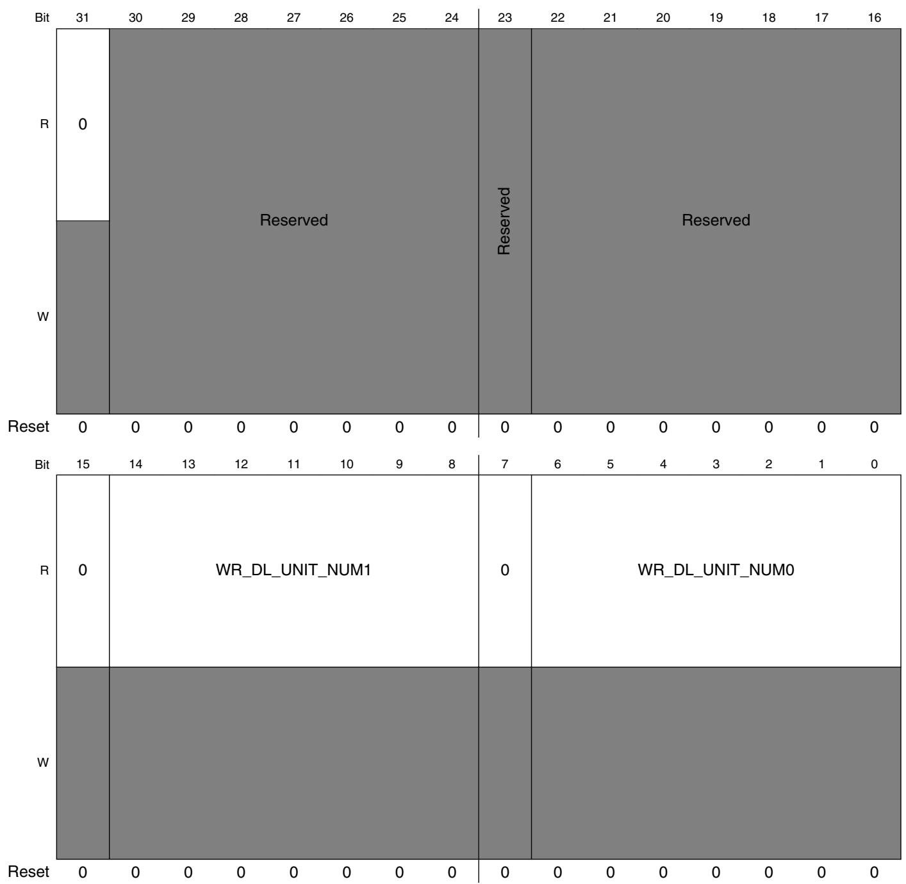

i.MX 6ULL Applications Processor Reference Manual, Rev. 1, 11/2017

MMDC_MPWRDLST field descriptions   

<table><tr><td>Field</td><td>Description</td></tr><tr><td>31Reserved</td><td>This read-only field is reserved and always has the value 0.</td></tr><tr><td>30-24-</td><td>This field is reserved.Reserved</td></tr><tr><td>23-</td><td>This field is reserved.Reserved</td></tr><tr><td>22-16-</td><td>This field is reserved.Reserved</td></tr><tr><td>15Reserved</td><td>This read-only field is reserved and always has the value 0.</td></tr><tr><td>14-8WR_DL_UNIT_NUM1</td><td>This field reflects the number of delay units that are actually used by write delay-line 1.</td></tr><tr><td>7Reserved</td><td>This read-only field is reserved and always has the value 0.</td></tr><tr><td>WR_DL_UNIT_NUM0</td><td>This field reflects the number of delay units that are actually used by write delay-line 0.</td></tr></table>

# 35.12.51 MMDC PHY CK Control Register (MMDC_MPSDCTRL)

This register controls the fine tuning of the primary clock (CK0).

Address: 21B_0000h base + 858h offset $=$ 21B_0858h

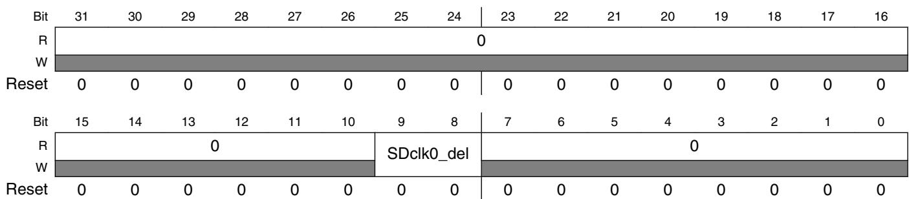

MMDC_MPSDCTRL field descriptions   

<table><tr><td>Field</td><td>Description</td></tr><tr><td>31-10Reserved</td><td>This read-only field is reserved and always has the value 0.</td></tr><tr><td>9-8SDclk0_del</td><td>DDR clock0 delay fine tuning. This field holds the number of delay units that are added to DDR clock (CK0).00 No change in DDR clock0 delay01 Add DDR clock0 delay of 1 delay unit.</td></tr></table>

Table continues on the next page...

i.MX 6ULL Applications Processor Reference Manual, Rev. 1, 11/2017

MMDC_MPSDCTRL field descriptions (continued)   

<table><tr><td>Field</td><td>Description</td></tr><tr><td></td><td>10 Add DDR clock0 delay of 2 delay units.
11 Add DDR clock0 delay of 3 delay units.</td></tr><tr><td>Reserved</td><td>This read-only field is reserved and always has the value 0.</td></tr></table>

# 35.12.52 MMDC ZQ LPDDR2 HW Control Register(MMDC_MPZQLP2CTL)

This register controls the idle time that takes the LPDDR2 device to perform ZQ calibration.

Address: 21B_0000h base $^ +$ 85Ch offset $=$ 21B_085Ch

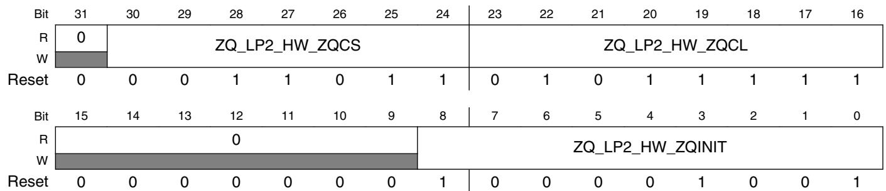

MMDC_MPZQLP2CTL field descriptions   

<table><tr><td>Field</td><td>Description</td></tr><tr><td>31Reserved</td><td>This read-only field is reserved and always has the value 0.</td></tr><tr><td>30-24ZQ_LP2_HW_ZQCS</td><td>This register defines the period in cycles that it takes the memory device to perform a short ZQ calibration. This is the period of time that the MMDC has to wait after sending a short ZQ calibration and before sending other commands. This delay will also be used if ZQ reset is sent.0x0-0x1A Reserved0x1B 112 cycles (default)0x1C 116 cycles0x7E 508 cycles0x7F 512 cycles</td></tr><tr><td>23-16ZQ_LP2_HW_ZQCL</td><td>This register defines the period in cycles that it takes the memory device to perform a long ZQ calibration. This is the period of time that the MMDC has to wait after sending a long ZQ calibration and before sending other commands.0x0-0x36 Reserved0x37 112 cycles</td></tr></table>

Table continues on the next page...

i.MX 6ULL Applications Processor Reference Manual, Rev. 1, 11/2017

MMDC_MPZQLP2CTL field descriptions (continued)   

<table><tr><td>Field</td><td>Description</td></tr><tr><td></td><td>0x38 114 cycles
0x5F 192 cycles (Default, JEDEC value, tZQCL, for LPDDR2, 360ns @ clock frequency 533MHz)
0xFE 510 cycles
0xFF 512 cycles</td></tr><tr><td>15-9 Reserved</td><td>This read-only field is reserved and always has the value 0.</td></tr><tr><td>ZQ_LP2_HW_ZQINIT</td><td>This register defines the period in cycles that it takes the memory device to perform a Init ZQ calibration.
This is the period of time that the MMDC has to wait after sending a init ZQ calibration and before sending other commands.
0x0-0x36 Reserved
0x37 112 cycles
0x38 114 cycles
0x109 532 cycles (Default, JEDEC value, tZQINIT, for LPDDR2, 1us @ clock frequency 533MHz)
0x1FE 1022 cycles
0x1FF 1024 cycles</td></tr></table>

# 35.12.53 MMDC PHY Read Delay HW Calibration Control Register (MMDC_MPRDDLHWCTL)

Address: 21B_0000h base $^ +$ 860h offset $=$ 21B_0860h

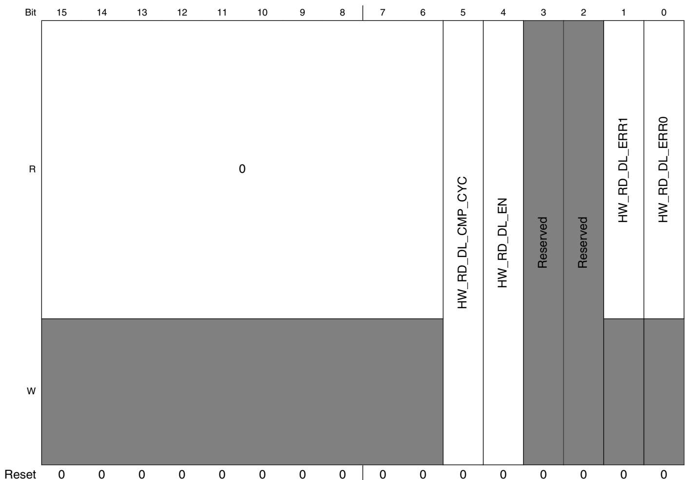

MMDC_MPRDDLHWCTL field descriptions   
Table continues on the next page...   

<table><tr><td>Field</td><td>Description</td></tr><tr><td>31-6 Reserved</td><td>This read-only field is reserved and always has the value 0.</td></tr><tr><td>5 HW_RD_DL_CMP_CYC</td><td>Automatic (HW) read sample cycle. If this bit is asserted then the MMDC will compare the read data 32 cycles after the MMDC sent the read command enable pulse else it compares the data after 16 cycles.</td></tr><tr><td>4 HW_RD_DL_EN</td><td>Enable automatic (HW) read calibration. If this bit is asserted then the MMDC will perform an automatic read calibration. HW should negate this bit upon completion of the calibration. Negation of this bit also points that the read calibration results are validNOTE: Before issuing the first read command MMDC counts 12 cycles.</td></tr><tr><td>3 -</td><td>This field is reserved.Reserved</td></tr><tr><td>2 -</td><td>This field is reserved.Reserved</td></tr><tr><td>1 HW_RD_DL_ERR1</td><td>Automatic (HW) read calibration error of Byte1. If this bit is asserted then it indicates that an error was found during the HW calibration process of read delay-line 1. In case this bit is zero at the end of the calibration process then the boundary results can be found at MPRDDLHWST0 register. This bit is valid only after HW_RD_DL_EN is de-asserted.</td></tr></table>

i.MX 6ULL Applications Processor Reference Manual, Rev. 1, 11/2017

MMDC_MPRDDLHWCTL field descriptions (continued)   

<table><tr><td>Field</td><td>Description</td></tr><tr><td></td><td>0 No error was found in read delay-line 1 during the automatic (HW) read calibration process of read delay-line 1.</td></tr><tr><td></td><td>1 An error was found in read delay-line 1 during the automatic (HW) read calibration process of read delay-line 1.</td></tr><tr><td>0 HW_RD_DL_ERR0</td><td>Automatic (HW) read calibration error of Byte0. If this bit is asserted then it indicates that an error was found during the HW calibration process of read delay-line 0. In case this bit is zero at the end of the calibration process then the boundary results can be found at MPRDDLHWST0 register. This bit is valid only after HW_RD_DL_EN is de-asserted.</td></tr><tr><td></td><td>0 No error was found in read delay-line 0 during the automatic (HW) read calibration process of read delay-line 0.</td></tr><tr><td></td><td>1 An error was found in read delay-line 0 during the automatic (HW) read calibration process of read delay-line 0.</td></tr></table>

# 35.12.54 MMDC PHY Write Delay HW Calibration Control Register (MMDC_MPWRDLHWCTL)

Address: 21B_0000h base $^ +$ 864h offset $=$ 21B_0864h

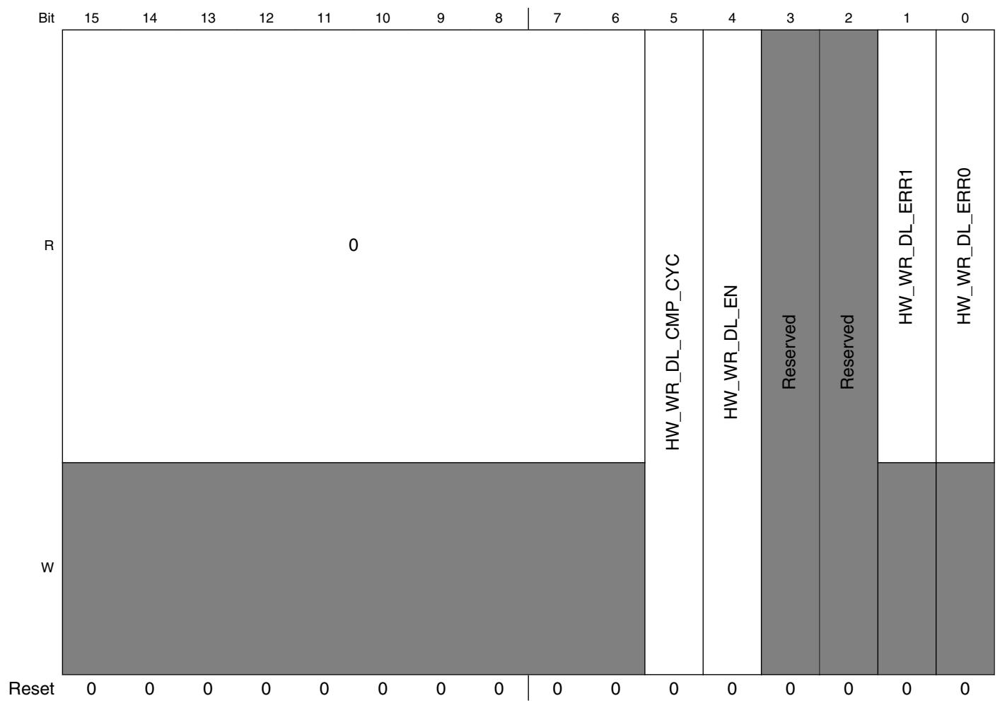  
MMDC Memory Map/Register Definition

MMDC_MPWRDLHWCTL field descriptions   

<table><tr><td>Field</td><td>Description</td></tr><tr><td>31-6Reserved</td><td>This read-only field is reserved and always has the value 0.</td></tr><tr><td>5HW_WR_DL_CMP_CYC</td><td>Write sample cycle. If this bit is asserted then the MMDC will compare the data 32 cycles after the MMDC sent the read command enable pulse else it compares the data after 16 cycles.</td></tr><tr><td>4HW_WR_DL_EN</td><td>Enable automatic (HW) write calibration. If this bit is asserted then the MMDC will perform an automatic write calibration. HW should negate this bit upon completion of the calibration. Negation of this bit also indicates that the write calibration results are validNOTE: Before issuing the first read command MMDC counts 12 cycles.</td></tr><tr><td>3-</td><td>This field is reserved.Reserved</td></tr><tr><td>2-</td><td>This field is reserved.Reserved</td></tr><tr><td>1HW_WR_DL_ERR1</td><td>Automatic (HW) write calibration error of Byte1. If this bit is asserted then it indicates that an error was found during the HW calibration process of write delay-line 1. In case this bit is zero at the end of the calibration process then the boundary results can be found at MPWRDLHWST0 register. This bit is valid only after HW_WR_DL_EN is de-asserted.</td></tr></table>

Table continues on the next page...

i.MX 6ULL Applications Processor Reference Manual, Rev. 1, 11/2017

MMDC_MPWRDLHWCTL field descriptions (continued)   

<table><tr><td>Field</td><td>Description</td></tr><tr><td></td><td>0 No error was found during the automatic (HW) write calibration process of write delay-line 1.1 An error was found during the automatic (HW) write calibration process of write delay-line 1.</td></tr><tr><td>0 HW_WR_DL_ERR0</td><td>Automatic (HW) write calibration error of Byte0. If this bit is asserted then it indicates that an error was found during the HW calibration process of write delay-line 0. In case this bit is zero at the end of the calibration process then the boundary results can be found at MPWRDLHWST0 register. This bit is valid only after HW_WR_DL_EN is de-asserted.0 No error was found during the automatic (HW) write calibration process of write delay-line 0.1 An error was found during the automatic (HW) write calibration process of write delay-line 0.</td></tr></table>

# 35.12.55 MMDC PHY Read Delay HW Calibration Status Register 0 (MMDC_MPRDDLHWST0)

Address: 21B_0000h base $^ +$ 868h offset $=$ 21B_0868h

<table><tr><td>Bit</td><td>31</td><td>30</td><td>29</td><td>28</td><td>27</td><td>26</td><td>25</td><td>24</td><td>23</td><td>22</td><td>21</td><td>20</td><td>19</td><td>18</td><td>17</td><td>16</td></tr><tr><td>R</td><td>0</td><td colspan="7">HW_RD_DL_UP1</td><td>0</td><td colspan="7">HW_RD_DL_LOW1</td></tr><tr><td>W</td><td></td><td colspan="7"></td><td></td><td colspan="7"></td></tr><tr><td>Reset</td><td>0</td><td>0</td><td>0</td><td>0</td><td>0</td><td>0</td><td>0</td><td>0</td><td>0</td><td>0</td><td>0</td><td>0</td><td>0</td><td>0</td><td>0</td><td>0</td></tr><tr><td>Bit</td><td>15</td><td>14</td><td>13</td><td>12</td><td>11</td><td>10</td><td>9</td><td>8</td><td>7</td><td>6</td><td>5</td><td>4</td><td>3</td><td>2</td><td>1</td><td>0</td></tr><tr><td>R</td><td>0</td><td colspan="7">HW_RD_DL_UP0</td><td>0</td><td colspan="7">HW_RD_DL_LOW0</td></tr><tr><td>W</td><td></td><td colspan="7"></td><td></td><td colspan="7"></td></tr><tr><td>Reset</td><td>0</td><td>0</td><td>0</td><td>0</td><td>0</td><td>0</td><td>0</td><td>0</td><td>0</td><td>0</td><td>0</td><td>0</td><td>0</td><td>0</td><td>0</td><td>0</td></tr></table>

MMDC_MPRDDLHWST0 field descriptions   

<table><tr><td>Field</td><td>Description</td></tr><tr><td>31Reserved</td><td>This read-only field is reserved and always has the value 0.</td></tr><tr><td>30-24HW_RD_DL_UP1</td><td>Automatic (HW) read calibration result of the upper boundary of Byte1. This field holds the automatic (HW) read calibration result of the upper boundary of Byte1</td></tr><tr><td>23Reserved</td><td>This read-only field is reserved and always has the value 0.</td></tr><tr><td>22-16HW_RD_DL_LOW1</td><td>Automatic (HW) read calibration result of the lower boundary of Byte1. This field holds the automatic (HW) read calibration result of the lower boundary of Byte1</td></tr><tr><td>15Reserved</td><td>This read-only field is reserved and always has the value 0.</td></tr><tr><td>14-8HW_RD_DL_UP0</td><td>Automatic (HW) read calibration result of the upper boundary of Byte0. This field holds the automatic (HW) read calibration result of the upper boundary of Byte0.</td></tr><tr><td>7Reserved</td><td>This read-only field is reserved and always has the value 0.</td></tr></table>

Table continues on the next page...

i.MX 6ULL Applications Processor Reference Manual, Rev. 1, 11/2017

MMDC_MPRDDLHWST0 field descriptions (continued)   

<table><tr><td>Field</td><td>Description</td></tr><tr><td>HW_RD_DL_LOW0</td><td>Automatic (HW) read calibration result of the lower boundary of Byte0. This field holds the automatic (HW) read calibration result of the lower boundary of Byte0.</td></tr></table>

# 35.12.56 MMDC PHY Write Delay HW Calibration Status Register 0 (MMDC_MPWRDLHWST0)

Address: 21B_0000h base $^ +$ 870h offset $=$ 21B_0870h

<table><tr><td>Bit</td><td>31</td><td>30</td><td>29</td><td>28</td><td>27</td><td>26</td><td>25</td><td>24</td><td>23</td><td>22</td><td>21</td><td>20</td><td>19</td><td>18</td><td>17</td><td>16</td></tr><tr><td>R</td><td>0</td><td colspan="7">HW_WR_DL_UP1</td><td>0</td><td colspan="7">HW_WR_DL_LOW1</td></tr><tr><td>W</td><td></td><td colspan="7"></td><td></td><td colspan="7"></td></tr><tr><td>Reset</td><td>0</td><td>0</td><td>0</td><td>0</td><td>0</td><td>0</td><td>0</td><td>0</td><td>0</td><td>0</td><td>0</td><td>0</td><td>0</td><td>0</td><td>0</td><td>0</td></tr><tr><td>Bit</td><td>15</td><td>14</td><td>13</td><td>12</td><td>11</td><td>10</td><td>9</td><td>8</td><td>7</td><td>6</td><td>5</td><td>4</td><td>3</td><td>2</td><td>1</td><td>0</td></tr><tr><td>R</td><td>0</td><td colspan="7">HW_WR_DL_UP0</td><td>0</td><td colspan="7">HW_WR_DL_LOW0</td></tr><tr><td>W</td><td></td><td colspan="7"></td><td></td><td colspan="7"></td></tr><tr><td>Reset</td><td>0</td><td>0</td><td>0</td><td>0</td><td>0</td><td>0</td><td>0</td><td>0</td><td>0</td><td>0</td><td>0</td><td>0</td><td>0</td><td>0</td><td>0</td><td>0</td></tr></table>

MMDC_MPWRDLHWST0 field descriptions   

<table><tr><td>Field</td><td>Description</td></tr><tr><td>31Reserved</td><td>This read-only field is reserved and always has the value 0.</td></tr><tr><td>30-24HW_WR_DL_UP1</td><td>Automatic (HW) write automatic (HW) write calibration result of the upper boundary of Byte1. This field holds the automatic (HW) write calibration result of the upper boundary of Byte1.</td></tr><tr><td>23Reserved</td><td>This read-only field is reserved and always has the value 0.</td></tr><tr><td>22-16HW_WR_DL_LOW1</td><td>Automatic (HW) write calibration result of the lower boundary of Byte1. This field holds the automatic (HW) write calibration result of the lower boundary of Byte1.</td></tr><tr><td>15Reserved</td><td>This read-only field is reserved and always has the value 0.</td></tr><tr><td>14-8HW_WR_DL_UP0</td><td>Automatic (HW) write calibration result of the upper boundary of Byte0. This field holds the automatic (HW) write calibration result of the upper boundary of Byte0.</td></tr><tr><td>7Reserved</td><td>This read-only field is reserved and always has the value 0.</td></tr><tr><td>HW_WR_DL_LOW0</td><td>Automatic (HW) write calibration result of the lower boundary of Byte0. This field holds the automatic (HW) write calibration result of the lower boundary of Byte0.</td></tr></table>

# 35.12.57 MMDC PHY Write Leveling HW Error Register (MMDC_MPWLHWERR)

Address: 21B_0000h base $^ +$ 878h offset $=$ 21B_0878h

<table><tr><td rowspan="2">Bit</td><td rowspan="2">Reserved</td><td>Reserved</td><td>HW_WL1_DQ</td><td>HW_WL0_DQ</td></tr><tr><td></td><td></td><td></td></tr><tr><td>Reset</td><td>0 0 0 0 0 0 0 0 0 0 0 0 0 0 0 0 0 0 0 0 0 0 0 0 0 0 0 0 0 0 0 0 0 0 0 0 0 0 0 0 0 0 0 0 0 0 0 0 0 0 0</td><td>0 0 0 0 0 0 0 0 0 0 0 0 0 0 0 0 0 0 0 0 0 0 0 0 0 0 0 0 0 0 0 0 0 0 0 0 0 0 0 0 0 0 0 0 0 0 0 0 0 16</td><td>15 14 13 12 11 10 9 8 7 6 5 4 3 2 1 0</td><td></td></tr></table>

MMDC_MPWLHWERR field descriptions   

<table><tr><td>Field</td><td>Description</td></tr><tr><td>31-24 -</td><td>This field is reserved. Reserved</td></tr><tr><td>23-16 -</td><td>This field is reserved. Reserved</td></tr><tr><td>15-8 HW_WL1_DQ</td><td>HW write-leveling calibration result of Byte1. This field holds the results for all the 8 write-leveling steps of Byte1. i.e. bit 0 holds the result of the write-leveling calibration of 0 delay, bit 1 holds the result of the write-leveling calibration of 1/8delay till bit 7 that holds the result of the write-leveling calibration of 7/8 delay</td></tr><tr><td>HW_WL0_DQ</td><td>HW write-leveling calibration result of Byte0. This field holds the results for all the 8 write-leveling steps of Byte0. i.e. bit 0 holds the result of the write-leveling calibration of 0 delay, bit 1 holds the result of the write-leveling calibration of 1/8delay till bit 7 that holds the result of the write-leveling calibration of 7/8 delay</td></tr></table>

# 35.12.58 MMDC PHY Read DQS Gating HW Status Register 0 (MMDC_MPDGHWST0)

Address: 21B_0000h base $^ +$ 87Ch offset $=$ 21B_087Ch

<table><tr><td>Bit</td><td>31</td><td>30</td><td>29</td><td>28</td><td>27</td><td>26</td><td>25</td><td>24</td><td>23</td><td>22</td><td>21</td><td>20</td><td>19</td><td>18</td><td>17</td><td>16</td><td>15</td><td>14</td><td>13</td><td>12</td><td>11</td><td>10</td><td>9</td><td>8</td><td>7</td><td>6</td><td>5</td><td>4</td><td>3</td><td>2</td><td>1</td><td>0</td></tr><tr><td>R</td><td rowspan="2" colspan="5">Reserved</td><td colspan="11">HW_DG_UP0</td><td rowspan="2" colspan="5">Reserved</td><td colspan="11">HW_DG_LOW0</td></tr><tr><td>W</td><td colspan="11"></td><td colspan="11"></td></tr><tr><td>Reset</td><td>0</td><td>0</td><td>0</td><td>0</td><td>0</td><td>0</td><td>0</td><td>0</td><td>0</td><td>0</td><td>0</td><td>0</td><td>0</td><td>0</td><td>0</td><td>0</td><td>0</td><td>0</td><td>0</td><td>0</td><td>0</td><td>0</td><td>0</td><td>0</td><td>0</td><td>0</td><td>0</td><td>0</td><td>0</td><td>0</td><td>0</td><td>0</td></tr></table>

MMDC_MPDGHWST0 field descriptions   

<table><tr><td>Field</td><td>Description</td></tr><tr><td>31-27 -</td><td>This field is reserved. Reserved</td></tr><tr><td>26-16 HW_DG_UP0</td><td>HW DQS gating calibration result of the upper boundary of Byte0. This field holds the HW DQS gating calibration result of the upper boundary of Byte0.</td></tr><tr><td>15-11 -</td><td>This field is reserved. Reserved</td></tr><tr><td>HW_DG_LOW0</td><td>HW DQS gating calibration result of the lower boundary of Byte0. This field holds the HW DQS gating calibration result of the lower boundary of Byte0.</td></tr></table>

i.MX 6ULL Applications Processor Reference Manual, Rev. 1, 11/2017

# 35.12.59 MMDC PHY Read DQS Gating HW Status Register 1 (MMDC_MPDGHWST1)

Address: 21B_0000h base $^ +$ 880h offset $=$ 21B_0880h

<table><tr><td>Bit</td><td>31</td><td>30</td><td>29</td><td>28</td><td>27</td><td>26</td><td>25</td><td>24</td><td>23</td><td>22</td><td>21</td><td>20</td><td>19</td><td>18</td><td>17</td><td>16</td><td>15</td><td>14</td><td>13</td><td>12</td><td>11</td><td>10</td><td>9</td><td>8</td><td>7</td><td>6</td><td>5</td><td>4</td><td>3</td><td>2</td><td>1</td><td>0</td></tr><tr><td>R</td><td rowspan="2" colspan="5">Reserved</td><td colspan="11">HW_DG_UP1</td><td rowspan="2" colspan="5">Reserved</td><td colspan="11">HW_DG_LOW1</td></tr><tr><td>W</td><td colspan="11"></td><td colspan="11"></td></tr><tr><td>Reset</td><td>0</td><td>0</td><td>0</td><td>0</td><td>0</td><td>0</td><td>0</td><td>0</td><td>0</td><td>0</td><td>0</td><td>0</td><td>0</td><td>0</td><td>0</td><td>0</td><td>0</td><td>0</td><td>0</td><td>0</td><td>0</td><td>0</td><td>0</td><td>0</td><td>0</td><td>0</td><td>0</td><td>0</td><td>0</td><td>0</td><td>0</td><td>0</td></tr></table>

MMDC_MPDGHWST1 field descriptions   

<table><tr><td>Field</td><td>Description</td></tr><tr><td>31-27 -</td><td>This field is reserved. Reserved</td></tr><tr><td>26-16 HW_DG_UP1</td><td>HW DQS gating calibration result of the upper boundary of Byte1. This field holds the HW DQS gating calibration result of the upper boundary of Byte1.</td></tr><tr><td>15-11 -</td><td>This field is reserved. Reserved</td></tr><tr><td>HW_DG_LOW1</td><td>HW DQS gating calibration result of the lower boundary of Byte1. This field holds the HW DQS gating calibration result of the lower boundary of Byte1.</td></tr></table>

# 35.12.60 MMDC PHY Read DQS Gating HW Status Register 2 (MMDC_MPDGHWST2)

Address: 21B_0000h base $^ +$ 884h offset $=$ 21B_0884h

<table><tr><td>Bit</td><td>31</td><td>30</td><td>29</td><td>28</td><td>27</td><td>26</td><td>25</td><td>24</td><td>23</td><td>22</td><td>21</td><td>20</td><td>19</td><td>18</td><td>17</td><td>16</td><td>15</td><td>14</td><td>13</td><td>12</td><td>11</td><td>10</td><td>9</td><td>8</td><td>7</td><td>6</td><td>5</td><td>4</td><td>3</td><td>2</td><td>1</td><td>0</td></tr><tr><td>R</td><td rowspan="2" colspan="5">Reserved</td><td colspan="11">HW_DG_UP2</td><td rowspan="2" colspan="5">Reserved</td><td colspan="11">HW_DG_LOW2</td></tr><tr><td>W</td><td colspan="11"></td><td colspan="11"></td></tr><tr><td>Reset</td><td>0</td><td>0</td><td>0</td><td>0</td><td>0</td><td>0</td><td>0</td><td>0</td><td>0</td><td>0</td><td>0</td><td>0</td><td>0</td><td>0</td><td>0</td><td>0</td><td>0</td><td>0</td><td>0</td><td>0</td><td>0</td><td>0</td><td>0</td><td>0</td><td>0</td><td>0</td><td>0</td><td>0</td><td>0</td><td>0</td><td>0</td><td>0</td></tr></table>

MMDC_MPDGHWST2 field descriptions   

<table><tr><td>Field</td><td>Description</td></tr><tr><td>31-27 -</td><td>This field is reserved. Reserved</td></tr><tr><td>26-16 HW_DG_UP2</td><td>HW DQS gating calibration result of the upper boundary of Byte2. This field holds the HW DQS gating calibration result of the upper boundary of Byte2.</td></tr><tr><td>15-11 -</td><td>This field is reserved. Reserved</td></tr><tr><td>HW_DG_LOW2</td><td>HW DQS gating calibration result of the lower boundary of Byte2. This field holds the HW DQS gating calibration result of the lower boundary of Byte2.</td></tr></table>

i.MX 6ULL Applications Processor Reference Manual, Rev. 1, 11/2017

# 35.12.61 MMDC PHY Read DQS Gating HW Status Register 3 (MMDC_MPDGHWST3)

Address: 21B_0000h base $^ +$ 888h offset $=$ 21B_0888h

<table><tr><td>Bit</td><td>31</td><td>30</td><td>29</td><td>28</td><td>27</td><td>26</td><td>25</td><td>24</td><td>23</td><td>22</td><td>21</td><td>20</td><td>19</td><td>18</td><td>17</td><td>16</td><td>15</td><td>14</td><td>13</td><td>12</td><td>11</td><td>10</td><td>9</td><td>8</td><td>7</td><td>6</td><td>5</td><td>4</td><td>3</td><td>2</td><td>1</td><td>0</td></tr><tr><td>R</td><td rowspan="2" colspan="5">Reserved</td><td colspan="11">HW_DG_UP3</td><td rowspan="2" colspan="5">Reserved</td><td colspan="11">HW_DG_LOW3</td></tr><tr><td>W</td><td colspan="11"></td><td colspan="11"></td></tr><tr><td>Reset</td><td>0</td><td>0</td><td>0</td><td>0</td><td>0</td><td>0</td><td>0</td><td>0</td><td>0</td><td>0</td><td>0</td><td>0</td><td>0</td><td>0</td><td>0</td><td>0</td><td>0</td><td>0</td><td>0</td><td>0</td><td>0</td><td>0</td><td>0</td><td>0</td><td>0</td><td>0</td><td>0</td><td>0</td><td>0</td><td>0</td><td>0</td><td>0</td></tr></table>

MMDC_MPDGHWST3 field descriptions   

<table><tr><td>Field</td><td>Description</td></tr><tr><td>31-27 -</td><td>This field is reserved. Reserved</td></tr><tr><td>26-16 HW_DG_UP3</td><td>HW DQS gating calibration result of the upper boundary of Byte3. This field holds the HW DQS gating calibration result of the upper boundary of Byte3.</td></tr><tr><td>15-11 -</td><td>This field is reserved. Reserved</td></tr><tr><td>HW_DG_LOW3</td><td>HW DQS gating calibration result of the lower boundary of Byte3. This field holds the HW DQS gating calibration result of the lower boundary of Byte3.</td></tr></table>

# 35.12.62 MMDC PHY Pre-defined Compare Register 1 (MMDC_MPPDCMPR1)

This register holds the MMDC pre-defined compare value that will be used during automatic read, read DQS gating and write calibration process. The compare value can be the MPR value (as defined in the JEDEC) or can be programmed by the PDV1 and PDV2 fields. In case of DDR3 (BL=8) the MMDC will duplicate PDV1, PDV2 and drive that data on Beat4-7 of the same byte.

Address: 21B_0000h base $^ +$ 88Ch offset $=$ 21B_088Ch

<table><tr><td>Bit</td><td>31</td><td>30</td><td>29</td><td>28</td><td>27</td><td>26</td><td>25</td><td>24</td><td>23</td><td>22</td><td>21</td><td>20</td><td>19</td><td>18</td><td>17</td><td>16</td><td>15</td><td>14</td><td>13</td><td>12</td><td>11</td><td>10</td><td>9</td><td>8</td><td>7</td><td>6</td><td>5</td><td>4</td><td>3</td><td>2</td><td>1</td><td>0</td><td></td></tr><tr><td>R W</td><td colspan="17">PDV2</td><td colspan="16">PDV1</td></tr><tr><td>Reset</td><td>0</td><td>0</td><td>0</td><td>0</td><td>0</td><td>0</td><td>0</td><td>0</td><td>0</td><td>0</td><td>0</td><td>0</td><td>0</td><td>0</td><td>0</td><td>0</td><td>0</td><td>0</td><td>0</td><td>0</td><td>0</td><td>0</td><td>0</td><td>0</td><td>0</td><td>0</td><td>0</td><td>0</td><td>0</td><td>0</td><td>0</td><td>0</td><td></td></tr></table>

MMDC_MPPDCMPR1 field descriptions   

<table><tr><td>Field</td><td>Description</td></tr><tr><td>31-16</td><td rowspan="2">MMDC Pre defined compare value2. This field holds the 2 MSB of the data that will be driven to the DDR device during automatic read, read DQS gating and write calibrations in case MPR(DDR3)/DQ calibration</td></tr><tr><td>PDV2</td></tr></table>

Table continues on the next page...

i.MX 6ULL Applications Processor Reference Manual, Rev. 1, 11/2017

MMDC_MPPDCMPR1 field descriptions (continued)   

<table><tr><td>Field</td><td>Description</td></tr><tr><td></td><td>(LPDDR2/LPDDR3) mode are disabled (MPR_CMP is disabled). Upon read access during the calibration the MMDC will compare the read data with the data that is stored in this field.</td></tr><tr><td></td><td>NOTE: Before issue the read access the MMDC will invert the value of this field and drive it to the associate entry in the read comparison FIFO. For further information see Section 19.14.3.1.2, &quot;Calibration with pre-defined value , Section 19.14.4.1.2, &quot;Calibration with pre-defined value and Section 19.14.5.1, &quot;HW (automatic) Write Calibration</td></tr><tr><td>PDV1</td><td>MMDC Pre defined compare value2. This field holds the 2 LSB of the data that will be driven to the DDR device during automatic read, read DQS gating and write calibrations in case MPR(DDR3)/ DQ calibration (LPDDR2/LPDDR3) mode are disabled (MPR_CMP is disabled). Upon read access during the calibration the MMDC will compare the read data with the data that is stored in this field.</td></tr><tr><td></td><td>NOTE: Before issuing the read access, the MMDC will invert the value of this field and drive it to the associated entry in the read comparison FIFO.</td></tr></table>

# 35.12.63 MMDC PHY Pre-defined Compare and CA delay-line Configuration Register (MMDC_MPPDCMPR2)

Address: 21B_0000h base $^ +$ 890h offset $=$ 21B_0890h

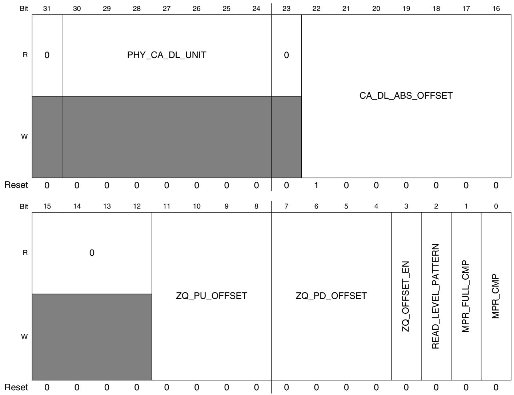

MMDC_MPPDCMPR2 field descriptions   

<table><tr><td>Field</td><td>Description</td></tr><tr><td>31Reserved</td><td>This read-only field is reserved and always has the value 0.</td></tr><tr><td>30-24PHY_CA_DL_UNIT</td><td>This field reflects the number of delay units that are actually used by CA(Command/Address of LPDDR2) delay-line</td></tr><tr><td>23Reserved</td><td>This read-only field is reserved and always has the value 0.</td></tr></table>

Table continues on the next page...

i.MX 6ULL Applications Processor Reference Manual, Rev. 1, 11/2017

MMDC_MPPDCMPR2 field descriptions (continued)   

<table><tr><td>Field</td><td>Description</td></tr><tr><td>22-16CA_DL_ABS_OFFSET</td><td>Absolute CA (Command/Address of LPDDRR2) offset. This field indicates the absolute delay between CA (Command/Address) bus and the DDR clock (CK) with fractions of a clock period and up to half cycle. The fraction is process and frequency independent. The delay of the delay-line would be (CA_DL_ABS_OFFSET / 256) * MMDC AXI clock (fast clock). So for the default value of 64 we get a quarter cycle delay.</td></tr><tr><td>15-12Reserved</td><td>This read-only field is reserved and always has the value 0 .</td></tr><tr><td>11-8ZQ_PU_OFFSET</td><td>Programmable offset from -7 to 7 added to the MMDC_MPZQHWCTRL[ZQ_HW PSU_RES] field when ZQ_OFFSET_EN is enabled. Bit[11] determines direction: 'b0 = Offset is added to ZQ_HW PSU_RES field 'b1 = Offset is subtracted from ZQ_HW PSU_RES field Bits[10:8] = Amount of change to apply. 0000 0 — Offset is added to ZQ_HW PSU_RES field 0001 1 — Offset is added to ZQ_HW PSU_RES field 0010 2 — Offset is added to ZQ_HW PSU_RES field 0011 3 — Offset is added to ZQ_HW PSU_RES field 0100 4 — Offset is added to ZQ_HW PSU_RES field 0101 5 — Offset is added to ZQ_HW PSU_RES field 0110 6 — Offset is added to ZQ_HW PSU_RES field 0111 7 — Offset is added to ZQ_HW PSU_RES field 1000 0 — Offset is subtracted from ZQ_HW PSU_RES field 1001 1 — Offset is subtracted from ZQ_HW PSU_RES field 1010 2 — Offset is subtracted from ZQ_HW PSU_RES field 1011 3 — Offset is subtracted from ZQ_HW PSU_RES field 1100 4 — Offset is subtracted from ZQ_HW PSU_RES field 1101 5 — Offset is subtracted from ZQ_HW PSU_RES field 1110 6 — Offset is subtracted from ZQ_HW PSU_RES field 1111 7 — Offset is subtracted from ZQ_HW PSU_RES field</td></tr><tr><td>7-4ZQ_PD_OFFSET</td><td>Programmable offset from -7 to 7 added to the MMDC_MPZQHWCTRL[ZQ_HW_PD_RES] field when ZQ_OFFSET_EN is enabled. Bit[7] determines direction: 'b0 = Offset is added to ZQ_HW_PD_RES field 'b1 = Offset is subtracted from ZQ_HW_PD_RES field Bits[6:4] = Amount of change to apply. 0000 0 — Offset is added to ZQ_HW_PD_RES field 0001 1 — Offset is added to ZQ_HW_PD_RES field 0010 2 — Offset is added to ZQ_HW_PD_RES field 0011 3 — Offset is added to ZQ_HW_PD_RES field 0100 4 — Offset is added to ZQ_HW_PD_RES field 0101 5 — Offset is added to ZQ_HW_PD_RES field 0110 6 — Offset is added to ZQ_HW_PD_RES field 0111 7 — Offset is added to ZQ_HW_PD_RES field 1000 0 — Offset is subtracted from ZQ_HW_PD_RES field</td></tr><tr><td></td><td>1001 1 — Offset is subtracted from ZQ_HW_PD_RES field</td></tr><tr><td></td><td>1010 2 — Offset is subtracted from ZQ_HW_PD_RES field</td></tr><tr><td></td><td>1011 3 — Offset is subtracted from ZQ_HW_PD_RES field</td></tr><tr><td></td><td>1100 4 — Offset is subtracted from ZQ_HW_PD_RES field</td></tr><tr><td></td><td>1101 5 — Offset is subtracted from ZQ_HW_PD_RES field</td></tr><tr><td></td><td>1110 6 — Offset is subtracted from ZQ_HW_PD_RES field</td></tr><tr><td></td><td>1111 7 — Offset is subtracted from ZQ_HW_PD_RES field</td></tr><tr><td>3ZQ_OFFSET_EN</td><td>0 Hardware ZQ offset disabled1 Hardware ZQ offset enabled</td></tr><tr><td>2READ_LEVEL_PATTERN</td><td>MPR(DDR3)/ DQ calibration (LPDDR2/LPDDR3) read compare pattern. In case MPR(DDR3)/ DQ calibration (LPDDR2/LPDDR3) modes are used during the calibration process (MPR_CMP is asserted) then this field indicates the read pattern for the comparison.0 Compare with read pattern 10101 Compare with read pattern 0011 (Used only in LPDDR2/LPDDR3 mode)</td></tr><tr><td>1MPR_FULL_CMP</td><td>MPR(DDR3)/ DQ calibration (LPDDR2/LPDDR3) full compare enable. In case MPR(DDR3)/ DQ calibration (LPDDR2/LPDDR3) modes are used during the calibration process (MPR_CMP is asserted) then this field indicates whether the MMDC will compare all the bits of the data that is read from the DDR device to the MPR pre-defined pattern. When this bit is de-asserted only LSB of each byte is compared.</td></tr><tr><td>0MPR_CMP</td><td>MPR(DDR3)/ DQ calibration (LPDDR2/LPDDR3) compare enable. This bit indicates whether the MMDC will compare the read data during automatic read and read DQS calibration processes to the pre-defined patterns that are driven by the DDR device (READ_LEVEL_PATTERN as defined by JEDEC) or general pre-defined value that are stored in PDV1 and PDV2. When this bit is disabled data is compared to the data of the pre defined compare value fieldFor further information see Read DQS Gating Calibration and Read Calibration .</td></tr></table>

# 35.12.64 MMDC PHY SW Dummy Access Register (MMDC_MPSWDAR0)

Address: 21B_0000h base $^ +$ 894h offset $=$ 21B_0894h

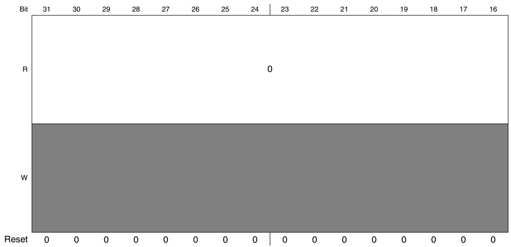

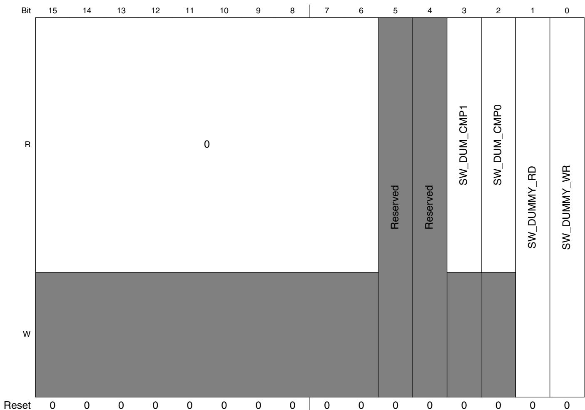

MMDC_MPSWDAR0 field descriptions   

<table><tr><td>Field</td><td>Description</td></tr><tr><td>31-6 
Reserved</td><td>This read-only field is reserved and always has the value 0.</td></tr><tr><td>5 
-</td><td>This field is reserved. 
Reserved</td></tr><tr><td>4 
-</td><td>This field is reserved. 
Reserved</td></tr><tr><td>3 
SW_DUM_CMP1</td><td>SW dummy read byte1 compare results. This bit indicates the result of the read data comparison of Byte1 at the completion of SW_DUMMY_RD. This bit is valid only when SW_DUMMY_RD is de-asserted. 
0 Dummy read fail 
1 Dummy read pass</td></tr><tr><td>2 
SW_DUM_CMP0</td><td>SW dummy read byte0 compare results. This bit indicates the result of the read data comparison of Byte0 at the completion of SW_DUMMY_RD. This bit is valid only when SW_DUMMY_RD is de-asserted. 
0 Dummy read fail 
1 Dummy read pass</td></tr><tr><td>1 
SW_DUMMY_RD</td><td>SW dummy read. When this bit is asserted the MMDC will generate internally read access without intervention of the system toward bank 0, row 0, column 0. If MPR_CMP = 1then the read data will be compared to MPPDCMPR2[READ_LEVEL.Pattern]. If MPR_CMP =0 then the read data will be</td></tr></table>

Table continues on the next page...

i.MX 6ULL Applications Processor Reference Manual, Rev. 1, 11/2017

MMDC_MPSWDAR0 field descriptions (continued)   

<table><tr><td>Field</td><td>Description</td></tr><tr><td></td><td>compared to MPPDCMPR1[PDV1], MPPDCMPR1[PDV2]. Upon completion of the access this bit is de-asserted automatically and the read data and comparison results are valid at MPSWDAR0[SW_DUM_CMP#] and MPSWDRDR0-MPSWDRDR7 respectively.</td></tr><tr><td>0 SW_DUMMY_WR</td><td>SW dummy write. When this bit is asserted the MMDC will generate internally write access without intervention of the system toward bank 0, row 0, column 0, while the data is driven from MPPDCMPR1[PDV1] and MPPDCMPR1[PDV2]. The bit is de-asserted automatically upon completion of the access.</td></tr></table>

# 35.12.65 MMDC PHY SW Dummy Read Data Register 0 (MMDC_MPSWDRDR0)

Address: 21B_0000h base $^ +$ 898h offset $=$ 21B_0898h

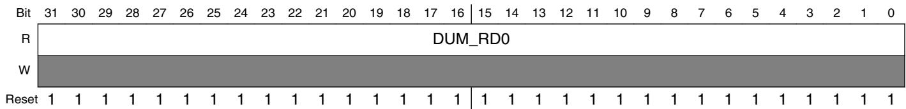

MMDC_MPSWDRDR0 field descriptions   

<table><tr><td>Field</td><td>Description</td></tr><tr><td>DUM_RD0</td><td>Dummy read data0. This field holds the first data that is read from the DDR during SW dummy read access (i.e. when SW_DUMMY_RD = 1). This field is valid only when SW_DUMMY_RD is de-asserted</td></tr></table>

# 35.12.66 MMDC PHY SW Dummy Read Data Register 1(MMDC_MPSWDRDR1)

Address: 21B_0000h base $^ +$ 89Ch offset $=$ 21B_089Ch

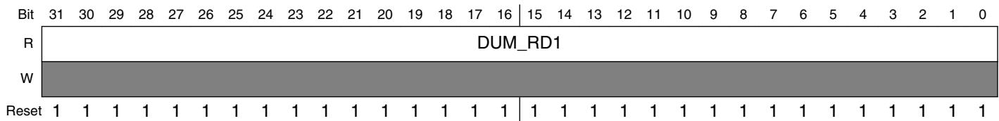

MMDC_MPSWDRDR1 field descriptions   

<table><tr><td>Field</td><td>Description</td></tr><tr><td>DUM_RD1</td><td>Dummy read data1. This field holds the second data that is read from the DDR during SW dummy read access (i.e. when SW_DUMMY_RD = 1). This field is valid only when SW_DUMMY_RD is de-asserted</td></tr></table>

i.MX 6ULL Applications Processor Reference Manual, Rev. 1, 11/2017

# 35.12.67 MMDC PHY SW Dummy Read Data Register 2 (MMDC_MPSWDRDR2)

Address: 21B_0000h base $^ +$ 8A0h offset $=$ 21B_08A0h

MMDC_MPSWDRDR2 field descriptions   

<table><tr><td>Field</td><td>Description</td></tr><tr><td>DUM_RD2</td><td>Dummy read data2. This field holds the third data that is read from the DDR during SW dummy read access (i.e. when SW_DUMMY_RD = 1). This field is valid only when SW_DUMMY_RD is de-asserted.</td></tr></table>

# 35.12.68 MMDC PHY SW Dummy Read Data Register 3 (MMDC_MPSWDRDR3)

Address: 21B_0000h base $^ +$ 8A4h offset $=$ 21B_08A4h

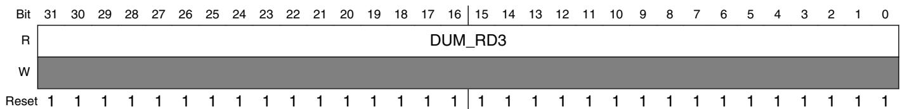

MMDC_MPSWDRDR3 field descriptions   

<table><tr><td>Field</td><td>Description</td></tr><tr><td>DUM_RD3</td><td>Dummy read data3. This field holds the forth data that is read from the DDR during SW dummy read access (i.e. when SW_DUMMY_RD = 1). This field is valid only when SW_DUMMY_RD is de-asserted.</td></tr></table>

# 35.12.69 MMDC PHY SW Dummy Read Data Register 4 (MMDC_MPSWDRDR4)

Address: 21B_0000h base $^ +$ 8A8h offset $=$ 21B_08A8h

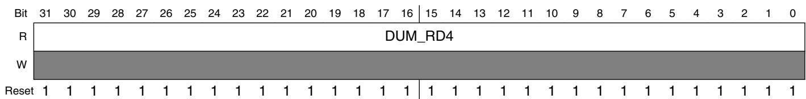

i.MX 6ULL Applications Processor Reference Manual, Rev. 1, 11/2017

MMDC_MPSWDRDR4 field descriptions   

<table><tr><td>Field</td><td>Description</td></tr><tr><td>DUM_RD4</td><td>Dummy read data4. This field holds the fifth data (only in case of burst length 8 (BL =1)) that is read from the DDR during SW dummy read access (i.e. when SW_DUMMY_RD = 1). This field is valid only when SW_DUMMY_RD is de-asserted.</td></tr></table>

# 35.12.70 MMDC PHY SW Dummy Read Data Register 5 (MMDC_MPSWDRDR5)

Address: 21B_0000h base $^ +$ 8ACh offset $=$ 21B_08ACh

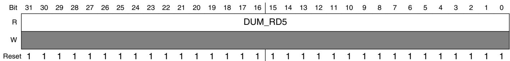

MMDC_MPSWDRDR5 field descriptions   

<table><tr><td>Field</td><td>Description</td></tr><tr><td>DUM_RD5</td><td>Dummy read data5. This field holds the sixth data (only in case of burst length 8 (BL =1)) that is read from the DDR during SW dummy read access (i.e. when SW_DUMMY_RD = 1). This field is valid only when SW_DUMMY_RD is de-asserted.</td></tr></table>

# 35.12.71 MMDC PHY SW Dummy Read Data Register 6 (MMDC_MPSWDRDR6)

Address: 21B_0000h base $^ +$ 8B0h offset $=$ 21B_08B0h

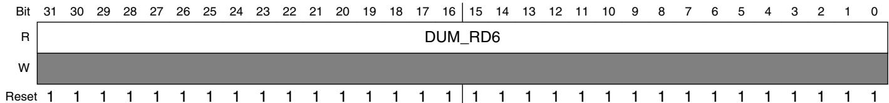

MMDC_MPSWDRDR6 field descriptions   

<table><tr><td>Field</td><td>Description</td></tr><tr><td>DUM_RD6</td><td>Dummy read data6. This field holds the seventh data (only in case of burst length 8 (BL =1)) that is read from the DDR during SW dummy read access (i.e. when SW_DUMMY_RD = 1). This field is valid only when SW_DUMMY_RD is de-asserted.</td></tr></table>

# 35.12.72 MMDC PHY SW Dummy Read Data Register 7 (MMDC_MPSWDRDR7)

Address: 21B_0000h base $^ +$ 8B4h offset $=$ 21B_08B4h

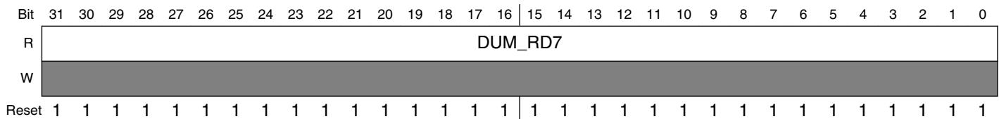

MMDC_MPSWDRDR7 field descriptions   

<table><tr><td>Field</td><td>Description</td></tr><tr><td>DUM_RD7</td><td>Dummy read data7. This field holds the eight data (only in case of burst length 8 (BL=1)) that is read from the DDR during SW dummy read access (i.e. when SW_DUMMY_RD = 1). This field is valid only when SW_DUMMY_RD is de-asserted.</td></tr></table>

# 35.12.73 MMDC PHY Measure Unit Register (MMDC_MPMUR0)

Address: 21B_0000h base $^ +$ 8B8h offset $=$ 21B_08B8h

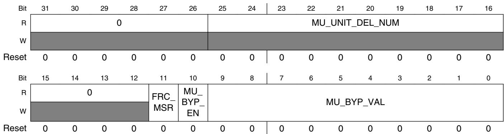

MMDC_MPMUR0 field descriptions   

<table><tr><td>Field</td><td>Description</td></tr><tr><td>31-26 Reserved</td><td>This read-only field is reserved and always has the value 0.</td></tr><tr><td>25-16 MU_UNIT_DEL_NUM</td><td>Number of delay units measured per cycle. This field is used in debug mode and holds the number of delay units that were measured by the measure unit per DDR clock cycle. The delay-lines that are used in every calibration process use that number for generating the desired delay.</td></tr><tr><td>15-12 Reserved</td><td>This read-only field is reserved and always has the value 0.</td></tr><tr><td>11 FRC_MSB</td><td>Force measurement on delay-lines. When this bit is asserted then a measurement process will be performed, where at the completion of the process the delay-lines will issue the desired delay. Upon completion of the measurement process the measure unit and the delay-lines will return to functional mode. This bit is self cleared.</td></tr></table>

Table continues on the next page...

i.MX 6ULL Applications Processor Reference Manual, Rev. 1, 11/2017

MMDC_MPMUR0 field descriptions (continued)   

<table><tr><td>Field</td><td>Description</td></tr><tr><td></td><td>NOTE: This bit should be used only during manual (SW) calibration and not while the DDR is functional (being accessed). After initial calibration is done the hardware performs periodic measurements to track any operating conditions changes. Hence, force measurements (FRC_MSB) should not be used. See Calibration Process for more information.</td></tr><tr><td></td><td>NOTE: User should make sure that there is no active accesses to/from DDR before asserting this bit.</td></tr><tr><td></td><td>0 No measurement is performed</td></tr><tr><td></td><td>1 Perform measurement process</td></tr><tr><td>10 MU_BYP_EN</td><td>Measure unit bypass enable. This field is used in debug mode and when it is asserted then the delay-lines will use the number of delay units that are indicated at MU_BYP_VAL, otherwise the delay-lines will use the number of delay units that was measured by the measurement unit and are indicated at MU_UNIT_DEL_NUM</td></tr><tr><td></td><td>0 The delay-lines use delay units as indicated at MU_UNIT_DEL_NUM.</td></tr><tr><td></td><td>1 The delay-lines use delay units as indicated at MU_BYPASS_VAL.</td></tr><tr><td>MU_BYP_VAL</td><td>Number of delay units for measurement bypass. This field is used in debug mode and holds the number of delay units that will be used by the delay-lines when MU_BYP_EN is asserted.</td></tr></table>

# 35.12.74 MMDC Write CA delay-line controller(MMDC_MPWRCADL)

This register is used to add fine-tuning adjustment to the CA (command/Address of LPDDR2 bus) relative to the DDR clock.

Address: 21B_0000h base $^ +$ 8BCh offset $=$ 21B_08BCh

<table><tr><td>Bit</td><td>31</td><td>30</td><td>29</td><td>28</td><td>27</td><td>26</td><td>25</td><td>24</td><td>23</td><td>22</td><td>21</td><td>20</td><td>19</td><td>18</td><td>17</td><td>16</td></tr><tr><td>R</td><td colspan="12">0</td><td rowspan="2" colspan="2">WR_CA9_DEL</td><td rowspan="2" colspan="2">WR_CA8_DEL</td></tr><tr><td>W</td><td colspan="12"></td></tr><tr><td>Reset</td><td>0</td><td>0</td><td>0</td><td>0</td><td>0</td><td>0</td><td>0</td><td>0</td><td>0</td><td>0</td><td>0</td><td>0</td><td>0</td><td>0</td><td>0</td><td>0</td></tr><tr><td>Bit</td><td>15</td><td>14</td><td>13</td><td>12</td><td>11</td><td>10</td><td>9</td><td>8</td><td>7</td><td>6</td><td>5</td><td>4</td><td>3</td><td>2</td><td>1</td><td>0</td></tr><tr><td>R</td><td colspan="2">WR_CA7_DEL</td><td colspan="2">WR_CA6_DEL</td><td colspan="2">WR_CA5_DEL</td><td colspan="2">WR_CA4_DEL</td><td colspan="2">WR_CA3_DEL</td><td colspan="2">WR_CA2_DEL</td><td colspan="2">WR_CA1_DEL</td><td colspan="2">WR_CA0_DEL</td></tr><tr><td>W</td><td colspan="16"></td></tr><tr><td>Reset</td><td>0</td><td>0</td><td>0</td><td>0</td><td>0</td><td>0</td><td>0</td><td>0</td><td>0</td><td>0</td><td>0</td><td>0</td><td>0</td><td>0</td><td>0</td><td>0</td></tr></table>

MMDC_MPWRCADL field descriptions   

<table><tr><td>Field</td><td>Description</td></tr><tr><td>31-20Reserved</td><td>This read-only field is reserved and always has the value 0 .</td></tr><tr><td>19-18WR_CA9_DEL</td><td>CA (Command/Address LPDDR2 bus) bit 9 delay fine tuning. This field holds the number of delay units that are added to CA (Command/Address bus) bit 9 relative to the clock .</td></tr></table>

Table continues on the next page...

i.MX 6ULL Applications Processor Reference Manual, Rev. 1, 11/2017

MMDC_MPWRCADL field descriptions (continued)   

<table><tr><td>Field</td><td>Description</td></tr><tr><td></td><td>00 No change in CA9 delay</td></tr><tr><td></td><td>01 Add CA9 delay of 1 delay unit</td></tr><tr><td></td><td>10 Add CA9 delay of 2 delay units.</td></tr><tr><td></td><td>11 Add CA9 delay of 3 delay units.</td></tr><tr><td>17-16WR_CA8_DEL</td><td>CA (Command/Address LPDDR2 bus) bit 8 delay fine tuning. This field holds the number of delay units that are added to CA (Command/Address bus) bit 8 relative to the clock.</td></tr><tr><td></td><td>00 No change in CA8 delay</td></tr><tr><td></td><td>01 Add CA8 delay of 1 delay unit</td></tr><tr><td></td><td>10 Add CA8 delay of 2 delay units.</td></tr><tr><td></td><td>11 Add CA8 delay of 3 delay units.</td></tr><tr><td>15-14WR_CA7_DEL</td><td>CA (Command/Address LPDDR2 bus) bit 7 delay fine tuning. This field holds the number of delay units that are added to CA (Command/Address bus) bit 7 relative to the clock.</td></tr><tr><td></td><td>00 No change in CA7 delay</td></tr><tr><td></td><td>01 Add CA7 delay of 1 delay unit</td></tr><tr><td></td><td>10 Add CA7 delay of 2 delay units.</td></tr><tr><td></td><td>11 Add CA7 delay of 3 delay units.</td></tr><tr><td>13-12WR_CA6_DEL</td><td>CA (Command/Address LPDDR2 bus) bit 6 delay fine tuning. This field holds the number of delay units that are added to CA (Command/Address bus) bit 6 relative to the clock.</td></tr><tr><td></td><td>00 No change in CA6 delay</td></tr><tr><td></td><td>01 Add CA6 delay of 1 delay unit</td></tr><tr><td></td><td>10 Add CA6 delay of 2 delay units.</td></tr><tr><td></td><td>11 Add CA6 delay of 3 delay units.</td></tr><tr><td>11-10WR_CA5_DEL</td><td>CA (Command/Address LPDDR2 bus) bit 5 delay fine tuning. This field holds the number of delay units that are added to CA (Command/Address bus) bit 5 relative to the clock.</td></tr><tr><td></td><td>00 No change in CA5 delay</td></tr><tr><td></td><td>01 Add CA5 delay of 1 delay unit</td></tr><tr><td></td><td>10 Add CA5 delay of 2 delay units.</td></tr><tr><td></td><td>11 Add CA5 delay of 3 delay units.</td></tr><tr><td>9-8WR_CA4_DEL</td><td>CA (Command/Address LPDDR2 bus) bit 4 delay fine tuning. This field holds the number of delay units that are added to CA (Command/Address bus) bit 4 relative to the clock.</td></tr><tr><td></td><td>00 No change in CA4 delay</td></tr><tr><td></td><td>01 Add CA4 delay of 1 delay unit</td></tr><tr><td></td><td>10 Add CA4 delay of 2 delay units.</td></tr><tr><td></td><td>11 Add CA4 delay of 3 delay units.</td></tr><tr><td>7-6WR_CA3_DEL</td><td>CA (Command/Address LPDDR2 bus) bit 3 delay fine tuning. This field holds the number of delay units that are added to CA (Command/Address bus) bit 3 relative to the clock.</td></tr><tr><td></td><td>00 No change in CA3 delay</td></tr><tr><td></td><td>01 Add CA3 delay of 1 delay unit</td></tr><tr><td></td><td>10 Add CA3 delay of 2 delay units.</td></tr><tr><td></td><td>11 Add CA3 delay of 3 delay units.</td></tr><tr><td>5-4WR_CA2_DEL</td><td>CA (Command/Address LPDDR2 bus) bit 2 delay fine tuning. This field holds the number of delay units that are added to CA (Command/Address bus) bit 2 relative to the clock.</td></tr><tr><td></td><td>00 No change in CA2 delay
01 Add CA2 delay of 1 delay unit
10 Add CA2 delay of 2 delay units.
11 Add CA2 delay of 3 delay units.</td></tr><tr><td>3-2
WR_CA1_DEL</td><td>CA (Command/Address LPDDR2 bus) bit 1 delay fine tuning. This field holds the number of delay units that are added to CA (Command/Address bus) bit 1 relative to the clock.
00 No change in CA1 delay
01 Add CA1 delay of 1 delay unit
10 Add CA1 delay of 2 delay units.
11 Add CA1 delay of 3 delay units.</td></tr><tr><td>WR_CA0_DEL</td><td>CA (Command/Address LPDDR2 bus) bit 0 delay fine tuning. This field holds the number of delay units that are added to CA (Command/Address bus) bit 0 relative to the clock.
00 No change in CA0 delay
01 Add CA0 delay of 1 delay unit
10 Add CA0 delay of 2 delay units.
11 Add CA0 delay of 3 delay units.</td></tr></table>

# 35.12.75 MMDC Duty Cycle Control Register (MMDC_MPDCCR)

This register is used to control the duty cycle of the DQS and the primary clock (CK0). Programming of this register is permitted by entering the DDR device into self-refresh mode through LPMD/DVFS mechanism.

MMDC1_MPDCCR only affects SDCLK0.

MMDC2_MPDCCR only affects SDCLK1.

# NOTE

If the duty cycle is modified after DDR initialization, the DDR will have to be placed in self-refresh mode.

# NOTE

The duty cycle may be changed during initial DDR initialization without having to be placed in self-refresh mode.

Address: 21B_0000h base $^ +$ 8C0h offset $=$ 21B_08C0h

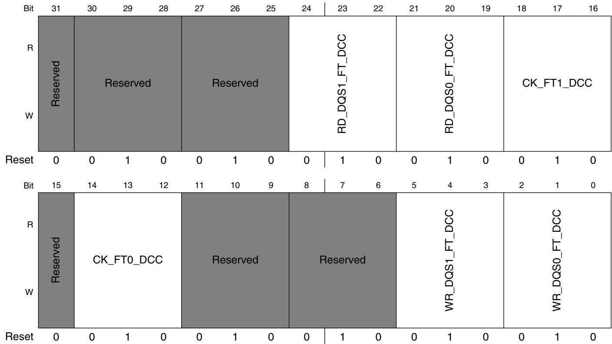

MMDC_MPDCCR field descriptions   

<table><tr><td>Field</td><td>Description</td></tr><tr><td>31-</td><td>This field is reserved.reserved</td></tr><tr><td>30-28-</td><td>This field is reserved.Reserved</td></tr><tr><td>27-25-</td><td>This field is reserved.Reserved</td></tr><tr><td>24-22RD_DQS1_FT_DCC</td><td>Read DQS duty cycle fine tuning control of Byte1. This field controls the duty cycle of read DQS of Byte1NOTE: All the other options are not allowed001 51.5% low 48.5% high010 50% duty cycle (default)100 48.5% low 51.5% high</td></tr><tr><td>21-19RD_DQS0_FT_DCC</td><td>Read DQS duty cycle fine tuning control of Byte0. This field controls the duty cycle of read DQS of Byte0NOTE: All the other options are not allowed001 51.5% low 48.5% high010 50% duty cycle (default)100 48.5% low 51.5% high</td></tr><tr><td>18-16CK_FT1_DCC</td><td>Secondary duty cycle fine tuning control of DDR clock. This field controls the duty cycle of the DDR clock and is cascaded to CK_FT0_DCCNOTE: All the other options are not allowed</td></tr></table>

Table continues on the next page...

i.MX 6ULL Applications Processor Reference Manual, Rev. 1, 11/2017

MMDC_MPDCCR field descriptions (continued)   

<table><tr><td>Field</td><td>Description</td></tr><tr><td></td><td>001 48.5% low 51.5% high</td></tr><tr><td></td><td>010 50% duty cycle (default)</td></tr><tr><td></td><td>100 51.5% low 48.5% high</td></tr><tr><td>15</td><td>This field is reserved.</td></tr><tr><td>-</td><td>Reserved</td></tr><tr><td>14-12CK_FTO_DCC</td><td>Primary duty cycle fine tuning control of DDR clock. This field controls the duty cycle of the DDR clock</td></tr><tr><td></td><td>NOTE: All the other options are not allowed</td></tr><tr><td></td><td>001 48.5% low 51.5% high</td></tr><tr><td></td><td>010 50% duty cycle (default)</td></tr><tr><td></td><td>100 51.5% low 48.5% high</td></tr><tr><td>11-9</td><td>This field is reserved.</td></tr><tr><td>-</td><td>Reserved</td></tr><tr><td>8-6</td><td>This field is reserved.</td></tr><tr><td>-</td><td>Reserved</td></tr><tr><td>5-3WR_DQS1_FT_DCC</td><td>Write DQS duty cycle fine tuning control of Byte1. This field controls the duty cycle of write DQS of Byte1</td></tr><tr><td></td><td>NOTE: All the other options are not allowed</td></tr><tr><td></td><td>001 51.5% low 48.5% high</td></tr><tr><td></td><td>010 50% duty cycle (default)</td></tr><tr><td></td><td>100 48.5% low 51.5% high</td></tr><tr><td>WR_DQS0_FT_DCC</td><td>Write DQS duty cycle fine tuning control of Byte0. This field controls the duty cycle of write DQS of Byte0</td></tr><tr><td></td><td>NOTE: All the other options are not allowed</td></tr><tr><td></td><td>001 51.5% low 48.5% high</td></tr><tr><td></td><td>010 50% duty cycle (default)</td></tr><tr><td></td><td>100 48.5% low 51.5% high</td></tr></table>

# Chapter 36 Medium Quality Sound (MQS)

# 36.1 Overview

Medium quality sound (MQS) is used to generate medium quality audio via a standard GPIO in the pinmux, allowing the user to connect stereo speakers or headphones to a power amplifier without an additional DAC chip.

MQS accepts the following inputs:

• 2-channel, LSB-valid 16-bit, MSB shift-out first serial data (sdata)   
• Frame sync asserting with the first bit of the frame (fs)   
• Bit clock used to shift data out on the positive clock edge (bclk)

The $4 4 \mathrm { k H z }$ or $4 8 \mathrm { k H z }$ input signals from SAI1 are in left_justified format. MQS provides the SNR target as no more than 20 dB for the signals below $1 0 \mathrm { k H z }$ . The signals above 10 kHz will have worse $\mathrm { T H D + N }$ values.

MQS provides only simple audio reproduction. No internal pop, click or distortion artifact reduction methods are provided.

# 36.1.1 Block Diagram